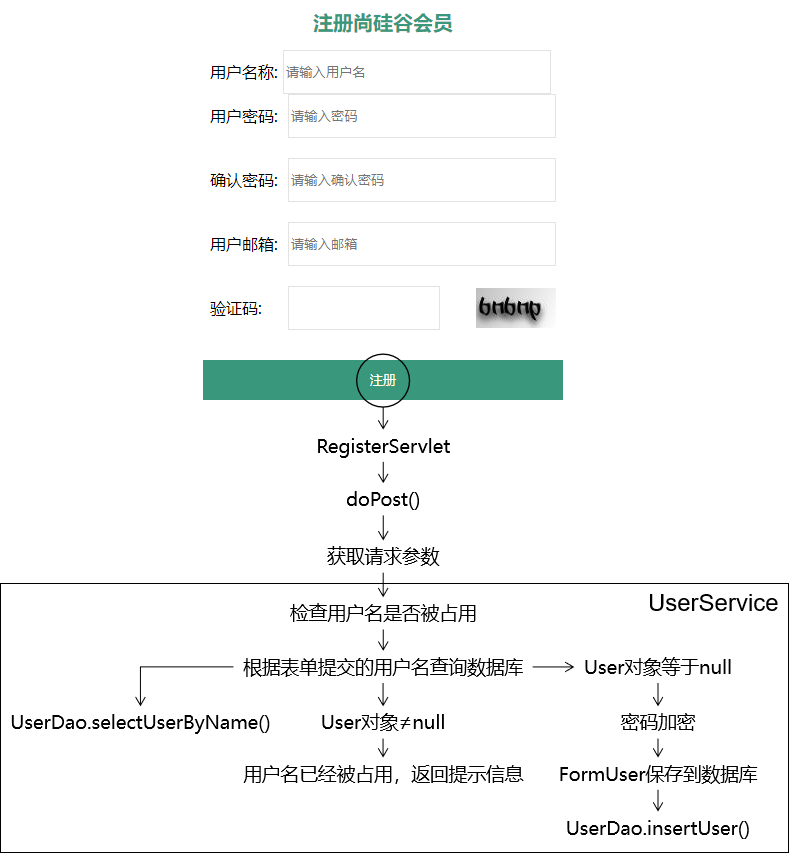
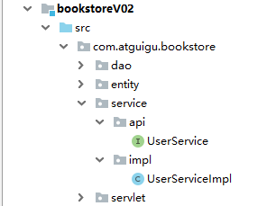

[[toc]]

# 第五节 完成带数据库的登录注册

## 1、密码加密

### ①加密方式介绍

- 对称加密：在知道密文和加密算法的情况下，能够反推回明文
- 非对称加密：
  - 加密：使用私钥加密
  - 解密：使用公钥解密


### ②加密算法：HASH

- 特点1：不可逆
- 特点2：加密后，密文长度固定
- 特点3：输入数据不变，输出数据也保证不变；输入数据变化，输出数据一定变化

常见的HASH算法举例：

- MD5
- SHA1
- SHA512
- CRC32


### ③执行加密的工具方法

```java
public class MD5Util {

    /**
     * 针对明文字符串执行MD5加密
     * @param source
     * @return
     */
    public static String encode(String source) {

        // 1.判断明文字符串是否有效
        if (source == null || "".equals(source)) {
            throw new RuntimeException("用于加密的明文不可为空");
        }

        // 2.声明算法名称
        String algorithm = "md5";

        // 3.获取MessageDigest对象
        MessageDigest messageDigest = null;
        try {
            messageDigest = MessageDigest.getInstance(algorithm);
        } catch (NoSuchAlgorithmException e) {
            e.printStackTrace();
        }

        // 4.获取明文字符串对应的字节数组
        byte[] input = source.getBytes();

        // 5.执行加密
        byte[] output = messageDigest.digest(input);

        // 6.创建BigInteger对象
        int signum = 1;
        BigInteger bigInteger = new BigInteger(signum, output);

        // 7.按照16进制将bigInteger的值转换为字符串
        int radix = 16;
        String encoded = bigInteger.toString(radix).toUpperCase();

        return encoded;
    }

}
```


## 2、注册功能

### ①目标

检查用户名是否可用，如果用户名可用则保存User对象


### ②思路




### ③代码

#### [1]创建UserService


```java
public interface UserService {

    void doRegister(User userForm);

    User doLogin(User userForm);

}
```

开发中，接口设计和接口中方式定义的理念：

- 方法的返回值应该对应这个方法本身的业务功能
  - 写操作：没有返回值
  - 读操作：有返回值，返回值就是查询的结果
- 方法执行是否成功
  - 成功：不抛异常
  - 失败：抛异常

> 启发：
>
> 上层方法向下层方法布置任务：方法名、方法的参数
>
> 下层方法向上层方法反馈结果：返回值、是否抛异常


#### [2]实现UserService接口





##### (1)UserDao声明为成员变量

说明：将来在Servlet中使用Service的时候，也是同样声明为成员变量，那么从Servlet、Service到Dao就都是<span style="color:blue;font-weight:bold;">『单实例，多线程』</span>方式运行。

```java
public class UserServiceImpl implements UserService {

    private UserDao userDao = new UserDaoImpl();

    @Override
    public void doRegister(User userForm) {

    }

    @Override
    public User doLogin(User userForm) {
        
        return null;
    }
}
```

理由：

- 创建对象的操作只执行一次
- 对象在内存中只保存一份，不会过多占用内存空间


##### (2)实现注册功能

```java
@Override
public void doRegister(User userForm) {

    // 1.从userForm对象中获取用户通过表单提交的用户名
    String userName = userForm.getUserName();

    // 2.根据用户名调用UserDao方法查询对应的User对象
    User userDB = userDao.selectUserByName(userName);

    // 3.检查User对象是否为空
    if (userDB != null) {
        // 4.如果User对象不为空，则抛出异常，通知上层调用方法：用户名已经被占用
        throw new RuntimeException("用户名已经被占用");
    }

    // 5.对表单提交的密码执行MD5加密
    // ①取出表单的密码
    String userPwd = userForm.getUserPwd();

    // ②执行加密
    String encode = MD5Util.encode(userPwd);

    // ③将加密得到的密文字符串设置回userForm对象
    userForm.setUserPwd(encode);

    // 6.调用UserDao方法将userForm对象保存到数据库
    userDao.insertUser(userForm);
}
```


#### [3]修改RegisterServlet

```java
protected void doPost(HttpServletRequest request, HttpServletResponse response) throws ServletException, IOException {

    // 1.从请求参数中获取数据封装为User对象
    String username = request.getParameter("username");
    String password = request.getParameter("password");
    String email = request.getParameter("email");

    User userForm = new User(null, username, password, email);

    // 2.调用UserService的方法执行注册
    try {
        userService.doRegister(userForm);

        // 3.如果没有抛出异常那么就跳转到注册成功的页面
        // 选择重定向的原因：跳转到regist_success.html页面后，用户刷新浏览器不会重复提交注册表单
        response.sendRedirect(request.getContextPath()+"/pages/user/regist_success.html");
    } catch (Exception e) {
        e.printStackTrace();

        // 4.如果抛出了异常
        response.setContentType("text/html;charset=UTF-8");
        response.getWriter().write("注册失败：" + e.getMessage());
    }

}
```


## 3、登录功能

### ①关键点提示

对用户密码进行验证时，无法将密文解密为明文，只能将明文再次加密为密文，<span style="color:blue;font-weight:bold;">『比较密文是否一致』</span>。


### ②思路


### ③代码

#### [1]UserService接口的doLogin()

```java
@Override
public User doLogin(User userForm) {

    // 1.获取表单提交的用户名
    String userName = userForm.getUserName();

    // 2.根据用户名调用UserDao方法查询User对象
    User userDB = userDao.selectUserByName(userName);

    // 3.检查数据库查询的User对象是否为null
    if (userDB == null) {
        // 4.如果数据库查询的User对象为null，说明用户名不正确，抛出异常：登录失败
        throw new RuntimeException("用户名或密码不正确");
    }

    // 5.密码验证
    // ①获取表单提交的密码
    String userPwdForm = userForm.getUserPwd();

    // ②对表单提交的密码进行加密
    String encode = MD5Util.encode(userPwdForm);

    // ③获取数据库查询到的密码
    String userPwdDB = userDB.getUserPwd();

    // ④比较表单密码和数据库密码
    if (Objects.equals(encode, userPwdDB)) {
        // 6.如果密码验证成功，则将从数据库查询出来的User对象返回
        return userDB;
        
    }else{
        // 7.如果密码验证失败，说明密码不正确，抛出异常：登录失败
        throw new RuntimeException("用户名或密码不正确");
    }

}
```


#### [2]LoginServlet的doPost()方法

```java
protected void doPost(HttpServletRequest request, HttpServletResponse response) throws ServletException, IOException {

    // 1.从请求参数中获取用户名和密码
    String username = request.getParameter("username");
    String password = request.getParameter("password");

    // 2.封装为User对象
    User userForm = new User(null, username, password, null);

    // 3.调用UserService的方法执行登录验证
    try {
        User userDB = userService.doLogin(userForm);

        // 4.登录成功后跳转到登录成功页面
        response.sendRedirect(request.getContextPath() + "/pages/user/login_success.html");
    } catch (Exception e) {
        e.printStackTrace();

        // 5.登录失败则显示提示消息
        response.setContentType("text/html;charset=UTF-8");
        response.getWriter().write("登录失败：" + e.getMessage());
    }

}
```


[上一节](verse04.html) [回目录](index.html)