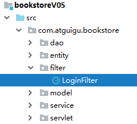

[[toc]]

# 第一节 登录检查

## 1、目标

把项目中需要保护的功能保护起来，没有登录不允许访问。但是我们不考虑后台登录检查，仅完成前台登录检查。

- 购物车功能
- 订单功能


## 2、思路


## 3、代码实现

### ①拦截受保护资源的请求

购物车资源地址：/protected/CartServlet

订单资源地址：/protected/OrderServlet

Filter拦截的地址：/protected/*


### ②对访问购物车资源的地址进行修改

#### [1]首页加入购物车

```html
<a th:href="@{/protected/CartServlet(method=addCart,bookId=${book.bookId})}">加入购物车</a>
```


#### [2]首页显示购物车

```html
<a href="protected/CartServlet?method=showCart" class="cart iconfont icon-gouwuche">购物车</a>
```


#### [3]cart.html清空购物车

```html
<a @click="clearCart" href="protected/CartServlet?method=clearCart" class="clear-cart">清空购物车</a>
```


#### [4]cart.html删除超链接

```html
<a @click="removeConfirm" th:href="@{/protected/CartServlet(method=removeItem,bookId=${cartItemEntry.value.bookId})}">删除</a>
```


#### [5]cart.html中Vue代码

凡是涉及到window.location.href都需要修改：

```javascript
window.location.href = "protected/CartServlet?method=decrease&bookId="+bookId;
……
```


### ③web.xml中修改CartServlet的url-pattern

```xml
<servlet>
    <servlet-name>CartServlet</servlet-name>
    <servlet-class>com.atguigu.bookstore.servlet.model.CartServlet</servlet-class>
</servlet>
<servlet-mapping>
    <servlet-name>CartServlet</servlet-name>
    <url-pattern>/protected/CartServlet</url-pattern>
</servlet-mapping>
```


### ④创建执行登录检查的Filter

#### [1]Filter类



```java
/**
 * 判断当前请求是否已登录的Filter
 * 由于在web.xml的配置中，这个Filter只拦截/protected开头的路径，
 * 所以，凡是被这个Filter拦截的请求都要求必须登录
 */
public class LoginFilter implements Filter {
    public void destroy() {}
    public void init(FilterConfig config) throws ServletException {}

    public void doFilter(ServletRequest request, ServletResponse response, FilterChain chain) throws ServletException, IOException {

        // 1.将request对象的类型转换为HttpServletRequest
        HttpServletRequest httpRequest = (HttpServletRequest) request;

        // 2.通过httpRequest对象获取HttpSession对象
        HttpSession session = httpRequest.getSession();

        // 3.尝试从Session域获取User对象
        User user = (User) session.getAttribute("user");

        // 4.判断User对象是否存在
        if (user == null) {

            // 5.转发到登录页面，提示用户登录后再操作
            request.setAttribute("message", "请登录后再操作");

            request.getRequestDispatcher("/UserServlet?method=toLoginPage").forward(request, response);

        }else{
            // 6.如果User对象存在，说明用户已登录，直接放行
            chain.doFilter(request, response);

        }

    }

}
```


#### [2]注册Filter类

```xml
<filter>
    <filter-name>LoginFilter</filter-name>
    <filter-class>com.atguigu.bookstore.filter.LoginFilter</filter-class>
</filter>
<filter-mapping>
    <filter-name>LoginFilter</filter-name>
    <url-pattern>/protected/*</url-pattern>
</filter-mapping>
```


[回目录](index.html) [下一节](verse02.html)