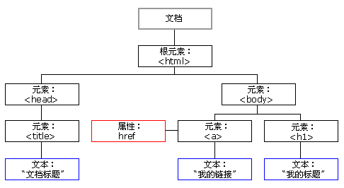
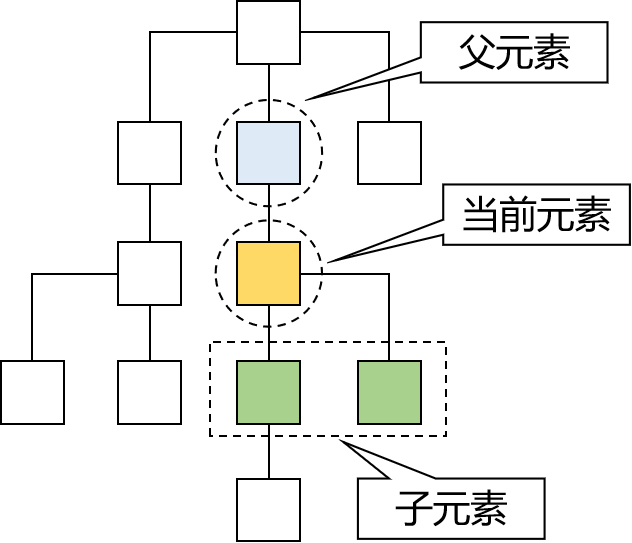

[[toc]]

# 第四节 DOM

## 1、概念

### ①名词解释

DOM是Document Object  Model的缩写，意思是『文档对象模型』——将HTML文档抽象成模型，再封装成对象方便用程序操作。

这是一种非常常用的编程思想：将现实世界的事物抽象成模型，这样就非常容易使用对象来量化的描述现实事物，从而把生活中的问题转化成一个程序问题，最终实现用应用软件协助解决现实问题。而在这其中『模型』就是那个连通现实世界和代码世界的桥梁。

### ②DOM树

浏览器把HTML文档从服务器上下载下来之后就开始按照『从上到下』的顺序『读取HTML标签』。每一个标签都会被封装成一个『对象』。

而第一个读取到的肯定是根标签html，然后是它的子标签head，再然后是head标签里的子标签……所以从html标签开始，整个文档中的所有标签都会根据它们之间的『父子关系』被放到一个『树形结构』的对象中。

这个包含了所有标签对象的整个树形结构对象就是JavaScript中的一个可以直接使用的内置对象：document。

例如，下面的标签结构：

会被解析为：

## 2、具体概念

### ①各个组成部分的类型

整个文档中的一切都可以看做Node。各个具体组成部分的具体类型可以看做Node类型的子类。

> 其实严格来说，JavaScript并不支持真正意义上的『继承』，这里我们借用Java中的『继承』概念，从逻辑上来帮助我们理解各个类型之间的关系。

| 组成部分         | 节点类型 | 具体类型 |
| ---------------- | -------- | -------- |
| 整个文档         | 文档节点 | Document |
| HTML标签         | 元素节点 | Element  |
| HTML标签内的文本 | 文本节点 | Text     |
| HTML标签内的属性 | 属性节点 | Attr     |
| 注释             | 注释节点 | Comment  |

### ②父子关系

### ③先辈后代关系

## 3、DOM操作

由于实际开发时基本上都是使用JavaScript的各种框架来操作，而框架中的操作方式和我们现在看到的原生操作完全不同，所以下面罗列的API仅供参考，不做要求。

### ①在整个文档范围内查询元素节点

| 功能               | API                                     | 返回值           |
| ------------------ | --------------------------------------- | ---------------- |
| 根据id值查询       | document.getElementById(“id值”)         | 一个具体的元素节 |
| 根据标签名查询     | document.getElementsByTagName(“标签名”) | 元素节点数组     |
| 根据name属性值查询 | document.getElementsByName(“name值”)    | 元素节点数组     |

### ②在具体元素节点范围内查找子节点

| 功能               | API                                                 | 返回值   |
| ------------------ | --------------------------------------------------- | -------- |
| 查找全部子节点     | element.childNodes 【W3C考虑换行，IE≤8不考虑】 | 节点数组 |
| 查找第一个子节点   | element.firstChild 【W3C考虑换行，IE≤8不考虑】 | 节点对象 |
| 查找最后一个子节点 | element.lastChild 【W3C考虑换行，IE≤8不考虑】  | 节点对象 |

### ③查找指定元素节点的父节点

| 功能                     | API                | 返回值   |
| ------------------------ | ------------------ | -------- |
| 查找指定元素节点的父节点 | element.parentNode | 节点对象 |

### ④查找指定元素节点的兄弟节点

| 功能               | API                                                   | 返回值   |
| ------------------ | ----------------------------------------------------- | -------- |
| 查找前一个兄弟节点 | node.previousSibling 【W3C考虑换行，IE≤8不考虑】 | 节点对象 |
| 查找后一个兄弟节点 | node.nextSibling 【W3C考虑换行，IE≤8不考虑】     | 节点对象 |

### ⑤属性操作

| 需求       | 操作方式                   |
| ---------- | -------------------------- |
| 读取属性值 | 元素对象.属性名            |
| 修改属性值 | 元素对象.属性名=新的属性值 |

### ⑥文本操作

| 需求       | 操作方式                              |
| ---------- | ------------------------------------- |
| 读取文本值 | element.firstChild.nodeValue          |
| 修改文本值 | element.firstChild.nodeValue=新文本值 |

### ⑦DOM增删改操作

| API                                      | 功能                                       |
| ---------------------------------------- | ------------------------------------------ |
| document.createElement(“标签名”)         | 创建元素节点并返回，但不会自动添加到文档中 |
| document.createTextNode(“文本值”)        | 创建文本节点并返回，但不会自动添加到文档中 |
| element.appendChild(ele)                 | 将ele添加到element所有子节点后面           |
| parentEle.insertBefore(newEle,targetEle) | 将newEle插入到targetEle前面                |
| parentEle.replaceChild(newEle, oldEle)   | 用新节点替换原有的旧子节点                 |
| parentEle.removeChild(childNode)         | 删除指定的子节点                           |
| element.innerHTML                        | 读写HTML代码                               |

[上一节](verse03.html) [回目录](index.html) [下一节](verse05.html)