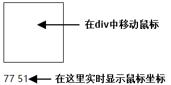

[[toc]]

# 第五节 JavaScript事件驱动

## 1、用地雷爆炸理解事件驱动

| 地雷           | 事件响应函数                  |
| -------------- | ----------------------------- |
| 兵工厂生产地雷 | 声明函数                      |
| 找到埋设位置   | 找到绑定事件响应函数的DOM元素 |
| 埋             | 绑                            |
| 等             | 等                            |
| 有人踩到       | 有人点击                      |
| 地雷爆炸       | 函数执行                      |

依次做完上面的各个动作就能设置好事件响应函数的绑定。


## 2、小练习



```html
<!DOCTYPE html>
<html>
	<head>
		<meta charset="utf-8">
		<title></title>
		<style type="text/css">
			#eventArea {
				border: 1px solid black;
				width: 100px;
				height: 100px;
			}
		</style>
	</head>
	<body>
		<!-- 用div作为鼠标移动区域 -->
		<div id="eventArea"></div>
		
		<!-- 在p标签内显示鼠标坐标 -->
		<p id="showData"></p>
	</body>
	<script type="text/javascript">
		
		// 根据id找到div标签对应的元素对象
		var divEle = document.getElementById("eventArea");
		
		// 根据id找到p标签对应的元素对象
		var pEle = document.getElementById("showData");
		
		// 声明事件响应函数
		function whenMouseMove(event){
			pEle.innerText = event.clientX + " " + event.clientY;
		}
		
		// 将事件响应函数赋值给对应的事件属性		
		// onmousemove表示在鼠标移动的时候
		divEle.onmousemove = whenMouseMove;
	</script>
</html>

```


下面是简化的代码：

```javascript
document.getElementById("eventArea").onmousemove = function (event){
	document.getElementById("showData").innerText = event.clientX + " " + event.clientY;
};
```


[上一节](verse04.html) [回目录](index.html)