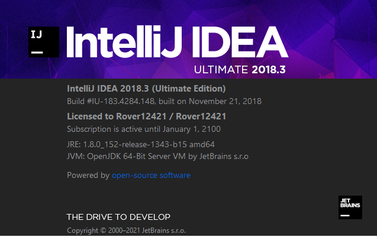
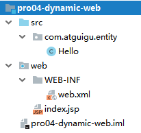
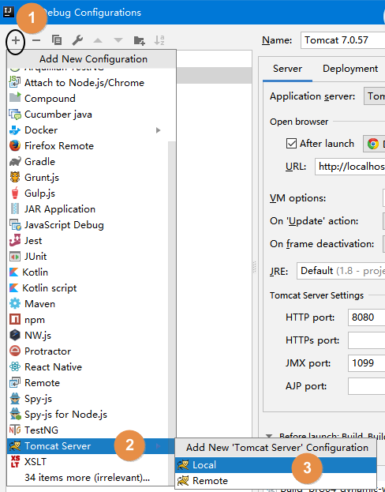
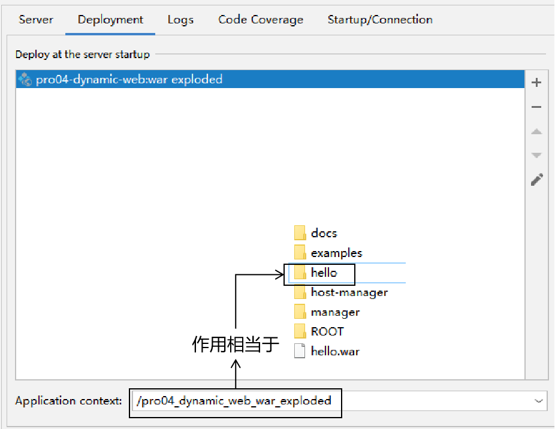
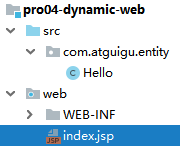
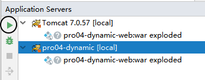
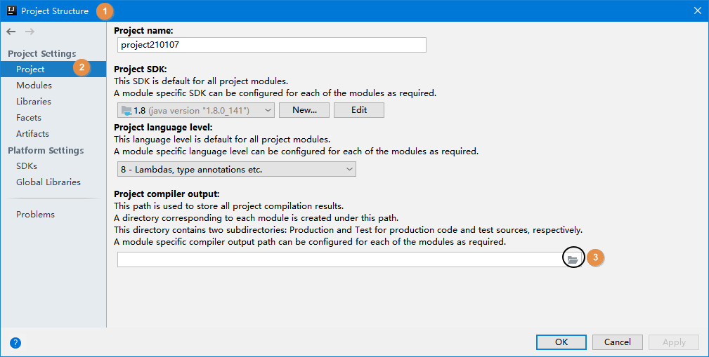
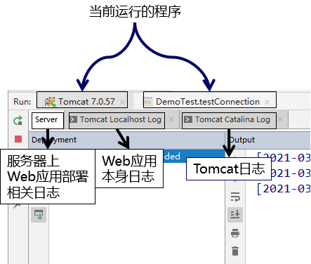

[[toc]]


# 第四节 创建动态Web工程并部署运行

## 1、第一步

创建empty project

## 2、第二步

以下操作基于IDEA2018.3



创建动态Web工程：


创建好的工程如下所示：



<span style="color:blue;font-weight:bold;">注意</span>：src目录应该是蓝色的，web目录的图标上有个蓝色的圆点。

## 3、动态Web工程目录结构介绍

| 目录或文件名            | 功能                                                         |
| ----------------------- | ------------------------------------------------------------ |
| src目录                 | 存放Java源文件                                               |
| web目录                 | 存放Web开发相关资源                                          |
| web/WEB-INF目录         | 存放web.xml文件、classes目录、lib目录                        |
| web/WEB-INF/web.xml文件 | 别名：部署描述符deployment descriptor<br />作用：Web工程的核心配置文件 |
| web/WEB-INF/classes目录 | 存放编译得到的*.class字节码文件                              |
| web/WEB-INF/lib目录     | 存放第三方jar包                                              |

## 4、创建用来部署Web工程的Tomcat实例







通常我们会觉得现在这个Application context太长了，改简短一些会更方便。


创建好的效果如下：


## 5、编写简单的测试代码

### ①Java代码


```java
public class Hello {

    public String getMessage() {
        return "年少不知软饭香";
    }

}
```


### ②JSP代码



```jsp
<%=new Hello().getMessage() %>
```

### ③启动专门为这个工程创建的Tomcat实例



### ④错误提示


提示信息的含义：未指定编译结果的保存目录。

错误原因：

- 父工程只是一个empty project
- 当前模块继承父工程的编译输出路径

为了解决这个问题我们可以在父工程中设置输出路径：





## 6、IDEA运行程序时界面布局



[上一节](verse03.html) [回目录](index.html) [下一节](verse05.html)