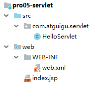
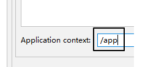

[[toc]]

# 第二节 Servlet HelloWorld

## 1、HelloWorld分析

### ①目标

在页面上点击超链接，由Servlet处理这个请求，并返回一个响应字符串：Hello,I am Servlet

### ②思路


## 2、具体操作

### ①第一步：创建动态Web module


### ②第二步：创建超链接

```html
<!-- /Web应用地址/Servlet地址 -->
<a href="/app/helloServlet">Servlet Hello World</a>
```

### ③第三步：创建HelloServlet的Java类

```java
public class HelloServlet implements Servlet {
    @Override
    public void init(ServletConfig servletConfig) throws ServletException {

    }

    @Override
    public ServletConfig getServletConfig() {
        return null;
    }

    @Override
    public void service(ServletRequest servletRequest, ServletResponse servletResponse) throws ServletException, IOException {

        // 控制台打印，证明这个方法被调用了
        System.out.println("我是HelloServlet，我执行了！");

        // 返回响应字符串
        // 1、获取能够返回响应数据的字符流对象
        PrintWriter writer = servletResponse.getWriter();

        // 2、向字符流对象写入数据
        writer.write("Hello,I am Servlet");
    }

    @Override
    public String getServletInfo() {
        return null;
    }

    @Override
    public void destroy() {

    }
}
```


### ④第四步：配置HelloServlet

配置文件位置：WEB-INF/web.xml


```xml
<!-- 配置Servlet本身 -->
<servlet>
    <!-- 全类名太长，给Servlet设置一个简短名称 -->
    <servlet-name>HelloServlet</servlet-name>

    <!-- 配置Servlet的全类名 -->
    <servlet-class>com.atguigu.servlet.HelloServlet</servlet-class>
</servlet>

<!-- 将Servlet和访问地址关联起来 -->
<servlet-mapping>
    <servlet-name>HelloServlet</servlet-name>
    <url-pattern>/helloServlet</url-pattern>
</servlet-mapping>
```

<span style="color:blue;font-weight:bold;">『虚拟路径』</span>：Servlet并<span style="color:blue;font-weight:bold;">不是</span>文件系统中<span style="color:blue;font-weight:bold;">实际存在</span>的<span style="color:blue;font-weight:bold;">目录或文件</span>，所以为了方便浏览器访问，我们创建了<span style="color:blue;font-weight:bold;">虚拟</span>出来的路径来访问它。

### ⑤小结

- 需求：在浏览器上点超链接能够访问Java程序


## 3、梳理概念

### ①原生Tomcat


### ②IDEA中的Tomcat实例


### ③IDEA中的Web工程



### ④根据Web工程生成的war包


### ⑤Web工程中的资源

#### [1]静态资源

- HTML文件
- CSS文件
- JavaScript文件
- 图片文件

#### [2]动态资源

- Servlet

### ⑥访问资源的地址

#### [1]静态资源

> /Web应用名称/静态资源本身的路径

#### [2]动态资源

> /Web应用名称/虚拟路径

### ⑦Web应用名称



### ⑧总体的逻辑结构


[上一节](verse01.html) [回目录](index.html) [下一节](verse03.html)