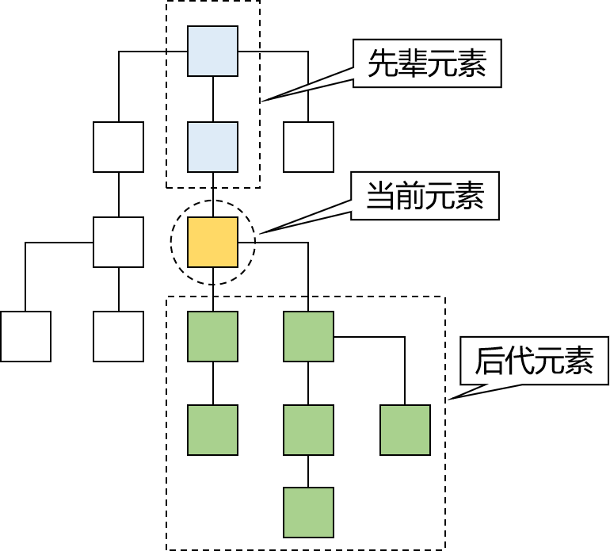

[[toc]]

# JavaScript笔记

## 1、基本语法

### ①嵌入方式

#### [1]具体方式

- 使用script标签：HTML文档内部
- 使用script标签的src属性：引用外部JavaScript文件


#### [2]引用外部JavaScript文件

- 引用外部JavaScript文件的script标签里面不能写JavaScript代码
- 引用外部JavaScript文件的script标签不能改成单标签
- 外部JavaScript文件一定要先引入再使用


### ②变量

#### [1]数据类型

- 基本数据类型
  - 数值型
  - 字符串类型：单引号和双引号作用一样
  - 布尔类型
- 引用数据类型

| &nbsp; | new关键字创建 | 使用符号 |
| ------ | ------------- | -------- |
| 对象   | new Xxx()     | {}       |
| 数组   | new Array()   | []       |


#### [2]声明变量

- 关键字：var
- 数据类型：可以接收任何类型的数据
- 标识符：严格区分大小写


#### [3]使用变量

- 变量在使用过程中仍然可以接受任何数据类型

- 如果使用一个没有声明的变量，会报错

  Uncaught ReferenceError: b is not defined

- 如果声明一个变量没有初始化，那么这个变量的值就是undefined


### ③函数

#### [1]系统内置函数

- alert()弹出警告框
- confirm()弹出确认框架
- console.log()在浏览器控制台打印日志信息


#### [2]声明函数

方式一：

```javascript
        function sum(a, b) {
            return a+b;
        }
```

方式二：声明匿名函数，将函数对象的引用赋值给一个变量

```javascript
        var total = function() {
            return a+b;
        };
```


#### [3]调用函数

基本语法公式：<span style="color:blue;font-weight:bold;">函数引用()</span>

```javascript
        function sum(a, b) {
            return a+b;
        }
        
        var result = sum(2, 3);
        console.log("result="+result);
```

或

```javascript
        var total = function() {
            return a+b;
        }
        
        var totalResult = total(3,6);
        console.log("totalResult="+totalResult);
```


#### [4]函数对象和函数引用的关系


在JavaScript中使用函数时，请大家务必注意：

- 单独写函数名表示函数的引用
- 函数名()表示调用函数

引用函数和调用函数是完全不一样的效果。以HelloWorld程序为例：

```javascript
// 1.通过document对象在整个文档范围内查找按钮对象
// 使用var关键字接收document.getElementById("helloBtn")方法的返回值
var helloBtn = document.getElementById("helloBtn");

// 2.声明一个函数，这个函数就是用户点击按钮后要调用执行的函数
function whenYouClickBtn() {
	
	// 当用户点击按钮后，调用JavaScript系统内置的函数，弹出警告框
	alert("Hello");
	
}

// 3.将2声明的函数绑定到按钮的单击事件上
// ①在JavaScript中，函数也是对象
// ②函数名是这个对象的引用
// ③将函数名赋值给按钮对象的事件属性就完成的事件响应函数的绑定
// ④最终效果：用户触发事件（真的点击了按钮），系统会来调用我们绑定的这个函数
helloBtn.onclick = whenYouClickBtn;
```


在最后一行代码中，函数名后面写()和不写()效果完全不同：

- 不写括号：将whenYouClickBtn函数的引入赋值给onclick属性
- 写括号：将whenYouClickBtn函数的返回值赋值给onclick属性


### ④this关键字

- 在script标签中直接使用：this代表window对象
- 在函数中使用：this代表那个调用函数的对象


### ⑤数组对象的常用方法

| 方法名    | 功能                                     |
| --------- | ---------------------------------------- |
| push()    | 将数据压入数组                           |
| pop()     | 将数据从数组中弹出                       |
| reverse() | 将数组中的数据反序                       |
| join()    | 将数组中的数据根据指定的符号拼接成字符串 |


和数组的join()配对的字符串的方法：

| 方法名  | 功能                             |
| ------- | -------------------------------- |
| split() | 将字符串根据指定的符号拆分成数组 |


### ⑥JSON格式

#### [1]用途

JSON这种数据格式的用途是<span style="color:blue;font-weight:bold;">『跨平台数据传输』</span>。


#### [2]语法规范

- 两端允许的符号
  - {}：定义一个JSON对象
  - []：定义一个JOSN数组
- JSON对象的格式
  - {key<span style="color:blue;font-weight:bold;font-size:30px;">:</span>value<span style="color:blue;font-weight:bold;font-size:30px;">,</span>...<span style="color:blue;font-weight:bold;font-size:30px;">,</span>key<span style="color:blue;font-weight:bold;font-size:30px;">:</span>value}
  - [value<span style="color:blue;font-weight:bold;font-size:30px;">,</span>...<span style="color:blue;font-weight:bold;font-size:30px;">,</span>value]
- key的类型：字符串类型
- value的类型：
  - 基本数据类型
  - 引用数据类型
    - JSON对象
    - JSON数组

正因为JSON的value可以还是JSON数据，所以JSON这种格式可以<span style="color:blue;font-weight:bold;">『多层嵌套』</span>，从而用来描述非常复杂的数据类型。


#### [3]JSON对象和JSON字符串互转

| 方法名           | 功能                       |
| ---------------- | -------------------------- |
| JSON.stringify() | 将JSON对象转换成JSON字符串 |
| JSON.parse()     | 将JSON字符串解析为JSON对象 |


## 2、DOM

- DOM：Document Object Model文档对象模型
- 数据结构：整个HTML文档中标签、文本、属性、注释等等节点对象组成的一个树形结构。

| 组成部分         | 节点类型 | 具体类型 |
| ---------------- | -------- | -------- |
| 整个文档         | 文档节点 | Document |
| HTML标签         | 元素节点 | Element  |
| HTML标签内的文本 | 文本节点 | Text     |
| HTML标签内的属性 | 属性节点 | Attr     |
| 注释             | 注释节点 | Comment  |

- 节点之间的关系

  - 父子关系

    

  - 先辈后代关系

    


## 3、事件驱动

### ①三个基本要素

- 控件：用户在页面上操作的那个东西
- 事件：用户具体所做的操作
- 函数：在检测到用户操作了控件后，我们希望执行的代码


### ②三要素之间的关系

| 地雷           | 事件响应函数                  |
| -------------- | ----------------------------- |
| 兵工厂生产地雷 | 声明函数                      |
| 找到埋设位置   | 找到绑定事件响应函数的DOM元素 |
| 埋             | 绑                            |
| 等             | 等                            |
| 有人踩到       | 有人点击                      |
| 地雷爆炸       | 函数执行                      |

### ③取消控件的默认行为

#### [1]控件的默认行为

- 超链接：点击后会跳转页面
- 表单的提交按钮：点击后会提交表单


#### [2]event事件对象

在JavaScript的function中，有很多内置的对象可以直接使用。其中event就是一个可以直接使用的内置对象，这个对象中封装了当前事件相关的所有信息。


#### [3]调用event对象取消控件的默认行为

```javascript
event.preventDefault()
```


### ④阻止事件冒泡

#### [1]冒泡


在页面上，某一个HTML元素触发事件后，这个事件会沿着DOM结构，向这个元素的父元素传递。如果有需要，父元素可以通过绑定事件响应函数的方式继续处理这个事件。如果没有被阻止，最终这个事件会被传递到window对象。


#### [2]阻止

在子元素的事件响应函数中，调用event事件对象的stopPropagation()方法就可以阻止事件向父元素传递。


## 4、正则表达式

### ①概念

本质：用字符串声明的规则

功能：

- 模式验证：使用规则对目标文本进行检测，判断目标文本是否满足规则。
- 匹配查找：使用规则在目标文件中进行搜索，把满足规则的返回。
- 匹配替换：使用规则在目标文件中进行搜索，把满足规则的替换为指定的新字符串。


### ②组成

- 普通字符：就代表字符本身。
- 元字符：在正则表达式中被赋予了特殊含义。例如：^在[]外面表示限制字符串开头的规则，在[]里面表示取反。


### ③在JavaScript中创建正则表达式对象

- new RegExp()
- /正则表达式/匹配模式
  - 匹配模式：g表示全文查找
  - 匹配模式：i表示忽略大小写
  - 匹配模式：m表示多行匹配


### ④元字符

| 代码 | 说明                                                         |
| ---- | ------------------------------------------------------------ |
| .    | 匹配除换行字符以外的任意字符。                               |
| \w   | 匹配字母或数字或下划线等价于[a-zA-Z0-9_]                     |
| \W   | 匹配任何非单词字符。等价于\[^A-Za-z0-9_]                     |
| \s   | 匹配任意的空白符，包括空格、制表符、换页符等等。等价于[\f\n\r\t\v]。 |
| \S   | 匹配任何非空白字符。等价于\[^\f\n\r\t\v]。                   |
| \d   | 匹配数字。等价于[0-9]。                                      |
| \D   | 匹配一个非数字字符。等价于\[^0-9]                            |
| \b   | 匹配单词的开始或结束                                         |
| ^    | 匹配字符串的开始，但在[]中使用表示取反                       |
| $    | 匹配字符串的结束                                             |
| \|   | 逻辑上的『或者』                                             |


### ④字符集合

| 语法格式    | 示例                                                         | 说明                                               |
| ----------- | ------------------------------------------------------------ | -------------------------------------------------- |
| [字符列表]  | 正则表达式：[abc]<br />含义：目标字符串包含abc中的任何一个字符<br />目标字符串：plain<br />是否匹配：是<br />原因：plain中的“a”在列表“abc”中 | 目标字符串中任何一个字符出现在字符列表中就算匹配。 |
| [^字符列表] | [^abc]<br />含义：目标字符串包含abc以外的任何一个字符<br />目标字符串：plain<br />是否匹配：是<br />原因：plain中包含“p”、“l”、“i”、“n” | 匹配字符列表中未包含的任意字符。                   |
| [字符范围]  | 正则表达式：[a-z]<br />含义：所有小写英文字符组成的字符列表<br />正则表达式：[A-Z]<br />含义：所有大写英文字符组成的字符列表 | 匹配指定范围内的任意字符。                         |


### ⑤重复出现

| 代码  | 说明           |
| ----- | -------------- |
| *     | 重复零次或多次 |
| +     | 重复一次或多次 |
| ?     | 重复零次或一次 |
| {n}   | 重复n次        |
| {n,}  | 重复n次或多次  |
| {n,m} | 重复n到m次     |


### ⑥常用典型例子

| 需求     | 正则表达式                                              |
| -------- | ------------------------------------------------------- |
| 用户名   | /^\[a-zA-Z\_][a-zA-Z_\\-0-9]{5,9}$/                     |
| 密码     | /^[a-zA-Z0-9_\\-\@\\#\\&\\*]{6,12}$/                    |
| 前后空格 | /^\s+\|\s+$/g                                           |
| 电子邮箱 | /^[a-zA-Z0-9_\\.-]+@([a-zA-Z0-9-]+[\\.]{1})+[a-zA-Z]+$/ |


### ⑦掌握要求

拿到一个现成的正则表达式，会改成我们需要的即可。


[回到上一级目录](index.html)