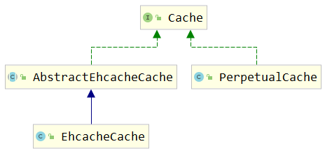
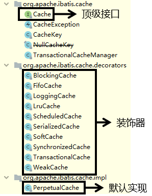

[[toc]]

# 第五节 缓存的基本原理

## 1、Cache接口

### ①Cache接口的重要地位

org.apache.ibatis.cache.Cache接口：所有缓存都必须实现的顶级接口




### ②Cache接口中的方法


| 方法名         | 作用             |
| -------------- | ---------------- |
| putObject()    | 将对象存入缓存   |
| getObject()    | 从缓存中取出对象 |
| removeObject() | 从缓存中删除对象 |


### ③缓存的本质

根据Cache接口中方法的声明我们能够看到，缓存的本质是一个<span style="color:blue;font-weight:bold;">Map</span>。


## 2、PerpetualCache



org.apache.ibatis.cache.impl.PerpetualCache是Mybatis的默认缓存，也是Cache接口的默认实现。Mybatis一级缓存和自带的二级缓存都是通过PerpetualCache来操作缓存数据的。但是这就奇怪了，同样是PerpetualCache这个类，怎么能区分出来两种不同级别的缓存呢？

其实很简单，调用者不同。

- 一级缓存：由BaseExecutor调用PerpetualCache
- 二级缓存：由CachingExecutor调用PerpetualCache，而CachingExecutor可以看做是对BaseExecutor的装饰


## 3、一级缓存机制


org.apache.ibatis.executor.BaseExecutor类中的关键方法：

### ①query()方法

```java
public <E> List<E> query(MappedStatement ms, Object parameter, RowBounds rowBounds, ResultHandler resultHandler, CacheKey key, BoundSql boundSql) throws SQLException {
    ErrorContext.instance().resource(ms.getResource()).activity("executing a query").object(ms.getId());
    if (closed) {
        throw new ExecutorException("Executor was closed.");
    }
    if (queryStack == 0 && ms.isFlushCacheRequired()) {
        clearLocalCache();
    }
    List<E> list;
    try {
        queryStack++;
        
        // 尝试从本地缓存中获取数据
        list = resultHandler == null ? (List<E>) localCache.getObject(key) : null;
        
        if (list != null) {
            handleLocallyCachedOutputParameters(ms, key, parameter, boundSql);
        } else {
            
            // 如果本地缓存中没有查询到数据，则查询数据库
            list = queryFromDatabase(ms, parameter, rowBounds, resultHandler, key, boundSql);
        }
    } finally {
        queryStack--;
    }
    if (queryStack == 0) {
        for (org.apache.ibatis.executor.BaseExecutor.DeferredLoad deferredLoad : deferredLoads) {
            deferredLoad.load();
        }
        // issue #601
        deferredLoads.clear();
        if (configuration.getLocalCacheScope() == LocalCacheScope.STATEMENT) {
            // issue #482
            clearLocalCache();
        }
    }
    return list;
}
```


### ②queryFromDatabase()方法

```java
private <E> List<E> queryFromDatabase(MappedStatement ms, Object parameter, RowBounds rowBounds, ResultHandler resultHandler, CacheKey key, BoundSql boundSql) throws SQLException {
    List<E> list;
    localCache.putObject(key, EXECUTION_PLACEHOLDER);
    try {
        
        // 从数据库中查询数据
        list = doQuery(ms, parameter, rowBounds, resultHandler, boundSql);
    } finally {
        localCache.removeObject(key);
    }
    
    // 将数据存入本地缓存
    localCache.putObject(key, list);
    if (ms.getStatementType() == StatementType.CALLABLE) {
        localOutputParameterCache.putObject(key, parameter);
    }
    return list;
}
```


## 4、二级缓存机制


下面我们来看看CachingExecutor类中的query()方法在不同情况下使用的具体缓存对象：

### ①未开启二级缓存


### ②使用自带二级缓存


### ③使用EHCache


[上一节](verse04.html) [回目录](index.html)