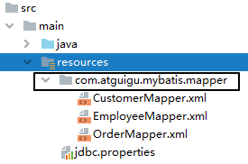
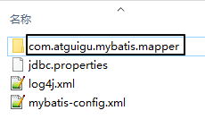
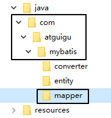

[[toc]]

# 第三节 Mapper映射

## 1、需求

Mapper 配置文件很多时，在全局配置文件中一个一个注册太麻烦，希望有一个办法能够一劳永逸。


## 2、配置方式

Mybatis 允许在指定 Mapper 映射文件时，只指定其所在的包：

```xml
<mappers>
		<package name="com.atguigu.mybatis.dao"/>
</mappers>
```


此时这个包下的所有 Mapper 配置文件将被自动加载、注册，比较方便。


## 3、资源创建要求

### ①基本要求

- Mapper 接口和 Mapper 配置文件名称一致
  - Mapper 接口：<span style="color:blue;font-weight:bold;">EmployeeMapper</span>.java
  - Mapper 配置文件：<span style="color:blue;font-weight:bold;">EmployeeMapper</span>.xml
- Mapper 配置文件放在 Mapper 接口所在的包内


如果工程是 Maven 工程，那么 Mapper 配置文件还是要放在 resources 目录下：



说白了就是：Mapper 配置文件所在目录的结构和 Mapper 接口所在包的目录结构一致。


### ②需要注意的一个情况

#### [1] IDEA 中看到的目录结构


#### [2]但实际上真实目录结构




#### [3]接口所在包的目录




#### [4]产生这个问题的原因

在 resources 目录下创建目录时没有把包名的点换成斜杠：


[上一节](verse02.html) [回目录](index.html) [下一节](verse04.html)