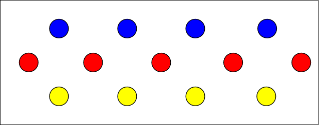
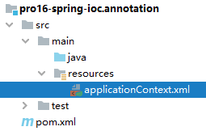

[[toc]]


# 第一个实验 [重要]标记与扫描

## 1、注解的作用

### ①注解

和 XML 配置文件一样，注解本身并不能执行，注解本身仅仅只是做一个标记，具体的功能是框架检测到注解标记的位置，然后针对这个位置按照注解标记的功能来执行具体操作。

本质上：所有一切的操作都是 Java 代码来完成的，XML 和注解只是告诉框架中的 Java 代码如何执行。


举例：元旦联欢会要布置教室，蓝色的地方贴上元旦快乐四个字，红色的地方贴上拉花，黄色的地方贴上气球。



班长做了所有标记，同学们来完成具体工作。墙上的标记相当于我们在代码中使用的注解，后面同学们做的工作，相当于框架的具体操作。


### ②扫描

Spring 为了知道程序员在哪些地方标记了什么注解，就需要通过扫描的方式，来进行检测。然后根据注解进行后续操作。


## 2、新建Module

```xml
<dependencies>
    
    <!-- 基于Maven依赖传递性，导入spring-context依赖即可导入当前所需所有jar包 -->
    <dependency>
        <groupId>org.springframework</groupId>
        <artifactId>spring-context</artifactId>
        <version>5.3.1</version>
    </dependency>
    
    <!-- junit测试 -->
    <dependency>
        <groupId>junit</groupId>
        <artifactId>junit</artifactId>
        <version>4.12</version>
        <scope>test</scope>
    </dependency>
    
</dependencies>
```


## 3、创建Spring配置文件




## 4、创建一组组件类

### ①使用@Component注解标记的普通组件

```java
package com.atguigu.ioc.component;

import org.springframework.stereotype.Component;

@Component
public class CommonComponent {
}
```


### ②使用@Controller注解标记的控制器组件

这个组件就是我们在三层架构中表述层里面，使用的控制器。以前是Servlet，以后我们将会使用Controller来代替Servlet。

```java
package com.atguigu.ioc.component;

import org.springframework.stereotype.Controller;

@Controller
public class SoldierController {
}
```


### ③使用@Service注解标记的业务逻辑组件

这个组件就是我们在三层架构中使用的业务逻辑组件。

```java
package com.atguigu.ioc.component;

import org.springframework.stereotype.Service;

@Service
public class SoldierService {

}
```


### ④使用@Repository注解标记的持久化层组件

这个组件就是我们以前用的Dao类，但是以后我们整合了Mybatis，这里就变成了Mapper接口，而Mapper接口是由Mybatis和Spring的整合包负责扫描的。

由于Mybatis整合包想要把Mapper接口背后的代理类加入Spring的IOC容器需要结合Mybatis对Mapper配置文件的解析，所以这个事情是Mybatis和Spring的整合包来完成，将来由Mybatis负责扫描，也不使用@Repository注解。

```java
package com.atguigu.ioc.component;

import org.springframework.stereotype.Repository;

@Repository
public class SoldierDao {
}
```


## 5、四个典型注解没有本质区别


通过查看源码我们得知，@Controller、@Service、@Repository这三个注解只是在@Component注解的基础上起了三个新的名字。


对于Spring使用IOC容器管理这些组件来说没有区别，也就是语法层面没有区别。所以@Controller、@Service、@Repository这三个注解只是给开发人员看的，让我们能够便于分辨组件的作用。


注意：虽然它们本质上一样，但是为了代码的可读性，为了程序结构严谨我们肯定不能随便胡乱标记。


## 6、扫描

### ①情况一：最基本的扫描方式[常用]

```xml
<!-- 配置自动扫描的包 -->
<!-- 最基本的扫描方式 -->
<context:component-scan base-package="com.atguigu.ioc.component"/>
```


从IOC容器中获取bean：

```java
@Test
public void testAnnotationcScanBean() {
    CommonComponent commonComponent = iocContainer.getBean(CommonComponent.class);
    
    SoldierController soldierController = iocContainer.getBean(SoldierController.class);
    
    SoldierService soldierService = iocContainer.getBean(SoldierService.class);
    
    SoldierDao soldierDao = iocContainer.getBean(SoldierDao.class);
    
    System.out.println("commonComponent = " + commonComponent);
    System.out.println("soldierController = " + soldierController);
    System.out.println("soldierService = " + soldierService);
    System.out.println("soldierDao = " + soldierDao);
}
```


### ②情况二：指定匹配模式

```xml
    <!-- 情况二：在指定扫描包的基础上指定匹配模式 -->
    <context:component-scan
            base-package="com.atguigu.ioc.component"
            resource-pattern="Soldier*.class"/>
```


### ③情况三：指定要排除的组件

或者也可以说指定不扫描的组件

```xml
<!-- 情况三：指定不扫描的组件 -->
<context:component-scan base-package="com.atguigu.ioc.component">
    
    <!-- context:exclude-filter标签：指定排除规则 -->
    <!-- type属性：指定根据什么来进行排除，annotation取值表示根据注解来排除 -->
    <!-- expression属性：指定排除规则的表达式，对于注解来说指定全类名即可 -->
    <context:exclude-filter type="annotation" expression="org.springframework.stereotype.Controller"/>
</context:component-scan>
```


### ④情况四：仅扫描指定组件

```xml
<!-- 情况四：仅扫描指定的组件 -->
<!-- 仅扫描 = 关闭默认规则 + 追加规则 -->
<!-- use-default-filters属性：取值false表示关闭默认扫描规则 -->
<context:component-scan base-package="com.atguigu.ioc.component" use-default-filters="false">
    
    <!-- context:include-filter标签：指定在原有扫描规则的基础上追加的规则 -->
    <context:include-filter type="annotation" expression="org.springframework.stereotype.Controller"/>
</context:component-scan>
```


## 7、组件的beanName

在我们使用 XML 方式管理 bean 的时候，每个 bean 都有一个唯一标识——id 属性的值，便于在其他地方引用。现在使用注解后，每个组件仍然应该有一个唯一标识。


### ①默认情况

类名首字母小写就是 bean 的 id。例如：SoldierController 类对应的 bean 的 id 就是 soldierController。


### ②使用value属性指定

```java
@Controller(value = "tianDog")
public class SoldierController {
}
```


当注解中只设置一个属性时，value属性的属性名可以省略：

```java
@Service("smallDog")
public class SoldierService {

}
```


[回目录](../verse04.html) [下一个实验](experiment02.html)