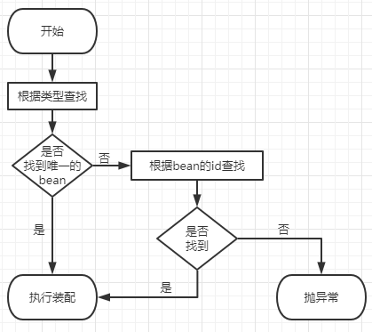

[[toc]]

# 第二个实验 [重要]自动装配

## 1、设定情景

- SoldierController 需要 SoldierService
- SoldierService 需要 SoldierDao

同时在各个组件中声明要调用的方法。


### ①在SoldierController中声明方法

```java
package com.atguigu.ioc.component;

import org.springframework.stereotype.Controller;

@Controller(value = "tianDog")
public class SoldierController {

    private SoldierService soldierService;

    public void getMessage() {
        soldierService.getMessage();
    }

}
```


### ②在SoldierService中声明方法

```java
@Service("smallDog")
public class SoldierService {

    private SoldierDao soldierDao;

    public void getMessage() {
        soldierDao.getMessage();
    }
}
```


### ③在SoldierDao中声明方法

```java
@Repository
public class SoldierDao {

    public void getMessage() {
        System.out.println("I am a soldier");
    }

}
```


## 2、自动装配的实现

### ①前提

参与自动装配的组件（需要装配别人、被别人装配）全部都必须在IOC容器中。


### ②@Autowired注解

在成员变量上直接标记@Autowired注解即可，<span style="color:blue;font-weight:bold;">不需要提供setXxx()方法</span>。以后我们在项目中的正式用法就是这样。

#### [1]给Controller装配Service

```java
@Controller(value = "tianDog")
public class SoldierController {
    
    @Autowired
    private SoldierService soldierService;
    
    public void getMessage() {
        soldierService.getMessage();
    }
    
}
```


#### [2]给Service装配Dao

```java
@Service("smallDog")
public class SoldierService {
    
    @Autowired
    private SoldierDao soldierDao;
    
    public void getMessage() {
        soldierDao.getMessage();
    }
}
```


## 3、@Autowired注解其他细节

### ①标记在其他位置

#### [1]构造器

```java
@Controller(value = "tianDog")
public class SoldierController {
    
    private SoldierService soldierService;
    
    @Autowired
    public SoldierController(SoldierService soldierService) {
        this.soldierService = soldierService;
    }
    ……
```


#### [2]setXxx()方法

```java
@Controller(value = "tianDog")
public class SoldierController {

    private SoldierService soldierService;

    @Autowired
    public void setSoldierService(SoldierService soldierService) {
        this.soldierService = soldierService;
    }
    ……
```


### ②@Autowired 工作流程



- 首先根据所需要的组件类型到 IOC 容器中查找
  - 能够找到唯一的 bean：直接执行装配
  - 如果完全找不到匹配这个类型的 bean：装配失败
  - 和所需类型匹配的 bean 不止一个
    - 没有 @Qualifier 注解：根据 @Autowired 标记位置成员变量的变量名作为 bean 的 id 进行匹配
      - 能够找到：执行装配
      - 找不到：装配失败
    - 使用 @Qualifier 注解：根据 @Qualifier 注解中指定的名称作为 bean 的id进行匹配
      - 能够找到：执行装配
      - 找不到：装配失败


```java
@Controller(value = "tianDog")
public class SoldierController {
    
    @Autowired
    @Qualifier(value = "maomiService222")
    // 根据面向接口编程思想，使用接口类型引入Service组件
    private ISoldierService soldierService;
```


### ③佛系装配

给 @Autowired 注解设置 required = false 属性表示：能装就装，装不上就不装。但是实际开发时，基本上所有需要装配组件的地方都是必须装配的，用不上这个属性。

```java
@Controller(value = "tianDog")
public class SoldierController {

    // 给@Autowired注解设置required = false属性表示：能装就装，装不上就不装
    @Autowired(required = false)
    private ISoldierService soldierService;
```


::: warning

如果类中同时存在装配属性的 setXxx() 方法会使 required = false 设定失效。

:::


[上一个实验](experiment01.html) [回目录](../verse04.html) [下一个实验](experiment03.html)
