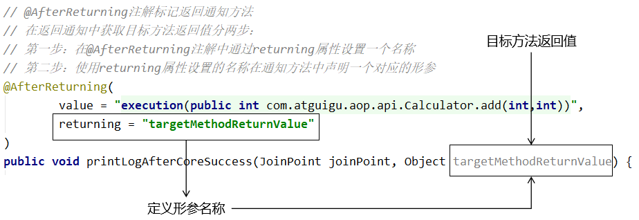

[[toc]]

# 实验二 各个通知获取细节信息

## 1、JoinPoint接口

org.aspectj.lang.JoinPoint

- 要点1：JoinPoint 接口通过 getSignature() 方法获取目标方法的签名（方法声明时的完整信息）
- 要点2：通过目标方法签名对象获取方法名
- 要点3：通过 JoinPoint 对象获取外界调用目标方法时传入的实参列表组成的数组

```java
// @Before注解标记前置通知方法
// value属性：切入点表达式，告诉Spring当前通知方法要套用到哪个目标方法上
// 在前置通知方法形参位置声明一个JoinPoint类型的参数，Spring就会将这个对象传入
// 根据JoinPoint对象就可以获取目标方法名称、实际参数列表
@Before(value = "execution(public int com.atguigu.aop.api.Calculator.add(int,int))")
public void printLogBeforeCore(JoinPoint joinPoint) {
    
    // 1.通过JoinPoint对象获取目标方法签名对象
    // 方法的签名：一个方法的全部声明信息
    Signature signature = joinPoint.getSignature();
    
    // 2.通过方法的签名对象获取目标方法的详细信息
    String methodName = signature.getName();
    System.out.println("methodName = " + methodName);
    
    int modifiers = signature.getModifiers();
    System.out.println("modifiers = " + modifiers);
    
    String declaringTypeName = signature.getDeclaringTypeName();
    System.out.println("declaringTypeName = " + declaringTypeName);
    
    // 3.通过JoinPoint对象获取外界调用目标方法时传入的实参列表
    Object[] args = joinPoint.getArgs();
    
    // 4.由于数组直接打印看不到具体数据，所以转换为List集合
    List<Object> argList = Arrays.asList(args);
    
    System.out.println("[AOP前置通知] " + methodName + "方法开始了，参数列表：" + argList);
}
```

需要获取方法签名、传入的实参等信息时，可以在通知方法声明JoinPoint类型的形参。


## 2、方法返回值




在返回通知中，通过@AfterReturning注解的returning属性获取目标方法的返回值

```java
// @AfterReturning注解标记返回通知方法
// 在返回通知中获取目标方法返回值分两步：
// 第一步：在@AfterReturning注解中通过returning属性设置一个名称
// 第二步：使用returning属性设置的名称在通知方法中声明一个对应的形参
@AfterReturning(
        value = "execution(public int com.atguigu.aop.api.Calculator.add(int,int))",
        returning = "targetMethodReturnValue"
)
public void printLogAfterCoreSuccess(JoinPoint joinPoint, Object targetMethodReturnValue) {
    
    String methodName = joinPoint.getSignature().getName();
    
    System.out.println("[AOP返回通知] "+methodName+"方法成功结束了，返回值是：" + targetMethodReturnValue);
}
```


## 3、目标方法抛出的异常


在异常通知中，通过@AfterThrowing注解的throwing属性获取目标方法抛出的异常对象

```java
// @AfterThrowing注解标记异常通知方法
// 在异常通知中获取目标方法抛出的异常分两步：
// 第一步：在@AfterThrowing注解中声明一个throwing属性设定形参名称
// 第二步：使用throwing属性指定的名称在通知方法声明形参，Spring会将目标方法抛出的异常对象从这里传给我们
@AfterThrowing(
        value = "execution(public int com.atguigu.aop.api.Calculator.add(int,int))",
        throwing = "targetMethodException"
)
public void printLogAfterCoreException(JoinPoint joinPoint, Throwable targetMethodException) {
    
    String methodName = joinPoint.getSignature().getName();
    
    System.out.println("[AOP异常通知] "+methodName+"方法抛异常了，异常类型是：" + targetMethodException.getClass().getName());
}
```


打印效果局部如下：

> [AOP异常通知] div方法抛异常了，异常类型是：java.lang.ArithmeticException
>
> java.lang.ArithmeticException: / by zero
>
> at com.atguigu.aop.imp.CalculatorPureImpl.div(CalculatorPureImpl.java:42)
> at sun.reflect.NativeMethodAccessorImpl.invoke0(Native Method)
> at sun.reflect.NativeMethodAccessorImpl.invoke(NativeMethodAccessorImpl.java:62)
> at sun.reflect.DelegatingMethodAccessorImpl.invoke(DelegatingMethodAccessorImpl.java:43)
> at java.lang.reflect.Method.invoke(Method.java:498)
> at org.springframework.aop.support.AopUtils.invokeJoinpointUsingReflection(AopUtils.java:344)


[上一个实验](experiment01.html) [回目录](../verse05.html) [下一个实验](experiment03.html)