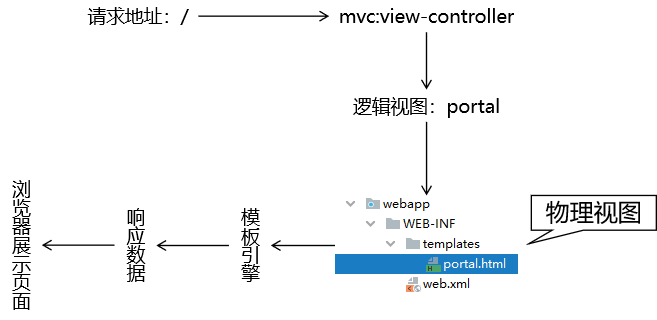
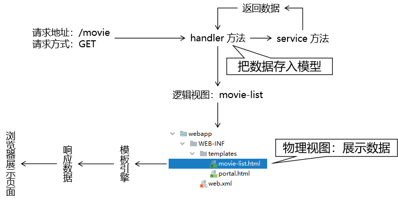
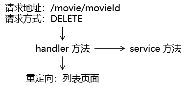
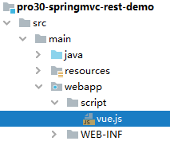
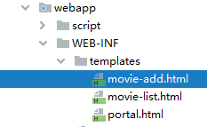

[[toc]]

# 第四节 案例

## 1、准备工作

和传统 CRUD 一样。

- 搭建环境
- 准备实体类
- 准备Service接口和实现类


## 2、功能清单

| 功能                  | URL 地址        | 请求方式 |
| --------------------- | --------------- | -------- |
| 访问首页√             | /               | GET      |
| 查询全部数据√         | /movie          | GET      |
| 删除√                 | /movie/2        | DELETE   |
| 跳转到添加数据的表单√ | /movie/add/page | GET      |
| 执行保存√             | /movie          | POST     |
| 跳转到更新数据的表单√ | /movie/2        | GET      |
| 执行更新√             | /movie          | PUT      |


## 3、具体功能：访问首页

### ①流程图




### ②配置view-controller


```xml
<mvc:view-controller path="/" view-name="portal"/>
```


### ③创建页面


```html
<!DOCTYPE html>
<html lang="en" xmlns:th="http://www.thymeleaf.org">
<head>
    <meta charset="UTF-8">
    <title>首页</title>
</head>
<body style="text-align: center">
    <h1>首页</h1>
    
    <a th:href="@{/movie}">显示电影列表</a>
    
</body>
</html>
```


## 4、具体功能：查询全部数据

### ①流程图




### ②handler 方法

```java
@RequestMapping(value = "/movie", method = RequestMethod.GET)
public String getMovieList(Model model) {
        
    // 1.调用 Service 方法查询数据
    List<Movie> movieList = movieService.getAll();
        
    // 2.将数据存入模型
    model.addAttribute("movieList", movieList);
    
    // 3.返回逻辑视图
    return "movie-list";
}
```


### ③页面展示数据

```html
<table>
    <tr>
        <th>电影ID</th>
        <th>电影名称</th>
        <th>电影票价格</th>
        <th>删除</th>
        <th>更新</th>
    </tr>
    <tbody th:if="${#lists.isEmpty(movieList)}">
    <tr>
        <td colspan="5">抱歉！没有查询到数据！</td>
    </tr>
    <tr>
        <td colspan="5">
            <a th:href="@{/movie/add/page}">跳转到添加数据的表单页面</a>
        </td>
    </tr>
    </tbody>
    <tbody th:if="${not #lists.isEmpty(movieList)}">
    <tr th:each="movie : ${movieList}">
        <td th:text="${movie.movieId}">这里显示电影ID</td>
        <td th:text="${movie.movieName}">这里显示电影名称</td>
        <td th:text="${movie.moviePrice}">这里显示电影价格</td>
        <td>
            <a th:href="@{/movie/}+${movie.movieId}">删除</a>
        </td>
        <td>
            <a th:href="@{/movie/}+${movie.movieId}">更新</a>
        </td>
    </tr>
    <tr>
        <td colspan="5">
            <a th:href="@{/movie/add/page}">跳转到添加数据的表单页面</a>
        </td>
    </tr>
    </tbody>
</table>
```


## 5、具体功能：删除



重点在于将 GET 请求转换为 DELETE。基本思路是：通过一个<span style="color:blue;font-weight:bold;">通用表单</span>，使用 <span style="color:blue;font-weight:bold;">Vue</span> 代码先把 GET 请求转换为 POST，然后再借助 <span style="color:blue;font-weight:bold;">hiddenHttpMethodFilter</span> 在服务器端把 POST 请求转为 DELETE。


### ①创建通用表单

```html
<!-- 组件名称：通用表单 -->
<!-- 组件作用：把删除超链接的 GET 请求转换为 POST，并携带 _method 请求参数 -->
<form id="convertForm" method="post">
    
    <!-- 请求参数作用：告诉服务器端 hiddenHttpMethodFilter 要转换的目标请求方式 -->
    <!-- 请求参数名：_method，这是 hiddenHttpMethodFilter 中规定的 -->
    <!-- 请求参数值：delete，这是因为我们希望服务器端将请求方式最终转换为 delete -->
    <input type="hidden" name="_method" value="delete"/>
</form>
```


### ②删除超链接绑定单击响应函数

在这个单击响应函数中完成转换

#### [1]引入 Vue



```html
<script type="text/javascript" th:src="@{/script/vue.js}"></script>
```


#### [2]绑定单击响应函数

删除超链接：

```html
<a @click="doConvert" th:href="@{/movie/}+${movie.movieId}">删除</a>
```


Vue代码：

```javascript
new Vue({
    "el":"#dataTable",
    "methods":{
        "doConvert":function () {
    
            // 1.根据 id 值查询到通用表单的元素对象
            var convertFormEle = document.getElementById("convertForm");
    
            // 2.将当前超链接的 href 属性值赋值给通用表单的元素对象的 action 属性
            // ①event：当前事件对象
            // ②event.target：当前点击的超链接对象
            // ③event.target.href：读取当前超链接对象的 href 属性
            // ④convertFormEle.action：给表单的 action 属性赋值
            convertFormEle.action = event.target.href;
    
            // 3.提交通用表单
            convertFormEle.submit();
    
            // 测试单击响应函数是否正确绑定
            // console.log("你点我了！！！");
    
            // 取消超链接控件的默认行为
            event.preventDefault();
        }
    }
});
```


### ③handler 方法

```java
    // 实际访问地址举例：/movie/2345QEA
    // 想要把路径中代表 movieId 的部分给匹配出来
    // 所以在 @RequestMapping 注解中写 URL 地址的时候，把地址中动态的部分用大括号标记出来
    // 在大括号中声明变量名
    // 在 @PathVariable 注解中引用这个变量名
    // 使用 @PathVariable 注解修饰一个形参，SpringMVC 就会将匹配到的值从形参这里传入
    @RequestMapping(value = "/movie/{movieId}", method = RequestMethod.DELETE)
    public String removeMovie(
            @PathVariable("movieId") String movieId
    ) {
    
        // 1.执行删除
        movieService.removeMovieById(movieId);
    
        // 2.重定向到显示列表的页面
        return "redirect:/movie";
    }
```


## 6、具体功能：跳转到添加数据的表单

### ①流程图


### ②配置view-controller


```xml
<mvc:view-controller path="/movie/add/page" view-name="movie-add"/>
```


### ③创建页面



```html
<form th:action="@{/movie}" method="post">
    
    电影名称：<input type="text" name="movieName" /><br/>
    电影票价格：<input type="text" name="moviePrice" /><br/>
    
    <button type="submit">保存</button>
    
</form>
```


## 7、具体功能：执行保存

### ①流程图


### ②handler 方法

```java
    @RequestMapping(value = "/movie", method = RequestMethod.POST)
    public String saveMovie(Movie movie) {
  
        movieService.saveMovie(movie);
  
        return "redirect:/movie";
    }
```


## 8、具体功能：跳转到更新数据的表单

### ①流程图


### ②handler 方法

```java
    @RequestMapping(value ="/movie/{movieId}", method = RequestMethod.GET)
    public String toEditPage(@PathVariable("movieId") String movieId, Model model) {
 
        Movie movie = movieService.getMovieById(movieId);
 
        model.addAttribute("movie", movie);
 
        return "movie-edit";
    }
```


### ③页面表单回显

```html
<form th:action="@{/movie}" method="post">
 
    <input type="hidden" name="_method" value="PUT" />
    <input type="hidden" name="movieId" th:value="${movie.movieId}" />
 
    电影名称：<input type="text" name="movieName" th:value="${movie.movieName}" /><br/>
    电影票价格：<input type="text" name="moviePrice" th:value="${movie.moviePrice}" /><br/>

    <button type="submit">更新</button>
 
</form>
```


## 9、具体功能：执行更新

### ①流程图


### ②handler 方法

```java
@RequestMapping(value = "/movie", method = RequestMethod.PUT)
public String updateMovie(Movie movie) {
 
    movieService.updateMovie(movie);
 
    return "redirect:/movie";
}
```


[上一节](verse03.html) [回目录](index.html)