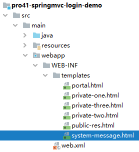
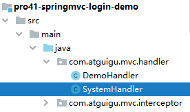
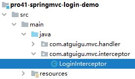

[[toc]]

# 案例

## 1、准备工作

- 搭建环境
- 创建首页
  - 首页超链接：公共资源
  - 首页超链接：三个私密资源
- 创建 DemoHandler

```java
@Controller
public class DemoHandler {
 
    @RequestMapping("/public/resource")
    public String publicResource() {

        return "public-res";
    }
 
    @RequestMapping("/private/resource/{path}")
    public String privateResource(@PathVariable String path) {

        return "private-"+path;
    }
 
}
```


## 2、显示错误提示

### ①需求点

系统错误信息显示页面需要动态显示提示消息，这就需要 Thymeleaf 模板引擎的解析。


### ②创建视图页面



```html
<!DOCTYPE html>
<html lang="en" xmlns:th="http://www.thymeleaf.org">
<head>
    <meta charset="UTF-8">
    <title>Title</title>
</head>
<body>
 
    <h1>系统消息</h1>
 
    <p th:text="${message}">在这里显示从请求域读取的消息</p>
 
    <a th:href="@{/}">回首页</a>
</body>
</html>
```


### ③创建 handler 方法



```java
@Controller
public class SystemHandler {
 
    @RequestMapping("/feature/system/message")
    public String toSystemMessagePage(){
 
        return "system-message";
    }
 
}
```

注：在当前这个小练习中，这个 handler 方法里面没有具体代码，所以也可以用 view-controller 代替


## 3、创建拦截器

### ①创建拦截器类



```java
public class LoginInterceptor implements HandlerInterceptor {
 
    @Override
    public boolean preHandle(HttpServletRequest request, HttpServletResponse response, Object handler) throws Exception {
 
        // 假设：请求参数中携带 token，且 token 值为 login 表示已登录
        // 1、获取请求参数
        String token = request.getParameter("token");
 
        // 2、检查 token 值
        if ("login".equals(token)) {
 
            // 3、对已经登录的请求执行放行操作
            return true;
 
        }
 
        // 4、对没有登录的请求跳转到错误信息提示页面
        // ①将提示消息存入请求域
        request.setAttribute("message",
                "私密资源需要登录后才可以访问");
 
        // ②执行转发
        request.getRequestDispatcher("/feature/system/message").forward(request, response);
 
        // 5、拦截器不放行，停止执行后续操作
        return false;
    }
}
```


### ②注册拦截器类

```xml
<!-- 注册拦截器类 -->
<mvc:interceptors>
    <mvc:interceptor>
        <!-- 拦截所有匹配 /private/resource/* 路径的请求 -->
        <mvc:mapping path="/private/resource/*"/>
 
        <!-- 配置拦截器类 -->
        <bean class="com.atguigu.mvc.interceptor.LoginInterceptor"/>
    </mvc:interceptor>
</mvc:interceptors>
```


[回到上一层](../verse02.html)