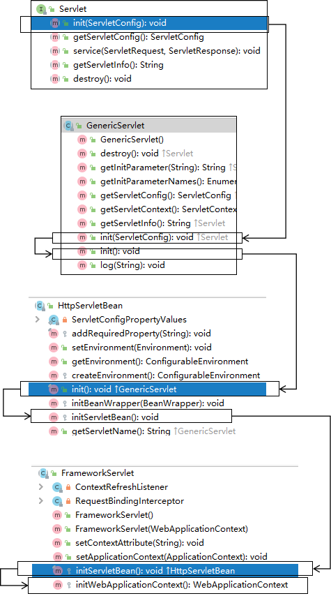

[[toc]]

# 第一节 启动过程

## 1、Servlet 生命周期回顾


| 生命周期环节 | 调用的方法                                                   | 时机                                                         | 次数 |
| ------------ | ------------------------------------------------------------ | ------------------------------------------------------------ | ---- |
| 创建对象     | 无参构造器                                                   | <span style="color:blue;font-weight:bold;">默认：第一次请求<br />修改：Web应用启动时</span> | 一次 |
| 初始化       | init(ServletConfig servletConfig)                            | 创建对象后                                                   | 一次 |
| 处理请求     | service(ServletRequest servletRequest, <br />ServletResponse servletResponse) | 接收到请求后                                                 | 多次 |
| 清理操作     | destroy()                                                    | Web应用卸载之前                                              | 一次 |


## 2、初始化操作调用路线图

### ①类和接口之间的关系


### ②调用线路图

调用线路图所示是方法调用的顺序，但是实际运行的时候本质上都是调用 DispatcherServlet 对象的方法。包括这里涉及到的接口的方法，也不是去调用接口中的『抽象方法』。毕竟抽象方法是没法执行的。抽象方法一定是在某个实现类中有具体实现才能被调用。

而对于最终的实现类：DispatcherServlet 来说，所有父类的方法最后也都是在 DispatcherServlet 对象中被调用的。




## 3、IOC 容器创建

所在类：org.springframework.web.servlet.FrameworkServlet

```java
protected WebApplicationContext createWebApplicationContext(@Nullable ApplicationContext parent) {
	Class<?> contextClass = getContextClass();
	if (!ConfigurableWebApplicationContext.class.isAssignableFrom(contextClass)) {
		throw new ApplicationContextException(
				"Fatal initialization error in servlet with name '" + getServletName() +
				"': custom WebApplicationContext class [" + contextClass.getName() +
				"] is not of type ConfigurableWebApplicationContext");
	}
    
    // 通过反射创建 IOC 容器对象
	ConfigurableWebApplicationContext wac =
			(ConfigurableWebApplicationContext) BeanUtils.instantiateClass(contextClass);

	wac.setEnvironment(getEnvironment());
    
    // 设置父容器
	wac.setParent(parent);
	String configLocation = getContextConfigLocation();
	if (configLocation != null) {
		wac.setConfigLocation(configLocation);
	}
	configureAndRefreshWebApplicationContext(wac);

	return wac;
}
```


## 4、将 IOC 容器对象存入应用域

所在类：org.springframework.web.servlet.FrameworkServlet

```java
protected WebApplicationContext initWebApplicationContext() {
	WebApplicationContext rootContext =
			WebApplicationContextUtils.getWebApplicationContext(getServletContext());
	WebApplicationContext wac = null;

	if (this.webApplicationContext != null) {
		wac = this.webApplicationContext;
		if (wac instanceof ConfigurableWebApplicationContext) {
			ConfigurableWebApplicationContext cwac = (ConfigurableWebApplicationContext) wac;
			if (!cwac.isActive()) {
				if (cwac.getParent() == null) {
					cwac.setParent(rootContext);
				}
				configureAndRefreshWebApplicationContext(cwac);
			}
		}
	}
	if (wac == null) {
		wac = findWebApplicationContext();
	}
	if (wac == null) {
        // 创建 IOC 容器
		wac = createWebApplicationContext(rootContext);
	}

	if (!this.refreshEventReceived) {
		synchronized (this.onRefreshMonitor) {
			onRefresh(wac);
		}
	}

	if (this.publishContext) {
		// 获取存入应用域时专用的属性名
		String attrName = getServletContextAttributeName();
        
        // 存入
		getServletContext().setAttribute(attrName, wac);
	}

	return wac;
}
```

看到这一点的意义：SpringMVC 有一个工具方法，可以从应用域获取 IOC 容器对象的引用。


工具类：org.springframework.web.context.support.<span style="color:blue;font-weight:bold;">WebApplicationContextUtils</span>

工具方法：getWebApplicationContext()

```java
@Nullable
public static WebApplicationContext getWebApplicationContext(ServletContext sc) {
	return getWebApplicationContext(sc, WebApplicationContext.ROOT_WEB_APPLICATION_CONTEXT_ATTRIBUTE);
}
```


## 5、请求映射初始化

FrameworkServlet.createWebApplicationContext()→configureAndRefreshWebApplicationContext()→wac.refresh()→触发刷新事件→org.springframework.web.servlet.DispatcherServlet.initStrategies()→org.springframework.web.servlet.DispatcherServlet.initHandlerMappings()


## 6、小结

整个启动过程我们关心如下要点：

- DispatcherServlet 本质上是一个 Servlet，所以天然的遵循 Servlet 的生命周期。所以宏观上是 Servlet 生命周期来进行调度。
- DispatcherServlet 的父类是 FrameworkServlet。
  - FrameworkServlet 负责框架本身相关的创建和初始化。
  - DispatcherServlet 负责请求处理相关的初始化。
- FrameworkServlet 创建 IOC 容器对象之后会存入应用域。
- FrameworkServlet 完成初始化会调用 IOC 容器的刷新方法。
- 刷新方法完成触发刷新事件，在刷新事件的响应函数中，调用 DispatcherServlet 的初始化方法。
- 在 DispatcherServlet 的初始化方法中初始化了请求映射等。


[回目录](index.html) [下一节](verse02.html)