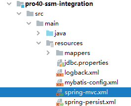

[[toc]]


# 第四节 增删改操作

## 1、设计 URL 地址

| 功能         | 地址                  | 请求方式        |
| ------------ | --------------------- | --------------- |
| 删除         | /emp/{empId}/{pageNo} | DELETE          |
| 前往新增页面 | /emp/add              | view-controller |
| 提交新增表单 | /emp                  | POST            |
| 前往更新页面 | /emp/{empId}/{pageNo} | GET             |
| 提交更新表单 | /emp                  | PUT             |


## 2、删除操作

### ①创建超链接


```html
<a th:href="@{/emp/}+${emp.empId}+'/'+${pageInfo.pageNum}" @click="doConvert">删除</a>
```


### ②handler 方法


```java
@DeleteMapping("/emp/{empId}/{pageNo}")
public String doRemove(
        @PathVariable("empId") Integer empId,
        @PathVariable("pageNo") Integer pageNo
) {
 
    // 执行删除
    empService.removeEmpById(empId);
 
    return "redirect:/get/page/" + pageNo;
}
```


### ③service 方法


```java
@Transactional(
        readOnly = false,
        propagation = Propagation.REQUIRES_NEW,
        rollbackFor = Exception.class)
@Override
public void removeEmpById(Integer empId) {
 
    empMapper.deleteByPrimaryKey(empId);
 
}
```


### ④mapper 方法


```java
void deleteByPrimaryKey(Integer empId);
```


### ⑤SQL 语句


```xml
<!-- void deleteByPrimaryKey(Integer empId); -->
<delete id="deleteByPrimaryKey">
    delete from t_emp where emp_id=#{empId}
</delete>
```


## 3、保存操作：前往表单页面

### ①创建超链接


```html
    <tr>
        <td colspan="5">
            <a th:href="@{/emp/add}">前往添加数据的表单页面</a>
        </td>
    </tr>
</tbody>
```


### ②创建 view-controller



```xml
<mvc:view-controller path="/emp/add" view-name="emp-add-form"/>
```


### ③创建视图页面


```html
<form th:action="@{/emp}" method="post">
    员工姓名：<input type="text" name="empName" /><br/>
    员工工资：<input type="text" name="empSalary" /><br/>
    <button type="submit">保存</button>
</form>
```


## 4、保存操作：提交表单

### ①handler 方法


```java
@PostMapping("/emp")
public String saveEmp(Emp emp) {
 
    // 执行保存
    empService.saveEmp(emp);
 
    // 为了在保存完成后直接显示新数据，直接前往最后一页
    // 通过 Integer.MAX_VALUE 获取一个非常大的数据，
    // 再结合配置 PageHelper 时指定的 reasonable 就可以直接前往最后一页
    return "redirect:/get/page/" + Integer.MAX_VALUE;
}
```


### ②service 方法


```java
@Transactional(
        readOnly = false,
        propagation = Propagation.REQUIRES_NEW,
        rollbackFor = Exception.class)
@Override
public void saveEmp(Emp emp) {
    empMapper.insertEmp(emp);
}
```


### ③mapper 方法


```java
void insertEmp(Emp emp);
```


### ④SQL 语句


```xml
<!-- void insertEmp(Emp emp); -->
<insert id="insertEmp">
    insert into t_emp(emp_name,emp_salary) values(#{empName},#{empSalary})
</insert>
```


## 5、更新操作：前往表单页面

### ①创建超链接


```html
<a th:href="@{/emp/}+${emp.empId}+'/'+${pageInfo.pageNum}">更新</a>
```


### ②handler 方法


```java
@GetMapping("/emp/{empId}/{pageNo}")
public String toEditPage(
        @PathVariable("empId") Integer empId,
            
        // @PathVariable 注解解析得到的数据会被自动存入模型，
        // 属性名就是注解中的变量名
        @PathVariable("pageNo") Integer pageNo,
        Model model
) {
 
    // 执行查询
    Emp emp = empService.getEmpById(empId);
 
    // 将实体类对象存入模型
    model.addAttribute("emp", emp);
 
    return "emp-edit-form";
}
```


### ③service 方法


```java
@Override
@Transactional(readOnly = true)
public Emp getEmpById(Integer empId) {
 
    return empMapper.selectByPrimaryKey(empId);
}
```


### ④mapper 方法


```java
Emp selectByPrimaryKey(Integer empId);
```


### ⑤SQL 语句


```java
<!-- Emp selectByPrimaryKey(Integer empId); -->
<select id="selectByPrimaryKey" resultType="Emp">
    select emp_id,emp_name,emp_salary from t_emp where emp_id=#{empId}
</select>
```


### ⑥创建页面视图


```html
<form th:action="@{/emp}" method="post">
 
    <!-- 附带表单隐藏域：将 POST 请求转换为 PUT 请求 -->
    <input type="hidden" name="_method" value="PUT" />
 
    <!-- 附带表单隐藏域：实体类的 id -->
    <input type="hidden" name="empId" th:value="${emp.empId}" />
 
    <!-- 附带表单隐藏域：来源页的页码 -->
    <input type="hidden" name="pageNo" th:value="${pageNo}" />
 
    <!-- 常规表单项回显 -->
    员工姓名：<input type="text" name="empName" th:value="${emp.empName}" /><br/>
    员工工资：<input type="text" name="empSalary" th:value="${emp.empSalary}" /><br/>
    <button type="submit">更新</button>
</form>
```


## 6、更新操作：提交表单

### ①handler 方法


```java
@PutMapping("/emp")
public String updateEmp(Emp emp, @RequestParam("pageNo") Integer pageNo) {
 
    // 执行更新
    empService.updateEmp(emp);
 
    // 重定向到分页页面
    return "redirect:/get/page/" + pageNo;
}
```


### ②service 方法


```java
@Override
@Transactional(
        readOnly = false,
        propagation = Propagation.REQUIRES_NEW,
        rollbackFor = Exception.class)
public void updateEmp(Emp emp) {
    empMapper.updateEmpByPrimaryKey(emp);
}
```


### ③mapper 方法


```java
void updateEmpByPrimaryKey(Emp emp);
```


### ④SQL 语句


```xml
<!-- void updateEmpByPrimaryKey(Emp emp); -->
<update id="updateEmpByPrimaryKey">
    update t_emp set emp_name=#{empName},emp_salary=#{empSalary}
    where emp_id=#{empId}
</update>
```


[上一节](verse03.html) [回目录](../index.html)