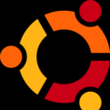

[[toc]]

# 第一章 Linux概述

## 1、为什么要使用Linux

Linux内核最初只是由芬兰人林纳斯·托瓦兹（Linus Torvalds）在赫尔辛基大学上学时出于个人爱好而编写的。

Linux是一套免费使用和自由传播的类Unix操作系统，是一个基于POSIX和UNIX的多用户、多任务、支持多线程和多CPU的操作系统。Linux能运行主要的UNIX工具软件、应用程序和网络协议。它支持32位和64位硬件。Linux继承了Unix以网络为核心的设计思想，是一个性能稳定的多用户网络操作系统。

目前市面上较知名的发行版有：Ubuntu、RedHat、CentOS、Debain、Fedora、SuSE、OpenSUSE。

Linux的优势主要体现在下面几个方面：

### ①性能强劲，安全稳定

Linux本来就是基于Unix概念而发展出来的操作系统，当然也继承了Unix稳定高效的特点。使用Linux系统的主机连续工作1年以上不死机、不重启是非常常见的。所以很多电影、动画中的特效制作这样需要强大运算能力的工作都是运行在Linux系统之上。

### ②可定制

如果你对Linux足够了解，完全可以使用Linux内核搭配需要的组件构成一个定制版系统，甚至你可以修改Linux源码进行深度定制

### ③免费或少许费用

学习Linux可以免费使用Linux的各种发行版，在商业用途中往往也只是支付很少的费用即可

### ④硬件配置要求低

Linux内核只有几KB大小，仅运行内核的话需要的系统开销很小，以命令行方式操作Linux也一样。以图形化界面方式运行Linux需要的资源也比Windows更少。

### ⑤嵌入移动设备

由于Linux只需要很少的资源就能够驱动所有硬件设备工作，所以非常适合嵌入到手机等移动设备中，例如现在我们使用的Android系统就是以Linux为核心的。

## 2、Linux之父

林纳斯·托瓦兹最早推出Linux系统内核时只有21岁，此时他已经有了10年编程经验。他的名言是：“Talk is cheap,show me the code!”。

## 3、Linux发行版

Linus和他的虚拟团队的工作仅仅是开发了Linux内核以及附带的一些工具，尚不能作为一个完整的可以交给终端用户使用的操作系统。为了方便用户使用，很多的商业公司或非营利团体，就将Linux 内核（包括工具）与可运行的软件整合起来，再加上系统的安装工具。这个『内核+软件+工具』的完全可安装的整体，我们称之为Linux distribution，这就是Linux的发行版，港台腔叫发行套件。这是Linux这样的开放式系统和Windows、Mac等这些封闭式系统的一个显著差别。

初学Linux通常会选择CentOS，这其实是RedHat收费后去掉收费功能而发布的一个免费的社区版。

主要的Linux发行版有：

### ①RedHat

http://www.redhat.com

### ②Fedora

http://fedoraproject.org

### ③Debian

http://www.debian.org

### ④Ubuntu

http://www.ubuntu.com

### ⑤CentOS

CentOS是RedHat的社区版

http://www.centos.org

我们可以从网易开源镜像站获取CentOS系统的镜像文件

http://mirrors.163.com

[返回上一级目录](../index.html)&nbsp;[下一章](../chapter02/index.html)