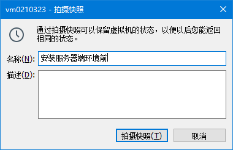
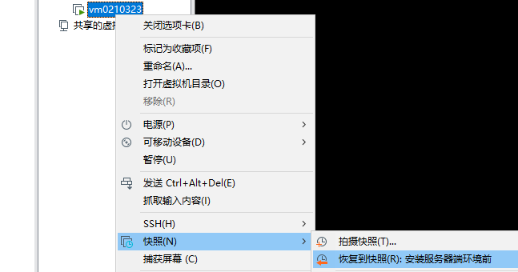
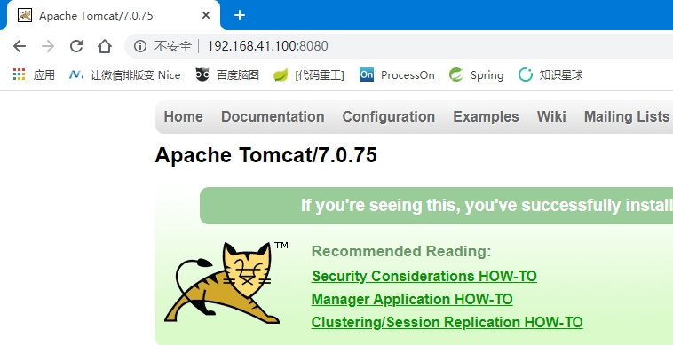

[[toc]]

# 第四节 服务器端应用程序安装

## 1、友情提示：退路

### ①备份配置文件

Linux 系统环境下配置文件通常内容很多。如果不小心修改了不该修改的地方，自己有不记得做了修改，那么将来报错很难找到错误位置。

为了避免这样的问题，我们可以在修改任何配置文件之前都多复制一份：把原始、纯净、正确的配置文件执行了备份。将来万一发生问题，拿原始配置文件覆盖错误配置文件，瞬间恢复到正确状态可以重新开始。


### ②拍摄快照

#### [1]第一种用法

针对需要通过安装过程来安装的程序，如果安装失败需要卸载后重新安装，那最好是卸载干净再重新执行安装。Linux 环境下不方便执行『清理残留』。

所以为了避免安装失败以后没有退路可以重新开始，建议在执行相关安装之前拍摄快照。一旦发生问题，可以恢复快照重新开始。


#### [2]第二种用法

对于已经安装好的程序（特别是系统当中安装了很多程序都已成功），强烈建议通过拍摄快照的方式保留这个正确的状态。


#### [3]操作

- 保存快照





- 恢复快照




- 删除快照


## 2、安装 JDK

### ①rpm 命令

rpm 是 Redhat package management 的缩写，实质上来说，通过 rpm 可以管理 Linux 环境下的安装包。

| 参数名   | 作用                                                         |
| -------- | ------------------------------------------------------------ |
| -qa      | 查询系统中已经安装的程序，通常配合管道，使用 grep 精确匹配想要查询的包 |
| -ivh     | 执行 rpm 包安装操作                                          |
| -e       | 卸载 rpm 包                                                  |
| --nodeps | 在卸载过程中忽略依赖关系                                     |

> 注：Linux 系统中命令的参数往往有这样的特点：
>
> - 参数如果是一个或多个完整的单词那么前面是两个“-”
> - 参数如果是单词的缩写，是一个字母，那么前面是一个“-”


### ②卸载系统预装的 JDK

查询系统中已经安装的 JDK

```shell
[root@apple ~]# rpm -qa | grep openjdk
java-1.8.0-openjdk-headless-1.8.0.161-2.b14.el7.x86_64
java-1.7.0-openjdk-1.7.0.171-2.6.13.2.el7.x86_64
java-1.8.0-openjdk-1.8.0.161-2.b14.el7.x86_64
java-1.7.0-openjdk-headless-1.7.0.171-2.6.13.2.el7.x86_64
```


执行卸载，卸载过程中使用 --nodeps 忽略依赖关系

```shell
[root@apple ~]# rpm -e --nodeps java-1.8.0-openjdk-headless-1.8.0.161-2.b14.el7.x86_64
[root@apple ~]# rpm -e --nodeps java-1.7.0-openjdk-1.7.0.171-2.6.13.2.el7.x86_64
[root@apple ~]# rpm -e --nodeps java-1.8.0-openjdk-1.8.0.161-2.b14.el7.x86_64
[root@apple ~]# rpm -e --nodeps java-1.7.0-openjdk-headless-1.7.0.171-2.6.13.2.el7.x86_64
```


<span style="color:blue;font-weight:bold;">重启系统生效</span>

```shell
[root@atguigu java]# reboot
```


### ③解压 JDK 的 tar 包配置环境变量

#### [1]解压 JDK 的 tar 包

```shell
cd /opt
tar -zxvf /opt/jdk-8u121-linux-x64.tar.gz
```


#### [2]配置 JDK 相关环境变量

配置环境变量的配置文件：<span style="color:blue;font-weight:bold;">/etc/profile</span><br/>

为了避免配置错误导致运行失败，提前复制一份/etc/profile

```shell
cp /etc/profile /etc/profile.bak
```


编辑 /etc/profile 文件（下面内容添加到文件末尾）：

```shell
# 声明 JAVA_HOME 环境变量，等号两边不能有空格
JAVA_HOME=/opt/jdk1.8.0_121
   
# 给 PATH 环境变量附加 $JAVA_HOME/bin 部分
# $PATH 表示引用 PATH 环境变量以前的旧值
# 使用英文冒号连接
# $JAVA_HOME 表示对 JAVA_HOME 变量的引用
# $JAVA_HOME/bin 表示指向可执行文件
PATH=$JAVA_HOME/bin:$PATH
   
# 发布
# 发布是发布变量名，不是引用变量的值，所以前面不写 $ 符号
export JAVA_HOME PATH
```


保存退出vim后，使用source命令执行/etc/profile脚本，让脚本中发布的环境变量生效。但是仅限于当前进程，如果想让新环境变量全局生效，可以reboot。

```shell
source /etc/profile
```


验证一下：

```shell
[root@apple jdk1.8.0_121]# echo $JAVA_HOME
/opt/jdk1.8.0_121

[root@apple jdk1.8.0_121]# echo $PATH
/opt/jdk1.8.0_121/bin:/usr/local/sbin:/usr/local/bin:/usr/sbin:/usr/bin:/root/bin

[root@apple jdk1.8.0_121]# java -version
java version "1.8.0_121"
Java(TM) SE Runtime Environment (build 1.8.0_121-b13)
Java HotSpot(TM) 64-Bit Server VM (build 25.121-b13, mixed mode)
```


## 3、安装Tomcat

### ①解压

```shell
tar -zxvf /opt/apache-tomcat-7.0.75.tar.gz
```


### ②操控

启动 Tomcat

```shell
/opt/apache-tomcat-7.0.75/bin/startup.sh
```


停止 Tomcat

```shell
/opt/apache-tomcat-7.0.75/bin/shutdown.sh
```


查看日志

```shell
tail -F /opt/apache-tomcat-7.0.75/logs/catalina.out
```


部署 war 包放在 webapps 目录下

```shell
/opt/apache-tomcat-7.0.75/webapps
```


### ③访问




- 在 Linux 系统本地使用火狐浏览器访问可以使用 localhost
- 在 Windows 系统访问 Linux 服务器端的 Tomcat 需要使用 LInux 的 IP 地址


## 4、MySQL安装步骤

### ①卸载系统预装 mariadb

```shell
rpm -e --nodeps mariadb-libs-1:5.5.56-2.el7.x86_64
```

> 注：MySQL 被 Oracle 收购，社区担心将来 MySQL 被 Oracle 关闭开源模式，和 Oracle 数据库一样变成商业化运作。所以社区开发了一个 MySQL 的社区版，内部和 MySQL 一样，只是名字不同，这就是 mariadb。但是我们当前在 Linux 系统中已经预装的 mariadb 只是一个残片，不能直接使用。所以还是要先卸载。


### ②安装服务器端程序

```shell
rpm -ivh /opt/MySQL-server-5.5.52-1.el6.x86_64.rpm
```

验证

```shello
[root@apple opt]# id mysql
uid=988(mysql) gid=982(mysql) 组=982(mysql)
```


### ③安装客户端程序

```shell
rpm -ivh /opt/MySQL-client-5.5.52-1.el6.x86_64.rpm
```


### ④启动 MySQL 服务

```shell
systemctl start mysql.service
```


### ⑤设置 root 用户密码

注意：这里的 root 用户是 MySQL 的 root 用户，不是 Linux 的 root 用户

```shell
[root@apple opt]# mysqladmin -u root password
New password: 
Confirm new password:
```


### ⑥登录MySQL

```shell
[root@apple opt]# mysql -u root -p
Enter password: 
Welcome to the MySQL monitor.  Commands end with ; or \g.
Your MySQL connection id is 2
Server version: 5.5.52 MySQL Community Server (GPL)

Copyright (c) 2000, 2016, Oracle and/or its affiliates. All rights reserved.

Oracle is a registered trademark of Oracle Corporation and/or its
affiliates. Other names may be trademarks of their respective
owners.

Type 'help;' or '\h' for help. Type '\c' to clear the current input statement.

mysql> show databases;
+--------------------+
| Database           |
+--------------------+
| information_schema |
| mysql              |
| performance_schema |
| test               |
+--------------------+
4 rows in set (0.00 sec)
```


### ⑦客户端登录 MySQL 服务器

#### [1]被防火墙拦截的错误提示


通过关闭防火墙服务器解决

```shell
systemctl stop firewalld.service
systemctl disable firewalld.service
```


#### [2]被MySQL自己拒绝连接


#### [3]在 MySQL 服务器端设置允许任何主机地址访问

执行SQL语句

```sql
GRANT ALL PRIVILEGES ON *.* TO 'root'@'%' IDENTIFIED BY 'atguigu' WITH GRANT OPTION;
```


重启 MySQL 服务。下面是执行操作的参考：

```shell
[root@apple opt]# mysql -u root -p
Enter password: 
Welcome to the MySQL monitor.  Commands end with ; or \g.
Your MySQL connection id is 5
Server version: 5.5.52 MySQL Community Server (GPL)

Copyright (c) 2000, 2016, Oracle and/or its affiliates. All rights reserved.

Oracle is a registered trademark of Oracle Corporation and/or its
affiliates. Other names may be trademarks of their respective
owners.

Type 'help;' or '\h' for help. Type '\c' to clear the current input statement.

mysql> 
mysql> use mysql;
Reading table information for completion of table and column names
You can turn off this feature to get a quicker startup with -A

Database changed
mysql> select host,user,password from user;
+-----------+------+-------------------------------------------+
| host      | user | password                                  |
+-----------+------+-------------------------------------------+
| localhost | root | *453FDE92DF58E2DE1A51D27869CF3F1A69984B1B |
| apple     | root |                                           |
| 127.0.0.1 | root |                                           |
| ::1       | root |                                           |
| localhost |      |                                           |
| apple     |      |                                           |
+-----------+------+-------------------------------------------+
6 rows in set (0.01 sec)

mysql> GRANT ALL PRIVILEGES ON *.* TO 'root'@'%' IDENTIFIED BY 'atguigu' WITH GRANT OPTION;
Query OK, 0 rows affected (0.00 sec)

mysql> select host,user,password,select_priv,update_priv from user;
+-----------+------+-------------------------------------------+-------------+-------------+
| host      | user | password                                  | select_priv | update_priv |
+-----------+------+-------------------------------------------+-------------+-------------+
| localhost | root | *453FDE92DF58E2DE1A51D27869CF3F1A69984B1B | Y           | Y           |
| apple     | root |                                           | Y           | Y           |
| 127.0.0.1 | root |                                           | Y           | Y           |
| ::1       | root |                                           | Y           | Y           |
| localhost |      |                                           | N           | N           |
| apple     |      |                                           | N           | N           |
| %         | root | *453FDE92DF58E2DE1A51D27869CF3F1A69984B1B | Y           | Y           |
+-----------+------+-------------------------------------------+-------------+-------------+
7 rows in set (0.00 sec)
```


重启MySQL服务

```shell
systemctl restart mysql.service
```


### ⑧解决字符乱码问题

#### [1]查看字符相关变量

```sql
mysql> show variables like "%char%";
+--------------------------+----------------------------+
| Variable_name            | Value                      |
+--------------------------+----------------------------+
| character_set_client     | utf8                       |
| character_set_connection | utf8                       |
| character_set_database   | latin1                     |
| character_set_filesystem | binary                     |
| character_set_results    | utf8                       |
| character_set_server     | latin1                     |
| character_set_system     | utf8                       |
| character_sets_dir       | /usr/share/mysql/charsets/ |
+--------------------------+----------------------------+
8 rows in set (0.00 sec)
```


#### [2]准备MySQL配置文件

```shell
cp /usr/share/mysql/my-small.cnf /etc/my.cnf
```

```cnf
[mysqld]
port            = 3306
socket          = /var/lib/mysql/mysql.sock
skip-external-locking
key_buffer_size = 16K
max_allowed_packet = 1M
table_open_cache = 4
sort_buffer_size = 64K
read_buffer_size = 256K
read_rnd_buffer_size = 256K
net_buffer_length = 2K
thread_stack = 128K
character-set-server=utf8
```


在[mysqld]部分的配置的最后添加 <span style="color:blue;font-weight:bold;">character-set-server=utf8</span><br/>

> 注意：别在 vim 的一般模式下直接粘贴！<span style="color:blue;font-weight:bold;">一定要进入编辑模式</span>！


::: warning

注意：别在 vim 的一般模式下直接粘贴！<span style="color:blue;font-weight:bold;">一定要进入编辑模式</span>！

:::


重启MySQL服务

```shell
systemctl restart mysql.service
```


查看字符集相关变量

```sql
mysql> show variables like "%char%";
+--------------------------+----------------------------+
| Variable_name            | Value                      |
+--------------------------+----------------------------+
| character_set_client     | utf8                       |
| character_set_connection | utf8                       |
| character_set_database   | utf8                       |
| character_set_filesystem | binary                     |
| character_set_results    | utf8                       |
| character_set_server     | utf8                       |
| character_set_system     | utf8                       |
| character_sets_dir       | /usr/share/mysql/charsets/ |
+--------------------------+----------------------------+
8 rows in set (0.00 sec)
```


重新创建数据库、创建数据库表、插入中文字符数据验证。


[上一节](verse03-shell.html) [回目录](index.html) [下一节](verse05-network.html)