[[toc]]

# 一、版本控制概述

## 1、为什么需要版本控制

一个人无法完成一个庞大项目的开发，而多人协作开发时需要使用相应的辅助工具。


## 2、版本控制工具

- 集中式版本控制工具

  CVS、<span style="color:blue;font-weight:bold;">SVN(Subversion)</span>、VSS……

- 分布式版本控制工具

  <span style="color:blue;font-weight:bold;">Git</span>、Mercurial、Bazaar、Darcs……

# 二、Git概述

## 1、Git官网与Logo

Git官网的网址是：https://git-scm.com/

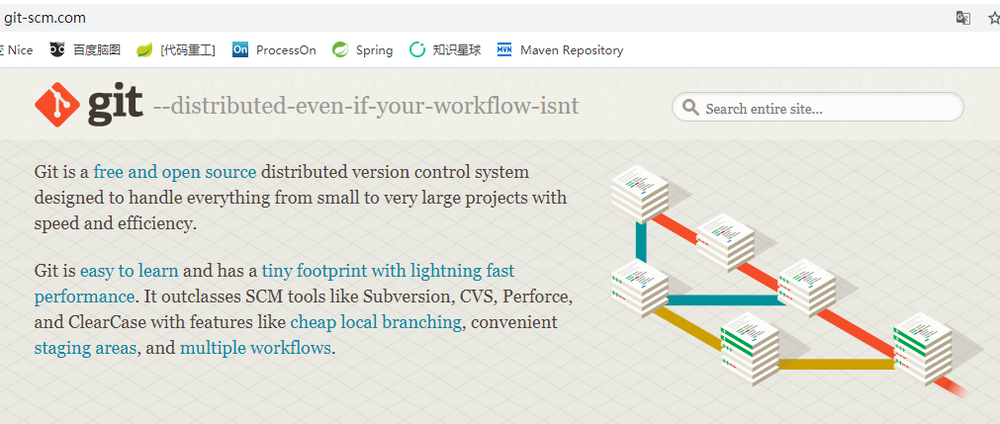

Git的Logo中特意凸显了<span style="color:blue;font-weight:bold;">分支</span>功能，说明这是Git官方认为的Git最大特色。而我们在实际使用中也确实能够体会到Git的分支功能确实如丝般顺滑，非常好用。


## 2、Git简史


## 3、Git工作机制

### ①本地库工作机制

Git使用本地库在我们本地的电脑上就可以记录版本信息，不需要联网。


### ②代码托管中心

代码托管中心负责维护<span style="color:blue;font-weight:bold;">远程库</span>，让团队成员可以彼此协作。

- 局域网

  Gitlab：如果有特殊需求不能使用外网的代码托管中心，可以在局域网内搭建自己的代码托管中心服务器。

- Internet

  GitHub：国外网站，有非常多优秀的开源项目托管代码，但是从国内访问很慢。

  码云：国内的代码托管中心，在国内互联网开发圈子中的地位举足轻重。

### ③远程库工作机制

#### [1]团队内协作


#### [2]跨团队协作


# 三、Git安装

[具体安装过程点这里](pages/installation.html)。

# 四、本地库命令行基本操作

## 1、初始化本地库

创建一个专门的目录，使用git init命令初始化为本地库，后面我们的版本控制操作都是在这个目录下进行。

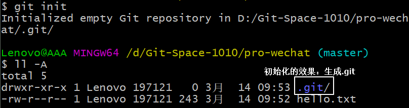

## 2、设置用户签名

签名的作用是区分不同操作者身份。用户的签名信息在每一个版本的提交信息中能够看到，以此确认本次提交是谁做的。<br/>
※注意：这里设置用户签名和将来登录GitHub（或其他代码托管中心）的账号没有任何关系。

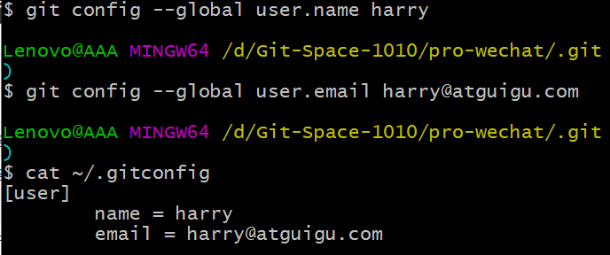

## 3、创建文件并进行版本控制

### ①新建文件

在初始化好本地库的这个目录中随便创建一个文本文件即可。

### ②查看本地库状态

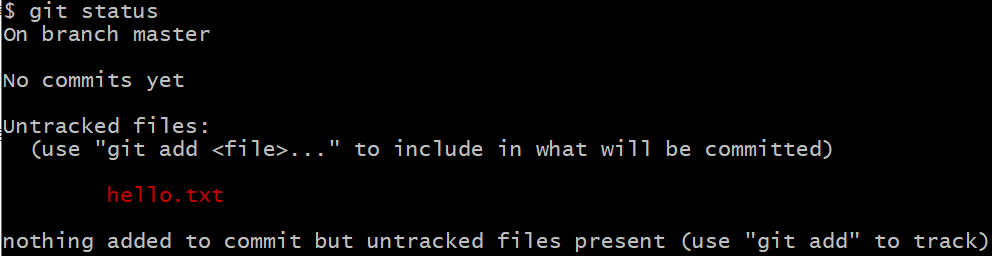

### ③追踪文件并添加到暂存区

git add命令有两个作用：

- 对“未追踪”的文件进行追踪，也就是加入版本控制体系，被Git管理。
- 将工作区的变动（新增和修改）添加到暂存区

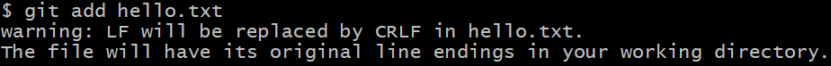

### ④再次查看本地库状态

检测到有新建的文件添加到了暂存区

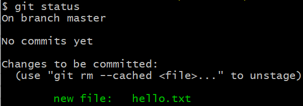

### ⑤将暂存区中的修改提交到本地库

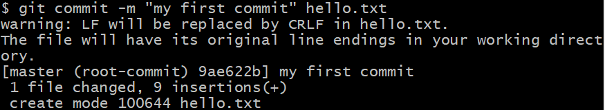

### ⑥提交完成后再查看本地库状态

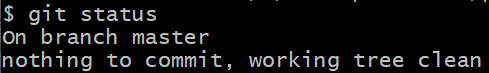

## 4、修改文件进行版本控制

### ①修改文件后查看本地库状态

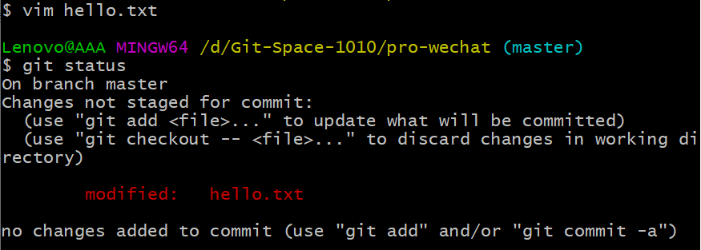

### ②工作区文件修改后添加到暂存区

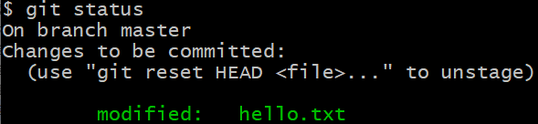

### ③后续操作

提交后再次查看状态，如果操作正确应该还是看到“working tree clean”。

## 5、不add直接commit

两种情况：

- 新建的文件尚未纳入版本控制体系：必须先add纳入版本控制体系后才可以commit
- 已纳入版本控制体系的文件被修改：可以不add直接commit，Git自动执行了add

## 6、版本穿梭

### ①查看版本记录

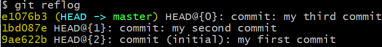

### ②切换到指定版本

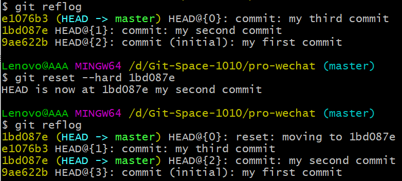

### ③底层其实是移动HEAD指针


# 五、本地库命令行分支操作

## 1、什么是分支

在使用版本控制工具开发的过程中，同时推进多个任务


## 2、分支的好处

- 同时并行推进多个功能开发，提高开发效率
- 各个分支在开发过程中，如果某一个分支开发失败，不会对其他分支有任何影响。失败的分支删除重新开始即可。

## 3、分支的底层实现

Git的分支操作之所以能够非常平滑，就是因为创建分支时，Git底层并没有把本地库中的内容复制出来，而仅仅是创建新的指针。有新版本提交后移动指针。


master、hotfix其实都是指向具体版本记录的指针。当前所在的分支，其实是由HEAD决定的。<br/>
所以创建分支的本质就是多创建一个指针。<br/>
HEAD如果指向master，那么我们现在就在master分支上。<br/>
HEAD如果指向hotfix，那么我们现在就在hotfix分支上。<br/>
所以切换分支的本质就是移动HEAD指针。

## 4、分支操作

### ①创建分支和切换分支

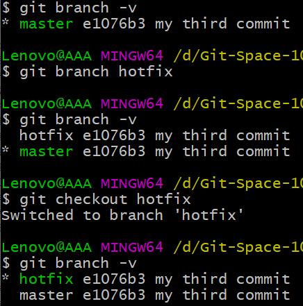

### ②在两个不同分支分别做不同修改

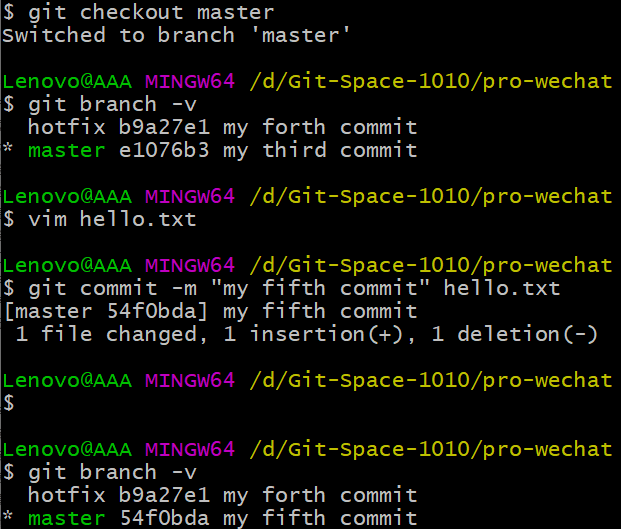


### ③分支合并


合并分支时一定是涉及到两个分支。这两个分支一个是“当前所在分支”，一个是“目标分支”。<br/>
命令写法：git merge 目标分支<br/>
所以分支合并命令的本质就是把“目标分支”合并到“当前分支”。<br/>
> 例如：把hotfix合并到master
> git merge hotfix
> 需要确保当前所在的分支是master

> 例如：把master合并到hotfix
> git merge master
> 需要确保当前所在的分支是hotfix

## 5、冲突

分支合并时，如果<span style="color:blue;font-weight:bold;">同一个文件</span>的<span style="color:blue;font-weight:bold;">同一个位置</span>有不同内容就会产生冲突。

### ①冲突的表现

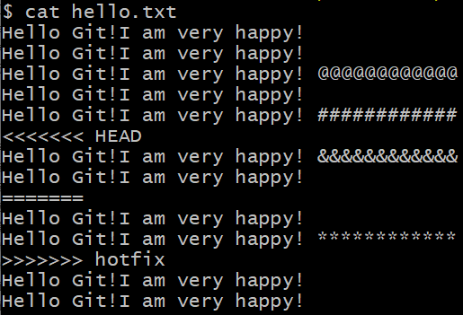

Git使用“<<<<<<<、=========、>>>>>>>>>>”符号帮我们标记出来，现在产生冲突的内容。

```html
<<<<<<< HEAD
Hello Git!I am very happy! &&&&&&&&&&&&
Hello Git!I am very happy!
=======
表示HEAD指针指向的位置（其实就是当前分支）在冲突中的内容
```


```html
=======
Hello Git!I am very happy!
Hello Git!I am very happy! ************
>>>>>>> hotfix
表示hotfix指针指向的位置在冲突中的内容
```

所以所谓冲突其实就是让我们在这二者中选择一个，Git无法替我们决定使用哪一个。必须人为决定新代码内容。<br/>

此时使用git status命令查看本地库状态

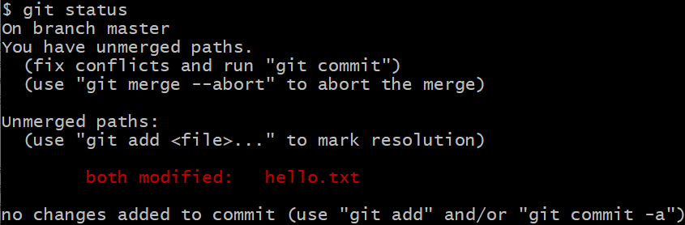

### ②冲突的解决

#### [1]第一步

编辑有冲突的文件，删除特殊符号，决定要使用的内容

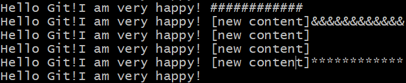

#### [2]第二步

添加到暂存区

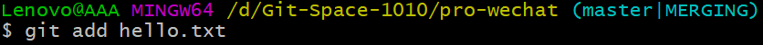

使用git status命令查看本地库状态

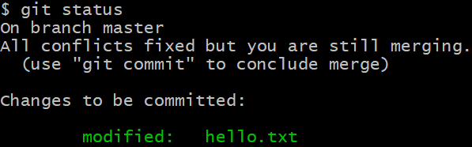


#### [3]第三步

执行提交（注意：使用git commit命令时不能带文件名）

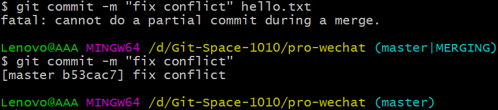

# 六、远程库命令行操作

## 1、创建远程库

登录后点这里：


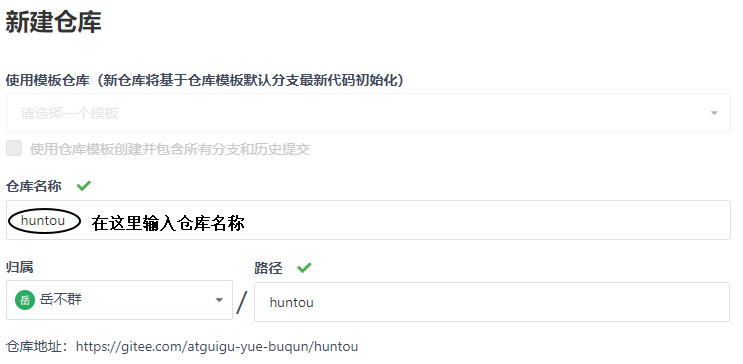


## 2、团队内协作

### ①在本地创建远程库地址别名

远程库地址太长了，我们需要在本地创建一个简短的别名便于引用

#### [1]先复制远程库地址

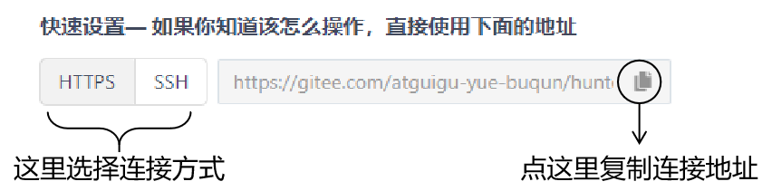

#### [2]在本地创建远程库地址别名

查看当前所有远程地址别名：git remote -v <br/>

创建新的远程地址别名：git remote add 别名 远程地址

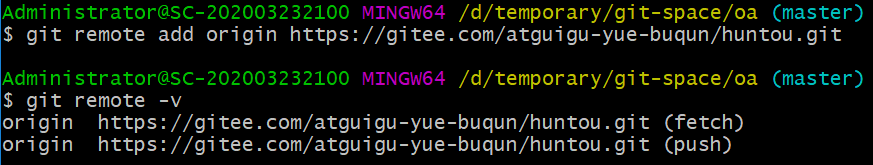

### ②推送

git push 别名 分支

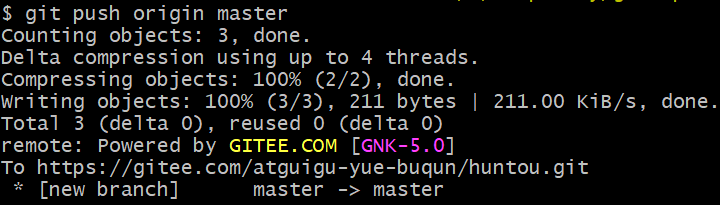

推送过程中需要填写账号密码

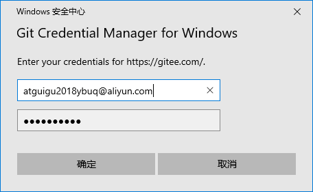

推送后可以刷新远程库所在页面，查看我们上传的文件

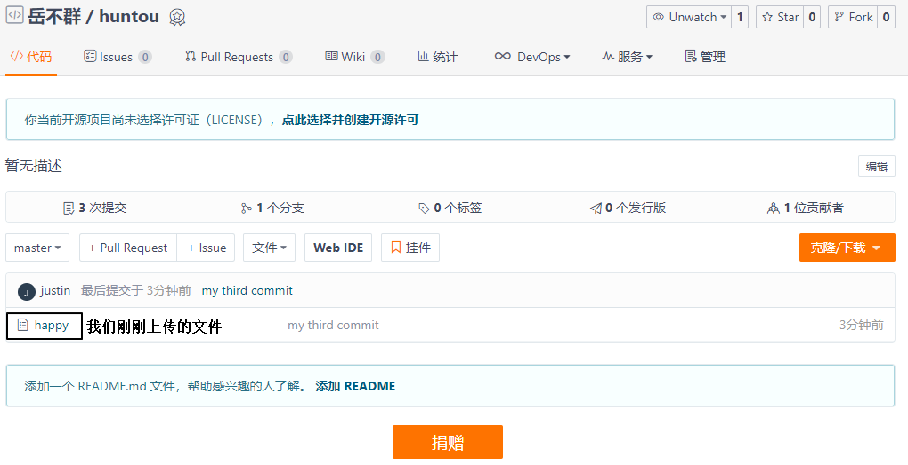

### ③克隆

团队其他人想拿到整个库就可以使用克隆功能。命令格式是：git clone 远程库地址<br/>

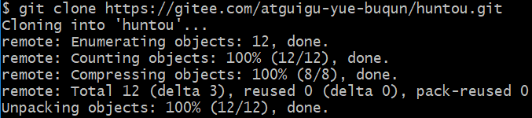

克隆命令有三个效果：

- 创建并初始化本地库，相当于执行了git init命令
- 创建远程地址别名，相当于执行了git remote add命令
- 把远程库文件下载到本地

### ④使用未加入团队的账号执行推送操作

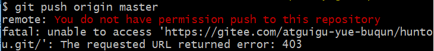

### ⑤邀请团队成员加入远程库

#### [1]仓库主人发起邀请

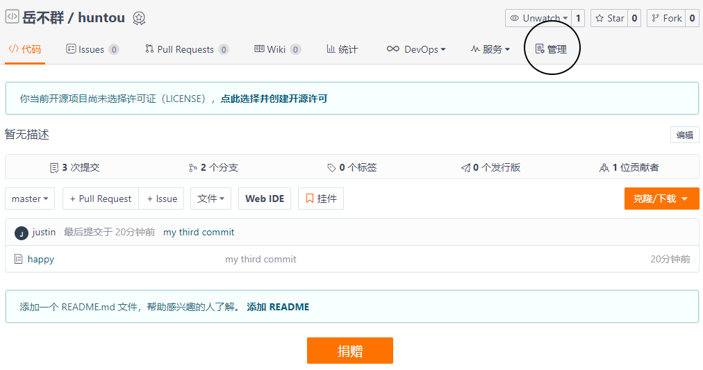

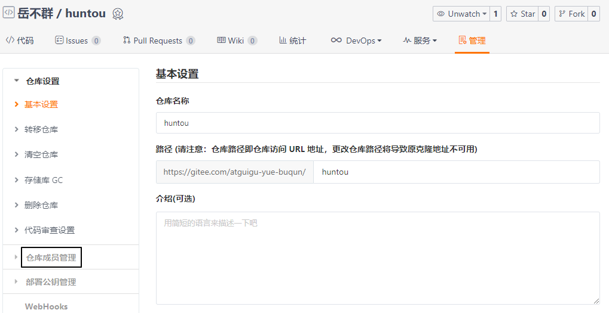


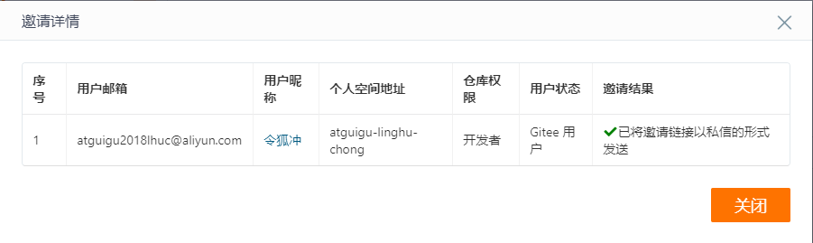


#### [2]被邀请人接受邀请

被邀请人登录自己的码云账号，查看私信通知


### ⑥加入团队后再尝试推送


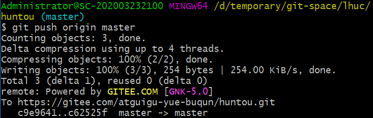

### ⑦通过拉取操作查看别人的修改

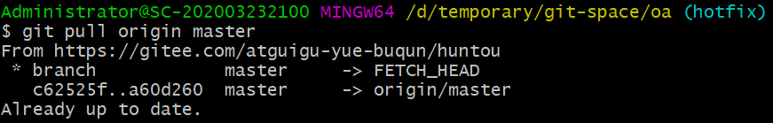

## 3、跨团队协作

### ①团队外：fork远程库

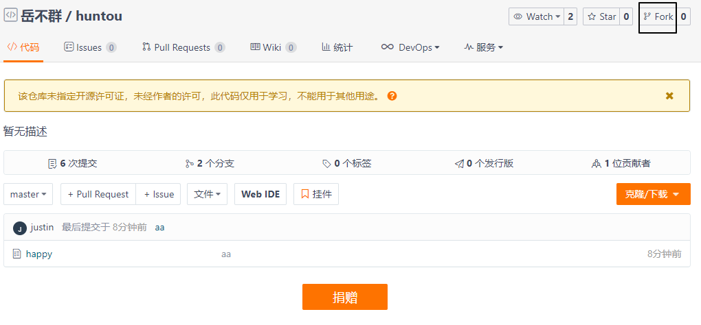

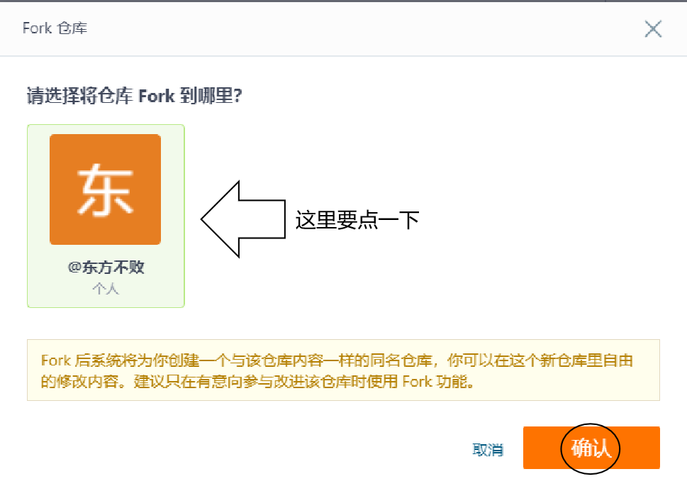

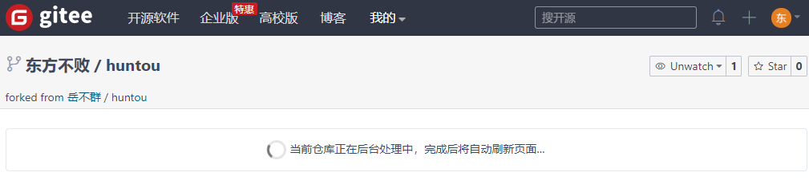

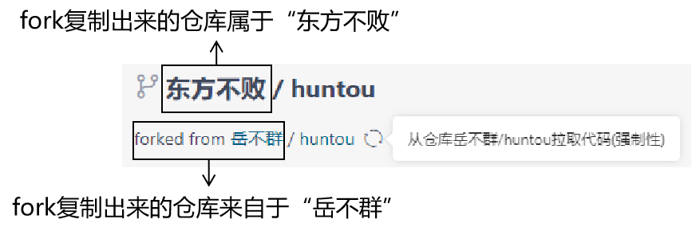


### ②团队外：在fork仓库中修改代码

如果要修改的代码很多，可以先clone到本地，修改完成后再push。如果修改不多可以直接在线修改。

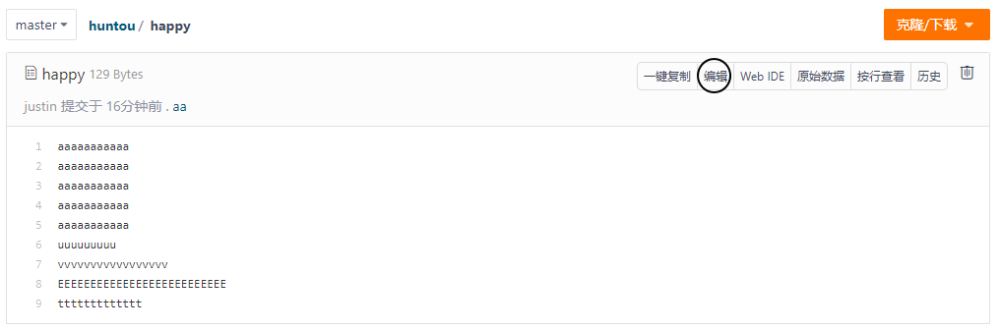

### ③团队外：修改完成后发起pull request

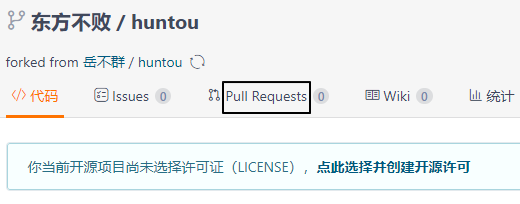

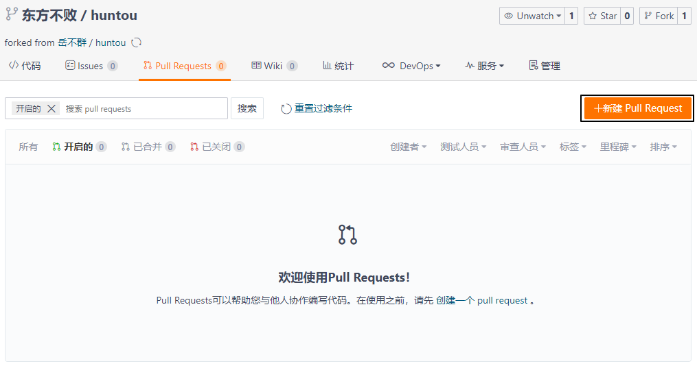

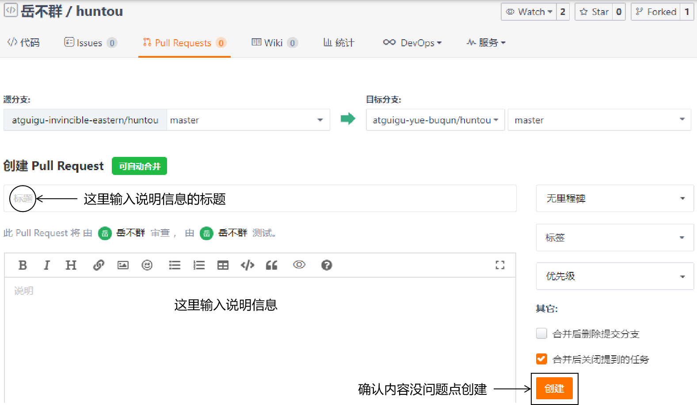

创建后效果如下：

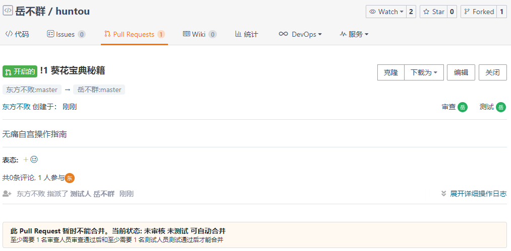

### ④团队内：审核代码

首先审核者通过站内通知获知pull request请求

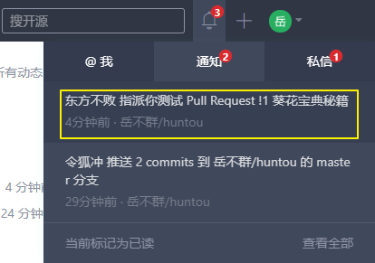


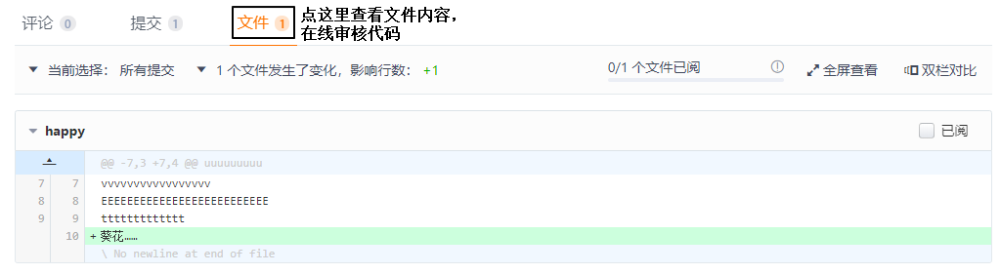

### ⑤团队内：合并代码

需要团队内确认审核代码没有问题，并且有专人测试通过，然后依次点击审核通过、测试通过按钮。


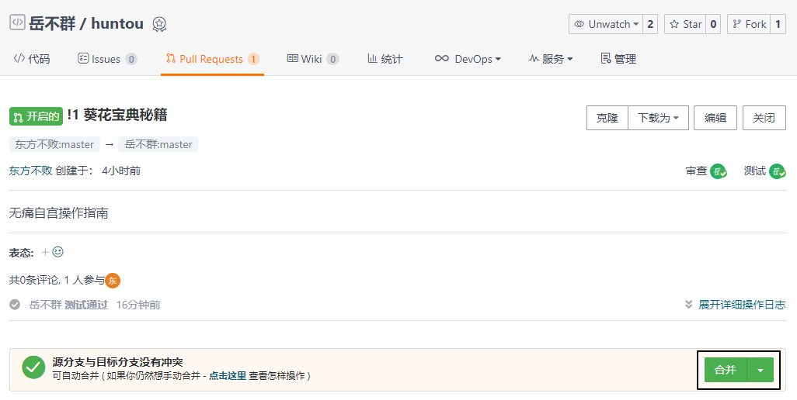


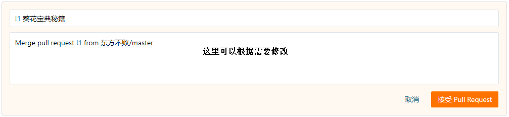


# 七、SSH方式连接

使用SSH非对称加密技术连接远程库可以实现免密登录

## 1、本地创建SSH密钥文件

> #进入当前用户的家目录
>
> $ cd ~
>
> 
>
> #运行命令生成.ssh密钥目录，注意：这里-C这个参数是大写的C
>
> $ ssh-keygen -t rsa -C atguigu2018ybuq@aliyun.com
>
> 
>
> #进入.ssh目录查看文件列表
>
> $ cd .ssh
>
> $ ls -lF
>
> 
>
> #查看id_rsa.pub文件内容
>
> $ cat id_rsa.pub
>
> 
>
> #复制id_rsa.pub文件内容

## 2、在码云填写公钥


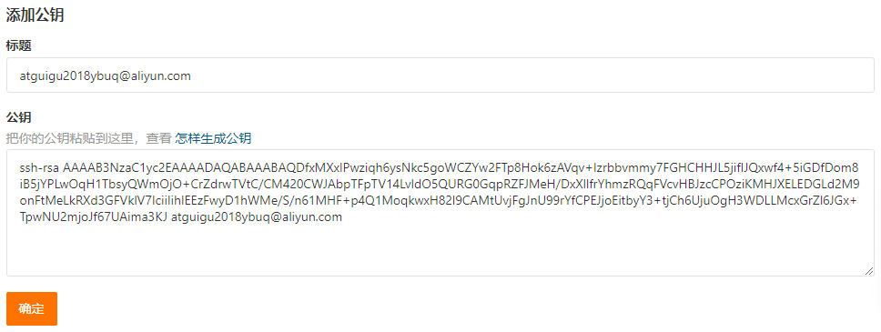

## 3、本地操作

> 回到Git bash创建远程地址别名
>
> git remote add origin_ssh git@github.com:atguigu2018ybuq/huashan.git
>
> 推送文件进行测试

# 八、在IDEA中操作本地库

## 1、配置忽略文件

### ①哪些文件需要忽略？

Eclipse工程特定文件

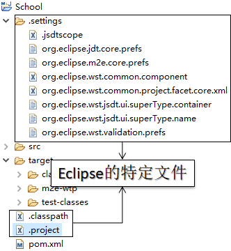

IDEA工程特定文件


编译产生的二进制文件（对于Maven工程来说就是target目录）


### ②为什么要忽略这些文件？

与项目的实际功能无关，不参与服务器上部署运行。把它们忽略掉能够屏蔽IDE工具之间的差异，避免这些无关的文件对我们版本控制造成不必要的干扰。

### ③忽略文件配置

#### [1]创建忽略规则文件

这个文件的存放位置原则上在哪里都可以，为了便于让~/.gitconfig文件引用，建议也放在用户家目录下

```html
# Compiled class file
*.class

# Log file
*.log

# BlueJ files
*.ctxt

# Mobile Tools for Java (J2ME)
.mtj.tmp/

# Package Files #
*.jar
*.war
*.nar
*.ear
*.zip
*.tar.gz
*.rar

# virtual machine crash logs, see http://www.java.com/en/download/help/error_hotspot.xml
hs_err_pid*

.classpath
.project
.settings
target
.idea
*.iml
```

在这个文件中把我们要忽略的东西加上。目录或文件直接写名字即可。

#### [2]在.gitconfig文件中引用忽略规则文件

```html
[user]
	name = peter
	email = peter@atguigu.com
[core]
	excludesfile = C:/Users/Lenovo/xxx.ignore
```

注意：这里要使用“正斜线（/）”，不要使用“反斜线（\）”

## 2、在IDEA中定位Git程序

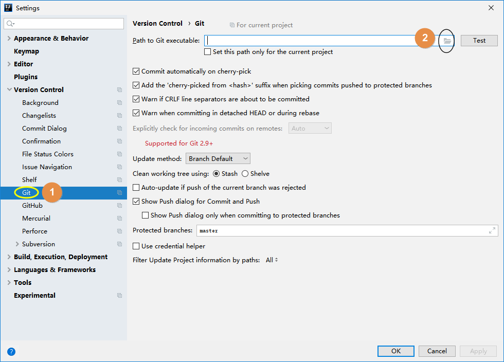

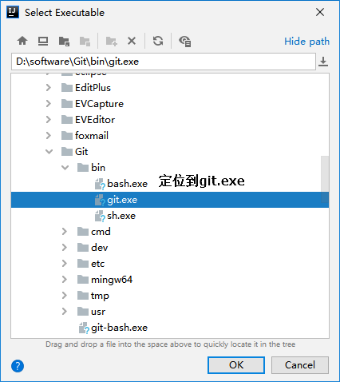


## 3、初始化本地库


## 4、添加到暂存区

在工程目录上点右键：


## 5、提交到本地库

在要提交的目录或文件这里点右键：


## 6、创建分支

在窗口右下角：


输入分支名称：


## 7、切换分支


## 8、合并分支


## 9、解决冲突


# 九、在IDEA中操作远程库

## 1、给IDEA安装码云插件

在IDEA中连接码云需要在IDEA中安装码云插件，官方参考文档地址是：https://gitee.com/help/articles/4117#article-header0


## 2、把我们的码云账号告诉IDEA


## 3、分享工程


## 4、克隆远程库


下面的提示点击yes


如果保存clone文件的目录和工程不同名则会出现下面的效果：


## 5、推送和拉取


## 6、拉取远程库的新的分支

### ①更新工程让本地能看到远程的新的分支


### ②查看远程分支中是否显示了新的分支


只要能看到这个分支显示了，那么就能够切换到这个分支，这样本地也有这个分支了。


剩下就是本地的分支操作。

# 十、Gitlab安装

注意：要使用CentOS7版本安装，CentOS6版本不行。

## 1、官网地址

首页：https://about.gitlab.com/<br/>

安装说明：https://about.gitlab.com/installation/

## 2、提前下载所需rpm

yum安装gitlab-ee(或ce)时，需要联网下载几百M的安装文件，非常耗时，所以应提前把所需RPM包下载并安装好。可以尝试用迅雷下载，比较快。下载地址是：

```html
https://packages.gitlab.com/gitlab/gitlab-ce/packages/el/7/gitlab-ce-10.8.2-ce.0.el7.x86_64.rpm
```

下载好后上传到Linux系统，习惯上还是放在/opt目录下。

## 3、安装步骤

```shell
sudo rpm -ivh /opt/gitlab-ce-10.8.2-ce.0.el7.x86_64.rpm

sudo yum install -y curl policycoreutils-python openssh-server cronie

sudo lokkit -s http -s ssh

sudo yum install -y postfix

sudo service postfix start

sudo chkconfig postfix on

curl https://packages.gitlab.com/install/repositories/gitlab/gitlab-**c**e/script.rpm.sh | sudo bash

sudo EXTERNAL_URL="http://gitlab.example.com" yum -y install gitlab-**c**e
```

把上面的命令放在shell文件中批量执行。执行完成后reboot。

## 4、启动并初始化Gitlab服务

```shell
#初始化配置
gitlab-ctl reconfigure

#启动Gitlab服务
gitlab-ctl start
```

PS：如需停止Gitlab服务可以运行gitlab-ctl stop

## 5、浏览器访问Gitlab服务

访问Linux服务器IP地址即可，如果想访问EXTERNAL_URL指定的域名还需要配置域名服务器或本地hosts文件。<br/>

初次登录时需要为gitlab的root用户设置密码。


## 6、命令行访问Gitlab

在Gitlab中创建Project（相当于远程库）之后，复制Project的访问地址，在Git中创建这个地址的别名


后面按照这个别名执行交互操作即可


## 7、IDEA中使用

### ①按照Gitlab插件


### ②设置Gitlab插件


这里我们需要访问gitlab.exampel.com域名，所以需要在系统中配置hosts。配置文件的路径是：C:\Windows\System32\drivers\etc\hosts

```html
192.168.198.100 gitlab.example.com
```

### ③分享工程到Gitlab


# 十一、总结


- 远程代码托管中心选择
  - GitHub：外网、境外
  - 码云：外网、国内★
  - Gitlab：内网
- 远程库操作
  - 创建远程库（IDEA分享工程上去会自动创建远程库）
  - 将远程库克隆到本地（在IDEA中克隆需要指定保存的目录，注意新的工程名称）
  - 推送
  - 拉取
  - fork和pull request在页面上操作即可
- 本地库基本操作
  - 初始化：git init
  - 设置签名
    - git config --global user.name xxx
    - git config --global user.email xxx@xxx.xxx
  - 追踪文件：git add 文件名
  - 将文件添加到暂存区：git add 文件名
  - 将文件提交到本地库：git commit -m "日志信息" 文件名
    - 如果文件尚未追踪，则不能直接提交
  - 查看版本记录：git reflog
  - 版本穿梭：git reset --hard 版本号的前7位
- 本地库分支操作
  - 创建分支：git branch 分支名字
  - 查看分支：git branch -v
  - 切换分支：git checkout 分支名字
  - 合并分支：git merge 目标分支名字
    - 效果是将目标分支合并到当前分支
  - 冲突相关
    - 产生：两个分支的当前版本中同一个文件在同一个位置不同
    - 解决
      - 删除特殊符号
      - 修改到满意的状态
      - 使用git add [文件名]标记为已解决
      - 使用git commit -m "日志"提交（注意：不能带文件名）