[[toc]]

# JVM(重点)

# 1 JVM简介

JVM是Java Virtual Machine（[Java虚拟机](https://baike.baidu.com/item/Java虚拟机/6810577)）的缩写，JVM是一种用于计算设备的规范，它是一个虚构出来的[计算机](https://baike.baidu.com/item/计算机/140338)，是通过在实际的计算机上仿真模拟各种计算机功能来实现的。

引入Java语言虚拟机后，Java语言在不同平台上运行时不需要重新编译。Java语言使用Java虚拟机屏蔽了与具体平台相关的信息，使得Java语言[编译程序](https://baike.baidu.com/item/编译程序/8290180)只需生成在Java虚拟机上运行的目标代码（[字节码](https://baike.baidu.com/item/字节码/9953683)），就可以在多种平台上不加修改地运行。

Java虚拟机有自己完善的硬件架构，如处理器、堆栈等，还具有相应的指令系统。

Java虚拟机本质上就是一个程序，当它在命令行上启动的时候，就开始执行保存在某字节码文件中的指令。Java语言的可移植性正是建立在Java虚拟机的基础上。任何平台只要装有针对于该平台的Java虚拟机，字节码文件（.class）就可以在该平台上运行。这就是“一次编译，多次运行”。

Java虚拟机不仅是一种跨平台的软件，而且是一种新的网络计算平台。该平台包括许多相关的技术，如符合开放接口标准的各种API、优化技术等。Java技术使同一种应用可以运行在不同的平台上。[Java平台](https://baike.baidu.com/item/Java平台/3793459)可分为两部分，即Java虚拟机（Java virtual machine，JVM）和Java API类库。

## 1.1  JVM的种类

Sun公司的HotSpot

BEA公司的JRockit

IBM公司的J9 VM

## 1.2  JVM虚拟机内存结构图

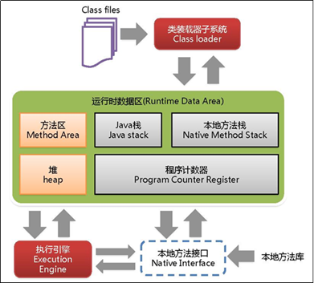

# 2  JVM概念

## 2.1  类加载器


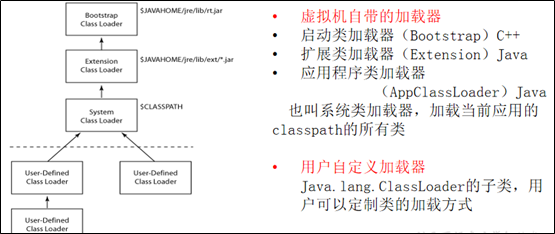

从文件系统或者网络加载class信息，把该信息存放在一块称之为方法区的内存空间

双亲委派机制: 出问题不要找我，找我爸 一层一层往上找

双亲委派机制有4种类加载器为：

\- 自定义(UserClassLoader)->应用/系统(App/SystemClassLoader)->扩展类(ExtClassLoader)->启动(BootstrapClassLoader)类加载器。

加载过程简述：

\- 当一个类加载某个类.class(需要编译即javac Xx.java>>Xx.class)的时候，不会直接去加载，而是自定义会委托应用/系统，应用/系统会委托扩展，扩展会委托启动类加载器尝试去加载，如果启动类加载器不加载这个，就交给扩展，扩展不行就应用/系统，一层层的下去，然后最终加载到这个.class类。

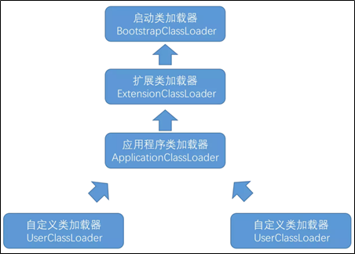

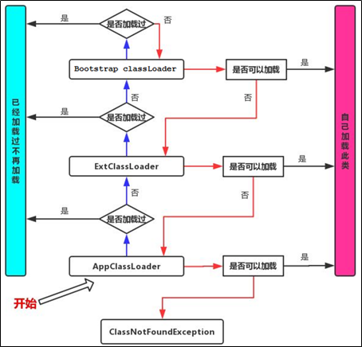

​    

沙箱安全机制: 保护程序安全 保护JAVA原生的JDK代码 

双亲委派优点？

a.安全，可避免用户自己编写的类动态替换Java的核心类，如java.lang.String

b.避免全限定命名的类重复加载(使用了findLoadClass()判断当前类是否已加载) 

题目：可不可以自己写个String类(也是自定义的String为何没加载到？) - 阿里

不可以。因为在类加载中，会根据双亲委派机制去寻找当前java.lang.String是否已被加载。由于启动类加载器已在启动时候加载了所以不会再次加载，因此使用的String是已在java核心类库加载过的String，而不是新定义的String。

## 2.2  执行引擎

负责解释JVM内部命令，翻译给操作系统执行

## 2.3  本地方法接口

Java开发中会碰到声明为 native的方法，如：public native int hashCode; 这是一个native方法。为什么存在native方法呢？Java不是完美的，Java的不足除了体现在运行速度上要比传统的C++慢许多之外，Java无法直接访问到操作系统底层（如系统硬件等)，为此Java使用native方法来扩展Java程序的功能

​     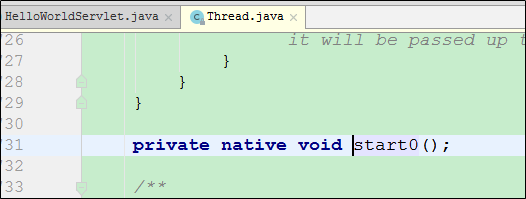

## 2.4  本地方法栈

内存中的一块区域负责登记 native方法

## 2.5  PC寄存器

是线程私有的,就是一个指针，指向方法区中的方法字节码，指向下一个方法所在的地址，不会被垃圾回收器回收，因为生命周期短

## 2.6  方法区

静态变量(类变量)+常量+类信息(.class 构造方法/接口定义)+运行时常量池存在方法区中

类加载器加载的类就放到方法区，该区归所有线程共享

实例变量存在堆内存中,和方法区无关

## 2.7  Java栈

程序=数据结构+算法

程序=业务需求+框架

队列: 先进先出

栈: 后进先出

栈也叫栈内存，在线程创建时创建，生命周期跟随线程生命周期，对于栈来说不存在垃圾回收问题，只要线程一结束该栈就Over，是线程私有的。

8种基本类型的变量+对象的引用变量+实例方法都是在函数的栈内存中分配。

栈存储什么? 

栈帧中主要保存3 类数据： 

本地变量(Local Variables):输入参数和输出参数以及方法内的变量； 

栈操作(Operand Stack):记录出栈、入栈的操作； 

栈帧数据(Frame Data):包括类文件、方法等等

```java
package com.atguigu.test;

public class Test {

    public static int show(int a)
    {
        a++;
        if(a<0){
            return a;
        }
        a = show(a);
        return a;
    }

    public static void main(String[] args) {
        System.out.println(show(0));
    }
}
```

## 2.8  栈+堆+方法区的交互关系

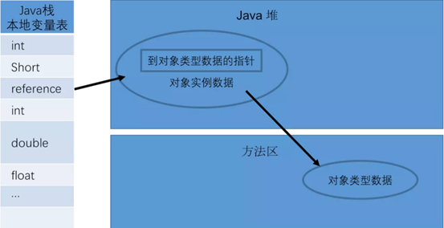

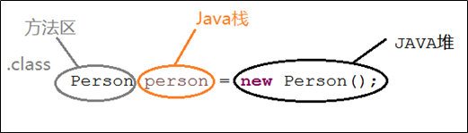

 

# 3  堆

## 3.1  新生代

新生代主要用来存放新生的对象。一般占据堆空间的1/3。在新生代中，保存着大量的刚刚创建的对象，但是大部分的对象都是朝生夕死，所以在新生代中会频繁的进行MinorGC，进行垃圾回收。新生代又细分为三个区：Eden区、SurvivorFrom、ServivorTo区，三个区的默认比例为：8：1：1。

-  **Eden区：**Java新创建的对象绝大部分会分配在Eden区（如果对象太大，则直接分配到老年代）。当Eden区内存不够的时候，就会触发MinorGC（新生代采用的是复制算法），对新生代进行一次垃圾回收。
- **SurvivorFrom区和To区：**在GC开始的时候，对象只会存在于Eden区和名为From的Survivor区，To区是空的，一次MinorGc过后，Eden区和SurvivorFrom区存活的对象会移动到SurvivorTo区中，然后会清空Eden区和SurvivorFrom区，并对存活的对象的年龄+1，如果对象的年龄达到15，则直接分配到老年代。MinorGC完成后，SurvivorFrom区和SurvivorTo区的功能进行互换。下一次MinorGC时，会把SurvivorTo区和Eden区存活的对象放入SurvivorFrom区中，并计算对象存活的年龄。

## 3.2 老年代

　　老年代主要存放应用中生命周期长的内存对象。老年代比较稳定，不会频繁的进行MajorGC。而在MaiorGC之前才会先进行一次MinorGc，使得新生的对象进入老年代而导致空间不够才会触发。当无法找到足够大的连续空间分配给新创建的较大对象也会提前触发一次MajorGC进行垃圾回收腾出空间。

　　在老年代中，MajorGC采用了标记—清除算法：首先扫描一次所有老年代里的对象，标记出存活的对象，然后回收没有标记的对象。MajorGC的耗时比较长。因为要扫描再回收。MajorGC会产生内存碎片，当老年代也没有内存分配给新来的对象的时候，就会抛出OOM（Out of Memory）异常。

## 3.3 永久代

　　永久代指的是永久保存区域。主要存放Class和Meta（元数据）的信息。Class在被加载的时候被放入永久区域，它和存放的实例的区域不同，在Java8中已经被移除，取而代之的是一个称之为“元数据区”（元空间）的区域。元空间和永久代类似，都是对JVM中规范中方法的实现。不过元空间与永久代之间最大的区别在于：元空间并不在虚拟机中，而是使用本地内存。因此，默认情况下，元空间的大小仅受本地内存的限制。类的元数据放入native memory，字符串池和类的静态变量放入java堆中。这样可以加载多少类的元数据就不再由MaxPermSize控制，而由系统的实际可用空间来控制。

采用元空间而不用永久代的原因：

- 为了解决永久代的OOM问题，元数据和class对象存放在永久代中，容易出现性能问题和内存溢出。
- 类及方法的信息等比较难确定其大小，因此对于永久代大小指定比较困难，大小容易出现永久代溢出，太大容易导致老年代溢出（堆内存不变，此消彼长）。
- 永久代会为GC带来不必要的复杂度，并且回收效率偏低。

 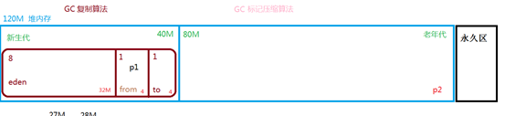

分为3块 新生代 老年代 元空间(Java8之前)

 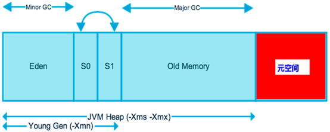

 

# 4  通过程序理解JVM

## 4.1  堆分配参数

初始堆大小和最大堆大小可以设置为一样，可以减少GC回收次数 提升性能

 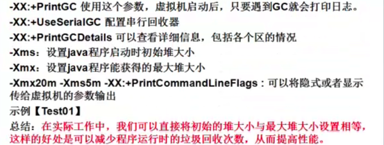

```java
package com.atguigu.test;

import java.util.Random;

public class Test01 {

   public static void main(String[] args) {
      test02();
   }

   public static void test02() {
      //-Xms8m -Xmx8m -XX:+PrintGCDetails
      //minor GC 和full GC触发
      String str = "www.atguigu.com";
      int i = 1;
      while (true) {
         str += str + new Random().nextInt(88888888) + new Random().nextInt(999999999);
         System.out.println("循环: " + i);
         System.out.println("max memory:" + Runtime.getRuntime().maxMemory());
         System.out.println("free memory:" + Runtime.getRuntime().freeMemory());
         System.out.println("total memory:" + Runtime.getRuntime().totalMemory());
         System.out.println(str.getBytes().length);
         i++;
      }
   }
}
```

## 4.2  堆分配参数

-XX:NewRatio设置新生代和老年代的比例 -XX:SurvivorRatio 设置eden:from:to的比例

 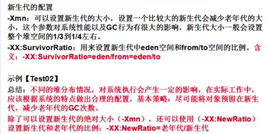

```java
package com.atguigu.test;

public class Test02 {
   public static void main(String[] args) {
      //第一次配置
      //-Xms20m -Xmx20m -Xmn1m -XX:SurvivorRatio=8 -XX:+PrintGCDetails -XX:+UseSerialGC
      //第二次配置
      //-Xms20m -Xmx20m -Xmn8m  -XX:+PrintGCDetails -XX:+UseSerialGC
      //第三次配置
      //-XX:NewRatio=老年代/新生代
      //-Xms21m -Xmx21m -XX:NewRatio=2 -XX:+PrintGCDetails -XX:+UseSerialGC
      byte[] b = null;
      //连续向系统申请10MB空间
      for(int i = 0 ; i <10; i ++){
         b = new byte[1*1024*1024];
      }
   }
}
```

 

## 4.3  堆溢出处理

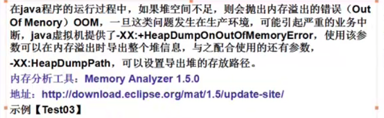

```java
package com.atguigu.test;

import java.util.Random;

public class Test03 {

   public static void main(String[] args) {
      test03();
   }

   public static void test03() {
      //-Xms15m  -Xmx15m -XX:+HeapDumpOnOutOfMemoryError -XX:HeapDumpPath=D:\test03.hprof
      String str = "www.atguigu.com";
      int i = 1;
      while (true) {
         str += str + new Random().nextInt(88888888) + new Random().nextInt(999999999);
         System.out.println("循环: " + i);
         System.out.println("max memory:" + Runtime.getRuntime().maxMemory());
         System.out.println("free memory:" + Runtime.getRuntime().freeMemory());
         System.out.println("total memory:" + Runtime.getRuntime().totalMemory());
         System.out.println(str.getBytes().length);
         i++;
      }
   }
}
```

​     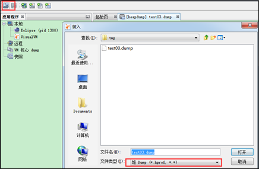


## 4.4  方法区（了解）

方法区溢出 OutOfMemoryError:PermGen space

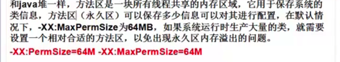

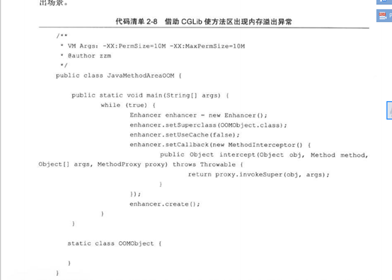

## 4.5  JVM详细配置（了解）

http://www.cnblogs.com/redcreen/archive/2011/05/04/2037057.html

# 5  垃圾回收算法

## 5.1  可达性分析

 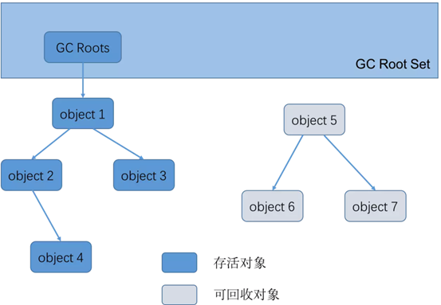

从GC Roots的对象作为起始点，从这些节点出发所走过的路径称为引用链。当一个对象到 GC Roots 没有任何引用链相连的时候说明对象不可用，很显然object5相关的引用已经没用了。

## 5.2  引用计数算法 

 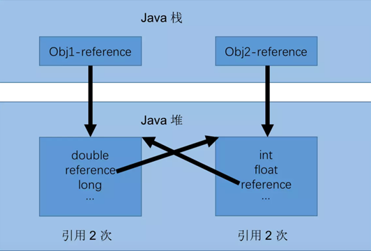

如果不下小心直接把 Obj1-reference 和 Obj2-reference 置 null。则在 Java 堆当中的两块内存依然保持着互相引用无法回收。**无法解决循环引用的情况**

## 5.3  标记清除算法 

原理

当堆中的有效内存空间(available memory)被耗尽的时候，就会停止整个程序(也被 称为stop the world)，然后进行两项工作，第一项则是标记，第二项则是清除。 

标记

从引用根节点开始标记所有被引用的对象。标记的过程其实就是遍历所有的GC Roots， 然后将所有GC Roots可达的对象标记为存活的对象。 

 清除

遍历整个堆，把未标记的对象清除。 

 缺点

此算法需要暂停整个应用，会产生内存碎片

## 5.4  标记压缩算法 

 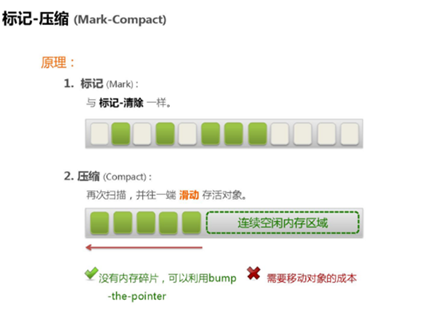

老年代进行垃圾回收

## 5.5  复制算法 

原理

对象产生的时候在eden区new，当eden空间用完时，程序又需要创建对象，这个时候触发JVM垃圾回收，不再被其他对象所引用的对象就会被销毁，然后将存活对象移动到from,下次再触发垃圾回收的时候eden+from作为主战场，存活对象移动到to区(这个时候to变为from) ，原先form变为to,**谁空谁为to,**有个交换的过程从from到to的过程每次复制一次对象年龄增长一岁，当年龄达到一定年龄(默认15岁)若养老区也满了，那么这个时候将产生MajorGC(FullGC)，进行养老区的内存清理。若养老区执行了Full GC之后发现依然无法进行对象的保存，就会产生OOM异常“OutOfMemoryError”

交换

经过这次GC后，Eden区和From区已经被清空。这个时候，“From”和“To”会交换他们的角色，也就是新的“To”就是上次GC前的“From”，新的“From”就是上次GC前的“To”。不管怎样，都会保证名为To的Survivor区域是空的，谁空谁为to

 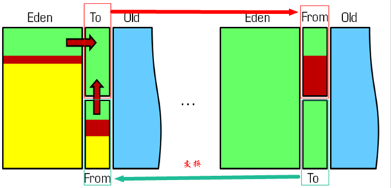

因为Eden区对象一般存活率较低，一般的，使用两块10%的内存作为空闲和活动区间，而另外80%的内存，则是用来给新建对象分配内存的。一旦发生GC，将10%的from活动区间与另外80%中存活的eden对象转移到10%的to空闲区间，接下来，将之前90%的内存全部释放，以此类推。 

缺点 

1、它浪费了一半的内存 

2、如果对象的存活率很高，我们可以极端一点，假设是100%存活，那么我们需要将所有对象都复制一遍，并将所有引用地址重置一遍。复制这一工作所花费的时间，在对象存活率达到一定程度时，将会变的不可忽视。 所以从以上描述不难看出，复制算法要想使用，最起码对象的存活率要非常低才行，而且最重要的是，我们必须要克服50%内存的浪费。

新生代进行垃圾回收


# 6  垃圾回收器

垃圾回收收集算法是内存回收的理论，而垃圾回收器是内存回收的实践。

## 6.1  并行和并发的区别

并发(Concurrent)

在操作系统中，是指一个时间段中有几个程序都处于已启动运行到运行完毕之间，且这几个程序都是在同一个处理机上运行。

并发不是真正意义上的“同时进行”，只是CPU把一个时间段划分成几个时间片段(时间区间)，然后在这几个时间区间之间来回切换，由于CPU处理的速度非常快，只要时间间隔处理得当，即可让用户感觉是多个应用程序同时在进行。如：打游戏和听音乐两件事情在同一个时间段内都是在同一台电脑上完成了从开始到结束的动作。那么，就可以说听音乐和打游戏是并发的

​     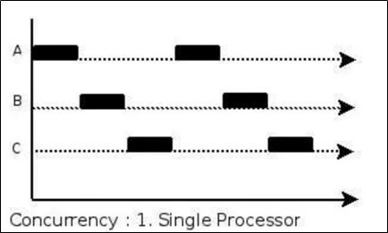

并行(Parallel)

当系统有一个以上CPU时，当一个CPU执行一个进程时，另一个CPU可以执行另一个进程，两个进程互不抢占CPU资源，可以同时进行，这种方式我们称之为并行(Parallel)。

其实决定并行的因素不是CPU的数量，而是CPU的核心数量，比如一个CPU多个核也可以并行

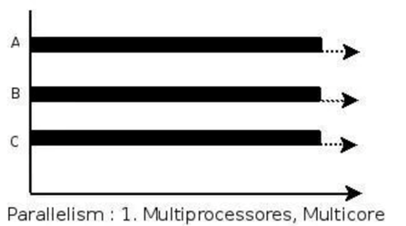

总结         

所以并发是在一段时间内宏观上多个程序同时运行，并行是在某一时刻，真正有多个程序在运行。

并行和并发的区别：

- 并发，指的是多个事情，在同一时间段内同时发生了。 


- 并行，指的是多个事情，在同一时间点上同时发生了。


- 并发的多个任务之间是互相抢占资源的。 


- 并行的多个任务之间是不互相抢占资源的、


只有在多CPU或者一个CPU多核的情况中，才会发生并行。

否则，看似同时发生的事情，其实都是并发执行的

## 6.2  Serial收集器

Serial是**单线程**执行垃圾回收的。当需要执行垃圾回收时，程序会暂停一切手上的工作，然后单线程执行垃圾回收。

### 6.2.1 Serial

因为新生代的特点是对象存活率低，所以收集算法用的是复制算法，把新生代存活对象复制到老年代，复制的内容不多，性能较好。

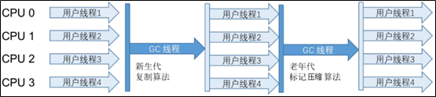

### 6.2.2 Serial Old

Serial Old收集器老年代的收集器，与Serial一样是单线程，不同的是算法用的是标记压缩(Mark-Compact)

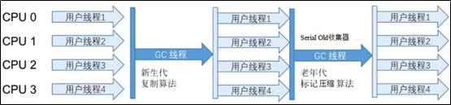

因为老年代里面对象的存活率高，如果依旧是用复制算法，需要复制的内容较多，性能较差。并且在极端情况下，当存活为100%时，没有办法用复制算法。所以需要用标记压缩Mark-Compact，以有效地避免这些问题

## 6.3  Parallel收集器

### 6.3.1 ParNew

ParNew同样用于新生代，是Serial的多线程版本，并且在参数、算法(同样是复制算法)上也完全和Serial相同。

Par是Parallel的缩写，但它的并行仅仅指的是收集多线程并行，并不是收集和原程序可以并行进行。ParNew也是需要暂停程序一切的工作，然后多线程执行垃圾回收。

​     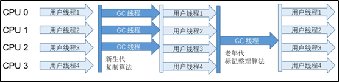

因为是多线程执行，所以在多CPU下，ParNew效果通常会比Serial好。但如果是单CPU则会因为线程的切换，性能反而更差

### 6.3.2 Parallel Scavenge

新生代的收集器，同样用的是复制算法，也是并行多线程收集。与ParNew最大的不同，它关注的是垃圾回收的吞吐量。

这里的吞吐量指的是 总时间与垃圾回收时间的比例。这个比例越高，证明垃圾回收占整个程序运行的比例越小。

### 6.3.3 Parallel Old

老年代的收集器，是Parallel Scavenge老年代的版本。其中的算法替换成Mark-Compact

​     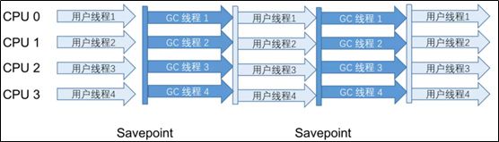

## 6.7  CMS收集器

CMS, Concurrent Mark Sweep同样是老年代的收集器。它关注的是垃圾回收最短的停顿时间(低停顿)，在老年代并不频繁GC的场景下，是比较适用的。命名中用的是concurrent，而不是parallel，说明这个收集器是有与工作执行并发的能力的。MS则说明算法用的是Mark Sweep算法,来看看具体地工作原理,CMS整个过程比之前的收集器要复杂,整个过程分为四步:**初始标记(initial mark)**

单线程执行，需要“Stop The World”，但仅仅把GC Roots的直接关联可达的对象给标  记一下，由于直接关联对象比较小，所以这里的速度非常快。

并发标记(concurrent mark)

对于初始标记过程所标记的初始标记对象，进行并发追踪标记，此时其他线程仍可以继续工作。此处时间较长，但不停顿。

重新标记(remark)

在并发标记的过程中，由于可能还会产生新的垃圾，所以此时需要重新标记新产生的垃圾。此处执行并行标记，与用户线程不并发，所以依然是“Stop The World”，时间比   初始时间要长一点。

并发清除(concurrent sweep)

并发清除之前所标记的垃圾。其他用户线程仍可以工作，不需要停顿。

​     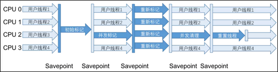

由于最耗费时间的并发标记与并发清除阶段都不需要暂停工作，所以整体的回收是低停顿的。

缺点

Mark Sweep算法会导致内存碎片比较多

CMS的并发能力依赖于CPU资源，所以在CPU数少和CPU资源紧张的情况下，性能较  差并发清除阶段，用户线程依然在运行，所以依然会产生新的垃圾，此阶段的垃圾并不  会再本次GC中回收，而放到下次。所以GC不能等待内存耗尽的时候才进行GC，这样   的话会导致并发清除的时候，用户线程可以了利用的空间不足。所以这里会浪费一些内   存空间给用户线程预留。

有人会觉得既然Mark Sweep会造成内存碎片,那么为什么不把算法换成Mark Compact呢?

答案其实很简答，因为当并发清除的时候，用Compact整理内存的话，原来的用户线程使用的内存还怎么用呢？要保证用户线程能继续执行，前提的它运行的资源不受影响嘛。Mark Compact更适合“Stop the World”这种场景下使用


## 6.8  G1收集器（查询资料）

G1，GarbageFirst，在JDK1.7版本正式启用，是当时最前沿的垃圾收集器。G1可以说是CMS的终极改进版，解决了CMS内存碎片、更多的内存空间登问题。虽然流程与CMS比较相似，但底层的原理已是完全不同。高效益优先。G1会预测垃圾回收的停顿时间，原理是计算老年代对象的效益率，优先回收最大效益的对象。

堆内存结构的不同。以前的收集器分代是划分新生代、老年代、持久代等。


## 6.9  ZGC

在JDK11当中，加入了实验性质的ZGC。它的回收耗时平均不到2毫秒 它是一款低停顿 高并发 的收集器。ZGC几乎在所有地方并发执行的，除了初始标记的是STW的。所以停顿时间几乎就耗费在初始标记上，这部分的实际是非常少的。那么其他阶段是怎么做到可以并发执行的呢？ZGC主要新增了两项技术，一个是着色指针Colored Pointer ，另一个是 读屏障Load Barrier 。

着色指针Colored Pointer

ZGC利用指针的64位中的几位表示Finalizable、Remapped、Marked1、Marked0(ZGC仅支持64位平台)，以标记该指向内存的存储状态。相当于在对象的指针上标注了对象的信息。注意，这里的指针相当于Java术语当中的引用。在这个被指向的内存发生变化的时候(内存在Compact被移动时)，颜色就会发生变。

在G1的时候就说到过，Compact阶段是需要STW，否则会影响用户线程执行。那么怎么解决这个问题呢？

读屏障Load Barrier由于着色指针的存在，在程序运行时访问对象的时候，可以轻易知道对象在内存的存储状态(通过指针访问对象)，若请求读的内存在被着色了。那么则会触发读屏障。读屏障会更新指针再返回结果，此过程有一定的耗费，从而达到与用户线程并发的效果。

把这两项技术联合下理解，与标记对象的传统算法相比，ZGC在指针上做标记，在访问指针时加入Load Barrier(读屏障)，比如当对象正被GC移动，指针上的颜色就会不对，这个屏障就会先把指针更新为有效地址再返回，也就是，永远只有单个对象读取时有概率被减速，而不存在为了保持应用与GC一致而粗暴整体的Stop The World。

ZGC虽然目前还在JDK 11还在实验阶段，但由于算法与思想是一个非常大的提升，相信在未来不久会成为主流的GC收集器使用

## 6.10 AliGC（了解原理）

https://yq.aliyun.com/articles/277268

AliGC是阿里巴巴JVM团队基于G1算法， 面向大堆(LargeHeap)应用场景

指定场景下的对比

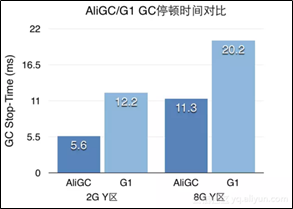

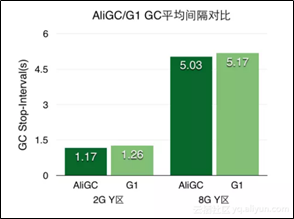

​     

 

 

 

 