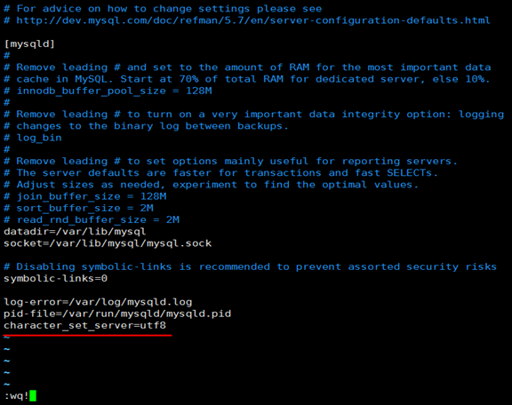
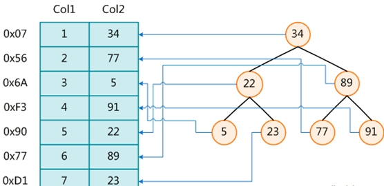
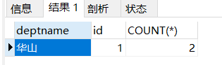

[[toc]]

# MySQL-day01

## 课程内容

- **MySQL架构介绍**

- **MySQL安装**

- **用户与权限管理**

- **逻辑架构**(重点)
- **存储引擎**
- **Join复习**
- **索引介绍**(重点)

# 1 MySQL简介

## 1.1 MySQL简介

-  MySQL是一个关系型数据库管理系统，由瑞典MySQL AB（创始人Michael Widenius）公司开发，2008被Sun收购（10亿美金），2009年Sun被Oracle收购。MariaDB
- MariaDB基于事务的Maria存储引擎，替换了MySQL的MyISAM存储引擎； 它使用了Percona的 XtraDB代替了InnoDB存储引擎。
-  MySQL是一种关联数据库管理系统，将数据保存在不同的表中，而不是将所有数据放在一个大仓库内，这样就增加了速度并提高了灵活性。
- MySQL是开源的，所以你不需要支付额外的费用。
- MySQL是可以定制的，采用了GPL（GNU General Public License）协议，你可以修改源码来开发自己的MySQL系统。
- MySQL支持大型的数据库。可以处理拥有上千万条记录的大型数据库。
- MySQL支持大型数据库，支持5000万条记录的数据仓库，32位系统表文件最大可支持4GB，64位系统支持最大的表文件为8TB。
-  MySQL使用标准的SQL数据语言形式。
- MySQL可以允许于多个系统上，并且支持多种语言。这些编程语言包括C、C++、Python、Java、Perl、PHP、Eiffel、Ruby和Tcl等。

**mysql和oracle的区别?**

**32位和64位有什么区别?**

## 1.2 MySQL安装

### 1.2.1 下载

1. **下载地址**

官网：[https://www.mysql.com](https://www.mysql.com/)

2. **打开官网，点击DOWNLOADS**

然后，点击MySQL Community(GPL) Downloads

MySQL分为社区版（Community Server）和企业版（Enterprise Server）

3. **点击MySQL Community Server**

4. **在General Availability(GA) Releases中选择适合的版本**
   - 如果安装Windows 系统下MySQL ，推荐下载MSI安装程序；点击Go to Download Page进行下载即可
   - Windows下的MySQL安装有两种安装程序
     - mysql-installer-web-community-5.7.28.0.msi 下载程序大小：19020KB；安装时需要联网安装组件。
     - mysql-installer-community-5.7.28.0.msi 下载程序大小：504828KB；安装时离线安装即可。推荐。

5. **如果安装Linux系统下MySQL，官方给出多种安装方式**

| 安装方式       | 特点                                                 |
| -------------- | ---------------------------------------------------- |
| rpm            | 安装简单，灵活性差，无法灵活选择版本、升级           |
| rpm repository | 安装包极小，版本安装简单灵活，升级方便，需要联网安装 |
| 通用二进制包   | 安装比较复杂，灵活性高，平台通用性好                 |
| 源码包         | 安装最复杂，时间长，参数设置灵活，性能好             |

- 目前最新版本为8.0.25


- 本课程中使用5.7版本。选择下图中⑤来到以前版本下载页面。


 

6. **下载MySQL Community Server 5.7.28**

- 这里不能直接选择CentOS7系统的版本，所以选择与之对应的Red Hat Enterprise Linux 7

- 直接点Download下载RPM Bundle全量包。包括了所有下面的组件。不需要一个一个下载了。


7. **不需要输入账号登录**

直接点：No thanks,just start my download.

 

8. **下载的tar包，用压缩工具打开**


解压后rpm安装包


### 1.2.2 安装

```sh
#检查系统是否安装了mariadb
rpm -qa|grep -i mariadb
#删除
yum remove mariadb-libs

#安装mysql的依赖
yum install libaio
yum install perl
yum install net-tools
```

**1. 将安装程序拷贝到/opt目录下**

在mysql的安装文件目录下执行：（必须按照顺序执行）

rpm -ivh mysql-community-common-5.7.28-1.el7.x86_64.rpm

rpm -ivh mysql-community-libs-5.7.28-1.el7.x86_64.rpm

rpm -ivh mysql-community-client-5.7.28-1.el7.x86_64.rpm

rpm -ivh mysql-community-server-5.7.28-1.el7.x86_64.rpm

注意: 如在检查工作时，没有检查mysql依赖环境在安装mysql-community-server会报错

rpm 是Redhat Package Manage缩写，通过RPM的管理，用户可以把源代码包装成以rpm为扩展名的文件形式，易于安装。

-i, --install   安装软件包

-v, --verbose  提供更多的详细信息输出

-h, --hash    软件包安装的时候列出哈希标记 (和 -v 一起使用效果更好)，展示进度条


**2 安装四个安装包**


**3 查看mysql版本**

执行 mysqladmin --version命令，类似java -version如果打出消息，即为成功


执行rpm -qa|grep -i mysql命令，查看是否安装成功，需要增加 -i 不用去区分大小写，否则搜索不到。


**4 服务的初始化**

为了保证数据库目录为与文件的所有者为 mysql 登录用户，如果你是以 root 身份运行 mysql 服务，需要执行下面的命令初始化：mysqld --initialize --user=mysql 

另外 --initialize 选项默认以“安全”模式来初始化，则会为 root 用户生成一个密码并将该密码标记为过期，登录后你需要设置一个新的密码 

查看密码：cat /var/log/mysqld.log


root@localhost: 后面就是初始化的密码

**5 启动mysql，并查看状态(加不加.service后缀都可以)**

启动：systemctl start mysqld.service

关闭：systemctl stop mysqld.service

重启：systemctl restart mysqld.service

查看状态：systemctl status mysqld.service


查看进程：ps -ef | grep -i mysql


**6 查看mysql服务是否自启动（默认自启动）**

systemctl list-unit-files|grep mysqld.service 


如不是enabled可以运行如下命令设置自启动

systemctl enable mysqld.service

如果希望不进行自启动，运行如下命令设置

systemctl disable mysqld.service


**7 首次登录**

通过 mysql -uroot -p进行登录，在Enter password：录入初始化密码


**8 修改密码**

因为初始化密码默认是过期的，所以查看数据库会报错

修改密码：ALTER USER 'root'@'localhost' IDENTIFIED BY '123456'; 但新密码太简单会报错


设置完密码就可以用新密码登录，正常使用数据库了 


使用quit退出，重新登录


**9 安装后目录结构**

| 参数         | 路径                                                       | 解释                         | 备注                       |
| ------------ | ---------------------------------------------------------- | ---------------------------- | -------------------------- |
| --basedir    | /usr/bin                                                   | 相关命令目录                 | mysqladmin mysqldump等命令 |
| --datadir    | /var/lib/mysql/                                            | mysql数据库文件的存放路径    |                            |
| --plugin-dir | /usr/lib64/mysql/plugin                                    | mysql插件存放路径            |                            |
| --log-error  | /var/log/mysqld.log                                        | mysql错误日志路径            |                            |
| --pid-file   | **/var/run/mysqld/mysqld.pid**                             | 进程pid文件                  |                            |
| --socket     | /var/lib/mysql/mysql.sock                                  | 本地连接时用的unix套接字文件 |                            |
|              | /usr/share/mysql                                           | 配置文件目录                 | mysql脚本及配置文件        |
|              | /etc/systemd/system/multi-user.target.wants/mysqld.service | 服务启停相关脚本             |                            |
|              | /etc/my.cnf                                                | mysql配置文件                | cat /etc/my.cnf            |

**10 字符集问题**

默认latin1字符编码，不支持中文

保存中文报错

 

1. 修改字符集

vim /etc/my.cnf

在最后加上中文字符集配置：character_set_server=utf8



2. 重新启动mysql

systemctl restart mysqld

3. 已生成的库表字符集如何变更

以前创建的库，创建的表字符集还是latin1


修改以前数据库的字符集

```sql
alter database test character set 'utf8';
```

修改以前数据表的字符集

```sql
alter table mytbl convert to character set 'utf8';
```


但是原有的数据如果是用非'utf8'编码的话，数据本身编码不会发生改变。

已有数据需要导出或删除，然后重新插入。

4. 查看字符集

show variables like 'character%'; 


# 2 用户与权限管理

## 2.1 用户管理

### 2.1.1 创建用户

```sql
create user zhang3 identified by '123123';
```

表示创建名称为zhang3的用户，密码设为123123；

### 2.1.2 user表

```sql
查看用户, 以列的方式显示数据
select * from mysql.user /G;
查询特定字段
select host,user,authentication_string,select_priv,insert_priv,drop_priv from mysql.user; 
```


- host ： 表示连接类型
  - % 表示所有远程通过 TCP方式的连接
  - IP地址 如 (192.168.1.2,127.0.0.1) 通过制定ip地址进行的TCP方式的连接
  - 机器名  通过制定网络中的机器名进行的TCP方式的连接
  - ::1 IPv6的本地ip地址，等同于IPv4的 127.0.0.1
  -  localhost 本地方式通过命令行方式的连接 ，比如mysql -u xxx -p xxx 方式的连接
-  user ： 表示用户名, 同一用户通过不同方式链接的权限是不一样的。
-  password ： 密码
  - 所有密码串通过 password(明文字符串) 生成的密文字符串。加密算法为MYSQLSHA1，不可逆 。
  - mysql 5.7 的密码保存到 authentication_string 字段中不再使用password 字段

### 2.1.3 设置密码

修改当前用户的密码:

```sql
set password =password('123456'); 
```

修改某个用户的密码:

```sql
update mysql.user set authentication_string=password('123456') where user='zhang3';
flush privileges;  #所有通过user表的修改，必须用该命令才能生效。否则，需重启服务。
```

### 3.1.4 修改用户

修改用户名：

```sql
update mysql.user set user='wang5' where user='zhang3';
flush privileges; 
```

### 3.1.5  删除用户

```sql
drop user zhang3 ; 
```

==**不要通过delete from user u where user='li4' 进行删除，系统会有残留信息保留。**== 

## 2.2 权限管理

### 2.2.1 授权命令

grant 权限1,权限2,…权限n on 数据库名称.表名称 to 用户名@用户地址 identified by ‘连接口令’;

该权限如果发现没有该用户，则会直接新建一个用户。

比如：

```sql
#给zhang3用户用本地命令行方式下，授予库下的所有表的插删改查的权限。
grant select,insert,delete,update on *.* to zhang3;
#授予通过网络方式登录的用户，对所有库所有表的全部权限，密码设为123456.
grant all privileges on *.* to zhang3@'%' identified by '123456'; 
```

### 2.2.2 收回权限

查看当前用户权限：show grants;

收回权限命令

```sql
revoke 权限1,权限2,…权限n on 数据库名称.表名称 from 用户名@用户地址 ;
#收回全库全表的所有权限
REVOKE ALL PRIVILEGES ON *.* FROM zhang3@'%';
#收回mysql库下的所有表的插删改查权限
REVOKE select,insert,update,delete ON *.* FROM zhang3@'%';
```

须用户重新登录后才能生效

### 2.2.3 查看权限

```sql
查看当前用户权限
show grants;
查看某用户的全局权限
select * from mysql.user;
查看某用户的某个表的权限
select * from mysql.tables_priv;
```

## 2.3 远程访问

### 2.3.1 确认网络

1. 在远程机器上使用ping ip地址保证网络畅通

2. 在远程机器上使用telnet命令保证端口号开放访问

拓展telnet命令开启:


### 2.3.2 关闭防火墙

systemctl start firewalld.service

systemctl status firewalld.service

systemctl stop firewalld.service

systemctl enable firewalld.service

systemctl disable firewalld.service

### 2.3.3 开放端口

查看开放的端口号

firewall-cmd --list-all

设置开放的端口号

firewall-cmd --add-service=http --permanent

firewall-cmd --add-port=3306/tcp --permanent

重启防火墙

firewall-cmd --reload 

# 3 逻辑架构

## 3.1 架构概览

和其它数据库相比，MySQL有点与众不同，它的架构可以在多种不同场景中应用并发挥良好作用。主要体现在存储引擎的架构上，插件式的存储引擎架构将查询处理和其它的系统任务以及数据的存储提取相分离。

这种架构可以根据业务的需求和实际需要选择合适的存储引擎。 


### 3.1.1 连接层

最上层是一些客户端和连接服务，包含本地sock通信和大多数基于客户端/服务端工具实现的类似于tcp/ip的通信。

主要完成一些类似于连接处理、授权认证、及相关的安全方案。

在该层上引入了线程池的概念，为通过认证安全接入的客户端提供线程。

同样在该层上可以实现基于SSL的安全链接。服务器也会为安全接入的每个客户端验证它所具有的操作权限。 

### 3.1.2 服务层

第二层架构主要完成大多数的核心服务功能，如SQL接口，并完成缓存的查询，SQL的分析和优化及部分内置函数的执行。

所有跨存储引擎的功能也在这一层实现，如过程、函数等。

在该层，服务器会解析查询并创建相应的内部解析树，并对其完成相应的优化：如确定查询表的顺序，是否利用索引等，最后生成相应的执行操作。

如果是select语句，服务器还会查询内部的缓存。如果缓存空间足够大，这样在解决大量读操作的环境中能够很好的提升系统的性能。

2.1 Management Serveices & Utilities： 系统管理和控制工具 

2.2 SQL Interface: SQL接口

- 接受用户的SQL命令，并且返回用户需要查询的结果。比如select from就是调用SQL Interface


2.3 Parser: 解析器

- SQL命令传递到解析器的时候会被解析器验证和解析。 

2.4 Optimizer: 查询优化器。

- SQL语句在查询之前会使用查询优化器对查询进行优化。 
- 用一个例子就可以理解： select uid,name from user where gender= 1;
- 优化器来决定先投影还是先过滤。 

2.5 Cache和Buffer： 查询缓存。

- 如果查询缓存有命中的查询结果，查询语句就可以直接去查询缓存中取数据。
- 这个缓存机制是由一系列小缓存组成的。比如表缓存，记录缓存，key缓存，权限缓存等 

### 3.1.3 引擎层

存储引擎层，存储引擎真正的负责了MySQL中数据的存储和提取，服务器通过API与存储引擎进行通信。不同的存储引擎具有的功能不同，这样我们可以根据自己的实际需要进行选取。后面介绍MyISAM和InnoDB 

### 3.1.4 存储层

数据存储层，主要是将数据存储在运行于裸设备的文件系统之上，并完成与存储引擎的交互。 

**http三次握手 四次挥手**

## 3.2 show profiles

了解查询语句底层执行的过程：select @@profiling;查看是否开启计划。

1)   修改配置文件/etc/my.cnf，先开启查询缓存

新增一行：query_cache_type=1

重启mysql：systemctl restart mysqld

2)   再开启查询执行计划

```sql
show variables like '%profiling%';
set profiling=1; 
```

3)   执行语句两次：

```sql
select * from mydb.mytbl where id=1; 
```

4)   显示最近执行的语句

```sql
show profiles; 
```


5)   显示执行计划

```sql
show profile cpu,block io for query 6; 
```


执行编号7时，比执行编号6时少了很多信息，从下面截图中可以看出查询语句直接从缓存中获取数据；

==**注意：SQL必须是一致的，否则，不能命中缓存。**==

例如：

```sql
#虽然查询结果一致，但并没有命中缓存。
select * from mydb.mytbl where id=2
select * from mydb.mytbl where id>1 and id<3
```

## 3.3 工作流程

==**mysql的查询流程：**==

1. 首先，mysql客户端通过协议与mysql服务器建连接，发送查询语句，先检查查询缓存，如果命中，直接返回结果，否则进行语句解析，也就是说，在解析查询之前，服务器会先访问查询缓存(query cache)——它存储SELECT语句以及相应的查询结果集。

2. 如果某个查询结果已经位于缓存中，服务器就不会再对查询进行解析、优化、以及执行。它仅仅将缓存中的结果返回给用户即可，这将大大提高系统的性能。

3. 语法解析器和预处理：首先mysql通过关键字将SQL语句进行解析，并生成一颗对应的“解析树”。

4. mysql解析器将使用mysql语法规则验证和解析查询；

5. 预处理器则根据一些mysql规则进一步检查解析树是否合法。 

6. 查询优化器当解析树被认为是合法的了，并且由优化器将其转化成执行计划。

7. 一条查询可以有很多种执行方式，最后都返回相同的结果。优化器的作用就是找到这其中最好的执行计划。 

8. mysql默认使用的BTREE索引，并且一个大致方向是：无论怎么折腾sql，至少在目前来说，mysql最多只用到表中的一个索引。

# 4 存储引擎

## 4.1 查看存储引擎

查看mysql提供什么存储引擎：

```sql
show engines;
```


查看默认的存储引擎：

```sql
show variables like '%storage_engine%';
```


## 4.2 引擎介绍

### 4.2.1 InnoDB

- **大于等于5.5之后，默认采用InnoDB引擎**。
- InnoDB是MySQL的默认事务型引擎，它被设计用来处理大量的短期(short-lived)事务。可以确保事务的完整提交(Commit)和回滚(Rollback)。
- 除了增加和查询外，还需要更新，删除操作，那么，应优选选择InnoDB存储引擎。
- 除非有非常特别的原因需要使用其他的存储引擎，否则应该优先考虑InnoDB引擎。

### 4.2.2 MyISAM

- MyISAM提供了大量的特性，包括全文索引、压缩、空间函数(GIS)等，但MyISAM不支持事务和行级锁，有一个毫无疑问的缺陷就是崩溃后无法安全恢复。
- 5.5之前默认的存储引擎
- 数据文件结构：
  - .frm 存储定义表
  - .MYD 存储数据
  - .MYI 存储索引

==**特别注意：**==

- 静态表字段都是非变长字段，存储占用空间比动态表多。存储数据时会按照列宽补足空格，但在访问时候并不会得到这些空格。

- 如果存储数据本身后面有空格，那么，查询时也会被去掉。

- 如果存储数据本身前面有空格，则查询时不会被去掉。

- 在没有where条件情况下统计表count(*)数量，不需要全表扫描，而是直接获取保存好的值。

### 4.2.3 Archive

- Archive档案存储引擎只支持**INSERT**和**SELECT**操作，在MySQL5.1之前不支持索引。
- Archive表**适合日志和数据采集（档案）**类应用。
- 根据英文的测试结论来看，Archive表比MyISAM表要小大约75%，比支持事务处理的InnoDB表小大约83%。

### 4.2.4 Blackhole

- Blackhole引擎没有实现任何存储机制，它会丢弃所有插入的数据，不做任何保存。
- 但服务器会记录Blackhole表的日志，所以可以用于复制数据到备库，或者简单地记录到日志。但这种应用方式会碰到很多问题，因此并不推荐。

### 4.2.5 CSV 

- CSV引擎可以将普通的CSV文件作为MySQL的表来处理，但不支持索引。
- CSV引擎可以作为一种数据交换的机制，非常有用。
- CSV存储的数据直接可以在操作系统里，用文本编辑器，或者excel读取。

### 4.2.6 Memory引擎

- 如果需要快速地访问数据，并且这些数据不会被修改，重启以后丢失也没有关系，那么使用Memory表是非常有用。
- Memory表至少比MyISAM表要快一个数量级。

### 4.2.7 Federated引擎

- Federated引擎是访问其他MySQL服务器的一个代理，尽管该引擎看起来提供了一种很好的跨服务器的灵活性，但也经常带来问题，因此默认是禁用的。


## 4.3 MyISAM和InnoDB

| **对比项**     | **MyISAM**                                               | **InnoDB**                                                   |
| -------------- | -------------------------------------------------------- | ------------------------------------------------------------ |
| 外键           | 不支持                                                   | 支持                                                         |
| 事务           | 不支持                                                   | 支持                                                         |
| 行表锁         | 表锁，即使操作一条记录也会锁住整个表，不适合高并发的操作 | 行锁,操作时只锁某一行，不对其它行有影响，适合高并发的操作    |
| 缓存           | 只缓存索引，不缓存真实数据                               | 不仅缓存索引还要缓存真实数据，对内存要求较高，而且内存大小对性能有决定性的影响 |
| 自带系统表使用 | Y                                                        | N                                                            |
| 关注点         | 性能：节省资源、消耗少、简单业务                         | 事务：并发写、事务、更大资源                                 |
| 默认安装       | Y                                                        | Y                                                            |
| 默认使用       | N                                                        | Y                                                            |

# 6 索引入门

## 6.1 索引简介

MySQL官方对索引的定义为：索引（Index）是帮助MySQL**高效获取数据的数据结构**。 

索引的本质：索引是数据结构。你可以简单理解为“排好序的快速查找数据结构”。

下图就是一种可能的索引方式示例：

  

**左边是数据表，一共有两列七条记录，最左边的是数据记录的物理地址**

为了加快Col2的查找，可以维护一个右边所示的二叉查找树，每个节点分别包含索引键值和一个指向对应数据记录物理地址的指针，这样就可以运用二叉查找在一定的复杂度内获取到相应数据，从而快速的检索出符合条件的记录。

数据本身之外，数据库还维护着一个满足特定查找算法的数据结构，这些数据结构以某种方式指向数据， 这样就可以在这些数据结构的基础上实现高级查找算法，这种数据结构就是**索引**。

一般来说索引本身也很大，不可能全部存储在内存中，因此索引往往**以索引文件形式存储磁盘上**

## 6.2 优点与缺点

优点:

- 类似大学图书馆建书目索引，提高数据检索的效率，降低数据库的IO成本

- 通过索引列对数据进行排序，降低数据排序的成本，降低了CPU的消耗

缺点:

- 实际上索引也是一张表，该表保存了主键与索引字段，并指向实体表的记录，所以**索引列也是要占用空间**的


- 虽然索引大大提高了查询速度，同时却会**降低更新表的速度**，如对表进行INSERT、UPDATE和DELETE。 因为更新表时，MySQL不仅要保存数据，还要保存一下索引文件每次更新添加了索引列的字段， 都会调整因为更新所带来的键值变化后的索引信息


## 6.3 索引结构

### 6.3.1 Hash

加速查找速度的数据结构，常见的有两类：

(1)哈希，例如HashMap，查询/插入/修改/删除的平均时间复杂度都是O(1)；

(2)树，例如平衡二叉搜索树，查询/插入/修改/删除的平均时间复杂度都是O(log2N)；

可以看到，不管是读请求，还是写请求，哈希类型的索引，都要比树型的索引更快一些，

**那为什么，索引结构要设计成树型呢？**

想想**范围/排序**等其它SQL条件：

哈希型的索引，时间复杂度会退化为O(n)而**树型的“有序”特性**，依然能够保持O(log2N) 的高效率。

备注：InnoDB并不支持哈希索引。

### 6.3.2 时间复杂度

同一问题可用不同算法解决，而一个算法的质量优劣将影响到算法乃至程序的效率。算法分析的目的在于选择合适算法和改进算法。


### 6.3.3 普通二叉树

二叉树的特点：

- 一个节点只能有两个子节点，也就是一个节点度不能超过2

- 左子节点 小于 本节点；右子节点大于等于 本节点，比我大的向右，比我小的向左


对该二叉树的节点进行查找

- 深度为1的节点的查找次数为1，


- 深度为2的节点的查找次数为2，


- 深度为N的节点的查找次数为N，


结论：因此其平均查找次数为 (1+2+2+3+3+3) / 6 = 2.3次

### 6.3.4 平衡二叉树

**平衡二叉树**（Balanced Binary Tree）又被称为AVL树（有别于AVL算法），且具有以下性质：

**==它是一棵空树或它的左右两个子树的高度差的绝对值不超过1，并且左右两个子树都是一棵平衡二叉树。==**

这个方案很好的解决了二叉查找树退化成链表的问题，把插入，查找，删除的时间复杂度最好情况和最坏情况都维持在O(logN)。但是频繁旋转会使插入和删除牺牲掉O(logN)左右的时间，不过相对二叉查找树来说，时间上稳定了很多。


平衡二叉树大部分操作和二叉查找树类似，主要不同在于插入删除的时候平衡二叉树的平衡可能被改变，并且只有从那些插入点到根结点的路径上的结点的平衡性可能被改变，因为只有这些结点的子树可能变化。

### 6.3.5 BTree(重点)

**B-Tree树即**B树，B即Balanced，平衡的意思。

**B树的阶：**节点的最多子节点个数。

B树的搜索，从根结点开始，对节点内的关键字（有序）序列进行二分查找，如果命中则结束，否则进入查询关键字所属范围的儿子节点；重复，直到所对应的儿子指针为空，或已经是叶子节点, 关键字集合分布在整颗树中, 即叶子节点和非叶子节点都存放数据, 搜索有可能在非叶子节点结束,其搜索性能等价于在关键字全集内做一次二分查找


**那么，我们思考一个问题，索引树会一次性加载吗？**

- 数据库索引是存储在磁盘上的，如果数据很大，必然导致索引的大小也会很大，超过几个G（好比新华字典字数多必然导致目录厚
- 当我们利用索引查询时候，是不可能将全部几个G的索引都加载进内存的，我们能做的只能是：
- 逐一加载每一个**磁盘页**，因为磁盘页对应着索引树的节点。

 

**页**

Page是Innodb存储的最基本结构，也是Innodb磁盘管理的最小单位，与数据库相关的所有内容都存储在Page结构里。

Page分为几种类型：**数据页（B-Tree Node），Undo页（Undo Log Page），系统页（System Page），事务数据页（Transaction System Page）**等；**==每个数据页的大小为16kb==**，每个Page使用一个32位（一位表示的就是0或1）的int值来表示，正好对应Innodb最大64TB的存储容量(16kb * 2^32=64tib)


**块**

系统从磁盘读取数据到内存时是以磁盘块（block）为基本单位的，位于同一个磁盘块中的数据会被一次性读取出来，而不是需要什么取什么。

InnoDB存储引擎中有页（Page）的概念，系统一个磁盘块的存储空间往往没有这么大，因此InnoDB每次申请磁盘空间时都会是若干地址连续磁盘块来达到页的大小16KB。InnoDB在把磁盘数据读入到磁盘时会以页为基本单位，在查询数据时如果一个页中的每条数据都能有助于定位数据记录的位置，这将会减少磁盘I/O次数，提高查询效率。

==**Btree的查询流程**==

每个节点占用一个盘块的磁盘空间，一个节点上有两个升序排序的关键字和三个指向子树根节点的指针，指针存储的是子节点所在磁盘块的地址。

模拟查找关键字29的过程：

- 根据根节点找到磁盘块1，读入内存。【磁盘I/O操作第1次】
- 比较关键字29在区间（17,35），找到磁盘块1的指针P2。
- 根据P2指针找到磁盘块3，读入内存。【磁盘I/O操作第2次】
- 比较关键字29在区间（26,30），找到磁盘块3的指针P2。
- 根据P2指针找到磁盘块8，读入内存。【磁盘I/O操作第3次】
- 在磁盘块8中的关键字列表中找到关键字29。

分析上面过程，发现需要3次磁盘I/O操作，和3次内存查找操作。由于内存中的关键字是一个有序表结构，可以利用二分法查找提高效率。而3次磁盘I/O操作是影响整个BTree查找效率的决定因素。

**BTree相对于AVLTree每次磁盘I/O取到内存的数据都发挥了作用，从而提高了查询效率。**

### 6.3.6 B+Tree(重点)

  B+树是B树的变体，也是一种多路搜索树。B+树的搜索与B树也基本相同，区别是B+树只有达到叶子节点才命中（B树可以在非叶子结点命中），其性能也等价于在关键字全集做一次二分查找

**==所有关键字都出现在叶子节点的链表中（即数据只能在叶子节点）==**，且链表中的关键字(数据)恰好是有序的。因此不可能在非叶子节点命中, **==非叶子节点相当于是叶子节点的索引，叶子节点相当于是存储（关键字）数据的数据层==**


通常在 B+Tree 上有两个头指针，一个指向根节点，另一个指向关键字最小的叶子节点，而且所有叶子节点（即数据节点）之间是一种链式环结构。 因此可以对 B+Tree 进行两种查找运算：一种是对于主键的范围查找和分页查找，另一种是从根节点开始，进行随机查找。 

InnoDB 存储引擎中页的大小为 16KB，一般表的主键类型为 INT（占用 4 个字节）或 BIGINT（占用 8 个字节），指针类型也一般为 4 或 8 个字节，也就是说一个页（B+Tree 中的一个节点）中大概存储 16KB/(8B+8B)=1K 个键值（因为是估值，为方便计算，这里的 K 取值为 10^3。也就是说一个深度为 3 的 B+Tree 索引可以维护 10^3 _ 10^3 _ 10^3 = 10 亿条记录。

实际情况中每个节点可能不能填充满，因此在数据库中，B+Tree 的高度一般都在 2~4 层。MySQL 的 InnoDB 存储引擎在设计时是将根节点常驻内存的，也就是说查找某一键值的行记录时最多只需要 1~3 次磁盘 I/O 操作。

==**BTree和B+Tree比较**==

- **B**树结构图中可以看到每个节点中不仅包含数据的key值，还有data值。而每一个页的存储空间是有限的，如果data数据较大时将会导致每个节点（即一个页）能存储的key的数量很小，当存储的数据量很大时同样会导致B树的深度较大，增大查询时的磁盘I/O次数进而影响查询效率。
- **B+树**中，所有数据记录节点都是按照键值大小顺序存放在同一层的叶子节点上，而非叶子节点上只存储key值信息，这样可以大大加大每个节点存储的key值数量，降低B+树的高度。

## 6.4 聚簇与非聚簇索引(重点)

### 6.4.1 聚簇索引

**聚簇索引**并不是一种单独的索引类型，而**是一种数据存储方式**。聚簇索引就是按照每张表的主键构造一颗B+树，同时叶子节点中存放的就是整张表的行记录数据，也将聚集索引的叶子节点称为数据页。这个特性决定了索引组织表中数据也是索引的一部分，每张表只能拥有一个聚簇索引。

Innodb通过主键聚集数据，如果没有定义主键，innodb会选择非空的唯一索引代替。如果没有这样的索引，innodb会隐式的定义一个主键来作为聚簇索引。

**优点：**

- 数据访问更快，因为聚簇索引将索引和数据保存在同一个B+树中，因此从聚簇索引中获取数据比非聚簇索引更快
- 聚簇索引对于主键的排序查找和范围查找速度非常快

**缺点：**

- 插入速度严重依赖于插入顺序，按照主键的**顺序插入**是最快的方式，否则将会出现页分裂，严重影响性能。因此，对于InnoDB表，我们一般都会定义一个**自增的ID列为主键**
- 更新主键的代价很高，因为将会导致被更新的行移动。因此，对于InnoDB表，我们一般定义主键为不可更新
- 二级索引访问需要两次索引查找，第一次找到主键值，第二次根据主键值找到行数据

### 6.4.2 非聚簇索引

在**聚簇索引之上创建的索引称之为非聚簇索引**，非聚簇索引访问数据总是需要二次查找。非聚簇索引叶子节点存储的不再是行的物理位置，而是主键值。通过非聚簇索引首先找到的是主键值，再通过主键值找到数据行的数据页，再通过数据页中的Page Directory找到数据行。

Innodb非聚簇索引的叶子节点并**不包含行记录的全部数据**，叶子节点除了包含键值外，还包含了相应行数据的聚簇索引键。

非聚簇索引的存在不影响数据在聚簇索引中的组织，所以一张表可以有多个非聚簇索引。在innodb中有时也称非聚簇索引为二级索引或辅助索引。

## 6.5 小结(笔记)

- 数据库索引用于加速查询
- 虽然哈希索引是 O(1)，树索引是 O(log(n))，但 SQL 有很多“有序”需求，故数据库使用树型索引
- InnoDB 不支持哈希索引
- 数据预读的思路是：磁盘读写并不是按需读取，而是按页预读，一次会读一页的数据，每次加载更多的数据，以便未来减少磁盘 IO
- 数据库的索引最常用 B+树： 
  - 很适合磁盘存储，能够充分利用局部性原理，磁盘预读； 
  - 很低的树高度，能够存储大量数据；
  - 索引本身占用的内存很小；
  - 能够很好的支持单点查询，范围查询，有序性查询；

# 7 MySQL索引

## 7.1 单值索引

即一个索引只包含单个列，一个表可以有多个单列索引，语法：

```sql
随表一起建索引：
CREATE TABLE customer (
  id INT(10) UNSIGNED  AUTO_INCREMENT ,
  customer_no VARCHAR(200),
  customer_name VARCHAR(200),
  PRIMARY KEY(id),
  KEY (customer_name)
);
单独建单值索引：
CREATE INDEX idx_customer_name ON customer(customer_name); 
删除索引：
DROP INDEX idx_customer_name  on customer;
```

## 7.2 唯一索引

索引列的值必须唯一，但允许有空值，语法：

```sql
随表一起建索引：
CREATE TABLE customer (
  id INT(10) UNSIGNED  AUTO_INCREMENT ,
  customer_no VARCHAR(200),
  customer_name VARCHAR(200),
  PRIMARY KEY(id),
  KEY (customer_name),
  UNIQUE (customer_no)
);
单独建唯一索引：
CREATE UNIQUE INDEX idx_customer_no ON customer(customer_no); 
删除索引：
DROP INDEX idx_customer_no on customer ;
```

## 7.3 主键索引

设定为主键后数据库会自动建立索引，**innodb**为聚簇索引，语法：

```sql
随表一起建索引：
CREATE TABLE customer (
  id INT(10) UNSIGNED  AUTO_INCREMENT ,
  customer_no VARCHAR(200),
  customer_name VARCHAR(200),
  PRIMARY KEY(id) 
);
CREATE TABLE customer2 (
  id INT(10) UNSIGNED   ,
  customer_no VARCHAR(200),
  customer_name VARCHAR(200) 
);
单独建主键索引：
ALTER TABLE customer2 add PRIMARY KEY customer2(id);  
删除主键索引：
ALTER TABLE customer2 drop PRIMARY KEY ;  
修改主键索引：
必须先删除掉(drop)原索引，再新建(add)索引
```

## 7.4 复合索引

即一个索引包含多个列，语法：

```sql
 随表一起建索引：
CREATE TABLE customer (
  id INT(10) UNSIGNED  AUTO_INCREMENT ,
  customer_no VARCHAR(200),
  customer_name VARCHAR(200),
  PRIMARY KEY(id),
  KEY (customer_name),
  UNIQUE (customer_name),
  KEY (customer_no,customer_name)
);
单独建索引：
CREATE INDEX idx_customer_no_name ON customer(customer_no,customer_name); 
删除索引：
DROP INDEX idx_customer_no_name  on customer ;
```

## 7.5 小结

==**哪些情况需要创建索引**==

-  主键自动建立唯一索引
- 频繁作为查询条件的字段应该创建索引
- 查询中与其它表关联的字段，外键关系建立索引
- 单键/组合索引的选择问题，who？(在高并发下倾向创建组合索引)
- 查询中排序的字段，排序字段若通过索引去访问将大大提高排序速度
- 查询中统计或者分组字段

**==哪些情况不要创建索引==**

- 表记录太少，300万数据时MySQL性能就开始下降了，这时就可以开始开始优化了


- 经常增删改的表，提高了查询速度，同时却会降低更新表的速度，如对表进行INSERT、UPDATE和DELETE。因为更新表时，MySQL不仅要保存数据，还要保存一下索引文件
- where条件里用不到的字段
- 数据重复过滤性不好的字段

# 8 SQL优化

## 8.1 SQL执行顺序


从这个顺序中我们不难发现，所有的查询语句都是从from开始执行的，在执行过程中，每个步骤都会为下一个步骤生成一个虚拟表，这个虚拟表将作为下一个执行步骤的输入。 
**第一步：**首先对from子句中的前两个表执行一个笛卡尔乘积，此时生成虚拟表 **vt1**（选择相对小的表做基础表） 

**第二步：**接下来便是应用on筛选器，on中的逻辑表达式将应用到 vt1 中的各个行，筛选出满足on逻辑表达式的行，生成虚拟表 **vt2** 

**第三步：**如果是outer join 那么这一步就将添加外部行，left outer jion 就把左表在第二步中过滤的添加进来，如果是right outer join 那么就将右表在第二步中过滤掉的行添加进来，这样生成虚拟表 **vt3** 

**第四步：**如果 from 子句中的表数目多余两个表，那么就将vt3和第三个表连接从而计算笛卡尔乘积，生成虚拟表，该过程就是一个重复1-3的步骤，最终得到一个新的虚拟表 vt3

**第五步：**应用where筛选器，对上一步生产的虚拟表引用where筛选器，生成虚拟表**vt4**

```properties
注意:对于包含outer join子句的查询，到底在on筛选器还是用where筛选器指定逻辑表达式呢？
on和where的最大区别在于，如果在on应用逻辑表达式那么在第三步outer join中还可以把移除的行再次添加回来，而where的移除的最终的。
举个简单的例子:
有一个学生表（班级,姓名）和一个成绩表(姓名,成绩)，我现在需要返回一个x班级的全体同学的成绩，但是这个班级有几个学生缺考，也就是说在成绩表中没有记录。
为了得到我们预期的结果我们就需要在on子句指定学生和成绩表的关系（学生.姓名=成绩.姓名）
那么我们是否发现在执行第二步的时候，对于没有参加考试的学生记录就不会出现在vt2中，因为他们被on的逻辑表达式过滤掉了
但是我们用left outer join就可以把左表（学生）中没有参加考试的学生找回来，因为我们想返回的是x班级的所有学生
如果在on中应用学生.班级='x'的话，left outer join会把x班级的所有学生记录找回
所以只能在where筛选器中应用学生.班级='x' 因为它的过滤是最终的。 
总结: 最终过滤条件放在where语句中,on语句做数据匹配不要做筛选!!!
```

**第六步：**group by 子句将中的唯一的值组合成为一组，得到虚拟表**vt5**。如果应用了group by，那么后面的所有步骤都只能得到的vt5的列或者是聚合函数（count、sum、avg等）。==原因在于最终的结果集中只为每个组包含一行,这一点请牢记。== 

**第七步：**应用cube或者rollup选项，为vt5生成超组，生成**vt6**

[^ROLLUP]: 是GROUP BY子句的一种扩展，可以为每个分组返回小计记录以及为所有分组返回总计记录。
[^CUBE]: 也是GROUP BY子句的一种扩展，可以返回每一个列组合的小计记录，同时在末尾加上总计记录。

**第八步：**应用having筛选器，生成**vt7**。having筛选器是第一个也是为唯一一个应用到已分组数据的筛选器

**第九步：**处理select子句。将vt7中的在select中出现的列筛选出来。生成**vt8**

**第十步：**应用distinct子句，vt8中移除相同的行，生成**vt9**

[^注意]: ==如果应用了group by子句那么distinct是多余的，原因同样在于分组的时候是将列中唯一的值分成一组，同时只为每一组返回一行记录，那么所以的记录都将是不相同的==

**第十一步：**应用order by子句。按照order_by_condition排序vt9，此时返回的一个游标，而不是虚拟表

[^游标]: sql是基于集合的理论的，集合不会预先对他的行排序，它只是成员的逻辑集合，成员的顺序是无关紧要的。对表进行排序的查询可以返回一个对象，这个对象包含特定的物理顺序的逻辑组织。这个对象就叫游标。正因为返回值是游标，那么使用order by 子句查询不能应用于表表达式。排序是很需要成本的，除非你必须要排序，否则最好不要指定order by，最后，在这一步中是第一个也是唯一一个可以使用select列表中别名的步骤。

**第十二步：**返回结果给请求者即用户 

## 8.2 测试数据

```sql
CREATE TABLE `t_dept` (
 `id` INT(11) NOT NULL AUTO_INCREMENT,
 `deptName` VARCHAR(30) DEFAULT NULL,
 `address` VARCHAR(40) DEFAULT NULL,
 PRIMARY KEY (`id`)
) ENGINE=INNODB AUTO_INCREMENT=1 DEFAULT CHARSET=utf8;
 
CREATE TABLE `t_emp` (
 `id` INT(11) NOT NULL AUTO_INCREMENT,
 `name` VARCHAR(20) DEFAULT NULL,
 `age` INT(3) DEFAULT NULL,
 `deptId` INT(11) DEFAULT NULL,
`empno` INT(11) NOT NULL,
 PRIMARY KEY (`id`),
 KEY `idx_dept_id` (`deptId`)
 #CONSTRAINT `fk_dept_id` FOREIGN KEY (`deptId`) REFERENCES `t_dept` (`id`)
) ENGINE=INNODB AUTO_INCREMENT=1 DEFAULT CHARSET=utf8;

INSERT INTO t_dept(id,deptName,address) VALUES(1,'华山','华山');
INSERT INTO t_dept(id,deptName,address) VALUES(2,'丐帮','洛阳');
INSERT INTO t_dept(id,deptName,address) VALUES(3,'峨眉','峨眉山');
INSERT INTO t_dept(id,deptName,address) VALUES(4,'武当','武当山');
INSERT INTO t_dept(id,deptName,address) VALUES(5,'明教','光明顶');
INSERT INTO t_dept(id,deptName,address) VALUES(6,'少林','少林寺');

INSERT INTO t_emp(id,NAME,age,deptId,empno) VALUES(1,'风清扬',90,1,100001);
INSERT INTO t_emp(id,NAME,age,deptId,empno) VALUES(2,'岳不群',50,1,100002);
INSERT INTO t_emp(id,NAME,age,deptId,empno) VALUES(3,'令狐冲',24,1,100003);

INSERT INTO t_emp(id,NAME,age,deptId,empno) VALUES(4,'洪七公',70,2,100004);
INSERT INTO t_emp(id,NAME,age,deptId,empno) VALUES(5,'乔峰',35,2,100005);

INSERT INTO t_emp(id,NAME,age,deptId,empno) VALUES(6,'灭绝师太',70,3,100006);
INSERT INTO t_emp(id,NAME,age,deptId,empno) VALUES(7,'周芷若',20,3,100007);

INSERT INTO t_emp(id,NAME,age,deptId,empno) VALUES(8,'张三丰',100,4,100008);
INSERT INTO t_emp(id,NAME,age,deptId,empno) VALUES(9,'张无忌',25,5,100009);
INSERT INTO t_emp(id,NAME,age,deptId,empno) VALUES(10,'韦小宝',18,NULL,100010);
```

## 8.3 JOIN查询

### 8.3.1 join查询入门

**场景1: A、B两表共有(查询所有有部门的员工->员工和部门之间必须存在关联的数据)**

```sql
select t_emp.*, t_dept.deptName,t_dept.address from t_emp inner join t_dept on t_emp.deptId = t_dept.id
```

**场景2:  A、B两表共有+A的独有（列出所有用户，并显示其机构信息）A的全集**

```sql
select t_emp.*, t_dept.deptName,t_dept.address from t_emp left join t_dept on t_emp.deptId = t_dept.id
```

**场景3: A、B两表共有+B的独有（列出所有部门，并显示其部门的员工信息 ）B的全集**

```sql
select t_emp.*, t_dept.deptName,t_dept.address from t_emp right join t_dept on t_emp.deptId = t_dept.id
```

**场景4: A的独有 （查询没有加入任何部门的员工）**

```sql
select t_emp.*, t_dept.deptName,t_dept.address from t_emp left join t_dept on t_emp.deptId = t_dept.id
where t_emp.deptId is null
```

**场景5: B的独有（查询没有任何员工的部门）**

```sql
select t_emp.*, t_dept.deptName,t_dept.address from t_emp right join t_dept on t_emp.deptId = t_dept.id
where t_emp.empno is null
```

**场景6:  AB全有（查询所有员工和所有部门）**

```sql
select t_emp.*, t_dept.deptName,t_dept.address from t_emp left join t_dept on t_emp.deptId = t_dept.id
union
select t_emp.*, t_dept.deptName,t_dept.address from t_emp right join t_dept on t_emp.deptId = t_dept.id
```

**场景7: A的独有+B的独有（查询没有加入任何部门的员工，以及查询出部门下没有任何员工的部门）**

```sql
select t_emp.*, t_dept.deptName,t_dept.address from t_emp left join t_dept on t_emp.deptId = t_dept.id
where t_emp.deptId is null
union
select t_emp.*, t_dept.deptName,t_dept.address from t_emp right join t_dept on t_emp.deptId = t_dept.id
where t_emp.empno is null
```

### 8.3.2 join查询进阶

增加掌门人字段

```sql
ALTER TABLE t_dept ADD CEO INT(11);
UPDATE t_dept SET CEO=2 WHERE id=1;
UPDATE t_dept SET CEO=4 WHERE id=2;
UPDATE t_dept SET CEO=6 WHERE id=3;
UPDATE t_dept SET CEO=8 WHERE id=4;
UPDATE t_dept SET CEO=9 WHERE id=5;
```

**场景8: 求各个门派对应的掌门人名称**

```sql
select t_dept.deptName, t_emp.name
from t_dept inner join t_emp on  t_dept.CEO = t_emp.id
```

**场景9: 求所有当上掌门人的平均年龄:** 

```sql
select AVG(t_emp.age)
from t_dept inner join t_emp on  t_dept.CEO = t_emp.id
```

**场景10: 求所有人物对应的掌门名称**

```sql
#临时表连接方式1---部门和ceo关系
SELECT c.name,ab.ceoname FROM t_emp c INNER JOIN
( SELECT b.id AS deptId,a.name AS ceoname FROM t_emp a INNER JOIN t_dept b ON a.id = b.ceo ) ab
ON c.deptId = ab.deptId ;

#临时表连接方式2---人和CEO关系
SELECT ab.name,c.name AS ceoname FROM 
( SELECT a.name,b.ceo FROM t_emp a LEFT JOIN t_dept b ON a.deptid = b.id ) ab
LEFT JOIN t_emp c ON ab.ceo = c.id ;

#三表左连接方式    （最推荐）
SELECT a.name,c.name AS ceoname FROM t_emp a 
LEFT JOIN t_dept b ON a.deptid = b.id 
LEFT JOIN t_emp c ON b.ceo = c.id ;

#子查询方式    （效率最差）
SELECT a.name ,(SELECT c.name FROM t_emp c WHERE c.id=b.ceo) AS ceoname
FROM t_emp a LEFT JOIN t_dept b 
ON a.deptid = b.id ;

```

## 8.4 作业

**作业:**

```properties
1、列出自己的掌门比自己年龄小的人员
2、列出所有年龄低于自己门派平均年龄的人员
3、列出至少有2个年龄大于40岁的成员的门派
4、至少有2位非掌门人成员的门派
5、列出全部人员，并增加一列备注“是否为掌门”，如果是掌门人显示是，不是掌门人显示否(if(条件表达式, true的结果, false的结果))
6、列出全部门派，并增加一列备注“老鸟or菜鸟”，若门派的平均值年龄>50显示“老鸟”，否则显示“菜鸟”
7、显示每个门派年龄最大的人
```

# 笔记

## 作业解法

t_dept


t_emp


### **列出自己的掌门比自己年龄小的人员**

**1.第一种解法（临时表）**

```mysql
SELECT e.age eAge,e.name eName,d.id dId FROM t_emp e INNER JOIN t_dept d ON d.ceo=e.id
```


```mysql
SELECT e.name,e.age,q.eName,q.eAge 
FROM t_emp e 
INNER JOIN (SELECT e.age eAge,e.name eName,d.id dId FROM t_emp e INNER JOIN t_dept d ON d.ceo=e.id) q 
ON q.dId=e.deptId 
WHERE q.eAge<e.age
```


**2.第二种解法（三表左连接方式 ，推荐）**

**第一步，两表连接**

```mysql
SELECT * FROM t_emp a 
LEFT JOIN t_dept b
ON a.`deptId` =b.id
```


**第二步，查询**

```mysql
SELECT * FROM t_emp a 
LEFT JOIN t_dept b
ON a.`deptId` =b.id
LEFT JOIN t_emp c
ON b.`CEO`=c.`id`
WHERE a.`age`>c.`age`
```


**第三部，优化，将*换成想要查询的字段**

**总结**：不要想一步做出来，一步一步做，三表左连接效率最高，第一步可以理解为将两表联合，然后在联合的表里找数据去对应原表，这种方法非常直观高效

### **2、列出所有年龄低于自己门派平均年龄的人员**

**1.第一种解法,临时表**

(1)列出临时表

查出平均年龄

```mysql
SELECT t3.id tId,AVG( age ) Aage 
	FROM
		t_emp t2 LEFT JOIN t_dept t3 ON t2.deptId = t3.id 
	GROUP BY t2.deptId
```


（2）查询

```mysql
SELECT t1.id, t1.NAME,t1.age,Aage 
FROM t_emp t1
LEFT JOIN (
	SELECT t3.id tId,AVG( age ) Aage 
	FROM
		t_emp t2 LEFT JOIN t_dept t3 ON t2.deptId = t3.id 
	GROUP BY t2.deptId ) t4 
ON t1.deptId = t4.tId 
WHERE
	t1.age > t4.Aage
```


2.第二种解法

### 3、列出至少有2个年龄大于40岁的成员的门派

**思考：最重要的一点是，脑海中先确定复杂查询的子查询，把子查询写出来**

这里的子查询就是筛选年龄大于40岁的门派成员

**子查询放在后面括号里就是临时表的发方法**

**放在前面后面继续连接join就是三表联查的做法**（方便理解才说前面后面，不是绝对）

不过子查询几乎不会失败，但三表联查不一定成功

（1）筛选年龄大于40岁的门派成员

```mysql
select * from t_emp t1
left join t_dept t2
on t1.deptId = t2.id  
where t1.age > 40   
```


(2)加限制条件

```mysql
select t2.deptName ,count(*) from t_emp t1
left join t_dept t2
on t1.deptId = t2.id
where t1.age > 40
GROUP BY t2.deptName
HAVING count(*)>=2
```


### 4.至少有2位非掌门人成员的门派

1.不严谨的做法，用三的做法

```mysql
select t2.deptName FROM t_emp t1
inner join t_dept t2
on t1.deptId = t2.id  
GROUP BY t2.deptName
HAVING COUNT(*)>=3  
```


2.（1）两表联查

```mysql
SELECT * FROM t_emp a 
INNER JOIN t_dept c ON a.`deptId` =c.`id`
```


(2)三表联查

```mysql
SELECT * FROM t_emp a 
INNER JOIN t_dept c ON a.`deptId` =c.`id`
LEFT JOIN t_dept b ON a.`id`=b.`ceo`
```


(3)查询

```mysql
SELECT c.deptname,  c.id,COUNT(*) FROM t_emp a 
INNER JOIN t_dept c ON a.`deptId` =c.`id`
LEFT JOIN t_dept b ON a.`id`=b.`ceo`
WHERE b.`id` IS NULL
GROUP BY c.`id` ,c.deptname
HAVING COUNT(*)>=2   
```



### 5.列出全部人员，并增加一列备注“是否为掌门”，如果是掌门人显示是，不是掌门人显示否(if(条件表达式, true的结果, false的结果))

(1)注意两表联查的巧妙运用，这里是t_emp的id对应t_dept的ceo

```mysql
SELECT  *
FROM  t_emp e
LEFT JOIN t_dept d ON e.`id`=d.`ceo`
```


```
SELECT  e.`name`, CASE WHEN d.`id` IS NULL THEN '否' ELSE '是' END '是否为掌门'
FROM  t_emp e
LEFT JOIN t_dept d ON e.`id`=d.`ceo`
```


### 6、列出全部门派，并增加一列备注“老鸟or菜鸟”，若门派的平均值年龄>50显示“老鸟”，否则显示“菜鸟”

因为要得到每个门派的平均年龄，所以根据deptName分组

```mysql
SELECT
	b.`deptName`,
IF
	( AVG( a.age )> 50, '老鸟', '菜鸟' ) '老鸟or菜鸟' 
FROM
	t_emp a
	INNER JOIN t_dept b ON a.`deptId` = b.`id` 
GROUP BY
	b.`id`,
	b.`deptName`
```


### 7、显示每个门派年龄最大的人

```mysql
SELECT
	b.`deptName`,
  Max(age)
FROM
	t_emp a
	INNER JOIN t_dept b ON a.`deptId` = b.`id` 
GROUP BY
	b.`id`,
	b.`deptName`
	
```


```mysql
SELECT
	b.`deptName`,
	a.name,
  Max(age)
FROM
	t_emp a
	INNER JOIN t_dept b ON a.`deptId` = b.`id` 
GROUP BY
	b.`id`,
	b.`deptName`
```

报错，根据`deptName`分组select，t_dept.`deptName`和 Max(age)都满足分组查询，t_emp.name不满足

```mysql
SELECT NAME,age FROM t_emp a
INNER JOIN
(
SELECT deptid,MAX(age) maxage
FROM t_emp
WHERE deptid IS NOT NULL
GROUP BY deptid
) aa ON a.`age`= aa.maxage AND a.`deptId`=aa.deptid
```


# 答案

```mysql
    CALL proc_drop_index('mydb','emp');
    CALL proc_drop_index('mydb','dept');

#1、列出自己的掌门比自己年龄小的人员 

    SELECT a.`name`,a.`age`,c.`name` ceoname,c.`age` ceoage FROM 
    t_emp a 
    LEFT JOIN t_dept b ON a.`deptId`= b.`id` 
    LEFT JOIN t_emp c ON b.`CEO`= c.`id`
    WHERE c.`age`<a.`age`


    
    #优化  
    EXPLAIN SELECT SQL_NO_CACHE a.`name`,a.`age`,c.`name` ceoname,c.`age` ceoage FROM 
    emp a 
    LEFT JOIN dept b ON a.`deptId`= b.`id` 
    LEFT JOIN emp c ON b.`CEO`= c.`id`
    WHERE c.`age`<a.`age`
    
    CREATE INDEX idx_age ON emp(age)
    

#2、列出所有年龄低于自己门派平均年龄的人员

SELECT c.`name`,c.`age`,aa.age FROM t_emp c INNER JOIN
(
    SELECT a.`deptId`,AVG(a.`age`)age FROM t_emp a
    WHERE a.`deptId` IS NOT NULL
    GROUP BY a.`deptId`
 )aa ON c.`deptId`=aa.deptid 
 WHERE c.`age`< aa.age

#优化 

EXPLAIN SELECT SQL_NO_CACHE c.`name`,c.`age`,aa.age FROM emp c INNER JOIN
(
    SELECT a.`deptId`,AVG(a.`age`)age FROM emp a
    WHERE a.`deptId` IS NOT NULL
    GROUP BY a.`deptId`
 )aa ON c.`deptId`=aa.deptid 
 WHERE c.`age`< aa.age
 
 CREATE INDEX idx_deptid ON emp(deptid)
 
  CREATE INDEX idx_deptid_age ON emp(deptid,age)


#3、列出至少有2个年龄大于40岁的成员的门派

 SELECT b.`deptName`,COUNT(*) FROM t_emp a 
 INNER JOIN t_dept b ON b.`id` = a.`deptId`
 WHERE a.age >40
 GROUP BY b.`deptName`,b.`id` 
 HAVING COUNT(*)>=2
 
 #优化 
 EXPLAIN SELECT SQL_NO_CACHE b.`deptName`,COUNT(*) FROM  
dept b STRAIGHT_JOIN emp a  ON b.`id` = a.`deptId`
 WHERE a.age >40
 GROUP BY b.`deptName`,b.`id` 
 HAVING COUNT(*)>=2
 
 CREATE INDEX  idx_deptid_age ON emp(deptid,age)
 CREATE INDEX  idx_deptname ON dept(deptname)

  
 STRAIGHT_JOIN 强制确定驱动表和被驱动表 1、概念非常明确 2、对数据量的比例非常明确

#4、至少有2位非掌门人成员的门派
SELECT * FROM t_emp a WHERE a.id NOT IN
{
 SELECT b.`ceo` FROM t_dept b WHERE b.`ceo`IS NOT NULL
}  

NOT IN -->LEFT JOIN xxx ON xx WHERE xx IS NULL


SELECT c.deptname,  c.id,COUNT(*) FROM t_emp a 
INNER JOIN t_dept c ON a.`deptId` =c.`id`
LEFT JOIN t_dept b ON a.`id`=b.`ceo`
WHERE b.`id` IS NULL
GROUP BY c.`id` ,c.deptname
HAVING COUNT(*)>=2

#优化 

EXPLAIN SELECT SQL_NO_CACHE c.deptname,  c.id,COUNT(*) 
FROM  dept c STRAIGHT_JOIN emp a 
  ON a.`deptId` =c.`id`
LEFT JOIN dept b ON a.`id`=b.`ceo`
WHERE b.`id` IS NULL
GROUP BY c.deptname,c.`id` 
HAVING COUNT(*)>=2

CREATE INDEX idx_ceo_deptnam ON dept(ceo,deptname)
CREATE INDEX idx_deptnam ON dept(deptname)
CREATE INDEX idx_deptid ON emp(deptid)

SELECT b.`id`,b.`deptName` ,COUNT(*) FROM t_emp a INNER JOIN  t_dept b ON a.`deptId`= b.`id`
GROUP BY b.`deptName`,b.`id`

SELECT b.`id`,b.`deptName`, COUNT(*) FROM emp a INNER JOIN  dept b ON a.`deptId`= b.`id`
GROUP BY b.`deptName`,b.`id`

UPDATE t_dept SET deptname='明教' WHERE id=5

#5、列出全部人员，并增加一列备注“是否为掌门”，如果是掌门人显示是，不是掌门人显示否
CASE WHEN
IF
 
SELECT  a.`name`, CASE WHEN b.`id` IS NULL THEN '否' ELSE '是' END '是否为掌门'
FROM  t_emp a 
LEFT JOIN t_dept b ON a.`id`=b.`ceo`  
 


#6、列出全部门派，并增加一列备注“老鸟or菜鸟”，若门派的平均值年龄>50显示“老鸟”，否则显示“菜鸟”

SELECT b.`deptName`,
IF (AVG(a.age)>50,'老鸟','菜鸟')'老鸟or菜鸟'
 FROM t_emp a
INNER JOIN t_dept b ON a.`deptId`= b.`id`
 GROUP BY b.`id` ,b.`deptName`

#7、显示每个门派年龄最大的人

SELECT NAME,age FROM t_emp a
INNER JOIN
(
SELECT deptid,MAX(age) maxage
FROM t_emp
WHERE deptid IS NOT NULL
GROUP BY deptid
) aa ON a.`age`= aa.maxage AND a.`deptId`=aa.deptid

#优化 
EXPLAIN SELECT SQL_NO_CACHE NAME,age FROM emp a
INNER JOIN
(
SELECT deptid,MAX(age) maxage
FROM emp
WHERE deptid IS NOT NULL
GROUP BY deptid
) aa ON a.`age`= aa.maxage AND a.`deptId`=aa.deptid


CREATE INDEX idx_deptid_age ON emp(deptid,age)


#错例
SELECT b.`deptName`,a.`name`,MAX(a.`age`)FROM t_dept b
   LEFT JOIN t_emp a ON b.`id`=a.`deptId`
   WHERE a.name IS NOT NULL
   GROUP BY b.`deptName`


UPDATE t_emp SET age=100 WHERE id =2


#8、显示每个门派年龄第二大的人
SET @rank=0;
SET @last_deptid=0;
SELECT a.deptid,a.name,a.age
 FROM(    
    SELECT t.*,
     IF(@last_deptid=deptid,@rank:=@rank+1,@rank:=1) AS rk,
     @last_deptid:=deptid AS last_deptid
    FROM t_emp t
    ORDER BY deptid,age DESC
    
 )a WHERE a.rk=2;

#分组排序
SET @rank=0;
SET @last_deptid=0;
SELECT * FROM
(
 SELECT t.*,
     IF(@last_deptid=deptid,@rank:=@rank+1,@rank:=1) AS rk,
     @last_deptid:=deptid AS last_deptid
    FROM t_emp t
    ORDER BY deptid,age DESC
) a WHERE a.rk <=1


#oracle rank() over()

UPDATE t_emp SET age=100 WHERE id =1

SET @rank=0;
SET @last_deptid=0;
SET @last_age=0;

 SELECT t.*,
     IF(@last_deptid=deptid,
     IF(@last_age = age,@rank,@rank:=@rank+1)
     ,@rank:=1) AS rk,
     @last_deptid:=deptid AS last_deptid,
     @last_age :=age AS last_age
    FROM t_emp t
    ORDER BY deptid,age DESC
```

