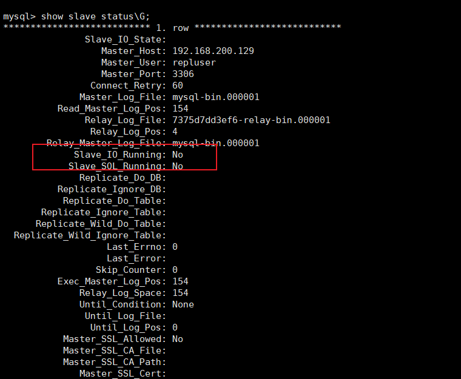
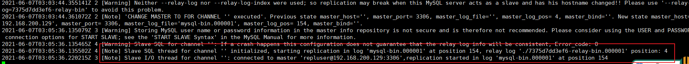
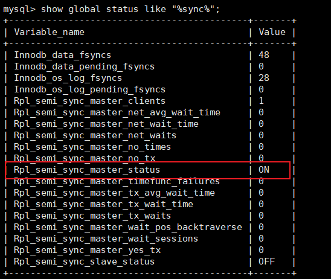
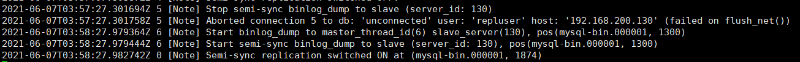

[[toc]]

# mysql-day03

## 课程大纲

- **mysql高可用架构:主从模式 主主模式 级联复制 主主与级联结合**
- **mysql高可用进阶: keepAlived**
- **数据切分: 垂直切分 水平切分**
- **MyCat入门: 分库与分表**
- **Mycat高级应用: 读写分离 主从切换 **

# 1 Mysql复制架构

## 1.1 数据拓展

- 热备份：数据库在运行的过程中，对数据进行备份操作。相对的，还有冷备份，冷备份需要停机，然后对数据进行备份操作。
- 多活：所谓的多活，就是让数据库机器节点会存在多个，避免单点情况的出现。
- 故障切换：当一台数据库物理机出现异常状况时，可以自动的切换到其他物理机上。
- 读写分离：当存在存在多台数据库物理机，将读写操作分别交给不同的机器完成。
- 负载均衡：假设当存在多台数据库物理机接收读请求时，多个请求会均匀的分配到不同的机器上，避免大量请求压在某一台机器上。

## 1.2 常见架构

**没有百分百的完美架构，只有适合的架构**

理解mysql的分库分表，先了解mysql的架构设计,在mysql架构中，经常会使用到的就是**读写分离**，此设计理念的基础上常见架构有: 一主一从或多从、主主复制、级联复制、主主与级联复制结合。

**一主一从或多从**: 一个mysql数据库主节点,一个或者多个从节点.主节点与从节点进行数据同步

**主主复制**: 两个mysql主节点,主节点与主节点之间进行数据同步

**级联复制**: 类似一主多从架构,但是从节点分级同步

**主主与级联复制结合**: 双主节点同步,同时从节点分级同步

## 1.3 主从模式

### 1.3.1 主从简介

主从模式是使用的最多的mysql高可用架构。

存在一台master作为写机，一个或多个slave作为读机,实现读写分离。之所以这么设计是因为在实际的情况下，读的请求量一般是远远大于写请求。架构图如下


**优点:**

读与写的节点分离,数据写入master节点后,再由master节点将数据复制到slave节点上

**缺点:**

- master是单点存在的，如果要对master进行停机维护，无法接收写请求
- master需要将写入数据复制到各个slave节点，复制是有一定的时间延迟的，因此有可能出现查询数据不一致
- 对master进行停机维护，需将某一个slave提升为新的master节点，选举规则需要进行自定义
- 当slave被提升为新的master后，可能会造成新的master节点与旧master的数据不一致

### 1.3.2 主从搭建

在虚拟机中安装docker

```linux
yum install docker
```

若遇到如下问题:


```linux
#编辑yum的配置文件
vi /etc/yum/pluginconf.d/langpacks.conf
将第一行：enable=1改为enable=0

#杀掉进程即可
kill -9 8683
```

查看docker版本

```
docker -v
#开启启动docker
systemctl enable docker
#查看运行状态
systemctl status docker
#启动
systemctl start docker
#停止
systemctl stop docker
#重启
systemctl restart docker
```

搜索mysql镜像

```
docker search mysql
```

下载mysql镜像

```
docker pull docker.io/mysql:5.7
```

安装mysql容器

```
#服务一
docker run --name mysqlm1 -p 3306:3306 --privileged=true -ti -e MYSQL_ROOT_PASSWORD=123456 -e MYSQL_USER=user -e MYSQL_PASSWORD=pass -v /home/mysql/docker-data/m1/conf:/etc/mysql/conf.d -v /home/mysql/docker-data/m1/data/:/var/lib/mysql -v /home/mysql/docker-data/m1/logs/:/var/log/mysql -d mysql:5.7
#服务二
docker run --name mysqls1 -p 3306:3306 --privileged=true -ti -e MYSQL_ROOT_PASSWORD=123456 -e MYSQL_USER=user -e MYSQL_PASSWORD=pass -v /home/mysql/docker-data/s1/conf:/etc/mysql/conf.d -v /home/mysql/docker-data/s1/data/:/var/lib/mysql -v /home/mysql/docker-data/s1/logs/:/var/log/mysql -d mysql:5.7
```

在两台机器上新增配置文件,路径为/home/mysql/docker-data/m1/conf/my.cnf

```
# For advice on how to change settings please see
# http://dev.mysql.com/doc/refman/5.7/en/server-configuration-defaults.html

[mysqld]
#
# Remove leading # and set to the amount of RAM for the most important data
# cache in MySQL. Start at 70% of total RAM for dedicated server, else 10%.
# innodb_buffer_pool_size = 128M
#
# Remove leading # to turn on a very important data integrity option: logging
# changes to the binary log between backups.
# log_bin
#
# Remove leading # to set options mainly useful for reporting servers.
# The server defaults are faster for transactions and fast SELECTs.
# Adjust sizes as needed, experiment to find the optimal values.
# join_buffer_size = 128M
# sort_buffer_size = 2M
# read_rnd_buffer_size = 2M

character_set_server=utf8
init_connect='SET NAMES utf8'

# Disabling symbolic-links is recommended to prevent assorted security risks
symbolic-links=0

lower_case_table_names=1
#指定主机号，不允许出现重复
server-id=129
#开启binlog
log-bin=mysql-bin
auto_increment_increment=2
auto_increment_offset=1

#rpl_semi_sync_master_enabled=1
#rpl_semi_sync_master_timeout=10000
```

/home/mysql/docker-data/s1/conf/my.cnf

```
# For advice on how to change settings please see
# http://dev.mysql.com/doc/refman/5.7/en/server-configuration-defaults.html

[mysqld]
#
# Remove leading # and set to the amount of RAM for the most important data
# cache in MySQL. Start at 70% of total RAM for dedicated server, else 10%.
# innodb_buffer_pool_size = 128M
#
# Remove leading # to turn on a very important data integrity option: logging
# changes to the binary log between backups.
# log_bin
#
# Remove leading # to set options mainly useful for reporting servers.
# The server defaults are faster for transactions and fast SELECTs.
# Adjust sizes as needed, experiment to find the optimal values.
# join_buffer_size = 128M
# sort_buffer_size = 2M
# read_rnd_buffer_size = 2M

character_set_server=utf8
init_connect='SET NAMES utf8'

# Disabling symbolic-links is recommended to prevent assorted security risks
symbolic-links=0

lower_case_table_names=1
#指定主机号，不允许出现重复
server-id=130
#开启binlog
log-bin=mysql-bin
auto_increment_increment=2
auto_increment_offset=1

#rpl_semi_sync_master_enabled=1
#rpl_semi_sync_master_timeout=10000
```

在master的docker容器中添加mysql权限，开启备份机复制，并且设置备份用户信息

```
#在129服务中进入mysql容器
docker exec -it mysqlm1 /bin/bash
#添加权限
GRANT REPLICATION SLAVE,FILE,REPLICATION CLIENT ON *.* TO 'repluser'@'%' IDENTIFIED BY '123456';
#刷新权限
FLUSH PRIVILEGES;
#重启容器
docker restart mysql129
#查看129的binlog信息
show master status;
```


接着在slave中进入到mysql容器，设置master信息，用于标注当前slave的master是谁

```sql
#语法
change master to master_host='master的ip',master_port=master的端口号,master_user='repluser',master_password='123456',master_log_file='master中的binlob文件',master_log_pos=master中的position位置信息;
#命令
change master to master_host='192.168.200.132',master_port=3306,master_user='repluser',master_password='123456',master_log_file='mysql-bin.000001',master_log_pos=4691;
```


完成后，还需要开启slave中的**IO**和**SQL**线程，这两个线程主要用于slave中进行数据备份，可以先查看slave中这两个线程的状态

```sql
show slave status\G;
```



我们发现在slave中，这两个线程是关闭的，需要将这两个线程进行开启

```sql
#开启
start slave;
```


到此，mysql主从复制就已经搭建完毕

### 1.3.3 测试

**case1: 查看主从相关信息**

查看slave中的binlog是否已经开启

```sql
show global variables like "%log%";
```


查看master、slave中的进程信息

```sql
#129和130分别输入
show processlist;
```

129节点内容


130节点内容


**case2: 数据库同步测试**

在129节点创建一个数据库


在130节点中查看数据库


**case3: 表同步测试**

在129中创建一张表

```sql
DROP TABLE IF EXISTS `t_user`;
CREATE TABLE `t_user` (
`id` int(11) NOT NULL AUTO_INCREMENT,
`username` varchar(50) DEFAULT NULL,
`password` varchar(50) DEFAULT NULL,
`address` varchar(50) DEFAULT NULL,
PRIMARY KEY (`id`)
) ENGINE=InnoDB AUTO_INCREMENT=10 DEFAULT CHARSET=utf8;
```


在130中查看表


**case4: 数据同步**

在129中新增一条数据

```sql
INSERT INTO `t_user` VALUES ('1', 'zhangsan', '123', '北京');
```


在130中查看数据


==**case5: 反向数据同步**(注意一定不要搞混!!!!!!)==

在130中新增一条数据

```sql
INSERT INTO `t_user` VALUES ('2', 'lisi', '123', '上海');
```


在129中查看数据


**==结论: 从服务中新增数据无法同步到主服务中去, 主从同步是单向的!==**

## 1.4 主从复制原理

### 1.4.1 异步复制


1. 事务提交到master
2. master接收到应用事务提交请求后，更新内部的binlog日志，让mysql引擎执行事务操作，并返回给客户端执行结果信息。同时在master中会存在一个事件监听，其会一直监听着master中binlog日志文件的改变，一旦发现日志文件发生改变，触发dump线程
3. dump线程被触发后，通知slave中的IO线程现在有事务操作要进行同步
4. slave中IO线程接收到通知后，会从slave中**relay-log.info**文件中获取slave中的binlog日志文件和pos位置信息。接着会把这部分信息发送给master的dump线程
5. master的dump线程收到这些信息后，会根据slave发送的binlog日志文件和pos位置，将最新的binlog日志和pos位置后面的内容同步给slave的IO线程
6. slave的IO线程接收到这些信息后，会将这部分内容同步到slave中的relay-bin文件中
7. 当relay-bin文件发生改变后，触发slave线程执行sql操作【异步】
8. 当slave向relay-bin写入完成后，会向master返回一个ACK消息，同步成功。

对于这一系列的操作，可以发现master和slave在进行同步时是以异步的方式完成的，master写入完binlog后，会马上通过引擎进行事务提交并向客户端返回响应，对于与slave同步的操作，则是异步完成的。

**优点:**

效率高

**缺点:**

可能出现数据不一致

### 1.4.2 半同步复制


半同步复制与异步复制的工作流程大体相似

**不同点:** 当master中的binlog日志写入完成后，其不会马上通过引擎进行事务提交，而会处于等待，等到slave同步完成向master返回ACK通知后，才会唤醒等待，继续向下执行。

- 等待的时长，默认为10秒，但该时间可以配置


- 尽量的避免了主从数据不一致，但造成吞吐量的降低


- mysql兜底方案: 使用半同步复制进行备份时slave节点挂掉了，那么当master等待10秒后，仍然会进行引擎提交，同时会将半同步复制切换为异步复制。等到slave节点重启后，又会自动的从异步复制切换到半同步复制。

### 1.4.3 异步复制实现

Mysql在进行复制操作时，默认是基于异步复制完成的。那为了更好的体会异步复制的效果，可以通过mysql日志来查看具体的复制过程效果。

1. **查看master的Mysql日志信息**

```
docker logs -f mysqlm1
```


​	根据当前查看的日志信息，在master中已经开启了dump线程连接到了id为130的slave节点，并且该id就是在slave的mysql配置文件中设置的id。同时pos内容包括当前的binlog日志和pos位置。

2. **查看slave的Mysql日志信息**

```
docker logs -f mysqls1
```



根据slave中的日志信息，可以看到，当前slave中已经开启了relay-log日志，其对应文件信息就是xxxxx-relay-bin。其内部保存的就是slave中的相关binlog信息和pos位置信息。

同时在slave中也已经开启了SQL Thread，并且根据信息可以，它会从7375d7dd3ef6-relay-bin.000001文件的4位置开始复制。

同时在slave中也开启了IO Thread，其已经连接到master，并且会从master的binlog日志的154的位置开启复制。

3. **查看master当前的binlog日志信息**

```
cd home/mysql/docker-data/129/data/
#确定当前master正在使用的binlog日志文件
cat mysql-bin.index
#查看当前binlog日志文件内容
tail -f mysql-bin.000001
```


4. **查看slave当前的日志信息**


### 1.4.4 半同步复制实现

1. 进入mysql容器，加载lib，**主从节点都要配置**，因为主从节点间会存在切换。

```sql
install plugin rpl_semi_sync_master soname 'semisync_master.so';
install plugin rpl_semi_sync_slave soname 'semisync_slave.so';
#查看插件信息
show plugins;
```


2. 启用半同步**（务必先启用从库，再启用主库）**

```sql
#先启用从库，再启用主库

从库：set global rpl_semi_sync_slave_enabled= 1;   # 1：启用，0：禁止

主库：
     set global rpl_semi_sync_master_enabled= 1;   # 1：启用，0：禁止
     set global rpl_semi_sync_master_timeout=10000;   # 单位为ms
```

3. 从库重启IO Thread

```sql
stop slave io_thread;
start slave io_thread;
```

4. 查看启动状态

```sql
#查询状态信息
show global status like "%sync%";
```



```sql
#查询参数信息
show global variables like '%sync%';
```


5. 半同步复制效果测试

- 正常的向master中添加数据，slave可以进行正常数据更新


- 关闭slave的IO,再次向master中添加数据

```sql
stop slave io_thread;
INSERT INTO `t_user` VALUES ('3', 'ding', '111', '武汉');
```


==**此时复制机制会由半同步复制转换为异步复制，当再次向master中添加数据，不会再次出现等待**==

- slave中重新开启IO Thread

```sql
start slave io_thread;
```

异步复制会再次转换为半同步复制，master中打印日志信息如下：



在slave IO Tthread关闭这段时间内的数据，会同步到slave中，不会出现数据丢失


## 1.5 主主复制

### 1.5.1 简介

对于主从复制来说，其内部会存在一台master以及一台或多台slave。但有一个非常明显的问题，**master是单点存在**。一旦master宕机，则无法进行数据的写入。为了解决这个问题，可以使用主主复制架构。

在主主复制架构中，会存在两台master，没有slave。并且会对这两台master进行读写分离，两台master会进行相互的复制, 架构图如下:


在此架构中，两台master会进行双向复制，为什么这么做呢？ 因为假设现在负责写的master宕机了，那么写的工作则会交给之前负责读的服务器来完成，相当于它即负责写又负责读。等到原先负责写的master恢复了，其在继续负责写工作。 反之亦然。因此才需要两者间进行双向复制。

**缺点: 读请求的并发量过大，服务可能产生宕机, 主主复制架构直接使用的情况较少。**

### 1.5.2 主主搭建

在129和130服务器,再各自创建一个实例

```
docker run --name mysqlm2 -p 3307:3306 --privileged=true -ti -e MYSQL_ROOT_PASSWORD=123456 -e MYSQL_USER=user -e MYSQL_PASSWORD=pass -v /home/mysql/docker-data/m2/conf:/etc/mysql/conf.d -v /home/mysql/docker-data/m2/data/:/var/lib/mysql -v /home/mysql/docker-data/m2/logs/:/var/log/mysql -d mysql:5.7
```

/home/mysql/docker-data/m2/conf/my.cnf

```
# For advice on how to change settings please see
# http://dev.mysql.com/doc/refman/5.7/en/server-configuration-defaults.html

[mysqld]
#
# Remove leading # and set to the amount of RAM for the most important data
# cache in MySQL. Start at 70% of total RAM for dedicated server, else 10%.
# innodb_buffer_pool_size = 128M
#
# Remove leading # to turn on a very important data integrity option: logging
# changes to the binary log between backups.
# log_bin
#
# Remove leading # to set options mainly useful for reporting servers.
# The server defaults are faster for transactions and fast SELECTs.
# Adjust sizes as needed, experiment to find the optimal values.
# join_buffer_size = 128M
# sort_buffer_size = 2M
# read_rnd_buffer_size = 2M

character_set_server=utf8
init_connect='SET NAMES utf8'

# Disabling symbolic-links is recommended to prevent assorted security risks
symbolic-links=0

lower_case_table_names=1
#指定主机号，不允许出现重复
server-id=1321
#开启binlog
log-bin=mysql-bin
auto_increment_increment=2
auto_increment_offset=1

#rpl_semi_sync_master_enabled=1
#rpl_semi_sync_master_timeout=10000
```

添加slave的相关配置, 虽然是主主模式,也要添加从用户

```sql
#添加权限
GRANT REPLICATION SLAVE,FILE,REPLICATION CLIENT ON *.* TO 'repluser'@'%' IDENTIFIED BY '123456';
#刷新权限
FLUSH PRIVILEGES;
```

主主搭建

```sql
#在129/130服务器上运行
show master status;
#执行主主关联
change master to master_host='172.17.0.3',master_port=3306,master_user='repluser',master_password='123456',master_log_file='mysql-bin.000003',master_log_pos=154;
#主主同步生效
start slave;
```

查看master 129的进程列表：show processlist;


slave131的进程列表：show processlist;


### 1.5.3 测试

**(作业,自行测试主主模式)**

## 1.6 级联复制(了解)

写请求的入口为一个，但当master向slave进行复制时，对于slave可以分为多层， master只要向其中两台slave复制即可，然后再由slave将其数据复制到后面更多的slave中。通过这种方式可以减轻master向slave复制的IO压力。但是这种架构会使slave的延迟会加大,架构如下图:


## 1.7 双主与级联复制(了解)

对于master在前面几种架构设计中，都存在单点问题， 对于master单点问题的解决，可以采用当前的架构。

通过这种架构不仅可以解决master单点的问题，也可以解决slave延迟的问题, 架构图如下:


# 2 Mysql高可用

## 2.1 简介

以主主架构为例，现在不管写或者读，只要其中一个宕机，则会把它本身工作交给另外一台服务器完成。此时就需要对IP进行一个自动的指向。而且这种服务器IP切换，对于上层应用来说，应该是完全隐藏的，其无需知道当前是由谁来完成具体工作，其只需要来连接一个IP就可以。

对于这种需求，就需要通过**keepAlived**来完成IP的自动切换。

 Keepalived是Linux下一个轻量级别的高可用解决方案。高可用(High Avalilability,HA)，其实两种不同的含义：广义来讲，是指整个系统的高可用行，狭义的来讲就是之主机的冗余和接管，

  它与HeartBeat RoseHA 实现相同类似的功能，都可以实现服务或者网络的高可用，但是又有差别，HeartBeat是一个专业的、功能完善的高可用软件，它提供了HA 软件所需的基本功能，比如：心跳检测、资源接管，检测集群中的服务，在集群节点转移共享IP地址的所有者等等。HeartBeat功能强大，但是部署和使用相对比较麻烦，

与HeartBeat相比，Keepalived主要是通过虚拟路由冗余来实现高可用功能，虽然它没有HeartBeat功能强大，但是Keepalived部署和使用非常的简单，所有配置只需要一个配置文件即可以完成


对于keepalived会在多台mysql服务器进行安装， 同时keepalived间也分为master和slave，  同时master会虚拟化一个VIP供应用进行连接。  如果一旦master挂掉后，会由slave节点继续工作，同时slave节点也会虚拟出相同VIP，供应用进行连接

## 2.2 keepAlived安装与配置

1. **安装keepalived**

下载keepalied安装包 http://www.keepalived.org/download.html


安装相关的环境依赖

```
yum install killall
yum -y install openssl-devel gcc gcc-c++
```

yum install killall若出现以下错误,命令更换为yum install psmisc


创建keepalived安装文件目录

```
mkdir /etc/keepalived
```

上传文件并解压

```
tar -zxvf keepalived-2.2.2.tar.gz
```

将解压的程序复制到用户目录

```
mv keepalived-2.2.2 /usr/local/keepalived
cd /usr/local/keepalived
```

安装

```
./configure && make && make install
```

创建启动文件

```
cp  -a /usr/local/etc/keepalived   /etc/init.d/
cp  -a /usr/local/etc/sysconfig/keepalived    /etc/sysconfig/
cp  -a /usr/local/sbin/keepalived    /usr/sbin/
```

编写shell脚本,**进入/etc/keepalived。创建chk.sh**，同时赋予执行权限：chmod +x chk.sh

```shell
#! /bin/bash
mysql -h 192.168.200.129 -u root -p123456 -P 3306 -e "show status;" >/dev/null 2>&1
if [ $? == 0 ]
then
    echo " $host mysql login successfully "
    exit 0
else
    echo "  mysql login faild"
    killall keepalived
    exit 2
fi
```

编写keepalived配置文件keepalived.conf

```
! Configuration File for keepalived

global_defs {
   notification_email {
     acassen@firewall.loc
     failover@firewall.loc
     sysadmin@firewall.loc
   }
   notification_email_from Alexandre.Cassen@firewall.loc
   smtp_server 192.168.200.1
   smtp_connect_timeout 30
   router_id LVS_DEVEL
   vrrp_skip_check_adv_addr
   vrrp_strict
   vrrp_garp_interval 0
   vrrp_gna_interval 0
}

vrrp_script chk_haproxy {
    script "/etc/keepalived/chk.sh"
    interval 2  #脚本循环运行间隔
}

vrrp_instance VI_1 {
    state BACKUP
    interface ens33
    virtual_router_id 51
    priority 100
    advert_int 1
    authentication {
        auth_type PASS
        auth_pass 1111
    }
    virtual_ipaddress {
        192.168.200.200
    }
}

```

启动

```
systemctl start keepalived
```

查看

```
ps -ef|grep keepalived
```


查看ip信息，此时可以发现出现了配置的虚拟ip

```
ip a
```


#  3 数据分片

## 3.1 简介

当前微服务架构非常流行，很多都会采用微服务架构对其系统进行拆分。 而虽然产生了多个微服务，但因为其用户量和数据量的问题，很有可能仍然使用的是同一个数据库。但是随着用户量和数据量增加，就会出现很多影响数据库性能的因素，如：数据存储量、IO瓶颈、访问量瓶颈等。此时就需要将数据进行拆分，从一个库拆分成多个库。


## 3.2 水平切分

为了解决垂直拆分出现的问题，可以使用水平拆分继续横向扩展，首先，可以如果**当前数据库的容量没有问题**的话，可以对读写极其频繁且数据量超大的表进行**分表**操作。由一张表拆分出多张表。

在一个库中，拆分出多张表，每张表存储不同的数据，这样对于其操作效率会有明显的提升。而且因为处于同一个库中，也不会出现分布式事务的问题。


而拆分出多张表后，如果当前数据库的容量已经不够了，但是还要继续拆分的话，就可以进行**分库**操作，产生多个数据库，然后在扩展出的数据库中继续扩展表。


**优点：**

- 尽量的避免了跨库join操作
- 不会存在超大型表的性能瓶颈问题
- 事务处理相对简单
- 只要拆分规则定义好，很难出现扩展性的限制

**缺点：**

- 拆分规则不好明确，规则一定会和业务挂钩，如根据id、根据时间等
- 不好明确数据位置，难以进行维护
- 多数据源管理难度加大，代码复杂度增加
- 也会存在分布式事务问题
- 数据库维护成本增加

## 3.3 垂直切分

垂直拆分是按照业务将表进行分类并分布到不同的数据节点上。在初始进行数据拆分时，使用垂直拆分是非常直观的一种方式。


**优点：**

- 拆分规格明确，按照不同的功能模块或服务分配不同的数据库
- 数据维护与定位简单

**缺点：**

- 对于读写极其频繁且数据量超大的表，仍然存在存储与性能瓶颈。简单的索引此时已经无法解决问题
- 会出现跨库join
- 需要对代码进行重构，修改原有的事务操作
- 某个表数据量达到一定程度后扩展起来较为困难

## 3.4 存在的问题

**数据切分带来的问题:**

- 产生引入分布式事务的问题
- 跨节点 Join 的问题
- 跨节点合并排序分页问题

例如: 

- 按照用户ID求模，将数据分散到不同的数据库，具有相同数据用户的数据都被分散到一个库中
- 按照日期，将不同月甚至日的数据分散到不同的库中
- 按照某个特定的字段求模，或者根据特定范围段分散到不同的库中

# 4 Mycat工具

## 4.1 Mycat简介

当对数据拆分后会产生诸多的问题，对于这些问题的解决，可以借助于数据库中间件来进行解决，现在时下比较流行的是使用Mycat。

Mycat是一款数据库中间件，对于应用程序来说是完全透明化的，不管底层的数据如何拆分，应用只需要连接Mycat即可完成对数据的操作。同时它还支持MySQL、SQL Server、Oracle、DB2、PostgreSQL等主流数据库。但是Mycat不会进行数据存储，它只是用于数据的路由。

其底层是基于拦截思想实现，其会拦截用户发送过来的SQL语句，首先对SQL语句做了一些特定的分析：如分片分析、路由分析、读写分离分析、缓存分析等，然后将此SQL发往后端的真实数据库，并将返回的结果做适当的处理，最终再返回给用户。


Mycat的特性如下:

- 支持SQL92标准
- 遵守Mysql原生协议，跨语言，跨平台，跨数据库的通用中间件代理
- 基于心跳的自动故障切换，支持读写分离，支持MySQL主从，以及galera cluster集群
- 支持Galera for MySQL集群，Percona Cluster或者MariaDB cluster
- 基于Nio实现，有效管理线程，高并发问题
- 支持数据的多片自动路由与聚合，支持sum,count,max等常用的聚合函数
- 支持单库内部任意join，支持跨库2表join
- 支持通过全局表，ER关系的分片策略，实现了高效的多表join查询
- 支持多租户方案
- 支持分布式事务
- 支持全局序列号，解决分布式下的主键生成问题
- 分片规则丰富，插件化开发，易于扩展
- 强大的web，命令行监控
- 支持前端作为mysq通用代理，后端JDBC方式支持Oracle、DB2、SQL Server 、 mongodb 
- 支持密码加密
- 支持服务降级
- 支持IP白名单
- 支持SQL黑名单、sql注入攻击拦截
- 支持分表(1.6以后版本)
- 集群基于ZooKeeper管理，在线升级，扩容，智能优化，大数据处理（2.0以后版本）

## 4.2 Mycat安装

**源码下载：**https://codeload.github.com/MyCATApache/Mycat-Server/zip/Mycat-server-1675-release

**官网:** http://www.mycat.org.cn/

**默认端口：8066**

**配置启动参数：**

```
#环境变量
-DMYCAT_HOME=D:\workspace\Mycat-Server-Mycat-server-1675-release\src\main
#设置堆外内存大小:当使用mycat对非分片查询时，会把所有的数据查询出来，然后把这部分数据放在堆外内存中
-XX:MaxDirectMemorySize=512M 
```

在Mycat有核心三个配置文件，分别为：**sever.xml、schema.xml、rule.xml**

- **sever.xml**：是Mycat服务器参数调整和用户授权的配置文件
- **schema.xml**：是逻辑库定义和表以及分片定义的配置文件
- **rule.xml**：是分片规则的配置文件，分片规则的具体一些参数信息单独存放为文件，也在这个目录下，配置文件修改需要重启

## 4.3 Mycat核心概念

- **逻辑库**：Mycat中的虚拟数据库。对应实际数据库的概念。在没有使用mycat时，应用需要确定当前连接的数据库等信息，那么当使用mycat后，也需要先虚拟一个数据库，用于应用的连接。
- **逻辑表**：mycat中的虚拟数据表。对应时间数据库中数据表的概念。
- **非分片表**：没有进行数据切分的表。
- **分片表**：已经被数据拆分的表，每个分片表中都有原有数据表的一部分数据。多张分片表可以构成一个完整数据表。
- **ER表**：子表的记录与所关联的父表记录存放在同一个数据分片上，即子表依赖于父表，通过表分组（Table Group）保证数据Join不会跨库操作。表分组（Table Group）是解决跨分片数据join的一种很好的思路，也是数据切分规划的重要一条规则
- **全局表**：可以理解为是一张数据冗余表，如状态表，每一个数据分片节点又保存了一份状态表数据。数据冗余是解决跨分片数据join的一种很好的思路，也是数据切分规划的另外一条重要规则。
- **分片节点（dataNode）**：数据切分后，每一个数据分片表所在的数据库就是分片节点。
- **节点主机（dataHost）**：数据切分后，每个分片节点（dataNode）不一定都会独占一台机器，同一机器上面可以有多个分片数据库，这样一个或多个分片节点（dataNode）所在的机器就是节点主机（dataHost）,为了规避单节点主机并发数限制，尽量将读写压力高的分片节点（dataNode）均衡的放在不同的节点主机（dataHost）。
- **分片规则（rule）**：按照某种业务规则把数据分到某个分片的规则就是分片规则。
- **全局序列号（sequence）**：也可以理解为分布式id。数据切分后，原有的关系数据库中的主键约束在分布式条件下将无法使用，因此需要引入外部机制保证数据唯一性标识，这种保证全局性的数据唯一标识的机制就是全局序列号（sequence），如UUID、雪花算法等。

# 5 Mycat入门

## 5.1 环境准备

在server.xml 文件中的system标签下配置所有的参数，全部为环境参数，可以根据当前需要进行开启和配置，如：设置mycat连接端口号

```xml
<property name="serverPort">8066</property>
```


## 5.2 通过Mycat访问数据库

### 5.2.1 server.xml配置

应用连接mycat的话，也需要设置用户名、密码、被连接数据库信息，要配置这些信息的话，可以修改server.xml，在其内部添加内容如下：

```xml
<!--配置自定义用户信息-->
<!--连接用户名-->
<user name="mycat">
    <!--连接密码-->
    <property name="password">mycat</property>
    <!--创建虚拟数据库-->
    <property name="schemas">userDB</property>
    <!--指定该库是否只读-->
    <!--<property name="readOnly">true</property>-->
</user>
```

### 5.2.2 schema.xml配置

当配置了一个虚拟数据库后，还需要修改schema.xml，对虚拟库进行详细配置

```xml
<?xml version="1.0"?>
<!DOCTYPE mycat:schema SYSTEM "schema.dtd">
<mycat:schema xmlns:mycat="http://io.mycat/">

	<!--配置虚拟数据库-->
	<!--name：虚拟逻辑数据库名称，对应server.xml中的schemas属性值-->
	<!--dataNode：逻辑库中逻辑表的默认数据节点-->
	<!--sqlMaxLimit：类似于SQL上添加limit，如schema为非分片库，则该属性无效-->
	<schema name="userDB" checkSQLschema="true" dataNode="localdn" sqlMaxLimit="500">
		<!--配置虚拟逻辑表-->
		<!--name：逻辑表名称，必须唯一-->
		<!--dataNode：逻辑表所处的数据节点，值必须与dataNode标签中的name属性对应。如果值过多可以用$连接，如：dn$1-99,dn$200-400-->
		<!--primaryKey：逻辑表对应的真实表的主键id的字段名-->
		<table name="tb_user" dataNode="localdn" primaryKey="user_id"/>
	</schema>

	<!--配置dataNode信息-->
	<!--name：当前datanode名称-->
	<!--dataHost：分片节点所处的节点主机，该值必须与dataHost标签中的name属性对应-->
	<!--database：当前数据节点所对应的实际物理数据库-->
	<dataNode name="localdn" dataHost="localdh" database="user"/>

	<!--配置节点主机-->
	<!--balance：用于进行读操作指向，有三个值可选
		0：所有读操作都发送到当前可用的writeHost上
		1：所有读操作都随机的发送到readHost上
		2：所有读操作都随机发送在writeHost与readHost上
	-->
	<!--maxCon：指定每个读写实例连接池的最大连接。也就是说，标签内嵌套的writeHost、readHost标签都会使用这个属性的值来实例化出连接池的最大连接数-->
	<!--minCon：指定每个读写实例连接池的最小连接，初始化连接池的大小-->
	<!--name：当前节点主机名称，不允许出现重复-->
	<!--dbType：当时使用的数据库类型-->
	<!--dbDriver：当前使用的数据库驱动-->
	<!--writeType：用于写操作指向，有三个值可选
		0：所有写操作都发送到可用的writeHost上
		1：所有写操作都随机发送到readHost上
		2：所有写操作都随机发送在writeHost与readHost上
	-->
	<!--readHost是从属于writeHost的，即意味着它从那个writeHost获取同步数据。
		因此，当它所属的writeHost宕机了，则它也不会再参与到读写分离中来，即“不工作了”。这是因为此时，它的数据已经“不可靠”了。
		基于这个考虑，目前mycat 1.3和1.4版本中，若想支持MySQL一主一从的标准配置，并且在主节点宕机的情况下，从节点还能读取数据。
		则需要在Mycat里配置为两个writeHost并设置banlance=1。”-->
	<!--switchType：设置节点切换操作，有三个值可选
		-1：不自动切换
		1：自动切换，默认值
		2：基于mysql主从同步的状态决定是否切换
	-->
	<!--slaveThreshold：主从同步状态决定是否切换，延迟超过该值就不切换-->
	<dataHost balance="0" maxCon="100" minCon="10" name="localdh" dbType="mysql" dbDriver="jdbc" writeType="0" switchType="1" slaveThreshold="1000">
		<!--查询心跳-->
		<heartbeat>select user()</heartbeat>
		<!--配置写节点实际物理数据库信息-->
		<writeHost url="jdbc:mysql://localhost:3306" host="host1" password="root" user="root"></writeHost>
	</dataHost>
</mycat:schema>
```

### 5.2.3 访问测试

通过navicat创建本地数据库连接并创建对应数据库，同时创建mycat连接。 在mycat连接中操作表，添加数据，可以发现，本地数据库中同步的也新增了对应的数据。

## 5.3 数据分片

### 5.3.1 取模分片

当一个数据表中的数据量非常大时，就需要考虑对表内数据进行分片，拆分的规则有很多种，比较简单的一种就是，通过对id进行取模，完成数据分片。

1. **修改schema.xml**

table标签新增属性：subTables、rule

```xml
<?xml version="1.0"?>
<!DOCTYPE mycat:schema SYSTEM "schema.dtd">
<mycat:schema xmlns:mycat="http://io.mycat/">

	<!--配置虚拟数据库-->
	<!--name：虚拟逻辑数据库名称，对应server.xml中的schemas属性值-->
	<!--dataNode：逻辑库中逻辑表的默认数据节点-->
	<!--sqlMaxLimit：类似于SQL上添加limit，如schema为非分片库，则该属性无效-->
	<schema name="userDB" checkSQLschema="true" dataNode="localdn" sqlMaxLimit="500">
		<!--配置虚拟逻辑表-->
		<!--name：逻辑表名称，必须唯一-->
		<!--dataNode：逻辑表所处的数据节点，值必须与dataNode标签中的name属性对应。如果值过多可以用$连接，如：dn$1-99,dn$200-400-->
		<!--primaryKey：逻辑表对应的真实表的主键id的字段名-->
		<!--subTables：分表的名称。可以存在多个，tb_user1,tb_user2,tb_user3.如果分表较多，可以通过$连接：tb_user$1-3-->
		<!--rule：分片规则，对应rule.xml中配置-->
		<table name="tb_user" dataNode="localdn" primaryKey="user_id" subTables="tb_user$1-3" rule="mod-long"/>
	</schema>

	<!--配置dataNode信息-->
	<!--name：当前datanode名称-->
	<!--dataHost：分片节点所处的节点主机，该值必须与dataHost标签中的name属性对应-->
	<!--database：当前数据节点所对应的实际物理数据库-->
	<dataNode name="localdn" dataHost="localdh" database="user"/>

	<!--配置节点主机-->
	<!--balance：用于进行读操作指向，有三个值可选
		0：所有读操作都发送到当前可用的writeHost上
		1：所有读操作都随机的发送到readHost上
		2：所有读操作都随机发送在writeHost与readHost上
	-->
	<!--maxCon：指定每个读写实例连接池的最大连接。也就是说，标签内嵌套的writeHost、readHost标签都会使用这个属性的值来实例化出连接池的最大连接数-->
	<!--minCon：指定每个读写实例连接池的最小连接，初始化连接池的大小-->
	<!--name：当前节点主机名称，不允许出现重复-->
	<!--dbType：当时使用的数据库类型-->
	<!--dbDriver：当前使用的数据库驱动-->
	<!--writeType：用于写操作指向，有三个值可选
		0：所有写操作都发送到可用的writeHost上
		1：所有写操作都随机发送到readHost上
		2：所有写操作都随机发送在writeHost与readHost上
	-->
	<!--readHost是从属于writeHost的，即意味着它从那个writeHost获取同步数据。
		因此，当它所属的writeHost宕机了，则它也不会再参与到读写分离中来，即“不工作了”。这是因为此时，它的数据已经“不可靠”了。
		基于这个考虑，目前mycat 1.3和1.4版本中，若想支持MySQL一主一从的标准配置，并且在主节点宕机的情况下，从节点还能读取数据。
		则需要在Mycat里配置为两个writeHost并设置banlance=1。”-->
	<!--switchType：设置节点切换操作，有三个值可选
		-1：不自动切换
		1：自动切换，默认值
		2：基于mysql主从同步的状态决定是否切换
	-->
	<!--slaveThreshold：主从同步状态决定是否切换，延迟超过该值就不切换-->
	<dataHost balance="0" maxCon="100" minCon="10" name="localdh" dbType="mysql" dbDriver="jdbc" writeType="0" switchType="1" slaveThreshold="1000">
		<!--查询心跳-->
		<heartbeat>select user()</heartbeat>
		<!--配置写节点实际物理数据库信息-->
		<writeHost url="jdbc:mysql://localhost:3306" host="host1" password="root" user="root"></writeHost>
	</dataHost>
</mycat:schema>
```

2. **修改rule.xml**

​	在schema.xml中已经指定规则为mod-long。因此需要到该文件中修改对应信息。

```xml
<tableRule name="mod-long">
    <rule>
        <!--当用用于id取模的字段-->
        <columns>user_id</columns>
        <algorithm>mod-long</algorithm>
    </rule>
</tableRule>

<!--修改当前的分片数量-->
<function name="mod-long" class="io.mycat.route.function.PartitionByMod">
		<!-- how many data nodes -->
		<!-- 根据datanode数量进行取模分片，也就是要模几。 -->
		<property name="count">3</property>
	</function>
```

3. **新增数据**

- 向数据库中插入9条数据

  ```sql
  INSERT INTO test(id) VALUES(1);
  INSERT INTO test(id) VALUES(2);
  INSERT INTO test(id) VALUES(3);
  INSERT INTO test(id) VALUES(4);
  INSERT INTO test(id) VALUES(5);
  INSERT INTO test(id) VALUES(6);
  INSERT INTO test(id) VALUES(7);
  INSERT INTO test(id) VALUES(8);
  INSERT INTO test(id) VALUES(9);
  ```

- 通过id查询数据

  

- 查询所有数据


4. **问题分析**

- 散列不均匀，出现数据倾斜
  - 每张表中的数据量差距较大

- 动态扩容时，存在rehash，出现数据丢失
  - 动态扩容后新增表时，需要对模数修改时有可能就会造成当查询某个分片时，在该分片中找不到对应数据

### 5.3.2 全局id分片

当进行数据切分后，数据会存放在多张表中，如果仍然通过数据库自增id的方式，就会出现ID重复的问题，造成数据错乱。所以当拆分完数据后，需要让每一条数据都有自己的ID，并且在多表中不能出现重复。比较常见的会使用雪花算法来生成分布式id。

在Mycat中也提供了四种方式来进行分布式id生成：基于文件、基于数据库、基于时间戳和基于ZooKeeper。

**基于本地文件**

**优点：**

- 本地加载，读取速度较快

**缺点：**

- MyCAT重新发布后，配置文件中的sequence会初始化

- 生成的id没有意义


- MyCat如果存在多个，会出现id重复冲突

**流程:**

1. 修改**sequence_conf.properties**

```properties
USER.HISIDS=  #使用过的历史分段，可不配置
USER.MINID=1  #最小ID值
USER.MAXID=200000  #最大ID值
USER.CURID=1000  #当前ID值
```

2. 修改**server.xml**

```xml
<!--设置全局序号生成方式
   0：文件
   1：数据库
   2：时间戳
   3：zookeeper
  -->
<!--必须带有MYCATSEQ_或者 mycatseq_进入序列匹配流程 注意MYCATSEQ_有空格的情况-->
	<property name="sequenceHandlerType">0</property>
	<property name="sequnceHandlerPattern">(?:(\s*next\s+value\s+for\s*MYCATSEQ_(\w+))(,|\)|\s)*)+</property>
	<property name="subqueryRelationshipCheck">false</property> <!-- 子查询中存在关联查询的情况下,检查关联字段中是否有分片字段 .默认 false -->
	<property name="sequenceHanlderClass">io.mycat.route.sequence.handler.HttpIncrSequenceHandler</property>
```

**测试:**

插入数据

```sql
insert into t_user(user_id,user_name) values('next value for MYCATSEQ_USER','wangwu')
```

**其他三种配置方式:**

1. ==**数据库:**==

- 执行dbseq.sql中的sql语句，执行完毕后，会创建一张表


- 修改sequence_db_conf.properties

```
TB_USER=localdn #dataNode的name属性的名字
```

- **修改server.xml文件**，修改全局序列号生成方式为数据库方式

```xml
<property name="sequenceHandlerType">1</property>
```

- 修改schema.xml, 在table中添加自增属性

```xml
<table name="tb_user" dataNode="localdn" primaryKey="id" subTables="tb_user$1-3" rule="mod-long" autoIncrement="true"/>
```

- 执行语句

```sql
insert into tb_user(user_id,user_name) values('next value for MYCATSEQ_TB_USER','wangwu')
```

- 特点

  - 本地加载，读取速度较快


  - 当MyCAT重新发布后，配置文件中的sequence会恢复到初始值


  - 生成的id没有含义，如时间


  - MyCat如果存在多个，会出现id重复问题

2. ==**zookeeper**==

- 修改**server.xml**，更改生成模式


```xml
<property name="sequenceHandlerType">3</property>
```

- 修改**myid.properties**，配置zk连接信息


```properties
loadZk=true
zkURL=192.168.200.131:2181
clusterId=01
myid=mycat_fz_01
clusterNodes=mycat_fz_01
```

- 修改**sequence_distributed_conf.properties**


```
INSTANCEID=ZK #声明使用zk生成
CLUSTERID=01
```

- 新增数据

```sql
#MYCATSEQ_这个后缀可以随便写即可
insert into tb_user(user_id,user_name) values('next value for MYCATSEQ_TB_AAAA','atguigu')
```

- 特点
  - ID 结构：**long 64 位**，ID 最大可占 63 位
  - 可以承受单机房单机器单线程 1000*(2^6)=640000 的并发。
  - 无悲观锁，无强竞争，吞吐量更高

3. **==时间戳==**

- 修改**server.xml**。更改生成方式

  ```xml
  <property name="sequenceHandlerType">2</property>
  ```

- 修改**sequence_time_conf.properties**


```properties
#sequence depend on TIME
#WORKID与DATAACENTERID: 0-31 任意整数。多mycat节点下，每个节点的WORKID、DATAACENTERID不能重复，组成唯一标识，总共支持32*32=1024 种组合
WORKID=01
DATAACENTERID=01
```

- 新增数据

  ```sql
  #MYCATSEQ_这个后缀可以随便写即可
  insert into tb_user(user_id,user_name) values('next value for MYCATSEQ_TB_BBBB','atguigu')
  ```

- 特点
  - 不存在id重复的现象
  - 数据类型太长，建议字段类型采用bigint(最大取值18446744073709551615)

### 5.3.3 枚举分片

适用于在特定业务场景下，将不同的数据存放于不同的数据库中，如按省份存放订单、按存放人员信息等。

1. 修改**schema.xml**，修改**table**标签中**name**属性为当前操作的表名，**rule**属性为**sharding-by-intfile**

```xml
<table name="tb_user_sharding_by_intfile" dataNode="dn129,dn130" primaryKey="user_id" rule="sharding-by-intfile"/>
```

2. 修改**rule.xml**，配置**tableRule**为**sharding-by-intfile**中**columns**属性为当前指定分片字段

```xml
<tableRule name="sharding-by-intfile">
    <rule>
        <columns>sex</columns>
        <algorithm>hash-int</algorithm>
    </rule>
</tableRule>
```

3. 修改**rule.xml**中**hash-int**

```xml
<function name="hash-int"
          class="io.mycat.route.function.PartitionByFileMap">
    <property name="mapFile">partition-hash-int.txt</property>
    <!--type默认值为0，0表示Integer，非零表示String-->
    <property name="type">1</property>
    <!--defaultNode 当有一些特殊数据信息可以存放于默认节点中，如即不是male也不是female。默认节点：小于0表示不设置默认节点，大于等于0表示设置默认节点,不能解析的枚举就存到默认节点-->
    <property name="defaultNode">0</property>
</function>
```

4. 修改**partition-hash-int.txt**。指定分片字段不同值存在于不同的数据库节点

```
male=0 #代表第一个datanode
female=1 #代表第二个datanode
```

5. 注意事项

   ==**该方案适用于特定业务场景进行数据分片，但该方式容易出现数据倾斜，如不同省份的订单量一定会不同。订单量大的省份还会进行数据分库，数据库架构就会继续发生对应改变。**==

### 5.3.4 固定hash分片

固定hash分片的工作原理类似与redis cluster槽的概念，在固定hash中会有一个范围是0-1024，内部会进行二进制运算操作，如取 id 的二进制低10 位 与 1111111111 进行&运算。从而当出现连接数据插入，其有可能会进入到同一个分片中，减少了分布式事务操作，提升插入效率同时尽量减少了数据倾斜问题，但不能避免不出现数据倾斜。


按照上面这张图就存在两个分区，partition1和partition2。partition1的范围是0-255，partition2的范围是256-1024。

当向分区中存数据时，先将id值转换为二进制，接着&1111111111，再对结果值转换为十进制，从而确定当前数据应该存入哪个分区中。

- 1023的二进制&1111111111运算后为1023，故落入第二个分区 

- 1024的二进制&1111111111运算后为0，故落入第一个分区

- 266 的二进制&1111111111运算后为266，故落入第二个分区内

1. 修改**schema.xml**，配置自定义固定hash分配规则

```xml
<table name="tb_user_fixed_hash" dataNode="dn129,dn130" primaryKey="user_id" rule="partition-by-fixed-hash"/>
```

2. 修改**rule.xml**，配置自定义固定hash分片规则

```xml
<tableRule name="partition-by-fixed-hash">
    <rule>
        <columns>user_id</columns>
        <algorithm>partition-by-fixed-hash</algorithm>
    </rule>
</tableRule>

<!--
  partitionCount: 存在多少个节点，如1,1    1,1,1
  partitionLength: 每个节点分配的范围大小
 -->
<function name="partition-by-fixed-hash" class="io.mycat.route.function.PartitionByLong">
    <property name="partitionCount">1,1</property>
    <property name="partitionLength">256,768</property>
</function>
```

3. 测试，添加数据，可以发现数据会根据计算，落入相应的数据库节点。

### 5.3.5 固定范围分片

该规则有点像枚举与固定hash的综合体，设置某一个字段，然后规定该字段值的不同范围值会进入到哪一个dataNode。适用于明确知道分片字段的某个范围属于某个分片

优点：适用于想明确知道某个分片字段的某个范围具体在哪一个节点

缺点：如果短时间内有大量的批量插入操作，那么某个分片节点可能一下子会承受比较大的数据库压力，而别的分片节点此时可能处于闲置状态，无法利用其它节点进行分担压力（热点数据问题)

1. 修改**schema.xml**。

```xml
<table name="tb_user_range" dataNode="dn129,dn130" primaryKey="user_id" rule="auto-sharding-long"/>
```

2. 修改**rule.xml**

```xml
<tableRule name="auto-sharding-long">
    <rule>
        <columns>age</columns>
        <algorithm>rang-long</algorithm>
    </rule>
</tableRule>
```

修改**autopartition-long.txt**，定义自定义范围

```
#用于定义dataNode对应的数据范围，如果配置多了会报错。
# range start-end ,data node index
# K=1000,M=10000.
#0-500M=0
#500M-1000M=1
#1000M-1500M=2

#所有的节点配置都是从0开始，0代表节点1
0-20=0
21-50=1
```

4. 测试，添加用户信息，年龄分别为9和33

### 5.3.6 取模范围分片

这种方式结合了范围分片和取模分片，主要是为后续的数据迁移做准备。

优点：可以自主决定取模后数据的节点分布

缺点：dataNode 划分节点是事先建好的，需要扩展时比较麻烦

1. 修改schema.xml，配置分片规则

```xml
<table name="tb_user_mod_range" dataNode="dn129,dn130" primaryKey="id" rule="sharding-by-partition"/>
```

2. 修改rule.xml，添加分片规则

```xml
<tableRule name="sharding-by-partition">
    <rule>
        <columns>user_id</columns>
        <algorithm>sharding-by-partition</algorithm>
    </rule>
</tableRule>

<function name="sharding-by-partition" class="io.mycat.route.function.PartitionByPattern">
    <!--求模基数-->
    <property name="patternValue">256</property>
    <!--默认节点-->
    <property name="defaultNode">0</property>
    <!--指定规则配置文件-->
    <property name="mapFile">partition-pattern.txt</property>
</function>
```

3. 添加partition-pattern.txt，文件内部配置节点中数据范围

```
#0-128表示id%256后的数据范围。
0-128=0
129-256=1
```

4. 测试

### 5.3.7 字符串hash分片

在业务场景下，有时可能会根据某个分片字段的前几个值来进行取模。如地址信息只取省份、姓名只取前一个字的姓等。此时则可以使用该种方式。

其工作方式与取模范围分片类型，该分片方式支持数值、符号、字母取模。

1. 修改schema.xml。

```xml
<table name="tb_user_string_hash" dataNode="dn129,dn130" primaryKey="user_id" rule="sharding-by-string-hash"/>
```

2. 修改rule.xml，定义拆分规则

```xml
<tableRule name="sharding-by-string-hash">
    <rule>
        <columns>user_name</columns>
        <algorithm>sharding-by-string-hash-function</algorithm>
    </rule>
</tableRule>

<function name="sharding-by-string-hash-function" class="io.mycat.route.function.PartitionByPrefixPattern">
    <!--求模基数 -->
    <property name="patternValue">256</property>
    <!-- 截取的位数  -->
    <property name="prefixLength">1</property>
    <property name="mapFile">partition-pattern-string-hash.txt</property>
</function>
```

3. 新建partition-pattern-string-hash.txt。指定数据分片节点

```
0-128=0
129-256=1
```

4）运行后可以发现 ，不同的姓名取模后，会进入不同的分片节点。

### 5.3.8 一致性hash

通过一致性hash分片可以最大限度的让数据均匀分布，但是均匀分布也会带来问题，就是分布式事务。

**原理(重点)**

一致性hash算法引入了hash环的概念。环的大小是0~2^32-1。首先通过crc16算法计算出数据节点在hash环中的位置。


当存储数据时，也会采用同样的算法，计算出数据key的hash值，映射到hash环上。


然后从数据映射的位置开始，以顺时针的方式找出距离最近的数据节点，接着将数据存入到该节点中。


此时可以发现，数据并没有达到预期的数据均匀，可以发现如果两个数据节点在环上的距离，决定有大量数据存入了dataNode2，而仅有少量数据存入dataNode1。

为了解决数据不均匀的问题，在mycat中可以设置**虚拟数据映射节点**。同时这些虚拟节点会映射到实际数据节点。


数据仍然以顺时针方式寻找数据节点，当找到最近的数据节点无论是实际还是虚拟，都会进行存储，如果是虚拟数据节点的话，最终会将数据保存到实际数据节点中。 从而尽量的使数据均匀分布。

实现流程如下:

1. 修改schema.xml

   ```xml
   <table name="tb_user_murmur" dataNode="dn129,dn130" primaryKey="user_id" rule="sharding-by-murmur"/>
   ```

2. 修改rule.xml

   ```xml
   <tableRule name="sharding-by-murmur">
       <rule>
           <columns>user_id</columns>
           <algorithm>murmur</algorithm>
       </rule>
   </tableRule>
   
   <function name="murmur"
             class="io.mycat.route.function.PartitionByMurmurHash">
       <property name="seed">0</property><!-- 默认是0即可 -->
       <property name="count">2</property><!-- 要分片的数据库节点数量，必须指定，否则没法分片 -->
       <property name="virtualBucketTimes">160</property><!-- 一个实际的数据库节点被映射为这么多虚拟节点，默认是160倍，也就是虚拟节点数是物理节点数的160倍 -->
       <!-- <property name="weightMapFile">weightMapFile</property> 节点的权重，没有指定权重的节点默认是1。以properties文件的格式填写，以从0开始到count-1的整数值也就是节点索引为key，以节点权重值为值。所有权重值必须是正整数，否则以1代替 -->
       <!-- <property name="bucketMapPath">/etc/mycat/bucketMapPath</property>
      用于测试时观察各物理节点与虚拟节点的分布情况，如果指定了这个属性，会把虚拟节点的murmur hash值与物理节点的映射按行输出到这个文件，没有默认值，如果不指定，就不会输出任何东西 -->
   </function>
   ```

3. 测试: 循环插入一千条数据，数据会尽量均匀的分布在两个节点中。

### 5.3.9 时间分片

当数据量非常大时，有时会考虑，按天去分库分表。这种场景是非常常见的。同时也有利于后期的数据查询。

1. 修改schema.xml

   ```xml
   <table name="tb_user_day" dataNode="dn129,dn130" primaryKey="user_id" rule="sharding-by-date"/>
   ```

2. 修改rule.xml，每十天一个分片，从起始时间开始计算，分片不够，则报错。

   ```xml
   <tableRule name="sharding-by-date">
       <rule>
           <columns>create_time</columns>
           <algorithm>partbyday</algorithm>
       </rule>
   </tableRule>
   
   <function name="partbyday"
             class="io.mycat.route.function.PartitionByDate">
       <!--日期格式-->
       <property name="dateFormat">yyyy-MM-dd</property>
       <property name="sNaturalDay">0</property>
       <!--从哪天开始,并且只能插入2020年的数据，2021的无法插入-->
       <property name="sBeginDate">2020-01-01</property>
       <!--每隔几天一个分片-->
       <property name="sPartionDay">10</property>
   </function>
   ```

3. 测试: 当时间为1月1-10号之间，会进入129节点。当时间为11-20号之间，会进入130节点，当超出则报错。


## 5.4 跨库join

### 5.4.1 全局表

系统中基本都会存在数据字典信息，如数据分类信息、项目的配置信息等。这些字典数据最大的特点就是数据量不大并且很少会被改变。同时绝大多数的业务场景都会涉及到字典表的操作。 因此为了避免频繁的跨库join操作，结合冗余数据思想，可以考虑把这些字典信息在每一个分库中都存在一份。

mycat在进行join操作时，当业务表与全局表进行聚合会优先选择相同分片的全局表，从而避免跨库join操作。在进行数据插入时，会把数据同时插入到所有分片的全局表中。

1）修改**schema.xml**

```xml
<table name="tb_global" dataNode="dn142,dn145" primaryKey="global_id" type="global"/>
```

### 5.4.2 ER表

ER表也是一种为了避免跨库join的手段，在业务开发时，经常会使用到主从表关系的查询，如商品表与商品详情表。

ER表的出现就是为了让有关系的表数据存储于同一个分片中，从而避免跨库join的出现。

1. 修改schema.xml

```xml
<table name="tb_goods" dataNode="dn129,dn130" primaryKey="goods_id" rule="sharding-by-murmur-goods">
    <childTable name="tb_goods_detail" primaryKey="goods_detail_id" joinKey="goods_id" parentKey="goods_id"></childTable>
</table>
```

2. 再次添加goods数据的时候,有关系的表数据存储于同一个分片中

# 6 Mycat进阶

## 6.1 读写分离

一个数据库的容量毕竟是有限制的，如果数据量非常大，分表已经满足不了的话，就会进行分库操作。分库架构如下：


现在存在两个主库，并且各自都有从节点。 当插入数据时，根据id取模放入不同的库中。同时主从间在进行写时复制的同时，还要完成主从读写分离的配置。

1. 修改schema.xml。配置多datenode与datahost。同时配置主从读写分离。

```xml
<?xml version="1.0"?>
<!DOCTYPE mycat:schema SYSTEM "schema.dtd">
<mycat:schema xmlns:mycat="http://io.mycat/">

    <schema name="userDB" checkSQLschema="true" dataNode="dn129" sqlMaxLimit="500">
        <table name="t_user" dataNode="dn129,dn130" primaryKey="id" rule="mod-long"/>
    </schema>

    
    <dataNode name="dn129" dataHost="dh129" database="user"/>
    <dataNode name="dn130" dataHost="dh130" database="user"/>

    <dataHost name="dh129" balance="1" maxCon="100" minCon="10"  dbType="mysql" dbDriver="jdbc" writeType="0" switchType="1" slaveThreshold="1000">
        <!--查询心跳-->
        <heartbeat>select user()</heartbeat>
        <!--配置写节点实际物理数据库信息-->
        <writeHost url="jdbc:mysql://192.168.200.129:3306" host="host1"  user="root" password="123456">
            <!--配置读节点实际物理数据库信息-->
            <readHost host="host2" url="jdbc:mysql://192.168.200.130:3306" user="root" password="123456" ></readHost>
        </writeHost>
    </dataHost>

    <dataHost name="dh130" balance="1" maxCon="100" minCon="10"  dbType="mysql" dbDriver="jdbc" writeType="0" switchType="1" slaveThreshold="1000">
        <!--查询心跳-->
        <heartbeat>select user()</heartbeat>
        <!--配置写节点实际物理数据库信息-->
        <writeHost url="jdbc:mysql://192.168.200.129:3306" host="host1"  user="root" password="123456">
            <!--配置读节点实际物理数据库信息-->
            <readHost host="host2" url="jdbc:mysql://192.168.200.130:3306" user="root" password="123456" ></readHost>
        </writeHost>
    </dataHost>
</mycat:schema>
```

2. 修改rule.xml。配置取模时的模数

```xml
<function name="mod-long" class="io.mycat.route.function.PartitionByMod">
    <!-- how many data nodes -->
    <!-- 根据datanode数量进行取模分片，也就是要模几。 -->
    <property name="count">2</property>
</function>
```

3. 读写分离验证

​	设置log4j2.xml的日志级别为DEBUG

```xml
<?xml version="1.0" encoding="UTF-8"?>
<Configuration status="DEBUG">
		........
        <asyncRoot level="DEBUG" includeLocation="true">
			........
        </asyncRoot>
    </Loggers>
</Configuration>
```

基于mysql服务进行数据查看，观察控制台信息，可以看到对于read请求的数据源，分别使用的是配置文件的配置


## 6.2 主从切换

基于Mycat主从复制方案，当前存在一个主节点和一个从节点，主节点负责写操作，从节点负责读操作。当在一个dataHost中配置了两个或多个writeHost，如果第一个writeHost宕机，则Mycat会在默认3次心跳检查失败后，自动切换到下一个可用的writeHost执行DML语句，并在**conf/dnindex.properties**文件里记录当前所用的writeHost的index。

在Mycat主从切换中，可以将从节点也配置为是一个写节点（相当于从节点同时负责读写）。当原有的master写节点宕机后，从节点会被提升为主节点，同时负责读写操作。当写节点恢复后，会被作为从节点使用，保持现有状态不变，跟随新的主节点。

==**简单点说就是：原来的主变成从，原来的从一直为主。**==

schema.xml配置

```xml
<?xml version="1.0"?>
<!DOCTYPE mycat:schema SYSTEM "schema.dtd">
<mycat:schema xmlns:mycat="http://io.mycat/">

	<schema name="userDB" checkSQLschema="true" dataNode="dn142" sqlMaxLimit="500">
		<table name="tb_user" dataNode="dn142" primaryKey="user_id" />
	</schema>


	<dataNode name="dn142" dataHost="dh142" database="user"/>

	<!--
		writeType:0  所有的写操作都发送到writeHost上
		balance:1 所有读操作都发送到readHost上
		switchType:2 基于mysql主从同步的状态决定是否切换
	-->
	<dataHost name="dh142"  writeType="0" balance="1" switchType="2" maxCon="100" minCon="10"  dbType="mysql" dbDriver="jdbc"  slaveThreshold="1000">
		<!--查询心跳-->
		<heartbeat>show slave status</heartbeat>
		<!--配置写节点实际物理数据库信息-->
		<writeHost url="jdbc:mysql://192.168.200.142:3309" host="host1"  user="root" password="123456">
			<!--配置读节点实际物理数据库信息-->
			<readHost host="host2" url="jdbc:mysql://192.168.200.145:3309" user="root" password="123456" ></readHost>
		</writeHost>

		<!--配置从节点也会作为写节点使用-->
		<writeHost url="jdbc:mysql://192.168.200.145:3309" host="host2"  user="root" password="123456"></writeHost>
	</dataHost>
</mycat:schema>
```

测试: 

- 开启host1和host2

  结论: 新增数据,全部新增到了host1中

- 关闭host1

  结论: 新增数据,全部新增到了host2中

- 再次开启host1

  结论: 新增数据,依然新增到host2中

 