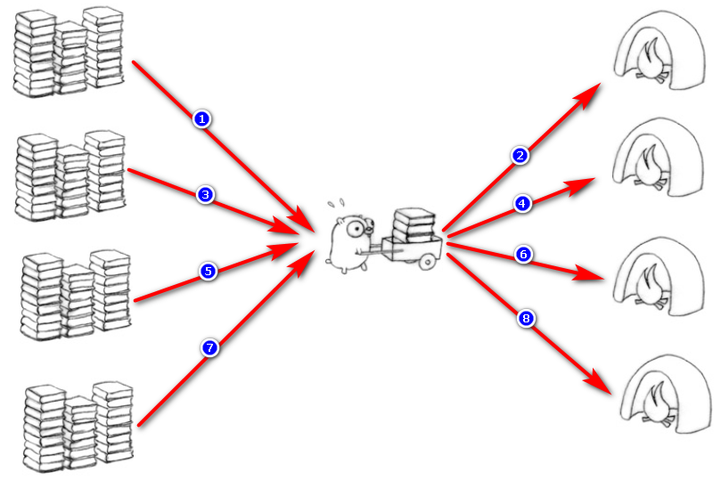
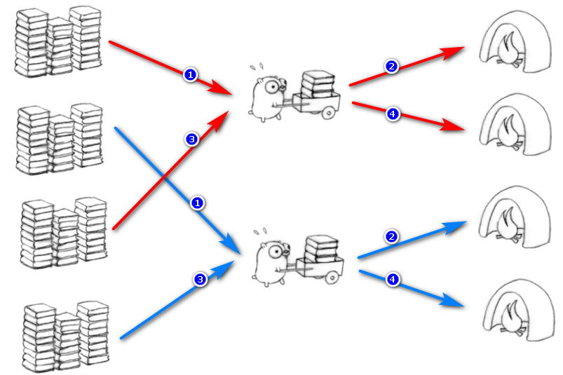
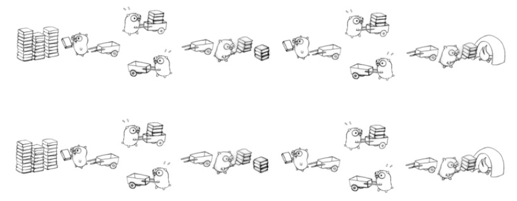

[[toc]]

# JUC-day01

## 课程内容

- 什么是JUC
- Lock接口
- Java8新特性lambda表达式
- 线程间通信


# 1 什么是JUC

## 1.1 JUC简介

在Java中，线程部分是一个重点，本篇文章说的JUC也是关于线程的。JUC就是java.util .concurrent工具包的简称。这是一个处理线程的工具包，JDK 1.5开始出现的。


## 1.2 进程与线程

**进程（Process）** 是计算机中的程序关于某数据集合上的一次运行活动，是系统进行资源分配和调度的基本单位，是操作系统结构的基础。 在当代面向线程设计的计算机结构中，进程是线程的容器。程序是指令、数据及其组织形式的描述，进程是程序的实体。是计算机中的程序关于某数据集合上的一次运行活动，是系统进行资源分配和调度的基本单位，是操作系统结构的基础。程序是指令、数据及其组织形式的描述，进程是程序的实体。


**线程（thread）** 是操作系统能够进行运算调度的最小单位。它被包含在进程之中，是进程中的实际运作单位。一条线程指的是进程中一个单一顺序的控制流，一个进程中可以并发多个线程，每条线程并行执行不同的任务。


**总结来说:** 

进程：指在系统中正在运行的一个应用程序；程序一旦运行就是进程；进程——资源分配的最小单位。

线程：系统分配处理器时间资源的基本单元，或者说进程之内独立执行的一个单元执行流。线程——程序执行的最小单位。


## 1.3 线程的状态

### 1.3.1 线程状态枚举类

**Thread.State**

```java
public enum State {
    /**
     * Thread state for a thread which has not yet started.
     */
    NEW,(新建)

    /**
     * Thread state for a runnable thread.  A thread in the runnable
     * state is executing in the Java virtual machine but it may
     * be waiting for other resources from the operating system
     * such as processor.
     */
    RUNNABLE,（准备就绪）

    /**
     * Thread state for a thread blocked waiting for a monitor lock.
     * A thread in the blocked state is waiting for a monitor lock
     * to enter a synchronized block/method or
     * reenter a synchronized block/method after calling
     * {@link Object#wait() Object.wait}.
     */
    BLOCKED,（阻塞）

    /**
     * Thread state for a waiting thread.
     * A thread is in the waiting state due to calling one of the
     * following methods:
     * <ul>
     *   <li>{@link Object#wait() Object.wait} with no timeout</li>
     *   <li>{@link #join() Thread.join} with no timeout</li>
     *   <li>{@link LockSupport#park() LockSupport.park}</li>
     * </ul>
     *
     * <p>A thread in the waiting state is waiting for another thread to
     * perform a particular action.
     *
     * For example, a thread that has called <tt>Object.wait()</tt>
     * on an object is waiting for another thread to call
     * <tt>Object.notify()</tt> or <tt>Object.notifyAll()</tt> on
     * that object. A thread that has called <tt>Thread.join()</tt>
     * is waiting for a specified thread to terminate.
     */
    WAITING,（不见不散）

    /**
     * Thread state for a waiting thread with a specified waiting time.
     * A thread is in the timed waiting state due to calling one of
     * the following methods with a specified positive waiting time:
     * <ul>
     *   <li>{@link #sleep Thread.sleep}</li>
     *   <li>{@link Object#wait(long) Object.wait} with timeout</li>
     *   <li>{@link #join(long) Thread.join} with timeout</li>
     *   <li>{@link LockSupport#parkNanos LockSupport.parkNanos}</li>
     *   <li>{@link LockSupport#parkUntil LockSupport.parkUntil}</li>
     * </ul>
     */
    TIMED_WAITING,（过时不候）

    /**
     * Thread state for a terminated thread.
     * The thread has completed execution.
     */
    TERMINATED;(终结)
}
```

### 1.3.2 wait/sleep的区别

1. sleep是Thread的静态方法，wait是Object的方法，任何对象实例都能调用。
2. sleep不会释放锁，它也不需要占用锁。wait会释放锁，但调用它的前提是当前线程占有锁(即代码要在synchronized中)。
3. 它们都可以被interrupted方法中断。


## 1.4 并发与并行


==任务是将左边的一堆柴全部搬到右边烧掉，每个任务包括三个过程：取柴，运柴，放柴烧火。==

### 1.4.1 串行模式

串行表示所有任务都一一按先后顺序进行。串行意味着必须先装完一车柴才能运送这车柴，只有运送到了，才能卸下这车柴，并且只有完成了这整个三个步骤，才能进行下一个步骤。

**串行是一次只能取得一个任务，并执行这个任务**。



### 1.4.2 并行模式

并行意味着可以同时取得多个任务，并同时去执行所取得的这些任务。并行模式相当于将长长的一条队列，划分成了多条短队列，所以并行缩短了任务队列的长度。==并行的效率从代码层次上强依赖于多进程/多线程代码，从硬件角度上则依赖于多核CPU。==

如下图，是多进程/多线程(2个工作者)的并行：



### 1.4.3 并发

**并发(concurrent)指的是多个程序可以同时运行的现象，更细化的是多进程可以同时运行或者多指令可以同时运行**。但这不是重点，在描述并发的时候也不会去扣这种字眼是否精确，==并发的重点在于它是一种现象==, ==并发描述的是多进程同时运行的现象==。但实际上，对于单核心CPU来说，同一时刻只能运行一个线程。所以，这里的"同时运行"表示的不是真的同一时刻有多个线程运行的现象，这是并行的概念，而是提供一种功能让用户看来多个程序同时运行起来了，但实际上这些程序中的进程不是一直霸占CPU的，而是执行一会停一会。

**要解决大并发问题，通常是将大任务分解成多个小任务**, 由于操作系统对进程的调度是随机的，所以切分成多个小任务后，可能会从任一小任务处执行。这可能会出现一些现象：

- 可能出现一个小任务执行了多次，还没开始下个任务的情况。这时一般会采用队列或类似的数据结构来存放各个小任务的成果
- 可能出现还没准备好第一步就执行第二步的可能。这时，一般采用多路复用或异步的方式，比如只有准备好产生了事件通知才执行某个任务。
- 可以多进程/多线程的方式并行执行这些小任务。也可以单进程/单线程执行这些小任务，这时很可能要配合多路复用才能达到较高的效率



上图中将一个任务中的三个步骤取柴、运柴、卸柴划分成了独立的小任务，有取柴的老鼠，有运柴的老鼠，有卸柴烧火的老鼠。

==**如果上图中所有的老鼠都是同一只，那么是串行并发的，如果是不同的多只老鼠，那么是并行并发的**。==

### 1.4.4 小结(重点)

**并行和串行：**

- 串行：一次只能取得一个任务并执行这一个任务
- 并行：可以同时通过多进程/多线程的方式取得多个任务，并以多进程或多线程的方式同时执行这些任务
- 注意点：
  - 如果是单进程/单线程的并行，那么效率比串行更差
  - 如果只有单核cpu，多进程并行并没有提高效率
  - 从任务队列上看，由于同时从队列中取得多个任务并执行，相当于将一个长任务队列变成了短队列

**并发：**

- 并发是一种现象：同时运行多个程序或多个任务需要被处理的现象

- 这些任务可能是并行执行的，也可能是串行执行的，和CPU核心数无关，是操作系统进程调度和CPU上下文切换达到的结果

- 解决大并发的一个思路是将大任务分解成多个小任务：

  - 可能要使用一些数据结构来避免切分成多个小任务带来的问题

  - 可以多进程/多线程并行的方式去执行这些小任务达到高效率

  - 或者以单进程/单线程配合多路复用执行这些小任务来达到高效率


# 2 Synchronized

## 2.1 Synchronized关键字回顾

synchronized是Java中的关键字，是一种同步锁。它修饰的对象有以下几种： 

   1. 修饰一个代码块，被修饰的代码块称为同步语句块，其作用的范围是大括号{}括起来的代码，作用的对象是调用这个代码块的对象

   2. 修饰一个方法，被修饰的方法称为同步方法，其作用的范围是整个方法，作用的对象是调用这个方法的对象

      ```
      虽然可以使用synchronized来定义方法，但synchronized并不属于方法定义的一部分，因此，synchronized关键字不能被继承。如果在父类中的某个方法使用了synchronized关键字，而在子类中覆盖了这个方法，在子类中的这个方法默认情况下并不是同步的，而必须显式地在子类的这个方法中加上synchronized关键字才可以。当然，还可以在子类方法中调用父类中相应的方法，这样虽然子类中的方法不是同步的，但子类调用了父类的同步方法，因此，子类的方法也就相当于同步了
      ```

   3. 修改一个静态的方法，其作用的范围是整个静态方法，作用的对象是这个类的所有对象

   4. 修改一个类，其作用的范围是synchronized后面括号括起来的部分，作用主的对象是这个类的所有对象

## 2.2 售票案例

```java
package com.atguigu.juc.demo;

public class SaleTicket{
        //一共有30张票
        private  int num = 30;

        /**
         * 售票方法
         */
        public synchronized void sale(){
            if(num > 0){
                num--;
                System.out.println(Thread.currentThread().getName() + "买到了一张票, 还剩下" + num + "张票");
            }
        }
    }
```

```java
package com.atguigu.juc.demo;

public class Test1 {

    /**
     * 测试方法
     * @param args
     */
    public static void main(String[] args) {
        //构建一个售票对象
        SaleTicket saleTicket = new SaleTicket();
        //启动两个线程去买票
        new Thread(() ->{
            for (int i = 0; i < 30; i++) {
                try {
                    Thread.sleep(1000);
                }catch (Exception e){
                    e.printStackTrace();
                }
                saleTicket.sale();
            }
        },"同学A").start();

        new Thread(() ->{
            for (int i = 0; i < 30; i++) {
                try {
                    Thread.sleep(1000);
                }catch (Exception e){
                    e.printStackTrace();
                }
                saleTicket.sale();
            }
        },"同学B").start();
    }

}
```

如果一个代码块被synchronized修饰了，当一个线程获取了对应的锁，并执行该代码块时，其他线程便只能一直等待，等待获取锁的线程释放锁，而这里获取锁的线程释放锁只会有两种情况：

　　1）获取锁的线程执行完了该代码块，然后线程释放对锁的占有；

　　2）线程执行发生异常，此时JVM会让线程自动释放锁。

　　那么如果这个获取锁的线程由于要等待IO或者其他原因（比如调用sleep方法）被阻塞了，但是又没有释放锁，其他线程便只能干巴巴地等待，试想一下，这多么影响程序执行效率。

==因此就需要有一种机制可以不让等待的线程一直无期限地等待下去（比如只等待一定的时间或者能够响应中断），通过Lock就可以办到。==

## 2.3 隐式可重入锁案例

```java
package com.atguigu.juc.demo;

public class SaleTicket{
        //一共有30张票
        private  int num = 30;
        //获取锁的次数
        private  int count = 0;
        /**
         * 售票方法
         */
        public synchronized void sale(){
            if(num > 0){
                num--;
                System.out.println(Thread.currentThread().getName() + "买到了一张票, 还剩下" + num + "张票");
                count++;
                System.out.println(Thread.currentThread().getName() + "获取到锁的次数为:" + count);
                sale();
            }

        }
    }
```

```java
package com.atguigu.juc.demo;

public class Test1 {

    /**
     * 测试方法
     * @param args
     */
    public static void main(String[] args) {
        //构建一个售票对象
        SaleTicket saleTicket = new SaleTicket();
        //启动两个线程去买票
        new Thread(() ->{
            saleTicket.sale();
        },"同学A").start();

        //启动两个线程去买票
        new Thread(() ->{
            saleTicket.sale();
        },"同学B").start();
    }

}
```

## 2.4 对象头


在JVM中，对象在内存中的布局分为三块区域：对象头、实例数据和对齐填充

**实例变量**：存放类的属性数据信息，包括父类的属性信息，如果是数组的实例部分还包括数组的长度，这部分内存按4字节对齐。

**填充数据**：由于虚拟机要求对象起始地址必须是8字节的整数倍。填充数据不是必须存在的，仅仅是为了字节对齐。

HotSpot虚拟机的对象头分为两部分信息，第一部分用于存储对象自身运行时数据，如哈希码、GC分代年龄等，这部分数据的长度在32位和64位的虚拟机中分别为32位和64位。官方称为Mark Word。另一部分用于存储指向对象类型数据的指针，如果是数组对象的话，还会有一个额外的部分存储数组长度。


由于对象头的信息是与对象自身定义的数据没有关系的额外存储成本，因此考虑到JVM的空间效率，Mark Word 被设计成为一个非固定的数据结构，以便存储更多有效的数据，它会根据对象本身的状态复用自己的存储空间。


## 2.5 synchronized优化

Synchronized是通过对象内部的一个叫做监视器锁（monitor）来实现的，监视器锁本质又是依赖于底层的操作系统的Mutex Lock（互斥锁）来实现的。而操作系统实现线程之间的切换需要从用户态转换到核心态，这个成本非常高，状态之间的转换需要相对比较长的时间，这就是为什么Synchronized效率低的原因。因此，这种依赖于操作系统Mutex Lock所实现的锁我们称之为“重量级锁”。

Java SE 1.6为了减少获得锁和释放锁带来的性能消耗，引入了“偏向锁”和“轻量级锁”：锁一共有4种状态，级别从低到高依次是：无锁状态、偏向锁状态、轻量级锁状态和重量级锁状态。锁可以升级但不能降级。

每一个锁都对应一个monitor对象，在HotSpot虚拟机中它是由ObjectMonitor实现的（C++实现）。每个对象都存在着一个monitor与之关联，对象与其monitor之间的关系有存在多种实现方式，如monitor可以与对象一起创建销毁或当线程试图获取对象锁时自动生成，但当一个monitor被某个线程持有后，它便处于锁定状态。

```
ObjectMonitor() {
    _header       = NULL;
    _count        = 0;  //锁计数器
    _waiters      = 0,
    _recursions   = 0;
    _object       = NULL;
    _owner        = NULL;
    _WaitSet      = NULL; //处于wait状态的线程，会被加入到_WaitSet
    _WaitSetLock  = 0 ;
    _Responsible  = NULL ;
    _succ         = NULL ;
    _cxq          = NULL ;
    FreeNext      = NULL ;
    _EntryList    = NULL ; //处于等待锁block状态的线程，会被加入到该列表
    _SpinFreq     = 0 ;
    _SpinClock    = 0 ;
    OwnerIsThread = 0 ;
  }
```

### 2.5.1 锁膨胀

上面讲到锁有四种状态，并且会因实际情况进行膨胀升级，其膨胀方向是：无锁——>偏向锁——>轻量级锁——>重量级锁，并且膨胀方向不可逆。

### 2.5.2 偏向锁

一句话总结它的作用：减少统一线程获取锁的代价。在大多数情况下，锁不存在多线程竞争，总是由同一线程多次获得，那么此时就是偏向锁。

核心思想：

如果一个线程获得了锁，那么锁就进入偏向模式，此时Mark Word的结构也就变为偏向锁结构，当该线程再次请求锁时，无需再做任何同步操作，即获取锁的过程只需要检查Mark Word的锁标记位为偏向锁以及当前线程ID等于Mark Word的ThreadID即可，这样就省去了大量有关锁申请的操作。

### 2.5.3 轻量级锁

轻量级锁是由偏向锁升级而来，当存在第二个线程申请同一个锁对象时，偏向锁就会立即升级为轻量级锁。注意这里的第二个线程只是申请锁，不存在两个线程同时竞争锁，可以是一前一后地交替执行同步块。

### 2.5.4 重量级锁

重量级锁是由轻量级锁升级而来，当同一时间有多个线程竞争锁时，锁就会被升级成重量级锁，此时其申请锁带来的开销也就变大。

重量级锁一般使用场景会在追求吞吐量，同步块或者同步方法执行时间较长的场景。

### 2.5.5 锁消除

消除锁是虚拟机另外一种锁的优化，这种优化更彻底，在JIT编译时，对运行上下文进行扫描，去除不可能存在竞争的锁。比如下面代码的method1和method2的执行效率是一样的，因为object锁是私有变量，不存在所得竞争关系。


### 2.5.6 锁粗化

锁粗化是虚拟机对另一种极端情况的优化处理，通过扩大锁的范围，避免反复加锁和释放锁。比如下面method3经过锁粗化优化之后就和method4执行效率一样了。


### 2.5.7 自旋锁与自适应自旋锁

轻量级锁失败后，虚拟机为了避免线程真实地在操作系统层面挂起，还会进行一项称为自旋锁的优化手段。

**自旋锁**：许多情况下，共享数据的锁定状态持续时间较短，切换线程不值得，通过让线程执行循环等待锁的释放，不让出CPU。如果得到锁，就顺利进入临界区。如果还不能获得锁，那就会将线程在操作系统层面挂起，这就是自旋锁的优化方式。但是它也存在缺点：如果锁被其他线程长时间占用，一直不释放CPU，会带来许多的性能开销。

**自适应自旋锁**：这种相当于是对上面自旋锁优化方式的进一步优化，它的自旋的次数不再固定，其自旋的次数由前一次在同一个锁上的自旋时间及锁的拥有者的状态来决定，这就解决了自旋锁带来的缺点。

# 2 Lock接口

## 2.2 什么是Lock

Lock锁实现提供了比使用同步方法和语句可以获得的更广泛的锁操作。它们允许更灵活的结构，可能具有非常不同的属性，并且可能支持多个关联的条件对象。Lock提供了比synchronized更多的功能。

Lock与的Synchronized区别

- Lock不是Java语言内置的，synchronized是Java语言的关键字，因此是内置特性。Lock是一个类，通过这个类可以实现同步访问；
- Lock和synchronized有一点非常大的不同，采用synchronized不需要用户去手动释放锁，当synchronized方法或者synchronized代码块执行完之后，系统会自动让线程释放对锁的占用；而Lock则必须要用户去手动释放锁，如果没有主动释放锁，就有可能导致出现死锁现象。

### 2.2.1 Lock接口

```java
public interface Lock {
    void lock();
    void lockInterruptibly() throws InterruptedException;
    boolean tryLock();
    boolean tryLock(long time, TimeUnit unit) throws InterruptedException;
    void unlock();
    Condition newCondition();
}
```

下面来逐个讲述Lock接口中每个方法的使用

### 2.2.2 lock

lock()方法是平常使用得最多的一个方法，就是用来获取锁。如果锁已被其他线程获取，则进行等待。

采用Lock，必须主动去释放锁，并且在发生异常时，不会自动释放锁。因此一般来说，使用Lock必须在try{}catch{}块中进行，并且将释放锁的操作放在finally块中进行，以保证锁一定被被释放，防止死锁的发生。通常使用Lock来进行同步的话，是以下面这种形式去使用的：

```java
Lock lock = ...;
lock.lock();
try{
    //处理任务
}catch(Exception ex){
     
}finally{
    lock.unlock();   //释放锁
}
```

### 2.2.2 lockInterruptibly

lockInterruptibly()方法比较特殊，当通过这个方法去获取锁时，如果线程正在等待获取锁，则这个线程能够响应中断，即中断线程的等待状态。也就使说，当两个线程同时通过lock.lockInterruptibly()想获取某个锁时，假若此时线程A获取到了锁，而线程B只有在等待，那么对线程B调用threadB.interrupt()方法能够中断线程B的等待过程。

由于lockInterruptibly()的声明中抛出了异常，所以lock.lockInterruptibly()必须放在try块中或者在调用lockInterruptibly()的方法外声明抛出InterruptedException。

因此lockInterruptibly()一般的使用形式如下：

```java
public void method() throws InterruptedException {
    lock.lockInterruptibly();
    try {  
     //.....
    }
    finally {
        lock.unlock();
    }  
}
```

==**注意，当一个线程获取了锁之后，是不会被interrupt()方法中断的。因为本身在前面的文章中讲过单独调用interrupt()方法不能中断正在运行过程中的线程，只能中断阻塞过程中的线程。**==

因此当通过lockInterruptibly()方法获取某个锁时，如果不能获取到，只有进行等待的情况下，是可以响应中断的。

==**而用synchronized修饰的话，当一个线程处于等待某个锁的状态，是无法被中断的，只有一直等待下去。**==

### 2.2.2 tryLock

tryLock()方法是有返回值的，它表示用来尝试获取锁，如果获取成功，则返回true，如果获取失败（即锁已被其他线程获取），则返回false，也就说这个方法无论如何都会立即返回。在拿不到锁时不会一直在那等待。

tryLock(long time, TimeUnit unit)方法和tryLock()方法是类似的，只不过区别在于这个方法在拿不到锁时会等待一定的时间，在时间期限之内如果还拿不到锁，就返回false。如果如果一开始拿到锁或者在等待期间内拿到了锁，则返回true。

所以，一般情况下通过tryLock来获取锁时是这样使用的：

```java
Lock lock = ...;
if(lock.tryLock()) {
     try{
         //处理任务
     }catch(Exception ex){
         
     }finally{
         lock.unlock();   //释放锁
     } 
}else {
    //如果不能获取锁，则直接做其他事情
}
```

### 2.2.2 newCondition

关键字synchronized与wait()/notify()这两个方法一起使用可以实现等待/通知模式， Lock锁的newContition()方法返回Condition对象，Condition类也可以实现等待/通知模式。

用notify()通知时，JVM会随机唤醒某个等待的线程， 使用Condition类可以进行选择性通知， Condition比较常用的两个方法：

- await()会使当前线程等待,同时会释放锁,当其他线程调用signal()时,线程会重新获得锁并继续执行。

- signal()用于唤醒一个等待的线程。

==注意：在调用Condition的await()/signal()方法前，也需要线程持有相关的Lock锁，调用await()后线程会释放这个锁，在singal()调用后会从当前Condition对象的等待队列中，唤醒 一个线程，唤醒的线程尝试获得锁， 一旦获得锁成功就继续执行。==

## 2.3 ReentrantLock

ReentrantLock，意思是可重入锁

ReentrantLock是唯一实现了Lock接口的类，并且ReentrantLock提供了更多的方法。下面通过一些实例看具体看一下如何使用。

```java
public class Test {
    private ArrayList<Integer> arrayList = new ArrayList<Integer>();
    public static void main(String[] args)  {
        final Test test = new Test();
         
        new Thread(){
            public void run() {
                test.insert(Thread.currentThread());
            };
        }.start();
         
        new Thread(){
            public void run() {
                test.insert(Thread.currentThread());
            };
        }.start();
    }  
     
    public void insert(Thread thread) {
        Lock lock = new ReentrantLock();    //注意这个地方
        lock.lock();
        try {
            System.out.println(thread.getName()+"得到了锁");
            for(int i=0;i<5;i++) {
                arrayList.add(i);
            }
        } catch (Exception e) {
            // TODO: handle exception
        }finally {
            System.out.println(thread.getName()+"释放了锁");
            lock.unlock();
        }
    }
}
```

==**问题:第二个线程怎么会在第一个线程释放锁之前得到了锁？**==

**原因: 在insert方法中的lock变量是局部变量，每个线程执行该方法时都会保存一个副本，那么理所当然每个线程执行到lock.lock()处获取的是不同的锁，所以就不会发生冲突。**

解决方案:

**方案一: lock实现**

```java
public class Test {
    private ArrayList<Integer> arrayList = new ArrayList<Integer>();
    private Lock lock = new ReentrantLock();    //注意这个地方
    public static void main(String[] args)  {
        final Test test = new Test();
         
        new Thread(){
            public void run() {
                test.insert(Thread.currentThread());
            };
        }.start();
         
        new Thread(){
            public void run() {
                test.insert(Thread.currentThread());
            };
        }.start();
    }  
     
    public void insert(Thread thread) {
        lock.lock();
        try {
            System.out.println(thread.getName()+"得到了锁");
            for(int i=0;i<5;i++) {
                arrayList.add(i);
            }
        } catch (Exception e) {
            // TODO: handle exception
        }finally {
            System.out.println(thread.getName()+"释放了锁");
            lock.unlock();
        }
    }
}
```

**方案二: tryLock实现**

```java
public class Test {
    private ArrayList<Integer> arrayList = new ArrayList<Integer>();
    private Lock lock = new ReentrantLock();    //注意这个地方
    public static void main(String[] args)  {
        final Test test = new Test();
         
        new Thread(){
            public void run() {
                test.insert(Thread.currentThread());
            };
        }.start();
         
        new Thread(){
            public void run() {
                test.insert(Thread.currentThread());
            };
        }.start();
    }  
     
    public void insert(Thread thread) {
        if(lock.tryLock()) {
            try {
                System.out.println(thread.getName()+"得到了锁");
                for(int i=0;i<5;i++) {
                    arrayList.add(i);
                }
            } catch (Exception e) {
                // TODO: handle exception
            }finally {
                System.out.println(thread.getName()+"释放了锁");
                lock.unlock();
            }
        } else {
            System.out.println(thread.getName()+"获取锁失败");
        }
    }
}
```

**方案三: lockInterruptibly实现**

```java
public class Test {
    private Lock lock = new ReentrantLock();   
    public static void main(String[] args)  {
        Test test = new Test();
        MyThread thread1 = new MyThread(test);
        MyThread thread2 = new MyThread(test);
        thread1.start();
        thread2.start();
         
        try {
            Thread.sleep(2000);
        } catch (InterruptedException e) {
            e.printStackTrace();
        }
        thread2.interrupt();
    }  
     
    public void insert(Thread thread) throws InterruptedException{
        lock.lockInterruptibly();   //注意，如果需要正确中断等待锁的线程，必须将获取锁放在外面，然后将InterruptedException抛出
        try {  
            System.out.println(thread.getName()+"得到了锁");
            long startTime = System.currentTimeMillis();
            for(    ;     ;) {
                if(System.currentTimeMillis() - startTime >= Integer.MAX_VALUE)
                    break;
                //插入数据
            }
        }
        finally {
            System.out.println(Thread.currentThread().getName()+"执行finally");
            lock.unlock();
            System.out.println(thread.getName()+"释放了锁");
        }  
    }
}
 
class MyThread extends Thread {
    private Test test = null;
    public MyThread(Test test) {
        this.test = test;
    }
    @Override
    public void run() {
         
        try {
            test.insert(Thread.currentThread());
        } catch (InterruptedException e) {
            System.out.println(Thread.currentThread().getName()+"被中断");
        }
    }
}
```

## 2.4 **ReadWriteLock**

ReadWriteLock也是一个接口，在它里面只定义了两个方法：

```java
public interface ReadWriteLock {
    /**
     * Returns the lock used for reading.
     *
     * @return the lock used for reading.
     */
    Lock readLock();
 
    /**
     * Returns the lock used for writing.
     *
     * @return the lock used for writing.
     */
    Lock writeLock();
}
```

一个用来获取读锁，一个用来获取写锁。也就是说将文件的读写操作分开，分成2个锁来分配给线程，从而使得多个线程可以同时进行读操作。下面的**ReentrantReadWriteLock**实现了ReadWriteLock接口。

ReentrantReadWriteLock里面提供了很多丰富的方法，不过最主要的有两个方法：readLock()和writeLock()用来获取读锁和写锁。

下面通过几个例子来看一下ReentrantReadWriteLock具体用法。

假如有多个线程要同时进行读操作的话，先看一下synchronized达到的效果：

```java
public class Test {
    private ReentrantReadWriteLock rwl = new ReentrantReadWriteLock();
     
    public static void main(String[] args)  {
        final Test test = new Test();
         
        new Thread(){
            public void run() {
                test.get(Thread.currentThread());
            };
        }.start();
         
        new Thread(){
            public void run() {
                test.get(Thread.currentThread());
            };
        }.start();
         
    }  
     
    public synchronized void get(Thread thread) {
        long start = System.currentTimeMillis();
        while(System.currentTimeMillis() - start <= 1) {
            System.out.println(thread.getName()+"正在进行读操作");
        }
        System.out.println(thread.getName()+"读操作完毕");
    }
}
```

而改成用读写锁的话：

```java
public class Test {
    private ReentrantReadWriteLock rwl = new ReentrantReadWriteLock();
     
    public static void main(String[] args)  {
        final Test test = new Test();
         
        new Thread(){
            public void run() {
                test.get(Thread.currentThread());
            };
        }.start();
         
        new Thread(){
            public void run() {
                test.get(Thread.currentThread());
            };
        }.start();
         
    }  
     
    public void get(Thread thread) {
        rwl.readLock().lock();
        try {
            long start = System.currentTimeMillis();
             
            while(System.currentTimeMillis() - start <= 1) {
                System.out.println(thread.getName()+"正在进行读操作");
            }
            System.out.println(thread.getName()+"读操作完毕");
        } finally {
            rwl.readLock().unlock();
        }
    }
}
```

说明thread1和thread2在同时进行读操作。这样就大大提升了读操作的效率。

==**注意:**==

- 如果有一个线程已经占用了读锁，则此时其他线程如果要申请写锁，则申请写锁的线程会一直等待释放读锁。

- 如果有一个线程已经占用了写锁，则此时其他线程如果申请写锁或者读锁，则申请的线程会一直等待释放写锁。

## 2.5 小结(重点)

Lock和synchronized有以下几点不同：

1. Lock是一个接口，而synchronized是Java中的关键字，synchronized是内置的语言实现；
2. synchronized在发生异常时，会自动释放线程占有的锁，因此不会导致死锁现象发生；而Lock在发生异常时，如果没有主动通过unLock()去释放锁，则很可能造成死锁现象，因此使用Lock时需要在finally块中释放锁；
3. Lock可以让等待锁的线程响应中断，而synchronized却不行，使用synchronized时，等待的线程会一直等待下去，不能够响应中断；
4. 通过Lock可以知道有没有成功获取锁，而synchronized却无法办到。
5. Lock可以提高多个线程进行读操作的效率。

在性能上来说，如果竞争资源不激烈，两者的性能是差不多的，而当竞争资源非常激烈时（即有大量线程同时竞争），此时Lock的性能要远远优于synchronized。

# 3 lambda

## 3.1 lambda简介

Lambda 表达式（lambda expression）是一个[匿名函数](https://baike.baidu.com/item/匿名函数/4337265)，Lambda表达式基于数学中的[λ演算](https://baike.baidu.com/item/λ演算)得名，直接对应于其中的lambda抽象（lambda abstraction），是一个匿名函数，即没有函数名的函数。Lambda表达式可以表示[闭包](https://baike.baidu.com/item/闭包/10908873)（注意和数学传统意义上的不同）。

Java 8的一个大亮点是引入Lambda表达式，使用它设计的代码会更加简洁。当开发者在编写Lambda表达式时，也会随之被编译成一个函数式接口。

不采用Lambda的老方法：

```java
Runnable runnable1=new Runnable(){
    @Override
    public void run(){
        System.out.println("Running without Lambda");
    }
};
```

使用Lambda：

```java
Runnable runnable2=()->System.out.println("Running from Lambda");
```

## 3.2 函数式接口

函数式接口（functional interface 也叫功能性接口，其实是同一个东西）。简单来说，函数式接口是只包含一个方法的接口。比如Java标准库中的java.lang.Runnable和 java.util.Comparator都是典型的函数式接口。

java 8提供 @FunctionalInterface作为注解,这个注解是非必须的，只要接口符合函数式接口的标准（即只包含一个方法的接口），虚拟机会自动判断，但最好在接口上使用注解@FunctionalInterface进行声明，以免团队的其他人员错误地往接口中添加新的方法。

Java中的lambda无法单独出现，它需要一个函数式接口来盛放，lambda表达式方法体其实就是函数接口的实现.

```java
@FunctionalInterface //添加此注解后，接口中只能有一个抽象方法。
public interface A {
	void call();
}
```

## 3.3 lambda入门案列

```java
public class Java8Tester {
   public static void main(String args[]){
      Java8Tester tester = new Java8Tester();
        
      // 类型声明
      MathOperation addition = (int a, int b) -> a + b;
        
      // 不用类型声明
      MathOperation subtraction = (a, b) -> a - b;
        
      // 大括号中的返回语句
      MathOperation multiplication = (int a, int b) -> { return a * b; };
        
      // 没有大括号及返回语句
      MathOperation division = (int a, int b) -> a / b;
        
      System.out.println("10 + 5 = " + tester.operate(10, 5, addition));
      System.out.println("10 - 5 = " + tester.operate(10, 5, subtraction));
      System.out.println("10 x 5 = " + tester.operate(10, 5, multiplication));
      System.out.println("10 / 5 = " + tester.operate(10, 5, division));
        
      // 不用括号
      GreetingService greetService1 = message ->
      System.out.println("Hello " + message);
        
      // 用括号
      GreetingService greetService2 = (message) ->
      System.out.println("Hello " + message);
        
      greetService1.sayMessage("Runoob");
      greetService2.sayMessage("Google");
   }
    
   interface MathOperation {
      int operation(int a, int b);
   }
    
   interface GreetingService {
      void sayMessage(String message);
   }
    
   private int operate(int a, int b, MathOperation mathOperation){
      return mathOperation.operation(a, b);
   }
}
```

使用 Lambda 表达式需要注意以下两点：

- Lambda 表达式主要用来定义行内执行的方法类型接口，例如，一个简单方法接口。在上面例子中，我们使用各种类型的Lambda表达式来定义MathOperation接口的方法。然后我们定义了sayMessage的执行。
- Lambda 表达式免去了使用匿名方法的麻烦，并且给予Java简单但是强大的函数化的编程能力。

## 3.4 拓展&总结(面试点)

==**java8中接口和抽象类的区别**==

**==相同点：==**

1. 都是抽象类型
2. 都可以有实现方法（以前接口不行）
3. 都可以不需要实现类或者继承者去实现所有方法（以前不行，现在接口中默认方法不需要实现者实现）

**==不同点==**

1. 抽象类不可以多重继承，接口可以（无论是多重类型继承还是多重行为继承）
2. 抽象类和接口所反映出的设计理念不同。其实抽象类表示的是"a-is-a"关系，接口表示的是"a-like-a"关系
3. 接口中定义的变量默认是public static final 型，且必须给其初值，所以实现类中不能重新定义，也不能改变其值；抽象类中的变量默认是 default 型，其值可以在子类中重新定义，也可以重新赋值

**总结：默认方法给予我们修改接口而不破坏原来的实现类的结构提供了便利，目前java 8的集合框架已经大量使用了默认方法来改进了**

# 4 线程间通信

线程间通信的模型有两种：共享内存和消息传递，以下方式都是基本这两种模型来实现的。我们来基本一道面试常见的题目来分析

**==场景---两个线程，一个线程对当前数值加1，另一个线程对当前数值减1,要求用线程间通信==**

## 4.1 volatile方案

基于volatile关键字来实现线程间相互通信是使用共享内存的思想，大致意思就是多个线程同时监听一个变量，当这个变量发生变化的时候 ，线程能够感知并执行相应的业务。这也是最简单的一种实现方式

```java
package com.atguigu.test;

/**
 * volatile关键字实现线程交替加减
 */
public class TestVolatile {
    /**
     * 交替加减
     * @param args
     */
    public static void main(String[] args){
        DemoClass demoClass = new DemoClass();
        new Thread(() ->{
            for (int i = 0; i < 5; i++) {
                demoClass.increment();
            }
        }, "线程一").start();

        new Thread(() ->{
                demoClass.decrement();
        }, "线程二").start();
    }
}

```

```java
package com.atguigu.test;

class DemoClass{
    //加减对象
    private int number = 0;

    //loop观察对象
    private int loop = 0;

    //两个线程共同监控的对象
    private static volatile boolean flag = false;

    /**
     * 加1
     */
    public void increment() {
        try {
            while (true){
                if (!flag){
                    number++;
                    System.out.println("当前进行第" + loop + "次-----------------");
                    System.out.println(Thread.currentThread().getName() + "加成功,结果为:" + number);
                    flag = true;
                    Thread.sleep(2000);
                }
                break;
            }
        }catch (Exception e){
            e.printStackTrace();
        }
    }

    /**
     * 减一
     */
    public void decrement(){
        try {
            while (true){
                if(flag){
                    System.out.println("当前进行第" + loop + "减-----------------");
                    number--;
                    loop++;
                    System.out.println(Thread.currentThread().getName() + "减成功,结果为:" + number);

                    flag = false;
                }
                if(loop == 5){
                    break;
                }
            }
        }catch (Exception e){
            e.printStackTrace();
        }
    }
}
```

## 4.2 synchronized方案

```java
package com.atguigu.test;

/**
 * volatile关键字实现线程交替加减
 */
public class TestVolatile {
    /**
     * 交替加减
     * @param args
     */
    public static void main(String[] args){
        DemoClass demoClass = new DemoClass();
        new Thread(() ->{
            for (int i = 0; i < 5; i++) {
                demoClass.increment();
            }
        }, "线程A").start();

        new Thread(() ->{
            for (int i = 0; i < 5; i++) {
                demoClass.decrement();
            }
        }, "线程B").start();
    }
}
```


```java
package com.atguigu.test;

class DemoClass{
    //加减对象
    private int number = 0;

    /**
     * 加1
     */
    public synchronized void increment() {
        try {
            while (number != 0){
                this.wait();
            }
            number++;
            System.out.println("--------" + Thread.currentThread().getName() + "加一成功----------,值为:" + number);
            notifyAll();
        }catch (Exception e){
            e.printStackTrace();
        }
    }

    /**
     * 减一
     */
    public synchronized void decrement(){
        try {
            while (number == 0){
                this.wait();
            }
            number--;
            System.out.println("--------" + Thread.currentThread().getName() + "减一成功----------,值为:" + number);
            notifyAll();
        }catch (Exception e){
            e.printStackTrace();
        }
    }
}
```

## 4.3 Lock方案

```java
package com.atguigu.test;

import java.util.concurrent.locks.Condition;
import java.util.concurrent.locks.Lock;
import java.util.concurrent.locks.ReentrantLock;

class DemoClass{
    //加减对象
    private int number = 0;

    //声明锁
    private Lock lock = new ReentrantLock();

    //声明钥匙
    private Condition condition = lock.newCondition();

    /**
     * 加1
     */
    public void increment() {
        try {
            lock.lock();
            while (number != 0){
                condition.await();
            }
            number++;
            System.out.println("--------" + Thread.currentThread().getName() + "加一成功----------,值为:" + number);
            condition.signalAll();
        }catch (Exception e){
            e.printStackTrace();
        }finally {
            lock.unlock();
        }
    }

    /**
     * 减一
     */
    public void decrement(){
        try {
            lock.lock();
            while (number == 0){
                condition.await();
            }
            number--;
            System.out.println("--------" + Thread.currentThread().getName() + "减一成功----------,值为:" + number);
            condition.signalAll();
        }catch (Exception e){
            e.printStackTrace();
        }finally {
            lock.unlock();
        }
    }
}
```

## 4.4 线程间定制化通信

### 4.4.1 案例介绍

==**问题: A线程打印5次A，B线程打印10次B，C线程打印15次C,按照此顺序循环10轮**==

### 4.4.2 实现流程

```java
package com.atguigu.test;

import java.util.concurrent.locks.Condition;
import java.util.concurrent.locks.Lock;
import java.util.concurrent.locks.ReentrantLock;

class DemoClass{
    //通信对象:0--打印A  1---打印B  2----打印C
    private int number = 0;
    //声明锁
    private Lock lock = new ReentrantLock();
    //声明钥匙A
    private Condition conditionA = lock.newCondition();
    //声明钥匙B
    private Condition conditionB = lock.newCondition();
    //声明钥匙C
    private Condition conditionC = lock.newCondition();

    /**
     * A打印5次
     */
    public void printA(int j){
        try {
            lock.lock();
            while (number != 0){
                conditionA.await();
            }
            System.out.println(Thread.currentThread().getName() + "输出A,第" + j + "轮开始");
            //输出5次A
            for (int i = 0; i < 5; i++) {
                System.out.println("A");
            }
            //开始打印B
            number = 1;
            //唤醒B
            conditionB.signal();
        }catch (Exception e){
            e.printStackTrace();
        }finally {
            lock.unlock();
        }
    }

    /**
     * B打印10次
     */
    public void printB(int j){
        try {
            lock.lock();
            while (number != 1){
                conditionB.await();
            }
            System.out.println(Thread.currentThread().getName() + "输出B,第" + j + "轮开始");
            //输出10次B
            for (int i = 0; i < 10; i++) {
                System.out.println("B");
            }
            //开始打印C
            number = 2;
            //唤醒C
            conditionC.signal();
        }catch (Exception e){
            e.printStackTrace();
        }finally {
            lock.unlock();
        }
    }

    /**
     * C打印15次
     */
    public void printC(int j){
        try {
            lock.lock();
            while (number != 2){
                conditionC.await();
            }
            System.out.println(Thread.currentThread().getName() + "输出C,第" + j + "轮开始");
            //输出15次C
            for (int i = 0; i < 15; i++) {
                System.out.println("C");
            }
            System.out.println("-----------------------------------------");
            //开始打印A
            number = 0;
            //唤醒A
            conditionA.signal();
        }catch (Exception e){
            e.printStackTrace();
        }finally {
            lock.unlock();
        }
    }
}
```

测试类

```java
package com.atguigu.test;

/**
 * volatile关键字实现线程交替加减
 */
public class TestVolatile {
    /**
     * 交替加减
     * @param args
     */
    public static void main(String[] args){

        DemoClass demoClass = new DemoClass();

        new Thread(() ->{
            for (int i = 1; i <= 10; i++) {
                demoClass.printA(i);
            }
        }, "A线程").start();

        new Thread(() ->{
            for (int i = 1; i <= 10; i++) {
                demoClass.printB(i);
            }
        }, "B线程").start();

        new Thread(() ->{
            for (int i = 1; i <= 10; i++) {
                demoClass.printC(i);
            }
        }, "C线程").start();
    }
}

```


