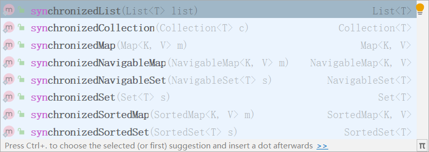
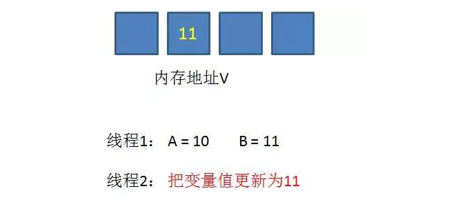
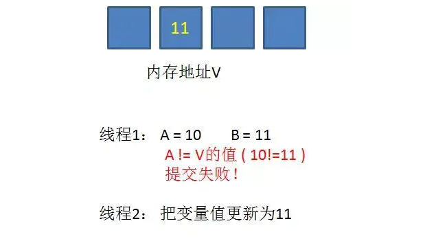
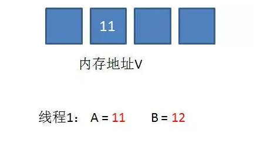
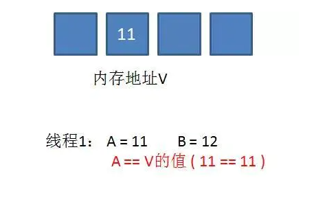
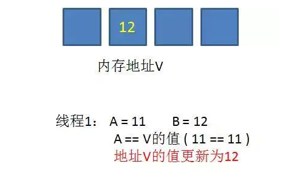

[[toc]]

# JUC-day02

## 课程内容

- **集合的线程安全**
- **Callable与Future接口**
- **JUC三大辅助类**: CountDownLatch CyclicBarrier Semaphore
- **读写锁: ReentrantReadWriteLock**


# 1 集合的线程安全

## 1.1 集合操作Demo

NotSafeDemo

```java
package com.atguigu.test;

import java.util.ArrayList;
import java.util.List;
import java.util.UUID;

/**
 * 集合线程安全案例
 */
public class NotSafeDemo {

    /**
     * 多个线程同时对集合进行修改
     * @param args
     */
    public static void main(String[] args) {
        List list = new ArrayList();

        for (int i = 0; i < 100; i++) {
            new Thread(() ->{
                    list.add(UUID.randomUUID().toString());
                System.out.println(list);
            }, "线程" + i).start();
        }
    }
}
```

异常内容

java.util.ConcurrentModificationException

**问题: 为什么会出现并发修改异常?**

查看ArrayList的add方法源码

```java
/**
 * Appends the specified element to the end of this list.
 *
 * @param e element to be appended to this list
 * @return <tt>true</tt> (as specified by {@link Collection#add})
 */
public boolean add(E e) {
    ensureCapacityInternal(size + 1);  // Increments modCount!!
    elementData[size++] = e;
    return true;
}
```

==**那么我们如何去解决List类型的线程安全问题?**==

## 1.2 Vector

Vector 是**矢量队列**，它是JDK1.0版本添加的类。继承于AbstractList，实现了List, RandomAccess, Cloneable这些接口。
Vector 继承了AbstractList，实现了List；所以，**它是一个队列，支持相关的添加、删除、修改、遍历等功能**。
Vector 实现了RandmoAccess接口，即**提供了随机访问功能**。RandmoAccess是java中用来被List实现，为List提供快速访问功能的。在Vector中，我们即可以通过元素的序号快速获取元素对象；这就是快速随机访问。
Vector 实现了Cloneable接口，即实现clone()函数。它能被克隆。

**==和ArrayList不同，Vector中的操作是线程安全的。==**

NotSafeDemo代码修改

```java
package com.atguigu.test;

import java.util.ArrayList;
import java.util.List;
import java.util.UUID;
import java.util.Vector;

/**
 * 集合线程安全案例
 */
public class NotSafeDemo {

    /**
     * 多个线程同时对集合进行修改
     * @param args
     */
    public static void main(String[] args) {
        List list = new Vector();

        for (int i = 0; i < 100; i++) {
            new Thread(() ->{
                    list.add(UUID.randomUUID().toString());
                System.out.println(list);
            }, "线程" + i).start();
        }
    }
}
```

**现在没有运行出现并发异常,为什么?**

查看Vector的add方法

```java
/**
 * Appends the specified element to the end of this Vector.
 *
 * @param e element to be appended to this Vector
 * @return {@code true} (as specified by {@link Collection#add})
 * @since 1.2
 */
public synchronized boolean add(E e) {
    modCount++;
    ensureCapacityHelper(elementCount + 1);
    elementData[elementCount++] = e;
    return true;
}
```

**add方法被synchronized同步修辞,线程安全!因此没有并发异常**

## 1.3 Collections

Collections提供了方法synchronizedList保证list是同步线程安全的

NotSafeDemo代码修改

```java
package com.atguigu.test;

import java.util.*;

/**
 * 集合线程安全案例
 */
public class NotSafeDemo {

    /**
     * 多个线程同时对集合进行修改
     * @param args
     */
    public static void main(String[] args) {
        List list = Collections.synchronizedList(new ArrayList<>());
        for (int i = 0; i < 100; i++) {
            new Thread(() ->{
                    list.add(UUID.randomUUID().toString());
                System.out.println(list);
            }, "线程" + i).start();
        }
    }
}
```

没有并发修改异常

查看方法源码

```java
/**
 * Returns a synchronized (thread-safe) list backed by the specified
 * list.  In order to guarantee serial access, it is critical that
 * <strong>all</strong> access to the backing list is accomplished
 * through the returned list.<p>
 *
 * It is imperative that the user manually synchronize on the returned
 * list when iterating over it:
 * <pre>
 *  List list = Collections.synchronizedList(new ArrayList());
 *      ...
 *  synchronized (list) {
 *      Iterator i = list.iterator(); // Must be in synchronized block
 *      while (i.hasNext())
 *          foo(i.next());
 *  }
 * </pre>
 * Failure to follow this advice may result in non-deterministic behavior.
 *
 * <p>The returned list will be serializable if the specified list is
 * serializable.
 *
 * @param  <T> the class of the objects in the list
 * @param  list the list to be "wrapped" in a synchronized list.
 * @return a synchronized view of the specified list.
 */
public static <T> List<T> synchronizedList(List<T> list) {
    return (list instanceof RandomAccess ?
            new SynchronizedRandomAccessList<>(list) :
            new SynchronizedList<>(list));
}
```

## 1.4 CopyOnWriteArrayList(重点)

首先我们对CopyOnWriteArrayList进行学习,其特点如下:

它相当于线程安全的ArrayList。和ArrayList一样，它是个可变数组；但是和ArrayList不同的时，它具有以下特性：

1. 它最适合于具有以下特征的应用程序：List 大小通常保持很小，只读操作远多于可变操作，需要在遍历期间防止线程间的冲突。
2. 它是线程安全的。
3. 因为通常需要复制整个基础数组，所以可变操作（add()、set() 和 remove() 等等）的开销很大。
4. 迭代器支持hasNext(), next()等不可变操作，但不支持可变 remove()等操作。
5. 使用迭代器进行遍历的速度很快，并且不会与其他线程发生冲突。在构造迭代器时，迭代器依赖于不变的数组快照。

**1. 独占锁效率低：采用读写分离思想解决**

**2. 写线程获取到锁，其他写线程阻塞**

**3. 复制思想：**

当我们往一个容器添加元素的时候，不直接往当前容器添加，而是先将当前容器进行 Copy，复制出一个新的容器，然后新的容器里添加元素，添加完元素之后，再将原容器的引用指向新的容器。

**这时候会抛出来一个新的问题，也就是数据不一致的问题。如果写线程还没来得及写会内存，其他的线程就会读到了脏数据。**

==**这就是CopyOnWriteArrayList 的思想和原理。就是拷贝一份。**==

NotSafeDemo代码修改

```java
package com.atguigu.test;

import java.util.*;
import java.util.concurrent.CopyOnWriteArrayList;

/**
 * 集合线程安全案例
 */
public class NotSafeDemo {

    /**
     * 多个线程同时对集合进行修改
     * @param args
     */
    public static void main(String[] args) {
        List list = new CopyOnWriteArrayList();
        for (int i = 0; i < 100; i++) {
            new Thread(() ->{
                    list.add(UUID.randomUUID().toString());
                System.out.println(list);
            }, "线程" + i).start();
        }
    }
}
```

没有线程安全问题

**原因分析**(**重点**):==**动态数组与线程安全**==

下面从“动态数组”和“线程安全”两个方面进一步对CopyOnWriteArrayList的原理进行说明。

- **“动态数组”机制**
  - 它内部有个“volatile数组”(array)来保持数据。在“添加/修改/删除”数据时，都会新建一个数组，并将更新后的数据拷贝到新建的数组中，最后再将该数组赋值给“volatile数组”, 这就是它叫做CopyOnWriteArrayList的原因
  - **由于它在“添加/修改/删除”数据时，都会新建数组，所以涉及到修改数据的操作，CopyOnWriteArrayList效率很低；但是单单只是进行遍历查找的话，效率比较高。**

- **“线程安全”机制**
  - 通过volatile和互斥锁来实现的。
  - 通过“volatile数组”来保存数据的。一个线程读取volatile数组时，总能看到其它线程对该volatile变量最后的写入；就这样，通过volatile提供了“读取到的数据总是最新的”这个机制的保证。
  - 通过互斥锁来保护数据。在“添加/修改/删除”数据时，会先“获取互斥锁”，再修改完毕之后，先将数据更新到“volatile数组”中，然后再“释放互斥锁”，就达到了保护数据的目的。

## 1.5 小结(重点)

**1.线程安全与线程不安全集合**

集合类型中存在线程安全与线程不安全的两种,常见例如:

ArrayList ----- Vector

HashMap -----HashTable

但是以上都是通过synchronized关键字实现,效率较低

**2.Collections构建的线程安全集合**



**3.java.util.concurrent并发包下**

CopyOnWriteArrayList CopyOnWriteArraySet类型,通过动态数组与线程安全个方面保证线程安全 


# 2 Callable&Future接口

## 2.1 Callable接口

目前我们学习了有两种创建线程的方法-一种是通过创建Thread类，另一种是通过使用Runnable创建线程。但是，Runnable缺少的一项功能是，当线程终止时（即run（）完成时），我们无法使线程返回结果。为了支持此功能，Java中提供了Callable接口。

==**现在我们学习的是创建线程的第三种方案---Callable接口**==

**Callable接口的特点如下(重点)**

- 为了实现Runnable，需要实现不返回任何内容的run（）方法，而对于Callable，需要实现在完成时返回结果的call（）方法。
- call（）方法可以引发异常，而run（）则不能。
- 为实现Callable而必须重写call方法
- 不能直接替换runnable,因为Thread类的构造方法根本没有Callable

```java
创建新类MyThread实现runnable接口
class MyThread implements Runnable{
 @Override
 public void run() {
 
 }
}
新类MyThread2实现callable接口
class MyThread2 implements Callable<Integer>{
 @Override
 public Integer call() throws Exception {
  return 200;
 } 
}
```

## 2.2 Future接口

当call（）方法完成时，结果必须存储在主线程已知的对象中，以便主线程可以知道该线程返回的结果。为此，可以使用Future对象。

将Future视为保存结果的对象–它可能暂时不保存结果，但将来会保存（一旦Callable返回）。Future基本上是主线程可以跟踪进度以及其他线程的结果的一种方式。要实现此接口，必须重写5种方法，这里列出了重要的方法,如下:

- **public boolean cancel（boolean mayInterrupt）：**用于停止任务。

  ==如果尚未启动，它将停止任务。如果已启动，则仅在mayInterrupt为true时才会中断任务。==

- **public Object get（）抛出InterruptedException，ExecutionException：**用于获取任务的结果。

  ==如果任务完成，它将立即返回结果，否则将等待任务完成，然后返回结果。==

- **public boolean isDone（）：**如果任务完成，则返回true，否则返回false

可以看到Callable和Future做两件事-Callable与Runnable类似，因为它封装了要在另一个线程上运行的任务，而Future用于存储从另一个线程获得的结果。实际上，future也可以与Runnable一起使用。

要创建线程，需要Runnable。为了获得结果，需要future。

## 2.4 FutureTask

Java库具有具体的FutureTask类型，该类型实现Runnable和Future，并方便地将两种功能组合在一起。
可以通过为其构造函数提供Callable来创建FutureTask。然后，将FutureTask对象提供给Thread的构造函数以创建Thread对象。因此，间接地使用Callable创建线程。

==**核心原理:(重点)**==

- 在主线程中需要执行比较耗时的操作时，但又不想阻塞主线程时，可以把这些作业交给Future对象在后台完成
- 当主线程将来需要时，就可以通过Future对象获得后台作业的计算结果或者执行状态
- 一般FutureTask多用于耗时的计算，主线程可以在完成自己的任务后，再去获取结果。
- 仅在计算完成时才能检索结果；如果计算尚未完成，则阻塞 get 方法
- 一旦计算完成，就不能再重新开始或取消计算
- get方法而获取结果只有在计算完成时获取，否则会一直阻塞直到任务转入完成状态，然后会返回结果或者抛出异常
- get只计算一次,因此get方法放到最后

## 2.5 使用Callable和Future

CallableDemo案例

```java
package com.atguigu.test;

import java.util.concurrent.Callable;
import java.util.concurrent.FutureTask;
import java.util.concurrent.TimeUnit;

/**
 * CallableDemo案列
 */
public class CallableDemo {


    /**
     * 实现runnable接口
     */
    static class MyThread1 implements Runnable{
        /**
         * run方法
         */
        @Override
        public void run() {
            try {
                System.out.println(Thread.currentThread().getName() + "线程进入了run方法");
            }catch (Exception e){
                e.printStackTrace();
            }
        }
    }

    /**
     * 实现callable接口
     */
    static class MyThread2 implements Callable{
        /**
         * call方法
         * @return
         * @throws Exception
         */
        @Override
        public Long call() throws Exception {
            try {
                System.out.println(Thread.currentThread().getName() + "线程进入了call方法,开始准备睡觉");
                Thread.sleep(1000);
                System.out.println(Thread.currentThread().getName() + "睡醒了");
            }catch (Exception e){
                e.printStackTrace();
            }
            return System.currentTimeMillis();
        }
    }

    public static void main(String[] args) throws Exception{
        //声明runable
        Runnable runable = new MyThread1();
        //声明callable
        Callable callable = new MyThread2();
        //future-callable
        FutureTask<Long> futureTask2 = new FutureTask(callable);
        //线程二
        new Thread(futureTask2, "线程二").start();
        for (int i = 0; i < 10; i++) {
            Long result1 = futureTask2.get();
            System.out.println(result1);
        }
        //线程一
        new Thread(runable,"线程一").start();
    }
}
```

## 2.6 小结(重点)

- 在主线程中需要执行比较耗时的操作时，但又不想阻塞主线程时，可以把这些作业交给Future对象在后台完成, 当主线程将来需要时，就可以通过Future对象获得后台作业的计算结果或者执行状态


- 一般FutureTask多用于耗时的计算，主线程可以在完成自己的任务后，再去获取结果


- 仅在计算完成时才能检索结果；如果计算尚未完成，则阻塞 get 方法。一旦计算完成，就不能再重新开始或取消计算。get方法而获取结果只有在计算完成时获取，否则会一直阻塞直到任务转入完成状态，然后会返回结果或者抛出异常。 


- 只计算一次

# 3 JUC三大辅助类

JUC中提供了三种常用的辅助类，通过这些辅助类可以很好的解决线程数量过多时Lock锁的频繁操作。这三种辅助类为：

- CountDownLatch: 减少计数
- CyclicBarrier: 循环栅栏
- Semaphore: 信号灯

下面我们分别进行详细的介绍和学习

## 3.1 减少计数CountDownLatch

CountDownLatch类可以设置一个计数器，然后通过countDown方法来进行减1的操作，使用await方法等待计数器不大于0，然后继续执行await方法之后的语句。

 * CountDownLatch主要有两个方法，当一个或多个线程调用await方法时，这些线程会阻塞
 * 其它线程调用countDown方法会将计数器减1(调用countDown方法的线程不会阻塞)
 * 当计数器的值变为0时，因await方法阻塞的线程会被唤醒，继续执行

**场景: 6个同学陆续离开教室后值班同学才可以关门。**

CountDownLatchDemo

```java
package com.atguigu.test;

import java.util.concurrent.CountDownLatch;

/**
 * CountDownLatchDemo
 */
public class CountDownLatchDemo {

    /**
     * 6个同学陆续离开教室后值班同学才可以关门
     * @param args
     */
    public static void main(String[] args) throws Exception{
        //定义一个数值为6的计数器
        CountDownLatch countDownLatch = new CountDownLatch(6);

        //创建6个同学
        for (int i = 1; i <= 6; i++) {
            new Thread(() ->{
                try{
                    if(Thread.currentThread().getName().equals("同学6")){
                        Thread.sleep(2000);
                    }
                    System.out.println(Thread.currentThread().getName() + "离开了");
                    //计数器减一,不会阻塞
                    countDownLatch.countDown();
                }catch (Exception e){
                    e.printStackTrace();
                }
            }, "同学" + i).start();
        }
        //主线程await休息
        System.out.println("主线程睡觉");
        countDownLatch.await();
        //全部离开后自动唤醒主线程
        System.out.println("全部离开了,现在的计数器为" + countDownLatch.getCount());
    }
}
```

## 3.2 循环栅栏CyclicBarrier

CyclicBarrier看英文单词可以看出大概就是循环阻塞的意思，在使用中CyclicBarrier的构造方法第一个参数是目标障碍数，每次执行CyclicBarrier一次障碍数会加一，如果达到了目标障碍数，才会执行cyclicBarrier.await()之后的语句。可以将CyclicBarrier理解为加1操作

**场景:  集齐7颗龙珠就可以召唤神龙**

CyclicBarrierDemo

```java
package com.atguigu.test;

import java.util.concurrent.CyclicBarrier;

/**
 * CyclicBarrierDemo案列
 */
public class CyclicBarrierDemo {

    //定义神龙召唤需要的龙珠总数
    private final static int NUMBER = 7;

    /**
     * 集齐7颗龙珠就可以召唤神龙
     * @param args
     */
    public static void main(String[] args) {
        //定义循环栅栏
        CyclicBarrier cyclicBarrier = new CyclicBarrier(NUMBER, () ->{
            System.out.println("集齐" + NUMBER + "颗龙珠,现在召唤神龙!!!!!!!!!");
        });
        //定义7个线程分别去收集龙珠
        for (int i = 1; i <= 7; i++) {
            new Thread(()->{
                try {
                    if(Thread.currentThread().getName().equals("龙珠3号")){
                        System.out.println("龙珠3号抢夺战开始,孙悟空开启超级赛亚人模式!");
                        Thread.sleep(5000);
                        System.out.println("龙珠3号抢夺战结束,孙悟空打赢了,拿到了龙珠3号!");
                    }else{
                        System.out.println(Thread.currentThread().getName() + "收集到了!!!!");
                    }
                    cyclicBarrier.await();
                }catch (Exception e){
                    e.printStackTrace();
                }
            }, "龙珠" + i + "号").start();
        }
    }
}
```

## 3.3 信号灯Semaphore

Semaphore的构造方法中传入的第一个参数是最大信号量（可以看成最大线程池），每个信号量初始化为一个最多只能分发一个许可证。使用acquire方法获得许可证，release方法释放许可

场景: 抢车位, 6部汽车3个停车位

SemaphoreDemo

```java
package com.atguigu.test;

import java.util.concurrent.Semaphore;

/**
 * Semaphore案列
 */
public class SemaphoreDemo {

    /**
     * 抢车位, 10部汽车1个停车位
     * @param args
     */
    public static void main(String[] args) throws Exception{
        //定义3个停车位
        Semaphore semaphore = new Semaphore(1);
        //模拟6辆汽车停车
        for (int i = 1; i <= 10; i++) {
            Thread.sleep(100);
            //停车
            new Thread(() ->{
                try {
                    System.out.println(Thread.currentThread().getName() + "找车位ing");
                    semaphore.acquire();
                    System.out.println(Thread.currentThread().getName() + "汽车停车成功!");
                    Thread.sleep(10000);
                }catch (Exception e){
                    e.printStackTrace();
                }finally {
                    System.out.println(Thread.currentThread().getName() + "溜了溜了");
                    semaphore.release();
                }
            }, "汽车" + i).start();
        }
    }
}
```

# 4 读写锁

## 4.1 读写锁介绍

现实中有这样一种场景：对共享资源有读和写的操作，且写操作没有读操作那么频繁。在没有写操作的时候，多个线程同时读一个资源没有任何问题，所以应该允许多个线程同时读取共享资源；但是如果一个线程想去写这些共享资源，就不应该允许其他线程对该资源进行读和写的操作了。

针对这种场景，**JAVA的并发包提供了读写锁ReentrantReadWriteLock，它表示两个锁，一个是读操作相关的锁，称为共享锁；一个是写相关的锁，称为排他锁**

1. 线程进入读锁的前提条件：

- 没有其他线程的写锁

- 没有写请求, 或者==有写请求，但调用线程和持有锁的线程是同一个(可重入锁)。==

2. 线程进入写锁的前提条件：

- 没有其他线程的读锁

- 没有其他线程的写锁

而读写锁有以下三个重要的特性：

（1）公平选择性：支持非公平（默认）和公平的锁获取方式，吞吐量还是非公平优于公平。

（2）重进入：读锁和写锁都支持线程重进入。

（3）锁降级：遵循获取写锁、获取读锁再释放写锁的次序，写锁能够降级成为读锁。

## 4.2 ReentrantReadWriteLock

ReentrantReadWriteLock 类的整体结构

```java
public class ReentrantReadWriteLock implements ReadWriteLock, java.io.Serializable {

    /** 读锁 */
    private final ReentrantReadWriteLock.ReadLock readerLock;

    /** 写锁 */
    private final ReentrantReadWriteLock.WriteLock writerLock;

    final Sync sync;
    
    /** 使用默认（非公平）的排序属性创建一个新的 ReentrantReadWriteLock */
    public ReentrantReadWriteLock() {
        this(false);
    }

    /** 使用给定的公平策略创建一个新的 ReentrantReadWriteLock */
    public ReentrantReadWriteLock(boolean fair) {
        sync = fair ? new FairSync() : new NonfairSync();
        readerLock = new ReadLock(this);
        writerLock = new WriteLock(this);
    }

    /** 返回用于写入操作的锁 */
    public ReentrantReadWriteLock.WriteLock writeLock() { return writerLock; }
    
    /** 返回用于读取操作的锁 */
    public ReentrantReadWriteLock.ReadLock  readLock()  { return readerLock; }


    abstract static class Sync extends AbstractQueuedSynchronizer {}

    static final class NonfairSync extends Sync {}

    static final class FairSync extends Sync {}

    public static class ReadLock implements Lock, java.io.Serializable {}

    public static class WriteLock implements Lock, java.io.Serializable {}
}
```

可以看到，ReentrantReadWriteLock实现了ReadWriteLock接口，ReadWriteLock接口定义了获取读锁和写锁的规范，具体需要实现类去实现；同时其还实现了Serializable接口，表示可以进行序列化，在源代码中可以看到ReentrantReadWriteLock实现了自己的序列化逻辑。

ReentrantReadWriteLock有五个内部类，五个内部类之间也是相互关联的。内部类的关系如下图所示。


- Sync继承自AQS、NonfairSync继承自Sync类、FairSync继承自Sync类
- ReadLock实现了Lock接口、WriteLock也实现了Lock接口

## 4.3 入门案例

==**场景: 使用ReentrantReadWriteLock 对一个hashmap进行读和写操作**==

==思考:==

- **场景一: 多个线程同时获取读锁,结果如何?**
- **场景二: 多线成获取写锁, 结果如何?**
- **场景三: 一个线程先获取读锁后其他线程获取写锁,结果如何?**
- **场景四: 一个线程获取写锁后其他线程获取读锁,结果如何?**
- **场景五: 同一个线程获取读锁后再去获取写锁,结果如何?**
- **场景六: 同一个线程获取写锁后再去获取读锁,结果如何?**

接下来我们一一进行实战验证

### 4.3.1 场景一

```java
package com.atguigu.test;

/**
 * 案例一
 */
public class Demo1 {

    /**
     * 多个线程同时获取读锁
     * @param args
     */
    public static void main(String[] args) {
        ReentrantReadWriteLockPojo pojo = new ReentrantReadWriteLockPojo();
        //读
        new Thread(() ->{
            pojo.get("B");
        }, "线程A").start();

        //读
        new Thread(() ->{
            pojo.get("B");
        }, "线程B").start();

        //读
        new Thread(() ->{
            pojo.get("B");
        }, "线程C").start();

        //读
        new Thread(() ->{
            pojo.get("B");
        }, "线程D").start();
    }
}
```

**结论: 多个线程可以同时获取读锁**

### 4.3.2 场景二

```java
package com.atguigu.test;

/**
 * 案例二
 */
public class Demo2 {

    /**
     * 多个线程同时获取写锁
     * @param args
     */
    public static void main(String[] args) {
        ReentrantReadWriteLockPojo pojo = new ReentrantReadWriteLockPojo();
        //写
        new Thread(() ->{
            pojo.put("A", "A");
        }, "线程A").start();

        //写
        new Thread(() ->{
            pojo.put("B", "B");
        }, "线程B").start();

        //写
        new Thread(() ->{
            pojo.put("C", "C");
        }, "线程C").start();
    }
}
```

**结论: 多个线程同时获取写锁,同一时间只有一个线程能获取到写锁**

### 4.3.3 场景三

```java
package com.atguigu.test;

/**
 * 案例三
 */
public class Demo3 {

    /**
     * 一个线程先获取读锁后其他线程获取写锁
     * @param args
     */
    public static void main(String[] args) throws Exception{
        ReentrantReadWriteLockPojo pojo = new ReentrantReadWriteLockPojo();
        //获取读锁
        new Thread(() ->{
            pojo.get("A");
        }, "线程A").start();
        //休息一秒后启动两个写线程
        Thread.sleep(1000);
        System.out.println("写线程开始启动");
        //写
        new Thread(() ->{
            pojo.put("B", "B");
        }, "线程B").start();
        //写
        new Thread(() ->{
            pojo.put("C", "C");
        }, "线程C").start();
        System.out.println("写线程启动完成");
    }
}
```

**结论: 当对象具有读锁时,其他线程无法加上写锁**

### 4.3.4 场景四

```java
package com.atguigu.test;

/**
 * 案例四
 */
public class Demo4 {

    /**
     * 一个线程先获取写锁后其他线程获取读锁
     * @param args
     */
    public static void main(String[] args) throws Exception{
        ReentrantReadWriteLockPojo pojo = new ReentrantReadWriteLockPojo();
        //获取写锁
        new Thread(() ->{
            pojo.put("A", "A");
        }, "线程A").start();
        //休息一秒后启动两个读线程
        Thread.sleep(1000);
        System.out.println("读线程开始启动");
        //读
        new Thread(() ->{
            pojo.get("A");
        }, "线程B").start();
        //读
        new Thread(() ->{
            pojo.get("A");
        }, "线程C").start();
        System.out.println("读线程启动完成");
    }
}
```

**结论: 当对象具有写锁时,其他线程无法加上读锁**

### 4.3.5 场景五

```java
/**
 * 读锁+写锁
 */
public String getAndWrite(String key){
    //加读锁
    lock.readLock().lock();
    try {
        System.out.println(Thread.currentThread().getName() + "读Start!!!!!!!!!!!!");
        //读取内容
        String s = map.get(key);
        if(s == null){
            s = "写锁";
            System.out.println(Thread.currentThread().getName() + "读了个null,开始加写锁");
            //同一个线程再加写锁
            if(lock.writeLock().tryLock()){
                System.out.println("同一个线程读锁再加写锁成功");
                //写数据
                map.put(key, s);
                System.out.println(Thread.currentThread().getName() + "写完了!!!");
            }
        }else{
            System.out.println(Thread.currentThread().getName() + "读End!!!!!!!!!!!!");
        }
        //返回结果
        return s;
    }catch (Exception e){
        e.printStackTrace();
        return null;
    }finally {
        //释放写锁
        lock.writeLock().unlock();
        //释放读锁
        lock.readLock().unlock();
    }
}
```

```java
package com.atguigu.test;

/**
 * 案例五
 */
public class Demo5 {

    /**
     * 一个线程先获取读锁后再获取写锁
     * @param args
     */
    public static void main(String[] args) throws Exception{
        ReentrantReadWriteLockPojo pojo = new ReentrantReadWriteLockPojo();
        new Thread(() ->{
            pojo.getAndWrite("A");
        }, "线程A").start();
    }
}
```

**结论: 同一个线程,拥有读锁但无法再获取写锁, 不允许锁升级**

**==作业: 重复获取读锁呢???==**

**==(注意:加几次读锁释放几次!!!)==**

### 4.3.6 场景六

```java
/**
 * 先写锁,再读锁
 */
public void putAndWrite(String key,String value){
    //加写锁
    lock.writeLock().lock();
    try{
        System.out.println(Thread.currentThread().getName() + "写Start!!!!!!!!!!!!");
        //开始写
        map.put(key,value);
        //读看看
        if(lock.readLock().tryLock()){
            System.out.println("同一个线程获取写锁再获取读锁成功!!!!!!!!!!!");
            //释放读锁
            lock.readLock().unlock();
        }
        //写完了
        System.out.println(Thread.currentThread().getName() + "写End!!!!!!!!!!!!");
    }catch (Exception e){
        e.printStackTrace();
    }finally {
        //释放
        lock.writeLock().unlock();
    }
}
```

**结论: 同一个线程,拥有写锁可再获取读锁**

**==作业: 重复获取写锁呢?==**

**==(注意:加几次锁释放几次!!!)==**

## 4.4 AQS(了解)

### 4.4.1 AQS简介

AbstractQueuedSynchronizer抽象的队列式的同步器, AQS定义了一套多线程访问共享资源的同步器框架，许多同步类实现都依赖于它

它维护了一个volatile int state（代表共享资源）和一个FIFO线程等待队列（多线程争用资源被阻塞时会进入此队列）。这里volatile是核心关键词，具体volatile的语义，在此不述。state的访问方式有三种:

- getState()
- setState()
- compareAndSetState()

AQS定义两种资源共享方式：Exclusive（独占，只有一个线程能执行，如ReentrantLock）和Share（共享，多个线程可同时执行，如Semaphore/CountDownLatch）。

### 4.4.2 AQS核心方法介绍

不同的自定义同步器争用共享资源的方式也不同。**自定义同步器在实现时只需要实现共享资源state的获取与释放方式即可**，至于具体线程等待队列的维护（如获取资源失败入队/唤醒出队等），AQS已经在顶层实现好了。自定义同步器实现时主要实现以下几种方法：

- isHeldExclusively()：该线程是否正在独占资源。只有用到condition才需要去实现它。
- tryAcquire(int)：独占方式。尝试获取资源，成功则返回true，失败则返回false。
- tryRelease(int)：独占方式。尝试释放资源，成功则返回true，失败则返回false。
- tryAcquireShared(int)：共享方式。尝试获取资源。负数表示失败；0表示成功，但没有剩余可用资源；正数表示成功，且有剩余资源。
- tryReleaseShared(int)：共享方式。尝试释放资源，如果释放后允许唤醒后续等待结点返回true，否则返回false。

### 4.4.3 基于AQS的实际案列

以ReentrantLock为例:

- state初始化为0，表示未锁定状态。A线程lock()时，会调用tryAcquire()独占该锁并将state+1。
- 其他线程再tryAcquire()时就会失败，直到A线程unlock()到state=0（即释放锁）为止，其它线程才有机会获取该锁。
- 释放锁之前，A线程自己是可以重复获取此锁的（state会累加），这就是可重入的概念。但要注意，获取多少次就要释放多么次，这样才能保证state是能回到零态的。

再以CountDownLatch以例:

- 任务分为N个子线程去执行，state也初始化为N（注意N要与线程个数一致）。
- 这N个子线程是并行执行的，每个子线程执行完后countDown()一次，state会CAS减1。
- 等到所有子线程都执行完后(即state=0)，会unpark()主调用线程，然后主调用线程就会从await()函数返回，继续后余动作。

一般来说，自定义同步器要么是独占方法，要么是共享方式，他们也只需实现tryAcquire-tryRelease、tryAcquireShared-tryReleaseShared中的一种即可。但AQS也支持自定义同步器同时实现独占和共享两种方式，如ReentrantReadWriteLock。

## 4.5 CAS

CAS是英文单词Compare And Swap的缩写，翻译过来就是比较并替换。

CAS机制当中使用了3个基本操作数：内存地址V，旧的预期值A，要修改的新值B。

更新一个变量的时候，只有当变量的预期值A和内存地址V当中的实际值相同时，才会将内存地址V对应的值修改为B。

CAS是英文单词Compare And Swap的缩写，翻译过来就是比较并替换。

CAS机制当中使用了3个基本操作数：内存地址V，旧的预期值A，要修改的新值B。

更新一个变量的时候，只有当变量的预期值A和内存地址V当中的实际值相同时，才会将内存地址V对应的值修改为B。

1.在内存地址V当中，存储着值为10的变量


2.此时线程1想要把变量的值增加1。对线程1来说，旧的预期值A=10，要修改的新值B=11


3.在线程1要提交更新之前，另一个线程2抢先一步，把内存地址V中的变量值率先更新成了11



4.线程1开始提交更新，首先进行A和地址V的实际值比较（Compare），发现A不等于V的实际值，提交失败



5.线程1重新获取内存地址V的当前值，并重新计算想要修改的新值。此时对线程1来说，A=11，B=12。这个重新尝试的过程被称为自旋



6.这一次比较幸运，没有其他线程改变地址V的值。线程1进行Compare，发现A和地址V的实际值是相等的



7.线程1进行SWAP，把地址V的值替换为B，也就是12



**缺点：**

**1.CPU开销较大**

**2.不能保证代码块的原子性**

## 4.6 小结(重要)

- 在线程持有读锁的情况下，该线程不能取得写锁(因为获取写锁的时候，如果发现当前的读锁被占用，就马上获取失败，不管读锁是不是被当前线程持有)。

- 在线程持有写锁的情况下，该线程可以继续获取读锁（获取读锁时如果发现写锁被占用，只有写锁没有被当前线程占用的情况才会获取失败）。

原因: 当线程获取读锁的时候，可能有其他线程同时也在持有读锁，因此不能把获取读锁的线程“升级”为写锁；而对于获得写锁的线程，它一定独占了读写锁，因此可以继续让它获取读锁，当它同时获取了写锁和读锁后，还可以先释放写锁继续持有读锁，这样一个写锁就“降级”为了读锁。