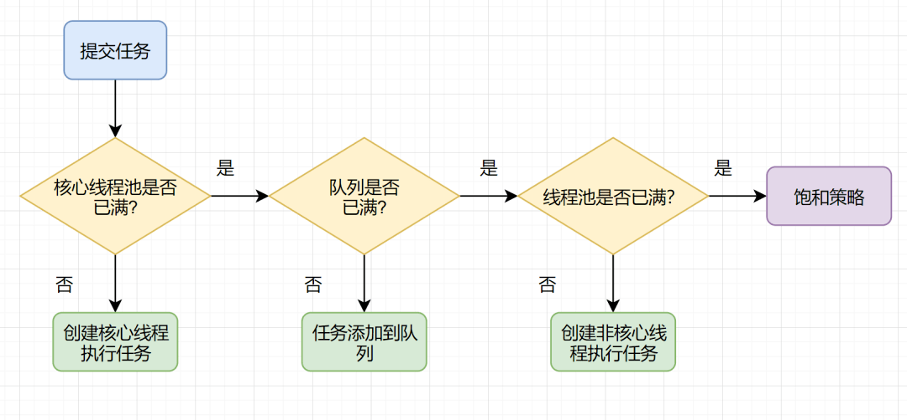
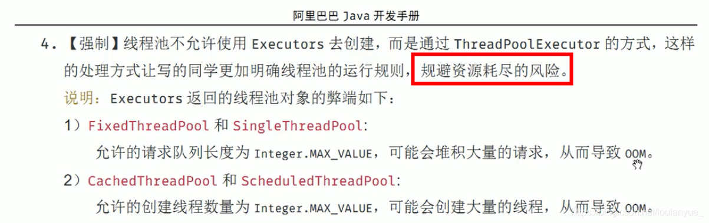

[[toc]]

# JUC-day03

## 课程内容

- **阻塞队列BlockingQueue**
- **ThreadPool线程池**
- **Stream流**
- **Fork/Join框架**
- **CompletableFuture**

# 1 阻塞队列

## 1.1 简介

BlockingQueue阻塞队列，顾名思义，首先它是一个队列, 通过一个共享的队列，可以使得数据由队列的一端输入，从另外一端输出；常用的队列主要有以下两种：

- 先进先出（FIFO）：先插入的队列的元素也最先出队列，类似于排队的功能。从某种程度上来说这种队列也体现了一种公平性

- 后进先出（LIFO）：后插入队列的元素最先出队列，这种队列优先处理最近发生的事件(栈)

多线程环境中，通过队列可以很容易实现数据共享，比如经典的“生产者”和“消费者”模型中，通过队列可以很便利地实现两者之间的数据共享, 但如果生产者和消费者在某个时间段内，万一发生数据处理速度不匹配的情况呢？

- 当队列中没有数据的情况下，消费者端的所有线程都会被自动阻塞（挂起），直到有数据放入队列
- 当队列中填满数据的情况下，生产者端的所有线程都会被自动阻塞（挂起），直到队列中有空的位置，线程被自动唤醒

## 1.2 核心方法

**放入数据**

- offer(anObject):表示如果可能的话,将anObject加到BlockingQueue里,即如果BlockingQueue可以容纳,则返回true,否则返回false.**（本方法不阻塞当前执行方法的线程）**
- offer(E o, long timeout, TimeUnit unit)：可以设定等待的时间，如果在指定的时间内，还不能往队列中加入BlockingQueue，则返回失败
- put(anObject):把anObject加到BlockingQueue里,如果BlockQueue没有空间,则调用此方法的线程被阻断直到BlockingQueue里面有空间再继续.

**获取数据**

- poll(time): 取走BlockingQueue里排在首位的对象,若不能立即取出,**则可以等time参数规定的时间,取不到时返回null**
- poll(long timeout, TimeUnit unit)：从BlockingQueue取出一个队首的对象，如果在指定时间内，队列一旦有数据可取，则立即返回队列中的数据。否则知道时间超时还没有数据可取，返回失败。
- take(): 取走BlockingQueue里排在首位的对象,若BlockingQueue为空,**阻断进入等待状态直到BlockingQueue有新的数据被加入**;
- drainTo(): 一次性从BlockingQueue获取所有可用的数据对象（还可以指定获取数据的个数），通过该方法，可以提升获取数据效率；不需要多次分批加锁或释放锁。

## 1.3 常见的BlockingQueue

### 1.3.1 ArrayBlockingQueue(常用)

基于数组的阻塞队列实现，在ArrayBlockingQueue内部，维护了一个定长数组，以便缓存队列中的数据对象，这是一个常用的阻塞队列，除了一个定长数组外，ArrayBlockingQueue内部还保存着两个整形变量，分别标识着队列的头部和尾部在数组中的位置。

ArrayBlockingQueue在生产者放入数据和消费者获取数据，都是共用同一个锁对象，由此也意味着两者无法真正并行运行，这点尤其不同于LinkedBlockingQueue；

按照实现原理来分析，ArrayBlockingQueue完全可以采用分离锁，从而实现生产者和消费者操作的完全并行运行。之所以没这样去做，也许是因为ArrayBlockingQueue的数据写入和获取操作已经足够轻巧，以至于引入独立的锁机制，除了给代码带来额外的复杂性外，其在性能上完全占不到任何便宜。 

ArrayBlockingQueue和LinkedBlockingQueue间还有一个明显的不同之处在于，前者在插入或删除元素时不会产生或销毁任何额外的对象实例，而后者则会生成一个额外的Node对象。这在长时间内需要高效并发地处理大批量数据的系统中，其对于GC的影响还是存在一定的区别。

在创建ArrayBlockingQueue时，我们还可以控制对象的内部锁是否采用公平锁，默认采用非公平锁。

==**一句话总结: 由数组结构组成的有界阻塞队列。**==

### 1.3.2 LinkedBlockingQueue(常用)

基于链表的阻塞队列，同ArrayListBlockingQueue类似，其内部也维持着一个数据缓冲队列（该队列由一个链表构成），当生产者往队列中放入一个数据时，队列会从生产者手中获取数据，并缓存在队列内部，而生产者立即返回；

只有当队列缓冲区达到最大值缓存容量时（LinkedBlockingQueue可以通过构造函数指定该值），才会阻塞生产者队列，直到消费者从队列中消费掉一份数据，生产者线程会被唤醒，反之对于消费者这端的处理也基于同样的原理。而LinkedBlockingQueue之所以能够高效的处理并发数据，还因为其对于生产者端和消费者端分别采用了独立的锁来控制数据同步，这也意味着在高并发的情况下生产者和消费者可以并行地操作队列中的数据，以此来提高整个队列的并发性能。

**ArrayBlockingQueue和LinkedBlockingQueue是两个最普通也是最常用的阻塞队列，一般情况下，在处理多线程间的生产者消费者问题，使用这两个类足以。**

==**一句话总结: 由链表结构组成的有界（但大小默认值为integer.MAX_VALUE）阻塞队列。**==

### 1.3.3 DelayQueue

DelayQueue中的元素只有当其指定的延迟时间到了，才能够从队列中获取到该元素。DelayQueue是一个没有大小限制的队列，因此往队列中插入数据的操作（生产者）永远不会被阻塞，而只有获取数据的操作（消费者）才会被阻塞。

==**一句话总结: 使用优先级队列实现的延迟无界阻塞队列。**==

### 1.4.4 PriorityBlockingQueue

基于优先级的阻塞队列（优先级的判断通过构造函数传入的Compator对象来决定），但需要注意的是PriorityBlockingQueue并**不会阻塞数据生产者，而只会在没有可消费的数据时，阻塞数据的消费者**。

因此使用的时候要特别注意，**生产者生产数据的速度绝对不能快于消费者消费数据的速度**，否则时间一长，会最终耗尽所有的可用堆内存空间。

在实现PriorityBlockingQueue时，内部控制线程同步的锁采用的是**公平锁**。

==**一句话总结: 支持优先级排序的无界阻塞队列。**==

### 1.4.5 SynchronousQueue

一种无缓冲的等待队列，类似于无中介的直接交易，有点像原始社会中的生产者和消费者，生产者拿着产品去集市销售给产品的最终消费者，而消费者必须亲自去集市找到所要商品的直接生产者，如果一方没有找到合适的目标，那么对不起，大家都在集市等待。相对于有缓冲的BlockingQueue来说，少了一个中间经销商的环节（缓冲区），如果有经销商，生产者直接把产品批发给经销商，而无需在意经销商最终会将这些产品卖给那些消费者，由于经销商可以库存一部分商品，因此相对于直接交易模式，总体来说采用中间经销商的模式会吞吐量高一些（可以批量买卖）；但另一方面，又因为经销商的引入，使得产品从生产者到消费者中间增加了额外的交易环节，单个产品的及时响应性能可能会降低。

声明一个SynchronousQueue有两种不同的方式，它们之间有着不太一样的行为。

**公平模式和非公平模式的区别:**

- 公平模式：SynchronousQueue会采用公平锁，并配合一个FIFO队列来阻塞多余的生产者和消费者，从而体现整体的公平策略；

- 非公平模式（SynchronousQueue默认）：SynchronousQueue采用非公平锁，同时配合一个LIFO队列来管理多余的生产者和消费者，而后一种模式，如果生产者和消费者的处理速度有差距，则很容易出现饥渴的情况，即可能有某些生产者或者是消费者的数据永远都得不到处理。

==**一句话总结: 不存储元素的阻塞队列，也即单个元素的队列。**==

### 1.4.6 LinkedTransferQueue

LinkedTransferQueue是一个由链表结构组成的无界阻塞TransferQueue队列。相对于其他阻塞队列，LinkedTransferQueue多了tryTransfer和transfer方法。

LinkedTransferQueue采用一种预占模式。意思就是消费者线程取元素时，如果队列不为空，则直接取走数据，若队列为空，那就生成一个节点（节点元素为null）入队，然后消费者线程被等待在这个节点上，后面生产者线程入队时发现有一个元素为null的节点，生产者线程就不入队了，直接就将元素填充到该节点，并唤醒该节点等待的线程，被唤醒的消费者线程取走元素，从调用的方法返回。

==**一句话总结: 由链表组成的无界阻塞队列。**==

### 1.4.7  LinkedBlockingDeque

LinkedBlockingDeque是一个由链表结构组成的双向阻塞队列，即可以从队列的两端插入和移除元素。

对于一些指定的操作，在插入或者获取队列元素时如果队列状态不允许该操作可能会阻塞住该线程直到队列状态变更为允许操作，这里的阻塞一般有两种情况

- 插入元素时: 如果当前队列已满将会进入阻塞状态，一直等到队列有空的位置时再讲该元素插入，该操作可以通过设置超时参数，超时后返回 false 表示操作失败，也可以不设置超时参数一直阻塞，中断后抛出InterruptedException异常
- 读取元素时: 如果当前队列为空会阻塞住直到队列不为空然后返回元素，同样可以通过设置超时参数

==**一句话总结: 由链表组成的双向阻塞队列**==

## 1.5 小结

**1. 在多线程领域：所谓阻塞，在某些情况下会挂起线程（即阻塞），一旦条件满足，被挂起的线程又会自动被唤起**

**2. 为什么需要BlockingQueue?**
在concurrent包发布以前，在多线程环境下，我们每个程序员都必须去自己控制这些细节，尤其还要兼顾效率和线程安全，而这会给我们的程序带来不小的复杂度。使用后我们不需要关心什么时候需要阻塞线程，什么时候需要唤醒线程，因为这一切BlockingQueue都给你一手包办了


# 2 ThreadPool线程池

## 2.1 线程池简介

线程池（英语：thread pool）：一种线程使用模式。线程过多会带来调度开销，进而影响缓存局部性和整体性能。而线程池维护着多个线程，等待着监督管理者分配可并发执行的任务。这避免了在处理短时间任务时创建与销毁线程的代价。线程池不仅能够保证内核的充分利用，还能防止过分调度。

例子：
10年前单核CPU电脑，假的多线程，像马戏团小丑玩多个球，CPU需要来回切换。
现在是多核电脑，多个线程各自跑在独立的CPU上，不用切换效率高。

**线程池的优势：**
线程池做的工作只要是控制运行的线程数量，处理过程中将任务放入队列，然后在线程创建后启动这些任务，如果线程数量超过了最大数量，超出数量的线程排队等候，等其他线程执行完毕，再从队列中取出任务来执行。

**它的主要特点为：**

- 降低资源消耗: 通过重复利用已创建的线程降低线程创建和销毁造成的销耗。
- 提高响应速度: 当任务到达时，任务可以不需要等待线程创建就能立即执行。
- 提高线程的可管理性: 线程是稀缺资源，如果无限制的创建，不仅会销耗系统资源，还会降低系统的稳定性，使用线程池可以进行统一的分配，调优和监控。

## 2.2 线程池参数说明

### 2.2.1 常用参数(重点)

- corePoolSize线程池的核心线程数
- maximumPoolSize能容纳的最大线程数
- keepAliveTime空闲线程存活时间
- unit 存活的时间单位
- workQueue 存放提交但未执行任务的队列
- threadFactory 创建线程的工厂类
- handler 等待队列满后的拒绝策略

线程池中，有三个重要的参数，决定影响了拒绝策略：corePoolSize - 核心线程数，也即最小的线程数。workQueue - 阻塞队列 。 maximumPoolSize - 最大线程数

当提交任务数大于 corePoolSize 的时候，会优先将任务放到 workQueue 阻塞队列中。当阻塞队列饱和后，会扩充线程池中线程数，直到达到 maximumPoolSize 最大线程数配置。此时，再多余的任务，则会触发线程池的拒绝策略了。

总结起来，也就是一句话，**当提交的任务数大于（workQueue.size() + maximumPoolSize ），就会触发线程池的拒绝策略**。

### 2.2.2 拒绝策略(重点)

**CallerRunsPolicy**: 当触发拒绝策略，只要线程池没有关闭的话，则使用调用线程直接运行任务。一般并发比较小，性能要求不高，不允许失败。但是，由于调用者自己运行任务，如果任务提交速度过快，可能导致程序阻塞，性能效率上必然的损失较大

**AbortPolicy**: 丢弃任务，并抛出拒绝执行 RejectedExecutionException 异常信息。线程池默认的拒绝策略。必须处理好抛出的异常，否则会打断当前的执行流程，影响后续的任务执行

**DiscardPolicy**: 直接丢弃，其他啥都没有

**DiscardOldestPolicy**: 当触发拒绝策略，只要线程池没有关闭的话，丢弃阻塞队列 workQueue 中最老的一个任务，并将新任务加入

## 2.3 线程池的种类与创建

### 2.3.1 newCachedThreadPool(常用)

**作用**：创建一个可缓存线程池，如果线程池长度超过处理需要，可灵活回收空闲线程，若无可回收，则新建线程.

**特点**: 

- 线程池中数量没有固定，可达到最大值（Interger. MAX_VALUE） 
- 线程池中的线程可进行缓存重复利用和回收（回收默认时间为1分钟） 
- 当线程池中，没有可用线程，会重新创建一个线程

**创建方式： **

```java
/**
     * 可缓存线程池
     * @return
     */
    public static ExecutorService newCachedThreadPool(){
        /**
         * corePoolSize线程池的核心线程数
         * maximumPoolSize能容纳的最大线程数
         * keepAliveTime空闲线程存活时间
         * unit 存活的时间单位
         * workQueue 存放提交但未执行任务的队列
         * threadFactory 创建线程的工厂类:可以省略
         * handler 等待队列满后的拒绝策略:可以省略
         */
        return new ThreadPoolExecutor(0,
                Integer.MAX_VALUE,
                60L,
                TimeUnit.SECONDS,
                new SynchronousQueue<>(),
                Executors.defaultThreadFactory(),
                new ThreadPoolExecutor.AbortPolicy());
    }
```

**场景: **适用于创建一个可无限扩大的线程池，服务器负载压力较轻，执行时间较短，任务多的场景

### 2.3.2 newFixedThreadPool(常用)

**作用**：创建一个可重用固定线程数的线程池，以共享的无界队列方式来运行这些线程。在任意点，在大多数线程会处于处理任务的活动状态。如果在所有线程处于活动状态时提交附加任务，则在有可用线程之前，附加任务将在队列中等待。如果在关闭前的执行期间由于失败而导致任何线程终止，那么一个新线程将代替它执行后续的任务（如果需要）。在某个线程被显式地关闭之前，池中的线程将一直存在。

**特征： **

- 线程池中的线程处于一定的量，可以很好的控制线程的并发量 
- 线程可以重复被使用，在显式关闭之前，都将一直存在 
- 超出一定量的线程被提交时候需在队列中等待

**创建方式**： 

```java
/**
     * 固定长度线程池
     * @return
     */
    public static ExecutorService newFixedThreadPool(){
        /**
         * corePoolSize线程池的核心线程数
         * maximumPoolSize能容纳的最大线程数
         * keepAliveTime空闲线程存活时间
         * unit 存活的时间单位
         * workQueue 存放提交但未执行任务的队列
         * threadFactory 创建线程的工厂类:可以省略
         * handler 等待队列满后的拒绝策略:可以省略
         */
        return new ThreadPoolExecutor(10,
                10,
                0L,
                TimeUnit.SECONDS,
                new LinkedBlockingQueue<>(),
                Executors.defaultThreadFactory(),
                new ThreadPoolExecutor.AbortPolicy());
    }
```

**场景: **适用于可以预测线程数量的业务中，或者服务器负载较重，对线程数有严格限制的场景

### 2.3.3 newSingleThreadExecutor(常用)

**作用**：创建一个使用单个 worker 线程的 Executor，以无界队列方式来运行该线程。（注意，如果因为在关闭前的执行期间出现失败而终止了此单个线程，那么如果需要，一个新线程将代替它执行后续的任务）。可保证顺序地执行各个任务，并且在任意给定的时间不会有多个线程是活动的。与其他等效的 newFixedThreadPool不同，可保证无需重新配置此方法所返回的执行程序即可使用其他的线程。

**特征：** 线程池中最多执行1个线程，之后提交的线程活动将会排在队列中以此执行

**创建方式： **

```java
/**
     * 单一线程池
     * @return
     */
    public static ExecutorService newSingleThreadExecutor(){
        /**
         * corePoolSize线程池的核心线程数
         * maximumPoolSize能容纳的最大线程数
         * keepAliveTime空闲线程存活时间
         * unit 存活的时间单位
         * workQueue 存放提交但未执行任务的队列
         * threadFactory 创建线程的工厂类:可以省略
         * handler 等待队列满后的拒绝策略:可以省略
         */
        return new ThreadPoolExecutor(1,
                1,
                0L,
                TimeUnit.SECONDS,
                new LinkedBlockingQueue<>(),
                Executors.defaultThreadFactory(),
                new ThreadPoolExecutor.AbortPolicy());
    }
```

**场景:** 适用于需要保证顺序执行各个任务，并且在任意时间点，不会同时有多个线程的场景

### 2.3.4 newScheduleThreadPool(了解)

**作用:** 线程池支持定时以及周期性执行任务，创建一个corePoolSize为传入参数，最大线程数为整形的最大数的线程池

**特征:** 

（1）线程池中具有指定数量的线程，即便是空线程也将保留 
（2）可定时或者延迟执行线程活动

**创建方式:**

```java
public static ScheduledExecutorService newScheduledThreadPool(int corePoolSize, 
                                                              ThreadFactory threadFactory) {
    return new ScheduledThreadPoolExecutor(corePoolSize, threadFactory);
}
```

**场景:** 适用于需要多个后台线程执行周期任务的场景

### 2.3.5 newWorkStealingPool

jdk1.8提供的线程池，底层使用的是ForkJoinPool实现，创建一个拥有多个任务队列的线程池，可以减少连接数，创建当前可用cpu核数的线程来并行执行任务

**创建方式:**

```java
public static ExecutorService newWorkStealingPool(int parallelism) {
        /**
         *  parallelism：并行级别，通常默认为JVM可用的处理器个数
         *  factory：用于创建ForkJoinPool中使用的线程。
         *  handler：用于处理工作线程未处理的异常，默认为null
         *  asyncMode：用于控制WorkQueue的工作模式:队列---反队列
         */
        return new ForkJoinPool(parallelism,
                ForkJoinPool.defaultForkJoinWorkerThreadFactory,
                null,
                true);
    }
```

**场景:** 适用于大耗时，可并行执行的场景

## 2.4 线程池入门案例

**场景: 火车站3个售票口, 10个用户买票**

```java
package com.atguigu.test;


import java.util.concurrent.*;

/**
 * 入门案例
 */
public class ThreadPoolDemo1 {

    /**
     * 火车站3个售票口, 10个用户买票
     * @param args
     */
    public static void main(String[] args) {
        //定时线程次:线程数量为3---窗口数为3
        ExecutorService threadService = new ThreadPoolExecutor(3,
                3,
                60L,
                TimeUnit.SECONDS,
                new LinkedBlockingQueue<>(),
                Executors.defaultThreadFactory(),
                new ThreadPoolExecutor.DiscardOldestPolicy());
        try {
            //10个人买票
            for (int i = 1; i <= 10; i++) {
                threadService.execute(()->{
                    try {
                        System.out.println(Thread.currentThread().getName() + "窗口,开始卖票");
                        Thread.sleep(5000);
                        System.out.println(Thread.currentThread().getName() + "窗口买票结束");
                    }catch (Exception e){
                        e.printStackTrace();
                    }
                });
            }
        }catch (Exception e){
            e.printStackTrace();
        }finally {
            //完成后结束
            threadService.shutdown();
        }
    }
}
```

## 2.5 线程池底层工作原理(重要)

1. 在创建了线程池后，线程池中的线程数为零
2. 当调用execute()方法添加一个请求任务时，线程池会做出如下判断：
     2.1 如果正在运行的线程数量小于corePoolSize，那么马上创建线程运行这个任务；
     2.2 如果正在运行的线程数量大于或等于corePoolSize，那么将这个任务放入队列；
     2.3 如果这个时候队列满了且正在运行的线程数量还小于maximumPoolSize，那么还是要创建非核心线程立刻运行这个任务；
     2.4 如果队列满了且正在运行的线程数量大于或等于maximumPoolSize，那么线程池会启动饱和拒绝策略来执行。
3. 当一个线程完成任务时，它会从队列中取下一个任务来执行
4. 当一个线程无事可做超过一定的时间（keepAliveTime）时，线程会判断：
       4.1 如果当前运行的线程数大于corePoolSize，那么这个线程就被停掉。
       4.2 所以线程池的所有任务完成后，它最终会收缩到corePoolSize的大小。



## 2.6 注意事项(重要)

1. 项目中创建多线程时，使用常见的三种线程池创建方式，单一、可变、定长都有一定问题，原因是FixedThreadPool和SingleThreadExecutor底层都是用LinkedBlockingQueue实现的，这个队列最大长度为Integer.MAX_VALUE，容易导致OOM。所以实际生产一般自己通过ThreadPoolExecutor的7个参数，自定义线程池
2. 创建线程池推荐适用ThreadPoolExecutor及其7个参数手动创建
   - corePoolSize线程池的核心线程数
   - maximumPoolSize能容纳的最大线程数
   - keepAliveTime空闲线程存活时间
   - unit 存活的时间单位
   - workQueue 存放提交但未执行任务的队列
   - threadFactory 创建线程的工厂类
   - handler 等待队列满后的拒绝策略

3. 为什么不允许适用不允许Executors.的方式手动创建线程池,如下图




# 3 Stream流

## 3.1 Stream简介

Java 8 API添加了一个新的抽象称为流Stream，可以让你以一种声明的方式处理数据。

Stream 使用一种类似用 SQL 语句从数据库查询数据的直观方式来提供一种对 Java 集合运算和表达的高阶抽象。

Stream API可以极大提高Java程序员的生产力，让程序员写出高效率、干净、简洁的代码。

这种风格将要处理的元素集合看作一种流， 流在管道中传输， 并且可以在管道的节点上进行处理， 比如筛选， 排序，聚合等。

元素流在管道中经过中间操作（intermediate operation）的处理，最后由最终操作(terminal operation)得到前面处理的结果。

Stream（流）是一个来自数据源的元素队列并支持聚合操作

- 元素是特定类型的对象，形成一个队列。 Java中的Stream并不会存储元素，而是按需计算。
- **数据源** 流的来源。 可以是集合，数组，I/O channel， 产生器generator 等。
- **聚合操作** 类似SQL语句一样的操作， 比如filter, map, reduce, find, match, sorted等。

和以前的Collection操作不同， Stream操作还有两个基础的特征：

- **Pipelining**: 中间操作都会返回流对象本身。 这样多个操作可以串联成一个管道， 如同流式风格（fluent style）。 这样做可以对操作进行优化， 比如延迟执行(laziness)和短路( short-circuiting)。
- **内部迭代**： 以前对集合遍历都是通过Iterator或者For-Each的方式, 显式的在集合外部进行迭代， 这叫做外部迭代。 Stream提供了内部迭代的方式， 通过访问者模式(Visitor)实现。

在 Java 8 中, 集合接口有两个方法来生成流：

- **stream()** − 为集合创建串行流。
- **parallelStream()** − 为集合创建并行流。

## 3.2 foreach

Stream 提供了新的方法 'forEach' 来迭代流中的每个数据。以下代码片段使用 forEach 输出了10个随机数：

```java
Random random = new Random();
random.ints().limit(10).forEach(System.out::println);
```

## 3.3 map

map 方法用于映射每个元素到对应的结果，以下代码片段使用 map 输出了元素对应的平方数：

```java
List<Integer> integers = Arrays.asList(1, 2, 3, 4, 5, 6, 7, 8, 9);
integers.stream().map(i -> i * i).distinct().collect(Collectors.toList()).forEach(System.out :: println);
```

## 3.4 filter

filter 方法用于通过设置的条件过滤出元素。以下代码片段使用 filter 方法过滤出空字符串：

```java
List<String> list = Arrays.asList("a","b","c","d","e","");
list.stream().filter(i -> !i.equals("")).forEach(System.out :: println);
```

## 3.5 limit

limit 方法用于获取指定数量的流。 以下代码片段使用 limit 方法打印出 3条数据：

```java
List<String> list = Arrays.asList("a","b","c","d","e","");
list.stream().filter(i -> !i.equals("")).limit(3).forEach(System.out :: println);
```

## 3.6 sorted

sorted 方法用于对流进行排序。以下代码片段使用 sorted 方法对输出的 10 个随机数进行排序：

```java
List<Integer> numbers = Arrays.asList(3, 12, 22, 13, 7, 8, 5);
numbers.stream().sorted(new Comparator<Integer>() {
    @Override
    public int compare(Integer o1, Integer o2) {
        return o1.compareTo(o2);
    }
}).forEach(System.out::println);
```

## 3.7 并行（parallel）程序

parallelStream 是流并行处理程序的代替方法。以下实例我们使用 parallelStream 来输出非空字符串的数量：

```java
List<String> strings = Arrays.asList("abc", "", "bc", "efg", "abcd","", "jkl");
strings.parallelStream().filter(a -> !a.equals("")).forEach(System.out::println);
```

## 3.8 Collectors 

Collectors 类实现了很多归约操作，例如将流转换成集合和聚合元素。Collectors 可用于返回列表或字符串：

```java
List<String> strings = Arrays.asList("abc", "", "bc", "efg", "abcd","", "jkl");
List<String> collect = strings.parallelStream().filter(a -> !a.equals("")).collect(Collectors.toList());
System.out.println("除去空的list为" + collect);
//合并成字符串,以||分隔
String collect1 = collect.stream().collect(Collectors.joining("||"));
System.out.println(collect1);
```

## 3.9 统计

一些产生统计结果的收集器也非常有用。它们主要用于int、double、long等基本类型上，它们可以用来产生类似如下的统计结果。

```java
List<Integer> numbers = Arrays.asList(1, 2, 3, 4, 5);
IntSummaryStatistics statistics = numbers.stream().mapToInt((a) -> a).summaryStatistics();
System.out.println("列表中最大的数 : " + statistics.getMax());
System.out.println("列表中最小的数 : " + statistics.getMin());
System.out.println("所有数之和 : " + statistics.getSum());
System.out.println("平均数 : " + statistics.getAverage());
```

## 3.10 小结

流(Stream) 到底是什么呢？
是数据渠道，用于操作数据源（集合、数组等）所生成的元素序列。

==**集合讲的是数据，流讲的是计算！**==

# 4 Fork/Join

## 4.1 Fork/Join框架简介

Fork/Join它可以将一个大的任务拆分成多个子任务进行并行处理，最后将子任务结果合并成最后的计算结果，并进行输出。Fork/Join框架要完成两件事情：

1. **任务分割**：首先Fork/Join框架需要把大的任务分割成足够小的子任务，如果子任务比较大的话还要对子任务进行继续分割

2. **执行任务并合并结果**：分割的子任务分别放到双端队列里，然后几个启动线程分别从双端队列里获取任务执行。子任务执行完的结果都放在另外一个队列里，启动一个线程从队列里取数据，然后合并这些数据。

在Java的Fork/Join框架中，使用两个类完成上述操作

- **ForkJoinTask**:我们要使用Fork/Join框架，首先需要创建一个ForkJoin任务。该类提供了在任务中执行fork和join的机制。通常情况下我们不需要直接集成ForkJoinTask类，只需要继承它的子类，Fork/Join框架提供了两个子类：

　　　　a.RecursiveAction：用于没有返回结果的任务

　　　　b.RecursiveTask:用于有返回结果的任务, 继承后可以实现递归(自己调自己)调用的任务

- **ForkJoinPool**:ForkJoinTask需要通过ForkJoinPool来执行

  **Fork/Join框架的实现原理**

ForkJoinPool由ForkJoinTask数组和ForkJoinWorkerThread数组组成，ForkJoinTask数组负责将存放以及将程序提交给ForkJoinPool，而ForkJoinWorkerThread负责执行这些任务。

## 4.2 fork方法

**fork方法的实现原理：**
当我们调用ForkJoinTask的fork方法时，程序会把任务放在ForkJoinWorkerThread的pushTask的**workQueue**中，异步地执行这个任务，然后立即返回结果

```java
public final ForkJoinTask<V> fork() {
        Thread t;
        if ((t = Thread.currentThread()) instanceof ForkJoinWorkerThread)
            ((ForkJoinWorkerThread)t).workQueue.push(this);
        else
            ForkJoinPool.common.externalPush(this);
        return this;
    }
```

pushTask方法把当前任务存放在ForkJoinTask数组队列里。然后再调用ForkJoinPool的signalWork()方法唤醒或创建一个工作线程来执行任务。代码如下：

```java
final void push(ForkJoinTask<?> task) {
            ForkJoinTask<?>[] a; ForkJoinPool p;
            int b = base, s = top, n;
            if ((a = array) != null) {    // ignore if queue removed
                int m = a.length - 1;     // fenced write for task visibility
                U.putOrderedObject(a, ((m & s) << ASHIFT) + ABASE, task);
                U.putOrderedInt(this, QTOP, s + 1);
                if ((n = s - b) <= 1) {
                    if ((p = pool) != null)
                        p.signalWork(p.workQueues, this);//执行
                }
                else if (n >= m)
                    growArray();
            }
        }
```

## 4.3 join方法

Join方法的主要作用是阻塞当前线程并等待获取结果。让我们一起看看ForkJoinTask的join方法的实现，代码如下：

```java
public final V join() {
        int s;
        if ((s = doJoin() & DONE_MASK) != NORMAL)
            reportException(s);
        return getRawResult();
    }
```

它首先调用doJoin方法，通过doJoin()方法得到当前任务的状态来判断返回什么结果，任务状态有4种：

**==已完成（NORMAL）、被取消（CANCELLED）、信号（SIGNAL）和出现异常（EXCEPTIONAL）==**

- 如果任务状态是已完成，则直接返回任务结果。
- 如果任务状态是被取消，则直接抛出CancellationException
- 如果任务状态是抛出异常，则直接抛出对应的异常

让我们分析一下doJoin方法的实现

```java
private int doJoin() {
        int s; Thread t; ForkJoinWorkerThread wt; ForkJoinPool.WorkQueue w;
        return (s = status) < 0 ? s :
            ((t = Thread.currentThread()) instanceof ForkJoinWorkerThread) ?
            (w = (wt = (ForkJoinWorkerThread)t).workQueue).
            tryUnpush(this) && (s = doExec()) < 0 ? s :
            wt.pool.awaitJoin(w, this, 0L) :
            externalAwaitDone();
    }

final int doExec() {
        int s; boolean completed;
        if ((s = status) >= 0) {
            try {
                completed = exec();
            } catch (Throwable rex) {
                return setExceptionalCompletion(rex);
            }
            if (completed)
                s = setCompletion(NORMAL);
        }
        return s;
    }
```

在doJoin()方法流程如下:

1. 首先通过查看任务的状态，看任务是否已经执行完成，如果执行完成，则直接返回任务状态；

2. 如果没有执行完，则从任务数组里取出任务并执行。
3. 如果任务顺利执行完成，则设置任务状态为NORMAL，如果出现异常，则记录异常，并将任务状态设置为EXCEPTIONAL。

## 4.4 Fork/Join框架的异常处理

ForkJoinTask在执行的时候可能会抛出异常，但是我们没办法在主线程里直接捕获异常，所以ForkJoinTask提供了isCompletedAbnormally()方法来检查任务是否已经抛出异常或已经被取消了，并且可以通过ForkJoinTask的getException方法获取异常。

getException方法返回Throwable对象，如果任务被取消了则返回CancellationException。如果任务没有完成或者没有抛出异常则返回null。

## 4.5 入门案例

**场景: 生成一个计算任务，计算1+2+3.........+1000**,**==每100个数切分一个子任务==**

```java
package com.atguigu.demo.pojo;

import java.util.concurrent.RecursiveTask;

/**
 * 求和
 */
public class ForkJoinTaskDemo extends RecursiveTask<Integer> {
    //从几开始
    private int start;
    //到几结束
    private int end;
    //每多少个数字创建一个子任务
    private int size = 100;
    //总和
    private int sum;

    /**
     * 构造函数
     * @param start
     * @param end
     */
    public ForkJoinTaskDemo(int start, int end){
        this.start = start;
        this.end = end;
    }

    /**
     * 计算
     * @return
     */
    @Override
    protected Integer compute() {
        System.out.println("当前计算区间为:" + start + "-----------" + end);
        int len = end - start;
        //判断长度是否超过100:小于100直接加,否则切分小任务
        if(len <= 100){
            for (int i = start; i <= end; i++) {
                sum+=i;
            }
        }else{
            //计算start + size区间切分为一个小任务,middle+1到end为第二个小任务
            int middle = start + size;
            //创建fork
            ForkJoinTaskDemo forkJoinTask1 = new ForkJoinTaskDemo(start, middle);
            ForkJoinTaskDemo forkJoinTask2 = new ForkJoinTaskDemo(middle + 1, end);
            //递归调用,异步执行
            forkJoinTask1.fork();
            forkJoinTask2.fork();
            //结果汇总
            sum = forkJoinTask1.join() + forkJoinTask2.join();
        }
        return sum;
    }
}

```

```java
package com.atguigu.demo;

import com.atguigu.demo.pojo.ForkJoinTaskDemo;

import java.util.concurrent.ForkJoinPool;
import java.util.concurrent.ForkJoinTask;

/**
 * 生成一个计算任务，计算1+2+3.........+1000 每100个数切分一个子任务
 */
public class Demo8 {

    public static void main(String[] args){
        //创建任务
        ForkJoinTaskDemo forkJoinTaskDemo = new ForkJoinTaskDemo(1, 1000);
        //定义执行器
        ForkJoinPool forkJoinPool = new ForkJoinPool();
        //执行任务:获取结果
        ForkJoinTask<Integer> result = forkJoinPool.submit(forkJoinTaskDemo);
        //同步阻塞获取结果
        try {
            System.out.println(result.get());
        }catch (Exception e){
            e.printStackTrace();
        }finally {
            //关闭
            forkJoinPool.shutdown();
        }
    }
}

```


# 5 CompletableFuture

## 5.1 CompletableFuture简介

CompletableFuture在Java里面被用于异步编程，异步通常意味着非阻塞，可以使得我们的任务单独运行在与主线程分离的其他线程中，并且通过回调可以在主线程中得到异步任务的执行状态，是否完成，和是否异常等信息。

CompletableFuture实现了Future, CompletionStage接口，实现了Future接口就可以兼容现在有线程池框架，而CompletionStage接口才是异步编程的接口抽象，里面定义多种异步方法，通过这两者集合，从而打造出了强大的CompletableFuture类。

## 5.2 Future与CompletableFuture

Futrue在Java里面，通常用来表示一个异步任务的引用，比如我们将任务提交到线程池里面，然后我们会得到一个Futrue，在Future里面有isDone方法来 判断任务是否处理结束，还有get方法可以一直阻塞直到任务结束然后获取结果，但整体来说这种方式，还是同步的，因为需要客户端不断阻塞等待或者不断轮询才能知道任务是否完成。

**Future的主要缺点如下：**

（1）不支持手动完成

我提交了一个任务，但是执行太慢了，我通过其他路径已经获取到了任务结果，现在没法把这个任务结果通知到正在执行的线程，所以必须主动取消或者一直等待它执行完成

（2）不支持进一步的非阻塞调用

通过Future的get方法会一直阻塞到任务完成，但是想在获取任务之后执行额外的任务，因为Future不支持回调函数，所以无法实现这个功能

（3）不支持链式调用

对于Future的执行结果，我们想继续传到下一个Future处理使用，从而形成一个链式的pipline调用，这在Future中是没法实现的。

（4）不支持多个Future合并

比如我们有10个Future并行执行，我们想在所有的Future运行完毕之后，执行某些函数，是没法通过Future实现的。

（5）不支持异常处理

Future的API没有任何的异常处理的api，所以在异步运行时，如果出了问题是不好定位的。

## 5.3 CompletableFuture入门

### 5.3.1 使用CompletableFuture

**场景:主线程里面创建一个CompletableFuture，然后主线程调用get方法会阻塞，最后我们在一个子线程中使其终止。**

```java
/**
 * 主线程里面创建一个CompletableFuture，然后主线程调用get方法会阻塞，最后我们在一个子线程中使其终止
 * @param args
 */
public static void main(String[] args) throws Exception{
    CompletableFuture<String> future = new CompletableFuture<>();
    new Thread(() -> {
        try{
            System.out.println(Thread.currentThread().getName() + "子线程开始干活");
            //子线程睡5秒
            Thread.sleep(5000);
            //在子线程中完成主线程
            future.complete("success");
        }catch (Exception e){
            e.printStackTrace();
        }
    }, "A").start();
    //主线程调用get方法阻塞
    System.out.println("主线程调用get方法获取结果为: " + future.get());
    System.out.println("主线程完成,阻塞结束!!!!!!");
}
```

### 5.3.2 没有返回值的异步任务runAsync

```java
/**
 * 没有返回值的异步任务
 * @param args
 */
public static void main(String[] args) throws Exception{
    System.out.println("主线程开始");
    //运行一个没有返回值的异步任务
    CompletableFuture<Void> future = CompletableFuture.runAsync(() -> {
        try {
            System.out.println("子线程启动干活");
            Thread.sleep(5000);
            System.out.println("子线程完成");
        } catch (Exception e) {
            e.printStackTrace();
        }
    });
    //主线程阻塞
    future.get();
    System.out.println("主线程结束");
}
```

### 5.3.3 有返回值的异步任务supplyAsync

```java
/**
 * 没有返回值的异步任务
 * @param args
 */
public static void main(String[] args) throws Exception{
    System.out.println("主线程开始");
    //运行一个有返回值的异步任务
    CompletableFuture<String> future = CompletableFuture.supplyAsync(() -> {
        try {
            System.out.println("子线程开始任务");
            Thread.sleep(5000);
        } catch (Exception e) {
            e.printStackTrace();
        }
        return "子线程完成了!";
    });
    //主线程阻塞
    String s = future.get();
    System.out.println("主线程结束, 子线程的结果为:" + s);
}
```

### 5.3.4 线程依赖thenApply 

当一个线程依赖另一个线程时，可以使用 thenApply 方法来把这两个线程串行化。

```java
private static Integer num = 10;

/**
 * 先对一个数加10,然后取平方
 * @param args
 */
public static void main(String[] args) throws Exception{
    System.out.println("主线程开始");
    CompletableFuture<Integer> future = CompletableFuture.supplyAsync(() -> {
        try {
            System.out.println("加10任务开始");
            num += 10;
        } catch (Exception e) {
            e.printStackTrace();
        }
        return num;
    }).thenApply(integer -> {
        return num * num;
    });
    Integer integer = future.get();
    System.out.println("主线程结束, 子线程的结果为:" + integer);
}
```

### 5.3.5 消费处理结果thenAccept 

thenAccept消费处理结果, 接收任务的处理结果，并消费处理，无返回结果。

```java
public static void main(String[] args) throws Exception{
    System.out.println("主线程开始");
   CompletableFuture.supplyAsync(() -> {
        try {
            System.out.println("加10任务开始");
            num += 10;
        } catch (Exception e) {
            e.printStackTrace();
        }
        return num;
    }).thenApply(integer -> {
        return num * num;
    }).thenAccept(new Consumer<Integer>() {
        @Override
        public void accept(Integer integer) {
            System.out.println("子线程全部处理完成,最后调用了accept,结果为:" + integer);
        }
    });
}
```

**作业:thenRun()方法**

thenRun: 一般也用于回调函数最后的执行，但这个方法不接受回调函数的返回值，纯粹就代表执行任务的最后一个步骤

### 5.3.6 异常处理exceptionally

exceptionally异常处理,出现异常时触发

```java
public static void main(String[] args) throws Exception{
    System.out.println("主线程开始");
    CompletableFuture<Integer> future = CompletableFuture.supplyAsync(() -> {
        int i= 1/0;
        System.out.println("加10任务开始");
        num += 10;
        return num;
    }).exceptionally(ex -> {
        System.out.println(ex.getMessage());
        return -1;
    });
    System.out.println(future.get());
}
```

handle类似于thenAccept/thenRun方法,是最后一步的处理调用,但是同时可以处理异常

```java
public static void main(String[] args) throws Exception{
    System.out.println("主线程开始");
    CompletableFuture<Integer> future = CompletableFuture.supplyAsync(() -> {
        System.out.println("加10任务开始");
        num += 10;
        return num;
    }).handle((i,ex) ->{
        System.out.println("进入handle方法");
        if(ex != null){
            System.out.println("发生了异常,内容为:" + ex.getMessage());
            return -1;
        }else{
            System.out.println("正常完成,内容为: " + i);
            return i;
        }
    });
    System.out.println(future.get());
}
```

### 5.3.7 结果合并thenCompose

thenCompose合并两个有依赖关系的CompletableFutures的执行结果

```java
public static void main(String[] args) throws Exception{
    System.out.println("主线程开始");
    //第一步加10
    CompletableFuture<Integer> future = CompletableFuture.supplyAsync(() -> {
        System.out.println("加10任务开始");
        num += 10;
        return num;
    });
    //合并
    CompletableFuture<Integer> future1 = future.thenCompose(i ->
            //再来一个CompletableFuture
            CompletableFuture.supplyAsync(() -> {
                return i + 1;
            }));
    System.out.println(future.get());
    System.out.println(future1.get());
}
```

### 5.3.8 结果合并thenCombine

两个没有依赖关系的CompletableFutures任务

```java
public static void main(String[] args) throws Exception{
    System.out.println("主线程开始");

    CompletableFuture<Integer> job1 = CompletableFuture.supplyAsync(() -> {
        System.out.println("加10任务开始");
        num += 10;
        return num;
    });

    CompletableFuture<Integer> job2 = CompletableFuture.supplyAsync(() -> {
        System.out.println("乘以10任务开始");
        num = num * 10;
        return num;
    });
    //合并两个结果
    CompletableFuture<Object> future = job1.thenCombine(job2, new BiFunction<Integer, Integer, List<Integer>>() {
        @Override
        public List<Integer> apply(Integer a, Integer b) {
            List<Integer> list = new ArrayList<>();
            list.add(a);
            list.add(b);
            return list;
        }
    });
    System.out.println("合并结果为:" + future.get());

}
```

### 5.3.9 合并多个任务

**allOf:** 一系列独立的future任务，等其所有的任务执行完后做一些事情

```java
/**
 * 先对一个数加10,然后取平方
 * @param args
 */
public static void main(String[] args) throws Exception{
    System.out.println("主线程开始");
    List<CompletableFuture> list = new ArrayList<>();
    CompletableFuture<Integer> job1 = CompletableFuture.supplyAsync(() -> {
        System.out.println("加10任务开始");
        num += 10;
        return num;
    });
    list.add(job1);

    CompletableFuture<Integer> job2 = CompletableFuture.supplyAsync(() -> {
        System.out.println("乘以10任务开始");
        num = num * 10;
        return num;
    });
    list.add(job2);

    CompletableFuture<Integer> job3 = CompletableFuture.supplyAsync(() -> {
        System.out.println("减以10任务开始");
        num = num * 10;
        return num;
    });
    list.add(job3);

    CompletableFuture<Integer> job4 = CompletableFuture.supplyAsync(() -> {
        System.out.println("除以10任务开始");
        num = num * 10;
        return num;
    });
    list.add(job4);
    //多任务合并
    List<Integer> collect = list.stream().map(CompletableFuture<Integer>::join).collect(Collectors.toList());
    System.out.println(collect);
}
```

**anyOf**: 只要在多个future里面有一个返回，整个任务就可以结束，而不需要等到每一个future结束

```java
/**
 * 先对一个数加10,然后取平方
 * @param args
 */
public static void main(String[] args) throws Exception{
    System.out.println("主线程开始");
    CompletableFuture<Integer>[] futures = new CompletableFuture[4];
    CompletableFuture<Integer> job1 = CompletableFuture.supplyAsync(() -> {
        try{
            Thread.sleep(5000);
            System.out.println("加10任务开始");
            num += 10;
            return num;
        }catch (Exception e){
            return 0;
        }
    });
    futures[0] = job1;

    CompletableFuture<Integer> job2 = CompletableFuture.supplyAsync(() -> {
        try{
            Thread.sleep(2000);
            System.out.println("乘以10任务开始");
            num = num * 10;
            return num;
        }catch (Exception e){
            return 1;
        }

    });
    futures[1] = job2;

    CompletableFuture<Integer> job3 = CompletableFuture.supplyAsync(() -> {
        try{
            Thread.sleep(3000);
            System.out.println("减以10任务开始");
            num = num * 10;
            return num;
        }catch (Exception e){
            return 2;
        }

    });
    futures[2] = job3;

    CompletableFuture<Integer> job4 = CompletableFuture.supplyAsync(() -> {
        try{
            Thread.sleep(4000);
            System.out.println("除以10任务开始");
            num = num * 10;
            return num;
        }catch (Exception e){
            return 3;
        }
    });
    futures[3] = job4;
    CompletableFuture<Object> future = CompletableFuture.anyOf(futures);
    System.out.println(future.get());
}
```